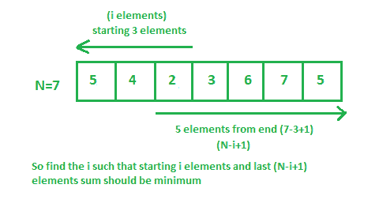
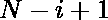

# 数组中前缀和后缀总和最小的索引

> 原文:[https://www . geesforgeks . org/index-with-minimum-sum-of-前缀和后缀-sum-in-a-array/](https://www.geeksforgeeks.org/index-with-minimum-sum-of-prefix-and-suffix-sums-in-an-array/)

给定一个整数数组。任务是在数组中找到索引，在该索引处**前缀(i) +后缀(i)** 的值最小。
**注** :

*   前缀 Sum(i) =数组前 I 个数字的总和。
*   后缀总和(i) =数组最后 N–I+1 个数字的总和。
*   阵列考虑基于 1 的索引。那就是数组中第一个元素的索引是 1。



**例:**

```
Input : arr[] = {3, 5, 1, 6, 6 }
Output : 3
Explanation: 
Presum[] = {3, 8, 9, 15, 21}
Postsum[] = { 21, 18, 13, 12, 6}
Presum[] + Postsum[] = {24, 26, 22, 27, 27}
It is clear that the min value of sum of
prefix and suffix sum is 22 at index 3.

Input : arr[] = { 3, 2, 5, 7, 3 }
Output : 2
```

假设我们需要最小化**前缀[i] +后缀[i]** 的值。这是第一个元素和第三个元素的总和。
如果仔细观察，可以看出:

> **前缀 Sum[i]** + **后缀 Sum[i]** = **数组中所有元素的和** + **arr[i]** (第 I 个索引处的元素)

由于数组中所有元素的总和对于每个索引都是相同的，因此对于最小值**arr【I】**来说，**PrefixSum【I】**+**后缀 sum【I】**的值是最小的。
因此，任务简化为只寻找数组最小元素的索引。
以下是上述方法的实施:

## C++

```
// C++ program to find the index with
// minimum sum of prefix and suffix
// sums in an Array

#include <bits/stdc++.h>
using namespace std;

int indexMinSum(int arr[], int n)
{
    // Initialization of the min value
    int min = arr[0];
    int index = 0;

    // Find minimum element in the array
    for (int i = 1; i < n; i++) {
        if (arr[i] < min) {

            // store the index of the
            // current minimum element
            min = arr[i];
            index = i;
        }
    }

    // return the index of min element
    // 1-based index
    return index + 1;
}

// Driver Code
int main()
{
    int arr[] = { 6, 8, 2, 3, 5 };
    int n = sizeof(arr) / sizeof(arr[0]);
    cout << indexMinSum(arr, n);
    return 0;
}
```

## Java 语言(一种计算机语言，尤用于创建网站)

```
// Java program to find the index with
// minimum sum of prefix and suffix
// sums in an Array

import java.io.*;

class GFG {

static int indexMinSum(int arr[], int n)
{
    // Initialization of the min value
    int min = arr[0];
    int index = 0;

    // Find minimum element in the array
    for (int i = 1; i < n; i++) {
        if (arr[i] < min) {

            // store the index of the
            // current minimum element
            min = arr[i];
            index = i;
        }
    }

    // return the index of min element
    // 1-based index
    return index + 1;
}

// Driver Code
    public static void main (String[] args) {
    int arr[] = { 6, 8, 2, 3, 5 };
    int n =arr.length;
    System.out.println( indexMinSum(arr, n));
    }
}
// This code is contributed by inder_verma..
```

## 蟒蛇 3

```
# Python 3 program to find the index with
# minimum sum of prefix and suffix
# sums in an Array

def indexMinSum(arr, n):

    # Initialization of the min value
    min = arr[0]
    index = 0

    # Find minimum element in the array
    for i in range(1, n) :
        if (arr[i] < min) :

            # store the index of the
            # current minimum element
            min = arr[i]
            index = i

    # return the index of min element
    # 1-based index
    return index + 1

# Driver Code
if __name__ == "__main__":

    arr = [ 6, 8, 2, 3, 5 ]
    n = len(arr)
    print(indexMinSum(arr, n))

# This code is contributed by ita_c
```

## C#

```
// C# program to find the index with
// minimum sum of prefix and suffix
// sums in an Array

using System;
class GFG
{
    static int indexMinSum(int []arr, int n)
    {
        // Initialization of the min value
        int min = arr[0];
        int index = 0;

        // Find minimum element in the array
        for (int i = 1; i < n; i++) {
            if (arr[i] < min) {

                // store the index of the
                // current minimum element
                min = arr[i];
                index = i;
            }
        }

        // return the index of min element
        // 1-based index
        return index + 1;
    }

    // Driver Code
    static void Main()
    {
        int []arr = { 6, 8, 2, 3, 5 };
        int n =arr.Length;
        Console.WriteLine(indexMinSum(arr, n));
    }
    // This code is contributed by ANKITRAI1
}
```

## 服务器端编程语言（Professional Hypertext Preprocessor 的缩写）

```
<?php
// PHP program to find the index with
// minimum sum of prefix and suffix
// sums in an Array
function indexMinSum($arr, $n)
{
    // Initialization of the
    // min value
    $min = $arr[0];
    $index = 0;

    // Find minimum element in
    // the array
    for ($i = 1; $i < $n; $i++)
    {
        if ($arr[$i] < $min)
        {

            // store the index of the
            // current minimum element
            $min = $arr[$i];
            $index = $i;
        }
    }

    // return the index of min
    // element 1-based index
    return ($index + 1);
}

// Driver Code
$arr = array(6, 8, 2, 3, 5 );
$n = sizeof($arr);
echo indexMinSum($arr, $n);

// This code is contributed by Sachin
?>
```

## java 描述语言

```
<script>

// JavaScript program to find the index with
// minimum sum of prefix and suffix
// sums in an Array

    function indexMinSum(arr,n)
    {
        // Initialization of the min value
    let min = arr[0];
    let index = 0;

    // Find minimum element in the array
    for (let i = 1; i < n; i++) {
        if (arr[i] < min) {

            // store the index of the
            // current minimum element
            min = arr[i];
            index = i;
        }
    }

    // return the index of min element
    // 1-based index
    return index + 1;
    }

    // Driver Code
    let arr=[6, 8, 2, 3, 5];
    let n =arr.length;
    document.write( indexMinSum(arr, n));

// This code is contributed by avanitrachhadiya2155

</script>
```

**Output:** 

```
3
```

**时间复杂度:** O(N)

**辅助空间:** O(1)