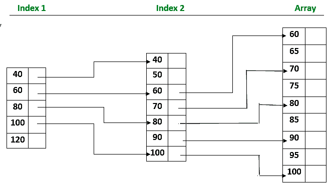

# 索引顺序搜索

> 原文:[https://www.geeksforgeeks.org/indexed-sequential-search/](https://www.geeksforgeeks.org/indexed-sequential-search/)

在这种搜索方法中，首先创建一个索引文件，当获得索引时，该文件包含所需记录的某个特定组或部分，然后部分索引花费更少的时间，因为它位于指定的组中。

**注意:**当用户请求特定记录时，它会首先找到记录该特定记录的索引组。

### 索引顺序搜索的特征:

*   在索引顺序搜索中，除了数组之外，还会留出一个排序索引。
*   索引中的每个元素都指向数组中的一个元素块或另一个扩展索引。
*   首先搜索索引，然后搜索数组，并引导数组中的搜索。

**注意:**索引顺序搜索实际上多次进行索引，就像创建索引的索引一样。

### 通过图表“索引顺序搜索”进行解释:



### 代码:

## C

```
// C program for Indexed Sequential Search
#include <stdio.h>
#include <stdlib.h>

void indexedSequentialSearch(int arr[], int n, int k)
{
    int elements[20], indices[20], temp, i, set = 0;
    int j = 0, ind = 0, start, end;
    for (i = 0; i < n; i += 3) {

        // Storing element
        elements[ind] = arr[i];

        // Storing the index
        indices[ind] = i;
        ind++;
    }
    if (k < elements[0]) {
        printf("Not found");
        exit(0);
    }
    else {
        for (i = 1; i <= ind; i++)
            if (k <= elements[i]) {
                start = indices[i - 1];
                end = indices[i];
                set = 1;
                break;
            }
    }
    if (set == 0) {
        start = indices[i - 1];
        end = n;
    }
    for (i = start; i <= end; i++) {
        if (k == arr[i]) {
            j = 1;
            break;
        }
    }
    if (j == 1)
        printf("Found at index %d", i);
    else
        printf("Not found");
}

// Driver code
void main()
{

    int arr[] = { 6, 7, 8, 9, 10 };
    int n = sizeof(arr) / sizeof(arr[0]);

    // Element to search
    int k = 8;
    indexedSequentialSearch(arr, n, k);
}
```

## Java 语言(一种计算机语言，尤用于创建网站)

```
// Java program for Indexed Sequential Search

import java.io.*;

class GFG {

    static void indexedSequentialSearch(int arr[], int n,
                                        int k)
    {
        int elements[] = new int[20];
        int indices[] = new int[20];
        int temp, i;
        int j = 0, ind = 0, start = 0, end = 0, set = 0;
        for (i = 0; i < n; i += 3) {

            // Storing element
            elements[ind] = arr[i];

            // Storing the index
            indices[ind] = i;
            ind++;
        }
        if (k < elements[0]) {
            System.out.println("Not found");
            return;
        }
        else {
            for (i = 1; i <= ind; i++)
                if (k <= elements[i]) {
                    start = indices[i - 1];
                    set = 1;
                    end = indices[i];
                    break;
                }
        }
        if (set == 0) {
            start = indices[i - 1];
            end = n;
        }
        for (i = start; i <= end; i++) {
            if (k == arr[i]) {
                j = 1;
                break;
            }
        }
        if (j == 1)
            System.out.println("Found at index " + i);
        else
            System.out.println("Not found");
    }

    // Driver code

    public static void main(String[] args)
    {
        int arr[] = { 6, 7, 8, 9, 10 };
        int n = arr.length;

        // Element to search
        int k = 8;
        indexedSequentialSearch(arr, n, k);
    }
}
// This code is contributed by shs..
```

## 蟒蛇 3

```
# Python program for Indexed
# Sequential Search

def indexedSequentialSearch(arr, n, k):

    elements = [0] * 20
    indices = [0] * 20
    j, ind, start, end = 0, 0, 0, 0
    set_flag = 0

    for i in range(0, n, 3):

        # Storing element
        elements[ind] = arr[i]

        # Storing the index
        indices[ind] = i
        ind += 1

    if k < elements[0]:
        print("Not found")
        exit(0)

    else:

        for i in range(1, ind + 1):
            if k <= elements[i]:
                start = indices[i - 1]
                end = indices[i]
                set_flag = 1
                break
    if set_flag == 0:
        start = indices[i-1]
        end = n
    for i in range(start, end + 1):
        if k == arr[i]:
            j = 1
            break

    if j == 1:
        print("Found at index", i)
    else:
        print("Not found")

# Driver code
if __name__ == "__main__":

    arr = [6, 7, 8, 9, 10]
    n = len(arr)

    # Element to search
    k = 8

    # Function call
    indexedSequentialSearch(arr, n, k)

# This code is contributed by Ryuga
```

## C#

```
// C# program for Indexed Sequential Search

using System;

class GFG {

static void indexedSequentialSearch(int []arr, int n, int k)
{
    int []elements = new int[20];
    int []indices = new int[20];
    int  i;
    int j = 0, ind = 0, start=0, end=0, set = 0;
    for (i = 0; i < n; i += 3) {

        // Storing element
        elements[ind] = arr[i];

        // Storing the index
        indices[ind] = i;
        ind++;
    }
    if (k < elements[0]) {
        Console.Write("Not found");
        return;

    }
    else {
        for (i = 1; i <= ind; i++)
            if (k <= elements[i]) {
                start = indices[i - 1];
                  set = 1;
                end = indices[i];
                break;
            }
    }
      if(set == 0)
    {
          start = indices[i-1];
          end = n-1;
    }
    for (i = start; i <= end; i++) {
        if (k == arr[i]) {
            j = 1;
            break;
        }
    }
    if (j == 1)
        Console.WriteLine("Found at index "+ i);
    else
        Console.WriteLine("Not found");
}

// Driver code

    public static void Main () {
        int []arr = { 6, 7, 8, 9, 10 };
        int n = arr.Length;

        // Element to search
        int k = 10;
        indexedSequentialSearch(arr, n, k);
    }
}
// This code is contributed by shs..
```

## 服务器端编程语言（Professional Hypertext Preprocessor 的缩写）

```
<?php
// PHP program for Indexed Sequential Search

function indexedSequentialSearch($arr, $n, $k)
{
    $elements = array();
    $indices = array();
    $temp = array();
    $j = 0; $ind = 0; $start=0; $end=0; $set = 0;
    for ($i = 0; $i < $n; $i += 3)
    {

        // Storing element
        $elements[$ind] = $arr[$i];

        // Storing the index
        $indices[$ind] = $i;
        $ind++;
    }

    if ($k < $elements[0])
    {
        echo "Not found";

    }
    else
    {
        for ($i = 1; $i <=$ind; $i++)
            if ($k < $elements[$i])
            {
                $start = $indices[$i - 1];
                 $set = 1;
                $end = $indices[$i];
                break;
            }
    }
      if($set == 1)
    {
          $start = $indices[$i-1];
          $end = $n;
    }
    for ($i = $start; $i <=$end; $i++)
    {
        if ($k == $arr[$i])
        {
            $j = 1;
            break;
        }
    }
    if ($j == 1)
        echo "Found at index ", $i;
    else
        echo "Not found";
}

// Driver code
$arr = array( 6, 7, 8, 9, 10 );
$n = count($arr);

// Element to search
$k = 10;
indexedSequentialSearch($arr, $n, $k);

// This code is contributed by shs..
?>
```

**Output:** 

```
Found at index 2

```