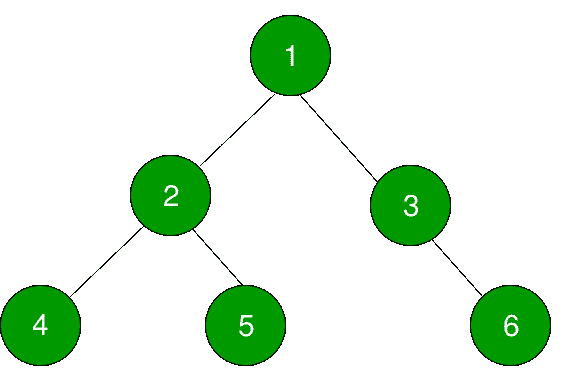

# 二叉树中节点的有序后继

> 原文:[https://www . geeksforgeeks . org/inoder-successor-node-二叉树/](https://www.geeksforgeeks.org/inorder-succesor-node-binary-tree/)

给定一棵二叉树和一个节点，我们需要编写一个程序来寻找这个节点的后继节点。二叉树中一个节点的有序后继者是二叉树有序遍历中的下一个节点。对于有序遍历中的最后一个节点，有序后继节点为空。



在上图中，节点 **4** 的后续节点为 **2** ，节点 **5** 为 **1** 。

我们已经讨论了如何在二叉查找树找到[节点的后续节点。我们不能用同样的方法来寻找一般二叉树的有序后继树。](https://www.geeksforgeeks.org/inorder-successor-in-binary-search-tree/)

我们需要为任何节点处理 3 种情况，以找到其有序的后继节点，如下所述:

1.  节点的右子节点不为空。如果该节点的右子节点不为空，则该节点的下一个后继节点将是其右子树中最左边的节点。
2.  节点的右子节点为空。如果节点的右子节点为空。然后我们继续寻找给定节点 x 的父节点，比如 p，这样 p->left = x。例如，在上面给定的树中，节点 **5** 的有序后继节点将是 **1** 。5 的第一个家长是 2 但是还剩 2- >！= 5.所以 2 的下一个父代是 1，现在 1- > left = 2。因此，5 的有序后继是 1。
    下面是这种情况下的算法:
    *   假设给定的节点是 **x** 。从**根**节点开始遍历树，递归查找 **x** 。
    *   如果**根** == **x** ，则停止递归，否则对左右子树递归查找 x。
    *   现在找到节点 **x** 后，递归将回溯到**根**。每次递归调用都会将节点本身返回给调用函数，我们将它存储在一个临时节点中，比如 **temp** 。现在，当它回到它现在将是根的位置时，检查 root.left = temp，如果不是，继续向上
3.  如果节点是最右边的节点。如果该节点是给定树中最右边的节点。例如，在上面的树中，节点 6 是最右边的节点。在这种情况下，该节点将没有更高级的后继节点。即树中最右边节点的有序后继节点为空。

下面是上述方法的实现:

## C++

```
// CPP program to find inorder successor of a node
#include<bits/stdc++.h>
using namespace std;

// A Binary Tree Node
struct Node
{
    int data;
    struct Node *left, *right;
};

// Temporary node for case 2
Node* temp = new Node;

// Utility function to create a new tree node
Node* newNode(int data)
{
    Node *temp = new Node;
    temp->data = data;
    temp->left = temp->right = NULL;
    return temp;
}

// function to find left most node in a tree
Node* leftMostNode(Node* node)
{
    while (node != NULL && node->left != NULL)
        node = node->left;
    return node;
}

// function to find right most node in a tree
Node* rightMostNode(Node* node)
{
    while (node != NULL && node->right != NULL)
        node = node->right;
    return node;
}

// recursive function to find the Inorder Successor
// when the right child of node x is NULL
Node* findInorderRecursive(Node* root, Node* x )
{
    if (!root)
        return NULL;

    if (root==x || (temp = findInorderRecursive(root->left,x)) ||
                   (temp = findInorderRecursive(root->right,x)))
    {
        if (temp)
        {
            if (root->left == temp)
            {
                cout << "Inorder Successor of " << x->data;
                cout << " is "<< root->data << "\n";
                return NULL;
            }
        }

        return root;
    }

    return NULL;
}

// function to find inorder successor of
// a node
void inorderSuccessor(Node* root, Node* x)
{
    // Case1: If right child is not NULL
    if (x->right != NULL)
    {
        Node* inorderSucc = leftMostNode(x->right);
        cout<<"Inorder Successor of "<<x->data<<" is ";
        cout<<inorderSucc->data<<"\n";
    }

    // Case2: If right child is NULL
    if (x->right == NULL)
    {   
        Node* rightMost = rightMostNode(root);

        // case3: If x is the right most node
        if (rightMost == x)
            cout << "No inorder successor! Right most node.\n";
        else
            findInorderRecursive(root, x);
    }
}

// Driver program to test above functions
int main()
{
    // Let's construct the binary tree
    //          1
    //    /    \
    //   2      3
    //  / \    / \
    // 4   5  6   7
    Node* root = newNode(1);
    root->left = newNode(2);
    root->right = newNode(3);
    root->left->left = newNode(4);
    root->left->right = newNode(5);
      root->right->left = newNode(6);
    root->right->right = newNode(7);

    // Case 1 : When there is a right child
    // eg: Node(1) has a right child ergo the inorder successor would be leftmost
      // node of the right subtree ie 6.
    inorderSuccessor(root, root);

    // case 2: When the right child is NULL
      // eg: From the above figure Node(5) satisfies this case
    inorderSuccessor(root, root->left->left);

    // case 3: When the node is the rightmost node of the binary tree
    inorderSuccessor(root, root->right->right);

    return 0;
}
```

## Java 语言(一种计算机语言，尤用于创建网站)

```
// Java program to find inorder successor of a node
class Solution
{
// A Binary Tree Node
 static class Node
{
    int data;
     Node left, right;
}

// Temporary node for case 2
static Node temp = new Node();

// Utility function to create a new tree node
static Node newNode(int data)
 {
    Node temp = new Node();
    temp.data = data;
    temp.left = temp.right = null;
    return temp;
}

// function to find left most node in a tree
static Node leftMostNode(Node node)
 {
    while (node != null && node.left != null)
        node = node.left;
    return node;
}

// function to find right most node in a tree
static Node rightMostNode(Node node)
 {
    while (node != null && node.right != null)
        node = node.right;
    return node;
}

// recursive function to find the Inorder Successor
// when the right child of node x is null
static Node findInorderRecursive(Node root, Node x )
 {
    if (root==null)
        return null;

    if (root==x || (temp = findInorderRecursive(root.left,x))!=null ||
                (temp = findInorderRecursive(root.right,x))!=null)
    {
        if (temp!=null)
        {
            if (root.left == temp)
            {
                System.out.print( "Inorder Successor of "+x.data);
                System.out.print( " is "+ root.data + "\n");
                return null;
            }
        }

        return root;
    }

    return null;
}

// function to find inorder successor of
// a node
static void inorderSuccessor(Node root, Node x)
 {
    // Case1: If right child is not null
    if (x.right != null)
    {
        Node inorderSucc = leftMostNode(x.right);
        System.out.print("Inorder Successor of "+x.data+" is ");
        System.out.print(inorderSucc.data+"\n");
    }

    // Case2: If right child is null
    if (x.right == null)
    {    
        int f = 0;

        Node rightMost = rightMostNode(root);

        // case3: If x is the right most node
        if (rightMost == x)
            System.out.print("No inorder successor! Right most node.\n");
        else
            findInorderRecursive(root, x);
    }
}

// Driver program to test above functions
public static void main(String args[])
{
    // Let's construct the binary tree
    // as shown in above diagram

    Node root = newNode(1);
    root.left = newNode(2);
    root.right = newNode(3);
    root.left.left = newNode(4);
    root.left.right = newNode(5);
    root.right.right = newNode(6);

    // Case 1
    inorderSuccessor(root, root.right);

    // case 2
    inorderSuccessor(root, root.left.left);

    // case 3
    inorderSuccessor(root, root.right.right);

}
}
//contributed by Arnab Kundu
```

## 蟒蛇 3

```
""" Python3 code for inorder successor
and predecessor of tree """

# A Binary Tree Node
# Utility function to create a new tree node
class newNode:

    # Constructor to create a new node
    def __init__(self, data):
        self.data = data
        self.left = None
        self.right = None

# function to find left most node in a tree
def leftMostNode(node):

    while (node != None and node.left != None):
        node = node.left
    return node

# function to find right most node in a tree
def rightMostNode(node):
    while (node != None and node.right != None):
        node = node.right
    return node

# recursive function to find the Inorder Successor
# when the right child of node x is None
def findInorderRecursive(root, x ):

    if (not root):
        return None
    if (root == x or (findInorderRecursive(root.left, x)) or
                     (findInorderRecursive(root.right, x))):
        if findInorderRecursive(root.right, x):
            temp=findInorderRecursive(root.right, x)
        else:
            temp=findInorderRecursive(root.left, x)
        if (temp):

            if (root.left == temp):

                print("Inorder Successor of",
                            x.data, end = "")
                print(" is", root.data)
                return None   
        return root
    return None

# function to find inorder successor
# of a node
def inorderSuccessor(root, x):

    # Case1: If right child is not None
    if (x.right != None) :
        inorderSucc = leftMostNode(x.right)
        print("Inorder Successor of", x.data,
                             "is", end = " ")
        print(inorderSucc.data)

    # Case2: If right child is None
    if (x.right == None):
        f = 0
        rightMost = rightMostNode(root)

        # case3: If x is the right most node
        if (rightMost == x):
            print("No inorder successor!",
                       "Right most node.")
        else:
            findInorderRecursive(root, x)

# Driver Code
if __name__ == '__main__':

    root = newNode(1)
    root.left = newNode(2)
    root.right = newNode(3)
    root.left.left = newNode(4)
    root.left.right = newNode(5)
    root.right.right = newNode(6)

    # Case 1
    inorderSuccessor(root, root.right)

    # case 2
    inorderSuccessor(root, root.left.left)

    # case 3
    inorderSuccessor(root, root.right.right)

# This code is contributed
# by SHUBHAMSINGH10
```

## C#

```
// C# program to find inorder
// successor of a node
using System;

class GFG
{

// A Binary Tree Node
public class Node
{
    public int data;
    public Node left, right;
}

// Temporary node for case 2
public static Node temp = new Node();

// Utility function to create
// a new tree node
public static Node newNode(int data)
{
    Node temp = new Node();
    temp.data = data;
    temp.left = temp.right = null;
    return temp;
}

// function to find left most
// node in a tree
public static Node leftMostNode(Node node)
{
    while (node != null &&
        node.left != null)
    {
        node = node.left;
    }
    return node;
}

// function to find right most
// node in a tree
public static Node rightMostNode(Node node)
{
    while (node != null &&
        node.right != null)
    {
        node = node.right;
    }
    return node;
}

// recursive function to find the
// Inorder Successor when the right
// child of node x is null
public static Node findInorderRecursive(Node root,
                                        Node x)
{
    if (root == null)
    {
        return null;
    }

    if (root == x ||
    (temp = findInorderRecursive(root.left, x)) != null ||
    (temp = findInorderRecursive(root.right, x)) != null)
    {
        if (temp != null)
        {
            if (root.left == temp)
            {
                Console.Write("Inorder Successor of " + x.data);
                Console.Write(" is " + root.data + "\n");
                return null;
            }
        }

        return root;
    }

    return null;
}

// function to find inorder successor
// of a node
public static void inorderSuccessor(Node root, Node x)
{
    // Case1: If right child is not null
    if (x.right != null)
    {
        Node inorderSucc = leftMostNode(x.right);
        Console.Write("Inorder Successor of " +
                            x.data + " is ");
        Console.Write(inorderSucc.data + "\n");
    }

    // Case2: If right child is null
    if (x.right == null)
    {
        int f = 0;

        Node rightMost = rightMostNode(root);

        // case3: If x is the right most node
        if (rightMost == x)
        {
            Console.Write("No inorder successor! " +
                            "Right most node.\n");
        }
        else
        {
            findInorderRecursive(root, x);
        }
    }
}

// Driver Code
public static void Main(string[] args)
{
    // Let's construct the binary tree
    // as shown in above diagram
    Node root = newNode(1);
    root.left = newNode(2);
    root.right = newNode(3);
    root.left.left = newNode(4);
    root.left.right = newNode(5);
    root.right.right = newNode(6);

    // Case 1
    inorderSuccessor(root, root.right);

    // case 2
    inorderSuccessor(root, root.left.left);

    // case 3
    inorderSuccessor(root, root.right.right);
}
}

// This code is contributed by Shrikant13
```

## java 描述语言

```
<script>
// Javascript program to find inorder successor of a node

// A Binary Tree Node
class Node
{
    constructor(data)
    {
        this.data=data;
        this.left=this.right=null;
    }
}

// Temporary node for case 2
let temp = new Node();

// function to find left most node in a tree
function leftMostNode(node)
{
     while (node != null && node.left != null)
        node = node.left;
    return node;
}

// function to find right most node in a tree   
function rightMostNode(node)
{
    while (node != null && node.right != null)
        node = node.right;
    return node;
}

// recursive function to find the Inorder Successor
// when the right child of node x is null
function findInorderRecursive(root,x)
{
    if (root==null)
        return null;

    if (root==x || (temp = findInorderRecursive(root.left,x))!=null ||
                (temp = findInorderRecursive(root.right,x))!=null)
    {
        if (temp!=null)
        {
            if (root.left == temp)
            {
                document.write( "Inorder Successor of "+x.data);
                document.write( " is "+ root.data + "<br>");
                return null;
            }
        }

        return root;
    }

    return null;
}

// function to find inorder successor of
// a node
function inorderSuccessor(root,x)
{
    // Case1: If right child is not null
    if (x.right != null)
    {
        let inorderSucc = leftMostNode(x.right);
        document.write("Inorder Successor of "+x.data+" is ");
        document.write(inorderSucc.data+"<br>");
    }

    // Case2: If right child is null
    if (x.right == null)
    {   
        let f = 0;

        let rightMost = rightMostNode(root);

        // case3: If x is the right most node
        if (rightMost == x)
            document.write("No inorder successor! Right most node.\n");
        else
            findInorderRecursive(root, x);
    }
}

// Driver program to test above functions
// Let's construct the binary tree
// as shown in above diagram

let root = new Node(1);
root.left = new Node(2);
root.right = new Node(3);
root.left.left = new Node(4);
root.left.right = new Node(5);
root.right.right = new Node(6);

// Case 1
inorderSuccessor(root, root.right);

// case 2
inorderSuccessor(root, root.left.left);

// case 3
inorderSuccessor(root, root.right.right);

// This code is contributed by avanitrachhadiya2155
</script>
```

**输出:**

```
Inorder Successor of 1 is 6
Inorder Successor of 4 is 2
No inorder successor! Right most node.
```

**另一种方法:**
我们将进行反向有序遍历，并跟踪当前访问的节点。一旦我们找到元素，最后一个被追踪的元素就是我们的答案。

下面是上述方法的实现:

## C++

```
// C++ Program to find inorder successor.
#include<bits/stdc++.h>
using namespace std;

// structure of a Binary Node.
struct Node
{
    int data;
    Node* left;
    Node* right;
};

// Function to create a new Node.
Node* newNode(int val)
{
    Node* temp = new Node;
    temp->data = val;
    temp->left = NULL;
    temp->right = NULL;

    return temp;
}

// function that prints the inorder successor
// of a target node. next will point the last
// tracked node, which will be the answer.
void inorderSuccessor(Node* root,
                      Node* target_node,
                      Node* &next)
{
    // if root is null then return
    if(!root)
        return;

    inorderSuccessor(root->right, target_node, next);

    // if target node found then enter this condition
    if(root->data == target_node->data)
    {
        // this will be true to the last node
        // in inorder traversal i.e., rightmost node.
        if(next == NULL)
            cout << "inorder successor of "
                 << root->data << " is: null\n";
        else
            cout << "inorder successor of "
                 << root->data << " is: "
                 << next->data << "\n";
    }
    next = root;
    inorderSuccessor(root->left, target_node, next);
}

// Driver Code
int main()
{

    // Let's construct the binary tree
    //          1
    //    /    \
    //   2      3
    //  / \    / \
    // 4   5  6   7
    Node* root = newNode(1);
    root->left = newNode(2);
    root->right = newNode(3);
    root->left->left = newNode(4);
    root->left->right = newNode(5);
      root->right->left = newNode(6);
    root->right->right = newNode(7);

    // Case 1
    Node* next = NULL;
    inorderSuccessor(root, root, next);

    // case 2
    next = NULL;
    inorderSuccessor(root, root->left->left, next);

    // case 3
    next = NULL;
    inorderSuccessor(root, root->right->right, next);

    return 0;
}

// This code is contributed by AASTHA VARMA
```

## Java 语言(一种计算机语言，尤用于创建网站)

```
// Java program to find inorder successor of a node.

class Node {
    int data;
    Node left, right;

    Node(int data) {
        this.data = data;
        left = null; right = null;
    }
}

// class to find inorder successor of
// a node
class InorderSuccessor {
    Node root;

    // to change previous node
    static class PreviousNode {
        Node pNode;
        PreviousNode() {
            pNode = null;
        }
    }

    // function to find inorder successor of
    // a node
    private void inOrderSuccessorOfBinaryTree(Node root,
                    PreviousNode pre, int searchNode)
    {
        // Case1: If right child is not NULL
        if(root.right != null)
        inOrderSuccessorOfBinaryTree(root.right, pre, searchNode);

        // Case2: If root data is equal to search node
        if(root.data == searchNode)
        System.out.println("inorder successor of " + searchNode + " is: "
                            + (pre.pNode != null ? pre.pNode.data : "null"));
            pre.pNode = root;

        if(root.left != null)
        inOrderSuccessorOfBinaryTree(root.left, pre, searchNode);
    }

    // Driver program to test above functions
    public static void main(String[] args)
    {
        InorderSuccessor tree = new InorderSuccessor();

        // Let's construct the binary tree
        // as shown in above diagram
        tree.root = new Node(1);
        tree.root.left = new Node(2);
        tree.root.right = new Node(3);

        tree.root.left.left = new Node(4);
        tree.root.left.right = new Node(5);
        tree.root.right.right = new Node(6);

        // Case 1
        tree.inOrderSuccessorOfBinaryTree(tree.root,
                                        new PreviousNode(), 3);

        // Case 2
        tree.inOrderSuccessorOfBinaryTree(tree.root,
                                           new PreviousNode(), 4);

        // Case 3
        tree.inOrderSuccessorOfBinaryTree(tree.root,
                                          new PreviousNode(), 6);
    }
}
// This code is contributed by Ashish Goyal.
```

## 蟒蛇 3

```
# Python3 program to find inorder successor.

# A Binary Tree Node
# Utility function to create a new tree node
class Node:

    # Constructor to create a new node
    def __init__(self, data):
        self.data = data
        self.left = None
        self.right = None

# Function to create a new Node.
def newNode(val):

    temp = Node(0)
    temp.data = val
    temp.left = None
    temp.right = None

    return temp

# function that prints the inorder successor
# of a target node. next will point the last
# tracked node, which will be the answer.
def inorderSuccessor(root, target_node):

    global next

    # if root is None then return
    if(root == None):
        return

    inorderSuccessor(root.right, target_node)

    # if target node found, then
    # enter this condition
    if(root.data == target_node.data):

        # this will be true to the last node
        # in inorder traversal i.e., rightmost node.
        if(next == None):
            print ("inorder successor of",
                    root.data , " is: None")
        else:
            print ( "inorder successor of",
                     root.data , "is:", next.data)

    next = root
    inorderSuccessor(root.left, target_node)

# global variable
next = None

# Driver Code
if __name__ == '__main__':

    # Let's construct the binary tree
    # as shown in above diagram.
    root = newNode(1)
    root.left = newNode(2)
    root.right = newNode(3)
    root.left.left = newNode(4)
    root.left.right = newNode(5)
    root.right.right = newNode(6)

    # Case 1
    next = None
    inorderSuccessor(root, root.right)

    # case 2
    next = None
    inorderSuccessor(root, root.left.left)

    # case 3
    next = None
    inorderSuccessor(root, root.right.right)

# This code is contributed by Arnab Kundu
```

## C#

```
// C# program to find inorder successor of a node.
using System;

class Node
{
    public int data;
    public Node left, right;

    public Node(int data)
    {
        this.data = data;
        left = null; right = null;
    }
}

// class to find inorder successor of
// a node
public class InorderSuccessor
{
    Node root;

    // to change previous node
    class PreviousNode
    {
        public Node pNode;
        public PreviousNode()
        {
            pNode = null;
        }
    }

    // function to find inorder successor of
    // a node
    private void inOrderSuccessorOfBinaryTree(Node root,
                    PreviousNode pre, int searchNode)
    {
        // Case1: If right child is not NULL
        if(root.right != null)
        inOrderSuccessorOfBinaryTree(root.right,
                                pre, searchNode);

        // Case2: If root data is equal to search node
        if(root.data == searchNode)
        {
            Console.Write("inorder successor of " +
                            searchNode + " is: ");
            if(pre.pNode != null)
                Console.WriteLine(pre.pNode.data);
            else
                Console.WriteLine("null");
        }
            pre.pNode = root;

        if(root.left != null)
            inOrderSuccessorOfBinaryTree(root.left,
                                pre, searchNode);
    }

    // Driver code
    public static void Main(String[] args)
    {
        InorderSuccessor tree = new InorderSuccessor();

        // Let's construct the binary tree
        // as shown in above diagram
        tree.root = new Node(1);
        tree.root.left = new Node(2);
        tree.root.right = new Node(3);

        tree.root.left.left = new Node(4);
        tree.root.left.right = new Node(5);
        tree.root.right.right = new Node(6);

        // Case 1
        tree.inOrderSuccessorOfBinaryTree(tree.root,
                                        new PreviousNode(), 3);

        // Case 2
        tree.inOrderSuccessorOfBinaryTree(tree.root,
                                        new PreviousNode(), 4);

        // Case 3
        tree.inOrderSuccessorOfBinaryTree(tree.root,
                                        new PreviousNode(), 6);
    }
}

// This code is contributed by PrinciRaj1992
```

## java 描述语言

```
<script>

// JavaScript program to find inorder successor of a node.

class Node
{
    constructor(data)
    {
        this.data = data;
        this.left = null;
        this.right = null;
    }
}

// class to find inorder successor of
// a node
var root = null;

// to change previous node
class PreviousNode
{
    constructor()
    {
        this.pNode = null;
    }
}

// function to find inorder successor of
// a node
function inOrderSuccessorOfBinaryTree(root, pre, searchNode)
{
    // Case1: If right child is not NULL
    if(root.right != null)
    inOrderSuccessorOfBinaryTree(root.right,
                            pre, searchNode);

    // Case2: If root data is equal to search node
    if(root.data == searchNode)
    {
        document.write("inorder successor of " +
                        searchNode + " is: ");
        if(pre.pNode != null)
            document.write(pre.pNode.data+"<br>");
        else
            document.write("null<br>");
    }
        pre.pNode = root;

    if(root.left != null)
        inOrderSuccessorOfBinaryTree(root.left,
                            pre, searchNode);
}

// Driver code

// Let's construct the binary tree
// as shown in above diagram
root = new Node(1);
root.left = new Node(2);
root.right = new Node(3);
root.left.left = new Node(4);
root.left.right = new Node(5);
root.right.right = new Node(6);

// Case 1
inOrderSuccessorOfBinaryTree(root,
                    new PreviousNode(), 3);

// Case 2
inOrderSuccessorOfBinaryTree(root,
                    new PreviousNode(), 4);

// Case 3
inOrderSuccessorOfBinaryTree(root,
                    new PreviousNode(), 6);

</script>
```

**输出:**

```
inorder successor of 1 is: 6
inorder successor of 4 is: 2
inorder successor of 7 is: null
```

**时间复杂度** : O( n)，其中 n 为树中节点数。

本文由 [**哈什·阿加瓦尔**](https://www.facebook.com/harsh.agarwal.16752) 供稿。如果你喜欢 GeeksforGeeks 并想投稿，你也可以使用[write.geeksforgeeks.org](https://write.geeksforgeeks.org)写一篇文章或者把你的文章邮寄到 review-team@geeksforgeeks.org。看到你的文章出现在极客博客主页上，帮助其他极客。
如果发现有不正确的地方，或者想分享更多关于上述话题的信息，请写评论。