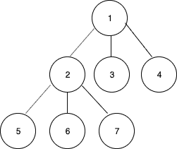
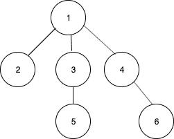

# N 元树的有序遍历

> 原文:[https://www . geesforgeks . org/in order-遍历 n 元树/](https://www.geeksforgeeks.org/inorder-traversal-of-an-n-ary-tree/)

给定一个包含的 N 元树，任务是打印树的有序遍历。

**示例:**

> **输入:** N = 3
> 
> 
> 
> **输出:**5 6 2 7 3 1 4
> T3】输入: N = 3
> 
> 
> 
> **输出:** 2 5 3 1 4 6

**方法:**N 元树的有序遍历被定义为递归地访问除最后一个、根和最后一个子树之外的所有子树。

*   递归访问第一个孩子。
*   递归访问第二个孩子。
*   …..
*   递归访问倒数第二个孩子。
*   打印节点中的数据。
*   递归访问最后一个孩子。
*   重复以上步骤，直到访问完所有节点。

以下是上述方法的实现:

## C++

```
// C++ implementation of the approach
#include<bits/stdc++.h>
using namespace std;

// Class for the node of the tree
struct Node
{
    int data;

    // List of children
    struct Node **children;

    int length;

    Node()
    {
        length = 0;
        data = 0;
    }

    Node(int n, int data_)
    {
        children = new Node*();
        length = n;
        data = data_;
    }
};

// Function to print the inorder traversal
// of the n-ary tree
void inorder(Node *node)
{
    if (node == NULL)
        return;

    // Total children count
    int total = node->length;

    // All the children except the last
    for (int i = 0; i < total - 1; i++)
        inorder(node->children[i]);

    // Print the current node's data
    cout<< node->data << " ";

    // Last child
    inorder(node->children[total - 1]);
}

// Driver code
int main()
{

    /* Create the following tree
          1
        / | \
        2 3 4
        / | \
        5 6 7
    */
    int n = 3;
    Node* root = new Node(n, 1);
    root->children[0] = new Node(n, 2);
    root->children[1] = new Node(n, 3);
    root->children[2] = new Node(n, 4);
    root->children[0]->children[0] = new Node(n, 5);
    root->children[0]->children[1] = new Node(n, 6);
    root->children[0]->children[2] = new Node(n, 7);

    inorder(root);
    return 0;
}

// This code is Contributed by Arnab Kundu
```

## Java 语言(一种计算机语言，尤用于创建网站)

```
// Java implementation of the approach
class GFG {

    // Class for the node of the tree
    static class Node {
        int data;

        // List of children
        Node children[];

        Node(int n, int data)
        {
            children = new Node[n];
            this.data = data;
        }
    }

    // Function to print the inorder traversal
    // of the n-ary tree
    static void inorder(Node node)
    {
        if (node == null)
            return;

        // Total children count
        int total = node.children.length;
        // All the children except the last
        for (int i = 0; i < total - 1; i++)
            inorder(node.children[i]);

        // Print the current node's data
        System.out.print("" + node.data + " ");

        // Last child
        inorder(node.children[total - 1]);
    }

    // Driver code
    public static void main(String[] args)
    {

        /* Create the following tree
                   1
                /  |  \
               2   3   4
             / | \
            5  6  7
        */
        int n = 3;
        Node root = new Node(n, 1);
        root.children[0] = new Node(n, 2);
        root.children[1] = new Node(n, 3);
        root.children[2] = new Node(n, 4);
        root.children[0].children[0] = new Node(n, 5);
        root.children[0].children[1] = new Node(n, 6);
        root.children[0].children[2] = new Node(n, 7);

        inorder(root);
    }
}
```

## 蟒蛇 3

```
# Python3 implementation of the approach
class GFG:

    # Class for the node of the tree
    class Node:
        def __init__(self,n,data):
            # List of children
            self.children = [None]*n
            self.data = data

    # Function to print the inorder traversal
    # of the n-ary tree
    def inorder(self, node):
        if node == None:
            return

        # Total children count
        total = len(node.children)

        # All the children except the last
        for i in range(total-1):
            self.inorder(node.children[i])

        # Print the current node's data
        print(node.data,end=" ")

        # Last child
        self.inorder(node.children[total-1])

    # Driver code
    def main(self):
        # Create the following tree 
        #          1
        #       /  |  \
        #      2   3   4
        #    / | \
        #   5  6  7

        n = 3
        root = self.Node(n, 1)
        root.children[0] = self.Node(n, 2)
        root.children[1] = self.Node(n, 3)
        root.children[2] = self.Node(n, 4)
        root.children[0].children[0] = self.Node(n, 5)
        root.children[0].children[1] = self.Node(n, 6)
        root.children[0].children[2] = self.Node(n, 7)

        self.inorder(root)

ob = GFG() # Create class object
ob.main() # Call main function

# This code is contributed by Shivam Singh
```

## C#

```
// C# implementation of the approach
using System;

class GFG
{

    // Class for the node of the tree
    public class Node
    {
        public int data;

        // List of children
        public Node []children;

        public Node(int n, int data)
        {
            children = new Node[n];
            this.data = data;
        }
    }

    // Function to print the inorder traversal
    // of the n-ary tree
    static void inorder(Node node)
    {
        if (node == null)
            return;

        // Total children count
        int total = node.children.Length;

        // All the children except the last
        for (int i = 0; i < total - 1; i++)
            inorder(node.children[i]);

        // Print the current node's data
        Console.Write("" + node.data + " ");

        // Last child
        inorder(node.children[total - 1]);
    }

    // Driver code
    public static void Main()
    {

        /* Create the following tree
                1
                / | \
            2 3 4
            / | \
            5 6 7
        */
        int n = 3;
        Node root = new Node(n, 1);
        root.children[0] = new Node(n, 2);
        root.children[1] = new Node(n, 3);
        root.children[2] = new Node(n, 4);
        root.children[0].children[0] = new Node(n, 5);
        root.children[0].children[1] = new Node(n, 6);
        root.children[0].children[2] = new Node(n, 7);

        inorder(root);
    }
}

// This code is contributed by AnkitRai01
```

## java 描述语言

```
<script>

// JavaScript implementation of the approach
// Class for the node of the tree
class Node
{

    constructor(n, data)
    {
        this.data = data;
        this.children = Array(n);
    }
}
// Function to print the inorder traversal
// of the n-ary tree
function inorder(node)
{
    if (node == null)
        return;
    // Total children count
    var total = node.children.length;

    // All the children except the last
    for (var i = 0; i < total - 1; i++)
        inorder(node.children[i]);
    // Print the current node's data
    document.write("" + node.data + " ");
    // Last child
    inorder(node.children[total - 1]);
}

// Driver code
/* Create the following tree
        1
        / | \
    2 3 4
    / | \
    5 6 7
*/
var n = 3;
var root = new Node(n, 1);
root.children[0] = new Node(n, 2);
root.children[1] = new Node(n, 3);
root.children[2] = new Node(n, 4);
root.children[0].children[0] = new Node(n, 5);
root.children[0].children[1] = new Node(n, 6);
root.children[0].children[2] = new Node(n, 7);
inorder(root);

</script>
```

**Output**

```
5 6 2 7 3 1 4 
```

**时间复杂度:** O(n)

**空间复杂度:** O(n)