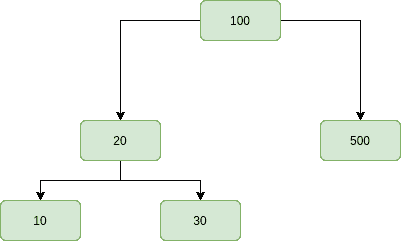
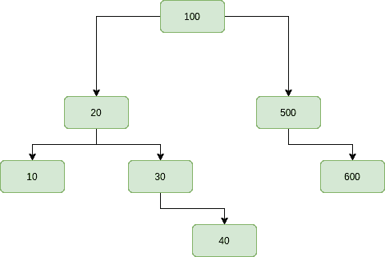

# 在二叉查找树迭代插入节点

> 原文:[https://www . geesforgeks . org/insert-一个二进制节点-搜索-树-迭代/](https://www.geeksforgeeks.org/insert-a-node-in-binary-search-tree-iteratively/)

帖子中已经讨论了在 BST 中插入新节点的递归方法:[二叉查找树| SET 1](https://www.geeksforgeeks.org/binary-search-tree-set-1-search-and-insertion/) 。在这篇文章中，讨论了一种在 BST 中插入节点的**迭代方法**。

**插入钥匙**

新的键总是插入到叶节点。从根开始搜索一个键，直到我们碰到一个叶节点。一旦找到叶节点，新节点将作为叶节点的子节点添加。
**例** :

> **输入:**给定的基站插入 40
> 
> 
> 
> **输出:**
> 
> 
> 
> **说明:**新节点 40 是叶节点。从根节点开始搜索，直到找到一个叶节点，也就是说，如果一个新值大于当前节点，则从右子节点移动到左子节点。
> **输入:**到给定的 BST 插入 600
> 
> 
> 
> **输出:**
> 
> 
> 
> **说明:**新节点 600 是叶节点。从根节点开始搜索，直到找到一个叶节点，也就是说，如果一个新值大于当前节点，则从右子节点移动到左子节点。

**<u>解:</u>**
**进场** :

*   需要注意的是，新的键总是被插入到叶节点。
*   从根开始运行循环，直到到达空指针。
*   保存当前节点的前一个指针。
*   如果当前节点为空，则创建并在那里插入新节点，并根据其值将其作为父节点/上一个节点的子节点之一。
*   如果当前节点的值小于新值，则移动到当前节点的右子节点，否则移动到左子节点。

**以下是上述方法的实施:**

## C++

```
// C++ program to demonstrate insert operation
// in binary search tree
#include <bits/stdc++.h>
using namespace std;

// BST node
struct Node {
    int key;
    struct Node *left, *right;
};

// Utility function to create a new node
Node* newNode(int data)
{
    Node* temp = new Node;

    temp->key = data;

    temp->left = NULL;
    temp->right = NULL;

    return temp;
}

// A utility function to insert a new
// Node with given key in BST
Node* insert(Node* root, int key)
{
    // Create a new Node containing
    // the new element
    Node* newnode = newNode(key);

    // Pointer to start traversing from root and
    // traverses downward path to search
    // where the new node to be inserted
    Node* x = root;

    // Pointer y maintains the trailing
    // pointer of x
    Node* y = NULL;

    while (x != NULL) {
        y = x;
        if (key < x->key)
            x = x->left;
        else
            x = x->right;
    }

    // If the root is NULL i.e the tree is empty
    // The new node is the root node
    if (y == NULL)
        y = newnode;

    // If the new key is less then the leaf node key
    // Assign the new node to be its left child
    else if (key < y->key)
        y->left = newnode;

    // else assign the new node its right child
    else
        y->right = newnode;

    // Returns the pointer where the
    // new node is inserted
    return y;
}

// A utility function to do inorder
// traversal of BST
void Inorder(Node* root)
{
    if (root == NULL)
        return;
    else {
        Inorder(root->left);
        cout << root->key << " ";
        Inorder(root->right);
    }
}

// Driver code
int main()
{
    /* Let us create following BST
            50
          /   \
        30      70
        / \   / \
       20 40 60 80 */

    Node* root = NULL;
    root = insert(root, 50);
    insert(root, 30);
    insert(root, 20);
    insert(root, 40);
    insert(root, 70);
    insert(root, 60);
    insert(root, 80);

    // Print inorder traversal of the BST
    Inorder(root);

    return 0;
}
```

## Java 语言(一种计算机语言，尤用于创建网站)

```
// Java program to demonstrate insert operation
// in binary search tree
import java.util.*;
class solution
{

// BST node
static class Node {
    int key;
     Node left, right;
};

// Utility function to create a new node
static Node newNode(int data)
{
    Node temp = new Node();

    temp.key = data;

    temp.left = null;
    temp.right = null;

    return temp;
}

// A utility function to insert a new
// Node with given key in BST
static Node insert(Node root, int key)
{
    // Create a new Node containing
    // the new element
    Node newnode = newNode(key);

    // Pointer to start traversing from root and
    // traverses downward path to search
    // where the new node to be inserted
    Node x = root;

    // Pointer y maintains the trailing
    // pointer of x
    Node y = null;

    while (x != null) {
        y = x;
        if (key < x.key)
            x = x.left;
        else
            x = x.right;
    }

    // If the root is null i.e the tree is empty
    // The new node is the root node
    if (y == null)
        y = newnode;

    // If the new key is less then the leaf node key
    // Assign the new node to be its left child
    else if (key < y.key)
        y.left = newnode;

    // else assign the new node its right child
    else
        y.right = newnode;

    // Returns the pointer where the
    // new node is inserted
    return y;
}

// A utility function to do inorder
// traversal of BST
static void Inorder(Node root)
{
    if (root == null)
        return;
    else {
        Inorder(root.left);
        System.out.print( root.key +" ");
        Inorder(root.right);
    }
}

// Driver code
public static void main(String args[])
{
    /* Let us create following BST 
            50 
          /   \ 
        30      70 
        / \   / \ 
       20 40 60 80 */

    Node root = null;
    root = insert(root, 50);
    insert(root, 30);
    insert(root, 20);
    insert(root, 40);
    insert(root, 70);
    insert(root, 60);
    insert(root, 80);

    // Print inorder traversal of the BST
    Inorder(root);

}
}
//contributed by Arnab Kundu
```

## 蟒蛇 3

```
"""Python3 program to demonstrate insert
operation in binary search tree """

# A Binary Tree Node
# Utility function to create a
# new tree node
class newNode:

    # Constructor to create a newNode
    def __init__(self, data):
        self.key= data
        self.left = None
        self.right = self.parent = None

# A utility function to insert a new
# Node with given key in BST
def insert(root, key):

    # Create a new Node containing
    # the new element
    newnode = newNode(key)

    # Pointer to start traversing from root
    # and traverses downward path to search
    # where the new node to be inserted
    x = root

    # Pointer y maintains the trailing
    # pointer of x
    y = None

    while (x != None):
        y = x
        if (key < x.key):
            x = x.left
        else:
            x = x.right

    # If the root is None i.e the tree is
    # empty. The new node is the root node
    if (y == None):
        y = newnode

    # If the new key is less then the leaf node key
    # Assign the new node to be its left child
    elif (key < y.key):
        y.left = newnode

    # else assign the new node its
    # right child
    else:
        y.right = newnode

    # Returns the pointer where the
    # new node is inserted
    return y

# A utility function to do inorder
# traversal of BST
def Inorder(root) :

    if (root == None) :
        return
    else:
        Inorder(root.left)
        print( root.key, end = " " )
        Inorder(root.right)

# Driver Code
if __name__ == '__main__':

    """ Let us create following BST
            50
        / \
        30     70
        / \ / \
    20 40 60 80 """

    root = None
    root = insert(root, 50)
    insert(root, 30)
    insert(root, 20)
    insert(root, 40)
    insert(root, 70)
    insert(root, 60)
    insert(root, 80)

    # Pr inorder traversal of the BST
    Inorder(root)

# This code is contributed by
# SHUBHAMSINGH10
```

## C#

```
// C# program to demonstrate insert 
// operation in binary search tree
using System;

class GFG
{
    // BST node
    class Node
    {
        public int key;
        public Node left, right;
    };

    // Utility function to create a new node
    static Node newNode(int data)
    {
        Node temp = new Node();

        temp.key = data;

        temp.left = null;
        temp.right = null;

        return temp;
    }

    // A utility function to insert a new
    // Node with given key in BST
    static Node insert(Node root, int key)
    {
        // Create a new Node containing
        // the new element
        Node newnode = newNode(key);

        // Pointer to start traversing from root and
        // traverses downward path to search
        // where the new node to be inserted
        Node x = root;

        // Pointer y maintains the trailing
        // pointer of x
        Node y = null;

        while (x != null)
        {
            y = x;
            if (key < x.key)
                x = x.left;
            else
                x = x.right;
        }

        // If the root is null i.e the tree is empty
        // The new node is the root node
        if (y == null)
            y = newnode;

        // If the new key is less then the leaf node key
        // Assign the new node to be its left child
        else if (key < y.key)
            y.left = newnode;

        // else assign the new node its right child
        else
            y.right = newnode;

        // Returns the pointer where the
        // new node is inserted
        return y;
    }

    // A utility function to do inorder
    // traversal of BST
    static void Inorder(Node root)
    {
        if (root == null)
            return;
        else
        {
            Inorder(root.left);
            Console.Write( root.key +" ");
            Inorder(root.right);
        }
    }

    // Driver code
    public static void Main(String []args)
    {
        /* Let us create following BST
                50
            / \
            30 70
            / \ / \
        20 40 60 80 */

        Node root = null;
        root = insert(root, 50);
        insert(root, 30);
        insert(root, 20);
        insert(root, 40);
        insert(root, 70);
        insert(root, 60);
        insert(root, 80);

        // Print inorder traversal of the BST
        Inorder(root);
    }
}

// This code is contributed 29AjayKumar
```

## java 描述语言

```
<script>

// javascript program to demonstrate insert 
// operation in binary search tree
// BST node
class Node
{
    constructor()
    {
        this.key = 0;
        this.left = null;
        this.right = null;
    }
};

// Utility function to create a new node
function newNode(data)
{
    var temp = new Node();
    temp.key = data;
    temp.left = null;
    temp.right = null;
    return temp;
}

// A utility function to insert a new
// Node with given key in BST
function insert(root, key)
{

    // Create a new Node containing
    // the new element
    var newnode = newNode(key);

    // Pointer to start traversing from root and
    // traverses downward path to search
    // where the new node to be inserted
    var x = root;

    // Pointer y maintains the trailing
    // pointer of x
    var y = null;

    while (x != null)
    {
        y = x;
        if (key < x.key)
            x = x.left;
        else
            x = x.right;
    }

    // If the root is null i.e the tree is empty
    // The new node is the root node
    if (y == null)
        y = newnode;

    // If the new key is less then the leaf node key
    // Assign the new node to be its left child
    else if (key < y.key)
        y.left = newnode;

    // else assign the new node its right child
    else
        y.right = newnode;

    // Returns the pointer where the
    // new node is inserted
    return y;
}

// A utility function to do inorder
// traversal of BST
function Inorder(root)
{
    if (root == null)
        return;
    else
    {
        Inorder(root.left);
        document.write( root.key +" ");
        Inorder(root.right);
    }
}

// Driver code
/* Let us create following BST
        50
    / \
    30 70
    / \ / \
20 40 60 80 */
var root = null;
root = insert(root, 50);
insert(root, 30);
insert(root, 20);
insert(root, 40);
insert(root, 70);
insert(root, 60);
insert(root, 80);
// Print inorder traversal of the BST
Inorder(root);

// This code is contributed by itsok.
</script>
```

**Output:** 

```
20 30 40 50 60 70 80
```

**复杂度分析:**

*   **时间复杂度:** O(h)，其中 h 为二叉查找树的高度。在最坏的情况下，高度等于节点数。

*   **空间复杂度:** O(1)，不需要额外空间。