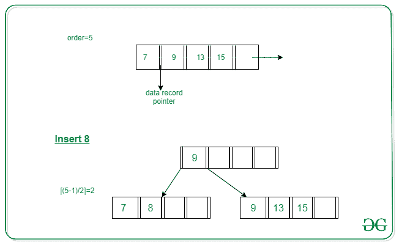
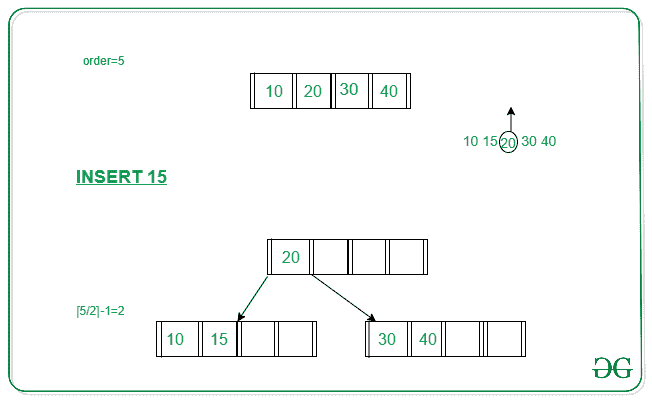
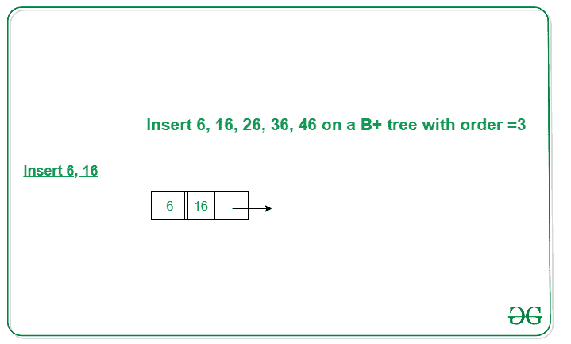
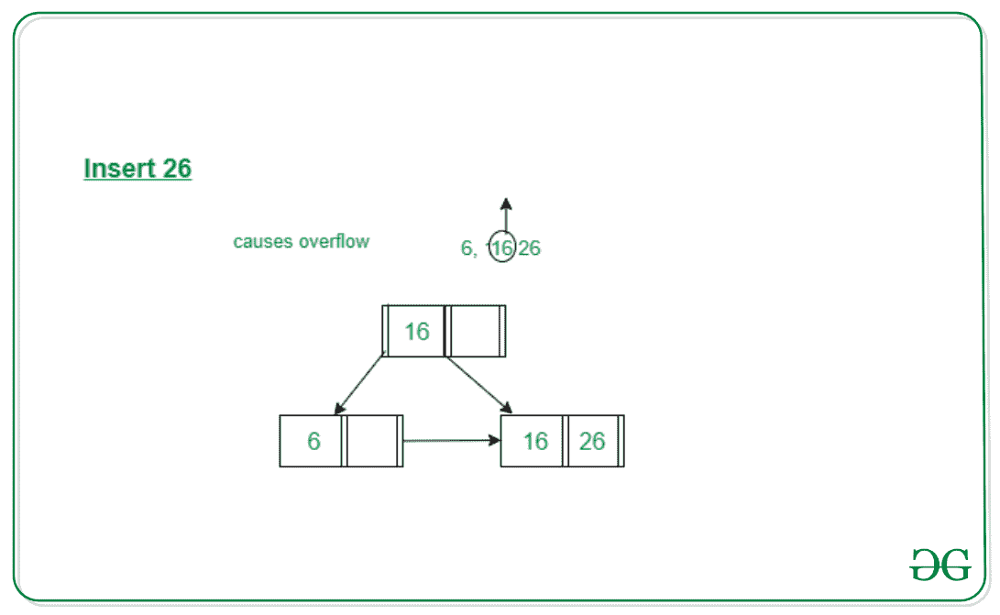
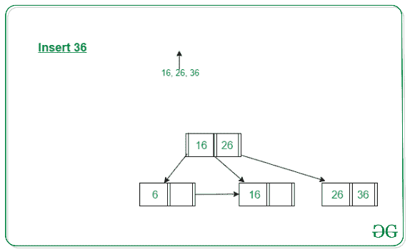
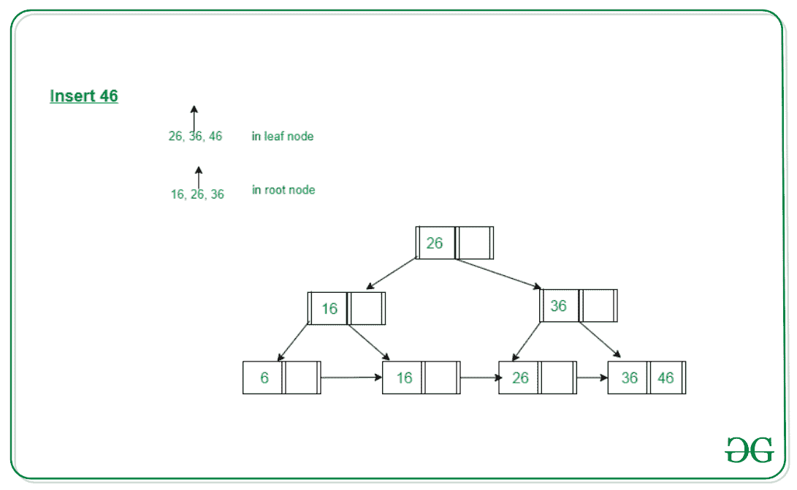

# 插入 B+树

> 原文:[https://www.geeksforgeeks.org/insertion-in-a-b-tree/](https://www.geeksforgeeks.org/insertion-in-a-b-tree/)

**先决条件:**[b+树介绍](https://www.geeksforgeeks.org/introduction-of-b-tree/)
在本文中，我们将讨论如何在 [B+树](https://www.geeksforgeeks.org/introduction-of-b-tree/)中插入节点。在插入过程中，必须遵循 **B+树**的以下属性:

*   除根之外的每个节点最多可以有 **M** 个子节点，至少有 **ceil(M/2)** 个子节点。
*   每个节点最多可以包含**M–1 个**键和最少**ceil(M/2)–1 个**键。
*   根至少有两个子级和一个搜索关键字。
*   而当节点包含的搜索键值超过**M–1**时，就会发生插入溢出。

这里 **M** 是 B+树的顺序。

### B+树插入步骤

1.  每个元素都被插入到一个叶节点中。所以，转到适当的叶节点。
2.  只有在没有溢出的情况下，才能以递增的顺序将键插入叶节点。如果有溢出，继续下面提到的步骤来处理溢出，同时保持 B+树属性。

### 插入 B+树的属性

**情况 1:** 叶节点溢出

1.  将叶节点分成两个节点。
2.  第一个节点包含 **ceil((m-1)/2)** 值。
3.  第二个节点包含剩余的值。
4.  将最小搜索键值从第二个节点复制到父节点。(右偏)

下图是将 8 插入 5 阶 B+树的图示:



**情况 2:** 非叶节点溢出

1.  将非叶节点拆分为两个节点。
2.  第一个节点包含 ceil(m/2)-1 值。
3.  将剩余中最小的移动到父级。
4.  第二个节点包含剩余的键。

下图是将 15 插入到 5 阶 B+树中的图示:



## <u>举例说明 B+树上的插入</u>

**问题:**在顺序= 3 的 B+树上插入以下键值 6、16、26、36、46。
**解决方案:**
**步骤 1:** 一个节点中的顺序最多为 3 个，因此只能有 2 个搜索键值。由于插入仅发生在 B+树的叶节点上，因此在节点中按递增顺序插入搜索键值 **6 和 16** 。下图为同一个:



**第二步:**我们不能在同一个节点中插入 **26** ，因为它会导致叶节点溢出，我们必须根据规则拆分叶节点。第一部分包含 **ceil((3-1)/2)** 值，即只有 **6** 。第二个节点包含剩余值，即 **16** 和 **26** 。然后也将最小的搜索键值从第二个节点复制到父节点，即 **16** 复制到父节点。下图为同一个:



**第 3 步:**现在下一个值是 **36** ，它将被插入到 **26** 之后，但是在该节点中，它会导致该叶节点再次溢出。再次按照上述步骤分割节点。第一部分包含 **ceil((3-1)/2)** 值，即只有 **16** 。第二个节点包含剩余值，即 **26** 和 **36** 。然后也将最小的搜索键值从第二个节点复制到父节点，即 **26** 复制到父节点。下面是同一个的图解:
图解如下图。



**步骤 4:** 现在我们必须插入 46，它将被插入到 **36** 之后，但是它会导致叶节点溢出。所以我们根据规则分割节点。第一部分包含 **26** ，第二部分包含 **36** 和 **46** ，但是现在我们还必须将 **36** 复制到父节点，但是它会导致溢出，因为一个节点中只能容纳两个搜索键值。现在按照步骤处理非叶节点中的溢出。
第一个节点包含 ceil(3/2)-1 值，即‘16’。
将剩余节点中最小的移动到父节点，即“26”将成为新的父节点。
第二个节点包含剩余的键，即‘36’，其余叶节点保持不变。下图为同一个:



下面是 B+树中插入的实现:

## C++

```
// C++ program for implementing B+ Tree
#include <climits>
#include <fstream>
#include <iostream>
#include <sstream>
using namespace std;
int MAX = 3;

// BP node
class Node {
    bool IS_LEAF;
    int *key, size;
    Node** ptr;
    friend class BPTree;

public:
    Node();
};

// BP tree
class BPTree {
    Node* root;
    void insertInternal(int,
                        Node*,
                        Node*);
    Node* findParent(Node*, Node*);

public:
    BPTree();
    void search(int);
    void insert(int);
    void display(Node*);
    Node* getRoot();
};

// Constructor of Node
Node::Node()
{
    key = new int[MAX];
    ptr = new Node*[MAX + 1];
}

// Initialise the BPTree Node
BPTree::BPTree()
{
    root = NULL;
}

// Function to find any element
// in B+ Tree
void BPTree::search(int x)
{

    // If tree is empty
    if (root == NULL) {
        cout << "Tree is empty\n";
    }

    // Traverse to find the value
    else {

        Node* cursor = root;

        // Till we reach leaf node
        while (cursor->IS_LEAF == false) {

            for (int i = 0;
                 i < cursor->size; i++) {

                // If the element to be
                // found is not present
                if (x < cursor->key[i]) {
                    cursor = cursor->ptr[i];
                    break;
                }

                // If reaches end of the
                // cursor node
                if (i == cursor->size - 1) {
                    cursor = cursor->ptr[i + 1];
                    break;
                }
            }
        }

        // Traverse the cursor and find
        // the node with value x
        for (int i = 0;
             i < cursor->size; i++) {

            // If found then return
            if (cursor->key[i] == x) {
                cout << "Found\n";
                return;
            }
        }

        // Else element is not present
        cout << "Not found\n";
    }
}

// Function to implement the Insert
// Operation in B+ Tree
void BPTree::insert(int x)
{

    // If root is null then return
    // newly created node
    if (root == NULL) {
        root = new Node;
        root->key[0] = x;
        root->IS_LEAF = true;
        root->size = 1;
    }

    // Traverse the B+ Tree
    else {
        Node* cursor = root;
        Node* parent;

        // Till cursor reaches the
        // leaf node
        while (cursor->IS_LEAF
               == false) {

            parent = cursor;

            for (int i = 0;
                 i < cursor->size;
                 i++) {

                // If found the position
                // where we have to insert
                // node
                if (x < cursor->key[i]) {
                    cursor
                        = cursor->ptr[i];
                    break;
                }

                // If reaches the end
                if (i == cursor->size - 1) {
                    cursor
                        = cursor->ptr[i + 1];
                    break;
                }
            }
        }

        if (cursor->size < MAX) {
            int i = 0;
            while (x > cursor->key[i]
                   && i < cursor->size) {
                i++;
            }

            for (int j = cursor->size;
                 j > i; j--) {
                cursor->key[j]
                    = cursor->key[j - 1];
            }

            cursor->key[i] = x;
            cursor->size++;

            cursor->ptr[cursor->size]
                = cursor->ptr[cursor->size - 1];
            cursor->ptr[cursor->size - 1] = NULL;
        }

        else {

            // Create a newLeaf node
            Node* newLeaf = new Node;

            int virtualNode[MAX + 1];

            // Update cursor to virtual
            // node created
            for (int i = 0; i < MAX; i++) {
                virtualNode[i]
                    = cursor->key[i];
            }
            int i = 0, j;

            // Traverse to find where the new
            // node is to be inserted
            while (x > virtualNode[i]
                   && i < MAX) {
                i++;
            }

            // Update the current virtual
            // Node to its previous
            for (int j = MAX + 1;
                 j > i; j--) {
                virtualNode[j]
                    = virtualNode[j - 1];
            }

            virtualNode[i] = x;
            newLeaf->IS_LEAF = true;

            cursor->size = (MAX + 1) / 2;
            newLeaf->size
                = MAX + 1 - (MAX + 1) / 2;

            cursor->ptr[cursor->size]
                = newLeaf;

            newLeaf->ptr[newLeaf->size]
                = cursor->ptr[MAX];

            cursor->ptr[MAX] = NULL;

            // Update the current virtual
            // Node's key to its previous
            for (i = 0;
                 i < cursor->size; i++) {
                cursor->key[i]
                    = virtualNode[i];
            }

            // Update the newLeaf key to
            // virtual Node
            for (i = 0, j = cursor->size;
                 i < newLeaf->size;
                 i++, j++) {
                newLeaf->key[i]
                    = virtualNode[j];
            }

            // If cursor is the root node
            if (cursor == root) {

                // Create a new Node
                Node* newRoot = new Node;

                // Update rest field of
                // B+ Tree Node
                newRoot->key[0] = newLeaf->key[0];
                newRoot->ptr[0] = cursor;
                newRoot->ptr[1] = newLeaf;
                newRoot->IS_LEAF = false;
                newRoot->size = 1;
                root = newRoot;
            }
            else {

                // Recursive Call for
                // insert in internal
                insertInternal(newLeaf->key[0],
                               parent,
                               newLeaf);
            }
        }
    }
}

// Function to implement the Insert
// Internal Operation in B+ Tree
void BPTree::insertInternal(int x,
                            Node* cursor,
                            Node* child)
{

    // If we doesn't have overflow
    if (cursor->size < MAX) {
        int i = 0;

        // Traverse the child node
        // for current cursor node
        while (x > cursor->key[i]
               && i < cursor->size) {
            i++;
        }

        // Traverse the cursor node
        // and update the current key
        // to its previous node key
        for (int j = cursor->size;
             j > i; j--) {

            cursor->key[j]
                = cursor->key[j - 1];
        }

        // Traverse the cursor node
        // and update the current ptr
        // to its previous node ptr
        for (int j = cursor->size + 1;
             j > i + 1; j--) {
            cursor->ptr[j]
                = cursor->ptr[j - 1];
        }

        cursor->key[i] = x;
        cursor->size++;
        cursor->ptr[i + 1] = child;
    }

    // For overflow, break the node
    else {

        // For new Interval
        Node* newInternal = new Node;
        int virtualKey[MAX + 1];
        Node* virtualPtr[MAX + 2];

        // Insert the current list key
        // of cursor node to virtualKey
        for (int i = 0; i < MAX; i++) {
            virtualKey[i] = cursor->key[i];
        }

        // Insert the current list ptr
        // of cursor node to virtualPtr
        for (int i = 0; i < MAX + 1; i++) {
            virtualPtr[i] = cursor->ptr[i];
        }

        int i = 0, j;

        // Traverse to find where the new
        // node is to be inserted
        while (x > virtualKey[i]
               && i < MAX) {
            i++;
        }

        // Traverse the virtualKey node
        // and update the current key
        // to its previous node key
        for (int j = MAX + 1;
             j > i; j--) {

            virtualKey[j]
                = virtualKey[j - 1];
        }

        virtualKey[i] = x;

        // Traverse the virtualKey node
        // and update the current ptr
        // to its previous node ptr
        for (int j = MAX + 2;
             j > i + 1; j--) {
            virtualPtr[j]
                = virtualPtr[j - 1];
        }

        virtualPtr[i + 1] = child;
        newInternal->IS_LEAF = false;

        cursor->size
            = (MAX + 1) / 2;

        newInternal->size
            = MAX - (MAX + 1) / 2;

        // Insert new node as an
        // internal node
        for (i = 0, j = cursor->size + 1;
             i < newInternal->size;
             i++, j++) {

            newInternal->key[i]
                = virtualKey[j];
        }

        for (i = 0, j = cursor->size + 1;
             i < newInternal->size + 1;
             i++, j++) {

            newInternal->ptr[i]
                = virtualPtr[j];
        }

        // If cursor is the root node
        if (cursor == root) {

            // Create a new root node
            Node* newRoot = new Node;

            // Update key value
            newRoot->key[0]
                = cursor->key[cursor->size];

            // Update rest field of
            // B+ Tree Node
            newRoot->ptr[0] = cursor;
            newRoot->ptr[1] = newInternal;
            newRoot->IS_LEAF = false;
            newRoot->size = 1;
            root = newRoot;
        }

        else {

            // Recursive Call to insert
            // the data
            insertInternal(cursor->key[cursor->size],
                           findParent(root,
                                      cursor),
                           newInternal);
        }
    }
}

// Function to find the parent node
Node* BPTree::findParent(Node* cursor,
                         Node* child)
{
    Node* parent;

    // If cursor reaches the end of Tree
    if (cursor->IS_LEAF
        || (cursor->ptr[0])->IS_LEAF) {
        return NULL;
    }

    // Traverse the current node with
    // all its child
    for (int i = 0;
         i < cursor->size + 1; i++) {

        // Update the parent for the
        // child Node
        if (cursor->ptr[i] == child) {
            parent = cursor;
            return parent;
        }

        // Else recursively traverse to
        // find child node
        else {
            parent
                = findParent(cursor->ptr[i],
                             child);

            // If parent is found, then
            // return that parent node
            if (parent != NULL)
                return parent;
        }
    }

    // Return parent node
    return parent;
}

// Function to get the root Node
Node* BPTree::getRoot()
{
    return root;
}

// Driver Code
int main()
{
    BPTree node;

    // Create B+ Tree
    node.insert(6);
    node.insert(16);
    node.insert(26);
    node.insert(36);
    node.insert(46);

    // Function Call to search node
    // with value 16
    node.search(16);

    return 0;
}
```

## 蟒蛇 3

```
# Python3 program for implementing B+ Tree

MAX = 3

# BP node
class Node :
    def __init__(self):
        self.IS_LEAF=False
        self.key, self.size=[None]*MAX,0
        self.ptr=[None]*(MAX+1)

# BP tree
class BPTree :

# Initialise the BPTree Node
    def __init__(self):
        self.root = None

# Function to find any element
# in B+ Tree
    def search(self,x):

        # If tree is empty
        if (self.root == None) :
            cout << "Tree is empty\n"

        # Traverse to find the value
        else :

            cursor = self.root

            # Till we reach leaf node
            while (not cursor.IS_LEAF) :

                for i in range(cursor.size) :

                    # If the element to be
                    # found is not present
                    if (x < cursor.key[i]) :
                        cursor = cursor.ptr[i]
                        break

                    # If reaches end of the
                    # cursor node
                    if (i == cursor.size - 1) :
                        cursor = cursor.ptr[i + 1]
                        break

            # Traverse the cursor and find
            # the node with value x
            for i in range(cursor.size):

                # If found then return
                if (cursor.key[i] == x) :
                    print("Found")
                    return

            # Else element is not present
            print("Not found")

    # Function to implement the Insert
    # Operation in B+ Tree
    def insert(self, x):

        # If root is None then return
        # newly created node
        if (self.root == None) :
            self.root = Node()
            self.root.key[0] = x
            self.root.IS_LEAF = True
            self.root.size = 1

        # Traverse the B+ Tree
        else :
            cursor = self.root
            parent=None
            # Till cursor reaches the
            # leaf node
            while (not cursor.IS_LEAF) :

                parent = cursor

                for i in range(cursor.size) :

                    # If found the position
                    # where we have to insert
                    # node
                    if (x < cursor.key[i]) :
                        cursor = cursor.ptr[i]
                        break

                    # If reaches the end
                    if (i == cursor.size - 1) :
                        cursor = cursor.ptr[i + 1]
                        break

            if (cursor.size < MAX) :
                i = 0
                while (i < cursor.size and x > cursor.key[i]):
                    i+=1

                for j in range(cursor.size,i,-1):
                    cursor.key[j] = cursor.key[j - 1]

                cursor.key[i] = x
                cursor.size+=1

                cursor.ptr[cursor.size] = cursor.ptr[cursor.size - 1]
                cursor.ptr[cursor.size - 1] = None

            else :

                # Create a newLeaf node
                newLeaf = Node()

                virtualNode=[None]*(MAX + 1)

                # Update cursor to virtual
                # node created
                for i in range(MAX):
                    virtualNode[i] = cursor.key[i]

                i = 0

                # Traverse to find where the new
                # node is to be inserted
                while (i < MAX and x > virtualNode[i]) :
                    i+=1

                # Update the current virtual
                # Node to its previous
                for j in range(MAX,i,-1) :
                    virtualNode[j] = virtualNode[j - 1]

                virtualNode[i] = x
                newLeaf.IS_LEAF = True

                cursor.size = int((MAX + 1) / 2)
                newLeaf.size = int(MAX + 1 - (MAX + 1) / 2)

                cursor.ptr[cursor.size] = newLeaf

                newLeaf.ptr[newLeaf.size] = cursor.ptr[MAX]

                cursor.ptr[MAX] = None

                # Update the current virtual
                # Node's key to its previous
                for i in range(cursor.size):
                    cursor.key[i] = virtualNode[i]

                # Update the newLeaf key to
                # virtual Node
                j=cursor.size
                for i in range(newLeaf.size):
                    newLeaf.key[i] = virtualNode[j]
                    j+=1

                # If cursor is the root node
                if (cursor == self.root) :

                    # Create a new Node
                    newRoot = Node()

                    # Update rest field of
                    # B+ Tree Node
                    newRoot.key[0] = newLeaf.key[0]
                    newRoot.ptr[0] = cursor
                    newRoot.ptr[1] = newLeaf
                    newRoot.IS_LEAF = False
                    newRoot.size = 1
                    root = newRoot

                else :

                    # Recursive Call for
                    # insert in internal
                    insertInternal(newLeaf.key[0],
                                parent,
                                newLeaf)

# Function to implement the Insert
# Internal Operation in B+ Tree
def insertInternal(x, cursor, child):

    # If we doesn't have overflow
    if (cursor.size < MAX) :
        i = 0

        # Traverse the child node
        # for current cursor node
        while (x > cursor.key[i] and i < cursor.size) :
            i+=1

        # Traverse the cursor node
        # and update the current key
        # to its previous node key
        for j in range(cursor.size,i,-1) :

            cursor.key[j] = cursor.key[j - 1]

        # Traverse the cursor node
        # and update the current ptr
        # to its previous node ptr
        for j in range(cursor.size + 1, i + 1,-1):
            cursor.ptr[j] = cursor.ptr[j - 1]

        cursor.key[i] = x
        cursor.size+=1
        cursor.ptr[i + 1] = child

    # For overflow, break the node
    else :

        # For new Interval
        newInternal = Node()
        virtualKey=[None]*(MAX + 1)
        virtualPtr=[None]*(MAX + 2)

        # Insert the current list key
        # of cursor node to virtualKey
        for i in range(MAX) :
            virtualKey[i] = cursor.key[i]

        # Insert the current list ptr
        # of cursor node to virtualPtr
        for i in range(MAX + 1):
            virtualPtr[i] = cursor.ptr[i]

        i = 0

        # Traverse to find where the new
        # node is to be inserted
        while (x > virtualKey[i] and i < MAX) :
            i+=1

        # Traverse the virtualKey node
        # and update the current key
        # to its previous node key
        for j in range(MAX + 1,i,-1):

            virtualKey[j] = virtualKey[j - 1]

        virtualKey[i] = x

        # Traverse the virtualKey node
        # and update the current ptr
        # to its previous node ptr
        for j in range(MAX + 2, i + 1,-1) :
            virtualPtr[j] = virtualPtr[j - 1]

        virtualPtr[i + 1] = child
        newInternal.IS_LEAF = false

        cursor.size = (MAX + 1) / 2

        newInternal.size = MAX - (MAX + 1) / 2

        # Insert new node as an
        # internal node
        j = cursor.size + 1
        for i in range(newInternal.size):
            newInternal.key[i] = virtualKey[j]
            j+=1

        j = cursor.size + 1
        for i in range(newInternal.size):
            newInternal.ptr[i] = virtualKey[j]
            j+=1

        # If cursor is the root node
        if (cursor == self.root) :

            # Create a new root node
            newRoot = self.root

            # Update key value
            newRoot.key[0] = cursor.key[cursor.size]

            # Update rest field of
            # B+ Tree Node
            newRoot.ptr[0] = cursor
            newRoot.ptr[1] = newInternal
            newRoot.IS_LEAF = false
            newRoot.size = 1
            root = newRoot

        else :

            # Recursive Call to insert
            # the data
            insertInternal(cursor.key[cursor.size],
                           findParent(root,
                                      cursor),
                           newInternal)

    # Function to find the parent node
    def findParent(self, cursor, child):
        # If cursor reaches the end of Tree
        if (cursor.IS_LEAF or (cursor.ptr[0]).IS_LEAF) :
            return None

        # Traverse the current node with
        # all its child
        for i in range(cursor.size + 1) :

            # Update the parent for the
            # child Node
            if (cursor.ptr[i] == child) :
                parent = cursor
                return parent

            # Else recursively traverse to
            # find child node
            else :
                parent = findParent(cursor.ptr[i], child)

                # If parent is found, then
                # return that parent node
                if (parent != None):
                    return parent

        # Return parent node
        return parent

    # Function to get the root Node
    def getRoot(self):
        return self.root

# Driver Code
if __name__=='__main__':
    node=BPTree()

    # Create B+ Tree
    node.insert(6)
    node.insert(16)
    node.insert(26)
    node.insert(36)
    node.insert(46)

    # Function Call to search node
    # with value 16
    node.search(16)
```

**Output:** 

```
Found
```