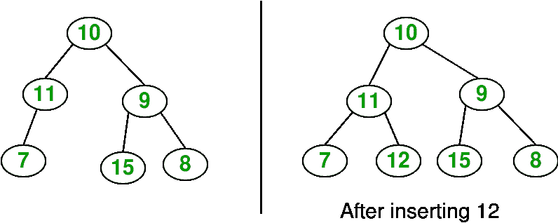

# 以层级顺序插入二叉树

> 原文:[https://www . geeksforgeeks . org/二进制顺序插入树/](https://www.geeksforgeeks.org/insertion-in-a-binary-tree-in-level-order/)

给定一个二叉树和一个键，在[级顺序](https://www.geeksforgeeks.org/level-order-tree-traversal/)中可用的第一个位置将键插入二叉树。



其思想是使用[队列](https://www.geeksforgeeks.org/queue-data-structure/)对给定的树进行迭代级序遍历。如果我们发现一个节点的左子节点是空的，我们就创建一个新的键作为该节点的左子节点。否则，如果我们发现一个节点的右子节点为空，我们就将新的键作为右子节点。我们一直遍历树，直到找到一个节点，它的左或右子节点都是空的。

## C++

```
// C++ program to insert element in Binary Tree
#include <iostream>
#include <queue>
using namespace std;

/* A binary tree node has data, pointer to left child
and a pointer to right child */

struct Node {
    int data;
    Node* left;
    Node* right;
};

/* Function to create a new node */

Node* CreateNode(int data)
{
    Node* newNode = new Node();
    if (!newNode) {
        cout << "Memory error\n";
        return NULL;
    }
    newNode->data = data;
    newNode->left = newNode->right = NULL;
    return newNode;
}

/* Function to insert element in binary tree */

Node* InsertNode(Node* root, int data)
{
    // If the tree is empty, assign new node address to root
    if (root == NULL) {
        root = CreateNode(data);
        return root;
    }

    // Else, do level order traversal until we find an empty
    // place, i.e. either left child or right child of some
    // node is pointing to NULL.
    queue<Node*> q;
    q.push(root);

    while (!q.empty()) {
        Node* temp = q.front();
        q.pop();

        if (temp->left != NULL)
            q.push(temp->left);
        else {
            temp->left = CreateNode(data);
            return root;
        }

        if (temp->right != NULL)
            q.push(temp->right);
        else {
            temp->right = CreateNode(data);
            return root;
        }
    }
}

/* Inorder traversal of a binary tree */

void inorder(Node* temp)
{
    if (temp == NULL)
        return;

    inorder(temp->left);
    cout << temp->data << ' ';
    inorder(temp->right);
}

// Driver code
int main()
{
    Node* root = CreateNode(10);
    root->left = CreateNode(11);
    root->left->left = CreateNode(7);
    root->right = CreateNode(9);
    root->right->left = CreateNode(15);
    root->right->right = CreateNode(8);

    cout << "Inorder traversal before insertion: ";
    inorder(root);
    cout << endl;

    int key = 12;
    root = InsertNode(root, key);

    cout << "Inorder traversal after insertion: ";
    inorder(root);
    cout << endl;

    return 0;
}
```

## Java 语言(一种计算机语言，尤用于创建网站)

```
// Java program to insert element in binary tree
import java.util.LinkedList;
import java.util.Queue;
public class GFG {

    /* A binary tree node has key, pointer to
    left child and a pointer to right child */
    static class Node {
        int key;
        Node left, right;

        // constructor
        Node(int key)
        {
            this.key = key;
            left = null;
            right = null;
        }
    }
    static Node root;
    static Node temp = root;

    /* Inorder traversal of a binary tree*/
    static void inorder(Node temp)
    {
        if (temp == null)
            return;

        inorder(temp.left);
        System.out.print(temp.key + " ");
        inorder(temp.right);
    }

    /*function to insert element in binary tree */
    static void insert(Node temp, int key)
    {

        if (temp == null) {
            root = new Node(key);
            return;
        }
        Queue<Node> q = new LinkedList<Node>();
        q.add(temp);

        // Do level order traversal until we find
        // an empty place.
        while (!q.isEmpty()) {
            temp = q.peek();
            q.remove();

            if (temp.left == null) {
                temp.left = new Node(key);
                break;
            }
            else
                q.add(temp.left);

            if (temp.right == null) {
                temp.right = new Node(key);
                break;
            }
            else
                q.add(temp.right);
        }
    }

    // Driver code
    public static void main(String args[])
    {
        root = new Node(10);
        root.left = new Node(11);
        root.left.left = new Node(7);
        root.right = new Node(9);
        root.right.left = new Node(15);
        root.right.right = new Node(8);

        System.out.print(
            "Inorder traversal before insertion:");
        inorder(root);

        int key = 12;
        insert(root, key);

        System.out.print(
            "\nInorder traversal after insertion:");
        inorder(root);
    }
}
// This code is contributed by Sumit Ghosh
```

## 蟒蛇 3

```
# Python program to insert element in binary tree
class newNode():

    def __init__(self, data):
        self.key = data
        self.left = None
        self.right = None

""" Inorder traversal of a binary tree"""
def inorder(temp):

    if (not temp):
        return

    inorder(temp.left)
    print(temp.key,end = " ")
    inorder(temp.right)

"""function to insert element in binary tree """
def insert(temp,key):

    if not temp:
        root = newNode(key)
        return
    q = []
    q.append(temp)

    # Do level order traversal until we find
    # an empty place.
    while (len(q)):
        temp = q[0]
        q.pop(0)

        if (not temp.left):
            temp.left = newNode(key)
            break
        else:
            q.append(temp.left)

        if (not temp.right):
            temp.right = newNode(key)
            break
        else:
            q.append(temp.right)

# Driver code
if __name__ == '__main__':
    root = newNode(10)
    root.left = newNode(11)
    root.left.left = newNode(7)
    root.right = newNode(9)
    root.right.left = newNode(15)
    root.right.right = newNode(8)

    print("Inorder traversal before insertion:", end = " ")
    inorder(root)

    key = 12
    insert(root, key)

    print()
    print("Inorder traversal after insertion:", end = " ")
    inorder(root)

# This code is contributed by SHUBHAMSINGH10
```

## C#

```
// C# program to insert element in binary tree
using System;
using System.Collections.Generic;

class GFG {

    /* A binary tree node has key, pointer to
    left child and a pointer to right child */
    public class Node {
        public int key;
        public Node left, right;

        // constructor
        public Node(int key)
        {
            this.key = key;
            left = null;
            right = null;
        }
    }
    static Node root;

    /* Inorder traversal of a binary tree*/
    static void inorder(Node temp)
    {
        if (temp == null)
            return;

        inorder(temp.left);
        Console.Write(temp.key + " ");
        inorder(temp.right);
    }

    /*function to insert element in binary tree */
    static void insert(Node temp, int key)
    {
          if (temp == null) {
            root = new Node(key);
            return;
        }
        Queue<Node> q = new Queue<Node>();
        q.Enqueue(temp);

        // Do level order traversal until we find
        // an empty place.
        while (q.Count != 0) {
            temp = q.Peek();
            q.Dequeue();

            if (temp.left == null) {
                temp.left = new Node(key);
                break;
            }
            else
                q.Enqueue(temp.left);

            if (temp.right == null) {
                temp.right = new Node(key);
                break;
            }
            else
                q.Enqueue(temp.right);
        }
    }

    // Driver code
    public static void Main(String[] args)
    {
        root = new Node(10);
        root.left = new Node(11);
        root.left.left = new Node(7);
        root.right = new Node(9);
        root.right.left = new Node(15);
        root.right.right = new Node(8);

        Console.Write(
            "Inorder traversal before insertion:");
        inorder(root);

        int key = 12;
        insert(root, key);

        Console.Write(
            "\nInorder traversal after insertion:");
        inorder(root);
    }
}

// This code is contributed by Rajput-Ji
```

## java 描述语言

```
<script>
// javascript program to insert element in binary tree

    /*
     * A binary tree node has key, pointer to left child and a pointer to right
     * child
     */
class Node {
    constructor(val) {
        this.key = val;
        this.left = null;
        this.right = null;
    }
}

    var temp;

    /* Inorder traversal of a binary tree */
    function inorder(temp) {
        if (temp == null)
            return;

        inorder(temp.left);
        document.write(temp.key + " ");
        inorder(temp.right);
    }

    /* function to insert element in binary tree */
    function insert(temp , key) {

        if (temp == null) {
            root = new Node(key);
            return;
        }
        var q = [];
        q.push(temp);

        // Do level order traversal until we find
        // an empty place.
        while (q.length!=0) {
            temp = q.pop();

            if (temp.left == null) {
                temp.left = new Node(key);
                break;
            } else
                q.push(temp.left);

            if (temp.right == null) {
                temp.right = new Node(key);
                break;
            } else
                q.push(temp.right);
        }
    }

    // Driver code
        var root = new Node(10);
        root.left = new Node(11);
        root.left.left = new Node(7);
        root.right = new Node(9);
        root.right.left = new Node(15);
        root.right.right = new Node(8);

        document.write("Inorder traversal before insertion:");
        inorder(root);

        var key = 12;
        insert(root, key);

        document.write("<br\>Inorder traversal after insertion:");
        inorder(root);

// This code is contributed by umadevi9616
</script>
```

**Output**

```
Inorder traversal before insertion: 7 11 10 15 9 8 
Inorder traversal after insertion: 7 11 12 10 15 9 8 
```

本文由**雅什辛拉**供稿。如果你喜欢 GeeksforGeeks 并想投稿，你也可以使用[write.geeksforgeeks.org](http://www.write.geeksforgeeks.org)写一篇文章或者把你的文章邮寄到 review-team@geeksforgeeks.org。看到你的文章出现在极客博客主页上，帮助其他极客。
如果你发现任何不正确的地方，或者你想分享更多关于上面讨论的话题的信息，请写评论。