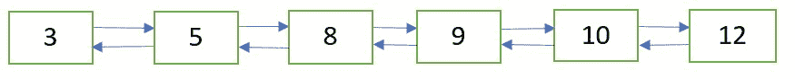

# 双链表的插入排序

> 原文:[https://www . geesforgeks . org/insertion-sort-double-link-list/](https://www.geeksforgeeks.org/insertion-sort-doubly-linked-list/)

使用插入排序技术对双向链表进行排序。

初始双向链表


应用插入排序后的双向链表



**算法:**
下面是一个简单的双链表插入排序算法。
1)创建一个空的**排序(或结果)**双链表。
2)遍历给定的双向链表，对每个节点执行以下操作。
a)在**排序(或结果)**双链表中以排序方式插入当前节点。
3)将给定链表的头部改为**排序(或结果)**列表的头部。
主要步骤是(2.a)，下面的帖子已经讲到了。
[双向链表的排序插入](https://www.geeksforgeeks.org/insert-value-sorted-way-sorted-doubly-linked-list/)

## C++

```
// C++ implementation for insertion Sort
// on a doubly linked list
#include <bits/stdc++.h>

using namespace std;

// Node of a doubly linked list
struct Node {
    int data;
    struct Node* prev, *next;
};

// function to create and return a new node
// of a doubly linked list
struct Node* getNode(int data)
{
    // allocate node
    struct Node* newNode =
          (struct Node*)malloc(sizeof(struct Node));

    // put in the data
    newNode->data = data;
    newNode->prev = newNode->next = NULL;
    return newNode;
}

// function to insert a new node in sorted way in
// a sorted doubly linked list
void sortedInsert(struct Node** head_ref, struct Node* newNode)
{
    struct Node* current;

    // if list is empty
    if (*head_ref == NULL)
        *head_ref = newNode;

    // if the node is to be inserted at the beginning
    // of the doubly linked list
    else if ((*head_ref)->data >= newNode->data) {
        newNode->next = *head_ref;
        newNode->next->prev = newNode;
        *head_ref = newNode;
    }

    else {
        current = *head_ref;

        // locate the node after which the new node
        // is to be inserted
        while (current->next != NULL &&
               current->next->data < newNode->data)
            current = current->next;

        /*Make the appropriate links */

        newNode->next = current->next;

        // if the new node is not inserted
        // at the end of the list
        if (current->next != NULL)
            newNode->next->prev = newNode;

        current->next = newNode;
        newNode->prev = current;
    }
}

// function to sort a doubly linked list using insertion sort
void insertionSort(struct Node** head_ref)
{
    // Initialize 'sorted' - a sorted doubly linked list
    struct Node* sorted = NULL;

    // Traverse the given doubly linked list and
    // insert every node to 'sorted'
    struct Node* current = *head_ref;
    while (current != NULL) {

        // Store next for next iteration
        struct Node* next = current->next;

        // removing all the links so as to create 'current'
        // as a new node for insertion
        current->prev = current->next = NULL;

        // insert current in 'sorted' doubly linked list
        sortedInsert(&sorted, current);

        // Update current
        current = next;
    }

    // Update head_ref to point to sorted doubly linked list
    *head_ref = sorted;
}

// function to print the doubly linked list
void printList(struct Node* head)
{
    while (head != NULL) {
        cout << head->data << " ";
        head = head->next;
    }
}

// function to insert a node at the beginning of
// the doubly linked list
void push(struct Node** head_ref, int new_data)
{
    /* allocate node */
    struct Node* new_node =
         (struct Node*)malloc(sizeof(struct Node));

    /* put in the data  */
    new_node->data = new_data;

    /* Make next of new node as head and previous as NULL */
    new_node->next = (*head_ref);
    new_node->prev = NULL;

    /* change prev of head node to new node */
    if ((*head_ref) != NULL)
        (*head_ref)->prev = new_node;

    /* move the head to point to the new node */
    (*head_ref) = new_node;
}

// Driver program to test above
int main()
{
    /* start with the empty doubly linked list */
    struct Node* head = NULL;

    // insert the following data
    push(&head, 9);
    push(&head, 3);
    push(&head, 5);
    push(&head, 10);
    push(&head, 12);
    push(&head, 8);

    cout << "Doubly Linked List Before Sortingn";
    printList(head);

    insertionSort(&head);

    cout << "nDoubly Linked List After Sortingn";
    printList(head);

    return 0;
}
```

## Java 语言(一种计算机语言，尤用于创建网站)

```
// Java implementation for insertion Sort
// on a doubly linked list
class Solution
{

// Node of a doubly linked list
static class Node
{
    int data;
    Node prev, next;
};

// function to create and return a new node
// of a doubly linked list
static Node getNode(int data)
{
    // allocate node
    Node newNode = new Node();

    // put in the data
    newNode.data = data;
    newNode.prev = newNode.next = null;
    return newNode;
}

// function to insert a new node in sorted way in
// a sorted doubly linked list
static Node sortedInsert(Node head_ref, Node newNode)
{
    Node current;

    // if list is empty
    if (head_ref == null)
        head_ref = newNode;

    // if the node is to be inserted at the beginning
    // of the doubly linked list
    else if ((head_ref).data >= newNode.data)
    {
        newNode.next = head_ref;
        newNode.next.prev = newNode;
        head_ref = newNode;
    }

    else
    {
        current = head_ref;

        // locate the node after which the new node
        // is to be inserted
        while (current.next != null &&
            current.next.data < newNode.data)
            current = current.next;

        //Make the appropriate links /

        newNode.next = current.next;

        // if the new node is not inserted
        // at the end of the list
        if (current.next != null)
            newNode.next.prev = newNode;

        current.next = newNode;
        newNode.prev = current;
    }
    return head_ref;
}

// function to sort a doubly linked list using insertion sort
static Node insertionSort(Node head_ref)
{
    // Initialize 'sorted' - a sorted doubly linked list
    Node sorted = null;

    // Traverse the given doubly linked list and
    // insert every node to 'sorted'
    Node current = head_ref;
    while (current != null)
    {

        // Store next for next iteration
        Node next = current.next;

        // removing all the links so as to create 'current'
        // as a new node for insertion
        current.prev = current.next = null;

        // insert current in 'sorted' doubly linked list
        sorted=sortedInsert(sorted, current);

        // Update current
        current = next;
    }

    // Update head_ref to point to sorted doubly linked list
    head_ref = sorted;

    return head_ref;
}

// function to print the doubly linked list
static void printList(Node head)
{
    while (head != null)
    {
        System.out.print(head.data + " ");
        head = head.next;
    }
}

// function to insert a node at the beginning of
// the doubly linked list
static Node push(Node head_ref, int new_data)
{
    // allocate node /
    Node new_node = new Node();

    // put in the data /
    new_node.data = new_data;

    // Make next of new node as head and previous as null /
    new_node.next = (head_ref);
    new_node.prev = null;

    // change prev of head node to new node /
    if ((head_ref) != null)
        (head_ref).prev = new_node;

    // move the head to point to the new node /
    (head_ref) = new_node;

    return head_ref;
}

// Driver code
public static void main(String args[])
{
    // start with the empty doubly linked list /
    Node head = null;

    // insert the following data
    head=push(head, 9);
    head=push(head, 3);
    head=push(head, 5);
    head=push(head, 10);
    head=push(head, 12);
    head=push(head, 8);

    System.out.println( "Doubly Linked List Before Sorting\n");
    printList(head);

    head=insertionSort(head);

    System.out.println("\nDoubly Linked List After Sorting\n");
    printList(head);

}
}

// This code is contributed by Arnab Kundu
```

## 蟒蛇 3

```
# Python3 implementation for insertion Sort
# on a doubly linked list

# Node of a doubly linked list
class Node:

    def __init__(self, data):
        self.data = data
        self.prev = None
        self.next = None

# function to create and return a new node
# of a doubly linked list
def getNode(data):

    # allocate node
    newNode = Node(0)

    # put in the data
    newNode.data = data
    newNode.prev = newNode.next = None
    return newNode

# function to insert a new node in sorted way in
# a sorted doubly linked list
def sortedInsert(head_ref, newNode):

    current = None

    # if list is empty
    if (head_ref == None):
        head_ref = newNode

    # if the node is to be inserted at the beginning
    # of the doubly linked list
    elif ((head_ref).data >= newNode.data) :
        newNode.next = head_ref
        newNode.next.prev = newNode
        head_ref = newNode

    else :
        current = head_ref

        # locate the node after which the new node
        # is to be inserted
        while (current.next != None and
            current.next.data < newNode.data):
            current = current.next

        """Make the appropriate links """
        newNode.next = current.next

        # if the new node is not inserted
        # at the end of the list
        if (current.next != None):
            newNode.next.prev = newNode

        current.next = newNode
        newNode.prev = current

    return head_ref;

# function to sort a doubly linked list
# using insertion sort
def insertionSort( head_ref):

    # Initialize 'sorted' - a sorted
    # doubly linked list
    sorted = None

    # Traverse the given doubly linked list
    # and insert every node to 'sorted'
    current = head_ref
    while (current != None) :

        # Store next for next iteration
        next = current.next

        # removing all the links so as to create
        # 'current' as a new node for insertion
        current.prev = current.next = None

        # insert current in 'sorted' doubly linked list
        sorted = sortedInsert(sorted, current)

        # Update current
        current = next

    # Update head_ref to point to
    # sorted doubly linked list
    head_ref = sorted

    return head_ref

# function to print the doubly linked list
def printList(head):

    while (head != None) :
        print( head.data, end = " ")
        head = head.next

# function to insert a node at the
# beginning of the doubly linked list
def push(head_ref, new_data):

    """ allocate node """
    new_node = Node(0)

    """ put in the data """
    new_node.data = new_data

    """ Make next of new node as head
    and previous as None """
    new_node.next = (head_ref)
    new_node.prev = None

    """ change prev of head node to new node """
    if ((head_ref) != None):
        (head_ref).prev = new_node

    """ move the head to point to the new node """
    (head_ref) = new_node
    return head_ref

# Driver Code
if __name__ == "__main__":

    """ start with the empty doubly linked list """
    head = None

    # insert the following data
    head = push(head, 9)
    head = push(head, 3)
    head = push(head, 5)
    head = push(head, 10)
    head = push(head, 12)
    head = push(head, 8)

    print( "Doubly Linked List Before Sorting")
    printList(head)

    head = insertionSort(head)

    print("\nDoubly Linked List After Sorting")
    printList(head)

# This code is contributed by Arnab Kundu
```

## C#

```
// C# implementation for insertion Sort
// on a doubly linked list
using System;

class GFG
{

// Node of a doubly linked list
public class Node
{
    public int data;
    public Node prev, next;
};

// function to create and return a new node
// of a doubly linked list
static Node getNode(int data)
{
    // allocate node
    Node newNode = new Node();

    // put in the data
    newNode.data = data;
    newNode.prev = newNode.next = null;
    return newNode;
}

// function to insert a new node in sorted way
// in a sorted doubly linked list
static Node sortedInsert(Node head_ref,
                         Node newNode)
{
    Node current;

    // if list is empty
    if (head_ref == null)
        head_ref = newNode;

    // if the node is to be inserted at the beginning
    // of the doubly linked list
    else if ((head_ref).data >= newNode.data)
    {
        newNode.next = head_ref;
        newNode.next.prev = newNode;
        head_ref = newNode;
    }

    else
    {
        current = head_ref;

        // locate the node after which
        // the new node is to be inserted
        while (current.next != null &&
               current.next.data < newNode.data)
            current = current.next;

        //Make the appropriate links

        newNode.next = current.next;

        // if the new node is not inserted
        // at the end of the list
        if (current.next != null)
            newNode.next.prev = newNode;

        current.next = newNode;
        newNode.prev = current;
    }
    return head_ref;
}

// function to sort a doubly linked list
// using insertion sort
static Node insertionSort(Node head_ref)
{
    // Initialize 'sorted' - a sorted doubly linked list
    Node sorted = null;

    // Traverse the given doubly linked list and
    // insert every node to 'sorted'
    Node current = head_ref;
    while (current != null)
    {

        // Store next for next iteration
        Node next = current.next;

        // removing all the links so as to create
        // 'current' as a new node for insertion
        current.prev = current.next = null;

        // insert current in 'sorted' doubly linked list
        sorted = sortedInsert(sorted, current);

        // Update current
        current = next;
    }

    // Update head_ref to point to
    // sorted doubly linked list
    head_ref = sorted;

    return head_ref;
}

// function to print the doubly linked list
static void printList(Node head)
{
    while (head != null)
    {
        Console.Write(head.data + " ");
        head = head.next;
    }
}

// function to insert a node at the beginning of
// the doubly linked list
static Node push(Node head_ref, int new_data)
{
    // allocate node
    Node new_node = new Node();

    // put in the data
    new_node.data = new_data;

    // Make next of new node as head
    // and previous as null
    new_node.next = (head_ref);
    new_node.prev = null;

    // change prev of head node to new node
    if ((head_ref) != null)
        (head_ref).prev = new_node;

    // move the head to point to the new node
    (head_ref) = new_node;

    return head_ref;
}

// Driver code
public static void Main(String []args)
{

    // start with the empty doubly linked list
    Node head = null;

    // insert the following data
    head = push(head, 9);
    head = push(head, 3);
    head = push(head, 5);
    head = push(head, 10);
    head = push(head, 12);
    head = push(head, 8);

    Console.WriteLine("Doubly Linked List Before Sorting");
    printList(head);

    head = insertionSort(head);

    Console.WriteLine("\nDoubly Linked List After Sorting");
    printList(head);
}
}

// This code is contributed by Princi Singh
```

## java 描述语言

```
<script>
    // javascript implementation for insertion Sort
    // on a doubly linked list

    // Node of a doubly linked list
    class Node {
        constructor(val) {
            this.data = val;
            this.prev = null;
            this.next = null;
        }
    }
    // function to create and return a new node
    // of a doubly linked list
    function getNode(data) {
        // allocate node
        var newNode = new Node();

        // put in the data
        newNode.data = data;
        newNode.prev = newNode.next = null;
        return newNode;
    }

    // function to insert a new node in sorted way in
    // a sorted doubly linked list
    function sortedInsert(head_ref,  newNode) {
        var current;

        // if list is empty
        if (head_ref == null)
            head_ref = newNode;

        // if the node is to be inserted at the beginning
        // of the doubly linked list
        else if ((head_ref).data >= newNode.data) {
            newNode.next = head_ref;
            newNode.next.prev = newNode;
            head_ref = newNode;
        }

        else {
            current = head_ref;

            // locate the node after which the new node
            // is to be inserted
            while (current.next != null && current.next.data < newNode.data)
                current = current.next;

            // Make the appropriate links /

            newNode.next = current.next;

            // if the new node is not inserted
            // at the end of the list
            if (current.next != null)
                newNode.next.prev = newNode;

            current.next = newNode;
            newNode.prev = current;
        }
        return head_ref;
    }

    // function to sort a doubly linked list using insertion sort
    function insertionSort(head_ref) {
        // Initialize 'sorted' - a sorted doubly linked list
        var sorted = null;

        // Traverse the given doubly linked list and
        // insert every node to 'sorted'
        var current = head_ref;
        while (current != null) {

            // Store next for next iteration
            var next = current.next;

            // removing all the links so as to create 'current'
            // as a new node for insertion
            current.prev = current.next = null;

            // insert current in 'sorted' doubly linked list
            sorted = sortedInsert(sorted, current);

            // Update current
            current = next;
        }

        // Update head_ref to point to sorted doubly linked list
        head_ref = sorted;

        return head_ref;
    }

    // function to print the doubly linked list
    function printList(head) {
        while (head != null) {
            document.write(head.data + " ");
            head = head.next;
        }
    }

    // function to insert a node at the beginning of
    // the doubly linked list
    function push(head_ref , new_data) {
        // allocate node /
        var new_node = new Node();

        // put in the data /
        new_node.data = new_data;

        // Make next of new node as head and previous as null /
        new_node.next = (head_ref);
        new_node.prev = null;

        // change prev of head node to new node /
        if ((head_ref) != null)
            (head_ref).prev = new_node;

        // move the head to point to the new node /
        (head_ref) = new_node;

        return head_ref;
    }

    // Driver code

    // start with the empty doubly linked list /
    var head = null;

    // insert the following data
    head = push(head, 9);
    head = push(head, 3);
    head = push(head, 5);
    head = push(head, 10);
    head = push(head, 12);
    head = push(head, 8);

    document.write("Doubly Linked List Before Sorting<br/>");
    printList(head);

    head = insertionSort(head);

    document.write("<br/>Doubly Linked List After Sorting<br/>");
    printList(head);

// This code contributed by umadevi9616
</script>
```

**输出:**

```
Doubly Linked List Before Sorting
8 12 10 5 3 9
Doubly Linked List After Sorting
3 5 8 9 10 12
```

**时间复杂度:** O(n <sup>2</sup>

本文由**阿育什·乔哈里**供稿。如果你喜欢 GeeksforGeeks 并想投稿，你也可以使用[write.geeksforgeeks.org](https://write.geeksforgeeks.org)写一篇文章或者把你的文章邮寄到 review-team@geeksforgeeks.org。看到你的文章出现在极客博客主页上，帮助其他极客。
如果你发现任何不正确的地方，或者你想分享更多关于上面讨论的话题的信息，请写评论。