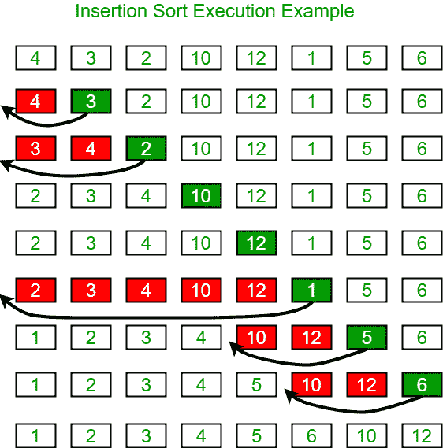

# 插入输出

> 原文:[https://www.geeksforgeeks.org/insertion-sort/](https://www.geeksforgeeks.org/insertion-sort/)

插入排序是一种简单的排序算法，其工作原理类似于您对手中的扑克牌进行排序的方式。数组实际上被分成一个排序的部分和一个未排序的部分。未排序部分的值被拾取并放置在排序部分的正确位置。
**算法**
以升序对大小为 n 的数组进行排序:
1:在数组上从 arr[1]迭代到 arr[n]。
2:将当前元素(键)与其前身进行比较。
3:如果关键元素小于其前身，将其与之前的元素进行比较。将较大的元素向上移动一个位置，为交换的元素腾出空间。
**例:**



**另一个例子:**
**12** ，11，13，5，6
让我们循环为 i = 1(数组的第二个元素)到 4(数组的最后一个元素)
i = 1。由于 11 小于 12，在 12
**之前移动 12 并插入 11，11，12** ，13，5，6
i = 2。13 将保持其位置，如同 A[0..I-1]小于 13
**11，12，13** ，5，6
i = 3。5 将移动到开始位置，11 到 13 之间的所有其他元素将在它们当前位置的前面移动一个位置。
**5、11、12、13** 、6
i = 4。6 将移动到 5 之后的位置，从 11 到 13 的元素将在其当前位置之前移动一个位置。
**5、6、11、12、13**

## C++

```
// C++ program for insertion sort
#include <bits/stdc++.h>
using namespace std;

/* Function to sort an array using insertion sort*/
void insertionSort(int arr[], int n)
{
    int i, key, j;
    for (i = 1; i < n; i++)
    {
        key = arr[i];
        j = i - 1;

        /* Move elements of arr[0..i-1], that are
        greater than key, to one position ahead
        of their current position */
        while (j >= 0 && arr[j] > key)
        {
            arr[j + 1] = arr[j];
            j = j - 1;
        }
        arr[j + 1] = key;
    }
}

// A utility function to print an array of size n
void printArray(int arr[], int n)
{
    int i;
    for (i = 0; i < n; i++)
        cout << arr[i] << " ";
    cout << endl;
}

/* Driver code */
int main()
{
    int arr[] = { 12, 11, 13, 5, 6 };
    int n = sizeof(arr) / sizeof(arr[0]);

    insertionSort(arr, n);
    printArray(arr, n);

    return 0;
}

// This is code is contributed by rathbhupendra
```

## C

```
// C program for insertion sort
#include <math.h>
#include <stdio.h>

/* Function to sort an array using insertion sort*/
void insertionSort(int arr[], int n)
{
    int i, key, j;
    for (i = 1; i < n; i++) {
        key = arr[i];
        j = i - 1;

        /* Move elements of arr[0..i-1], that are
          greater than key, to one position ahead
          of their current position */
        while (j >= 0 && arr[j] > key) {
            arr[j + 1] = arr[j];
            j = j - 1;
        }
        arr[j + 1] = key;
    }
}

// A utility function to print an array of size n
void printArray(int arr[], int n)
{
    int i;
    for (i = 0; i < n; i++)
        printf("%d ", arr[i]);
    printf("\n");
}

/* Driver program to test insertion sort */
int main()
{
    int arr[] = { 12, 11, 13, 5, 6 };
    int n = sizeof(arr) / sizeof(arr[0]);

    insertionSort(arr, n);
    printArray(arr, n);

    return 0;
}
```

## Java 语言(一种计算机语言，尤用于创建网站)

```
// Java program for implementation of Insertion Sort
class InsertionSort {
    /*Function to sort array using insertion sort*/
    void sort(int arr[])
    {
        int n = arr.length;
        for (int i = 1; i < n; ++i) {
            int key = arr[i];
            int j = i - 1;

            /* Move elements of arr[0..i-1], that are
               greater than key, to one position ahead
               of their current position */
            while (j >= 0 && arr[j] > key) {
                arr[j + 1] = arr[j];
                j = j - 1;
            }
            arr[j + 1] = key;
        }
    }

    /* A utility function to print array of size n*/
    static void printArray(int arr[])
    {
        int n = arr.length;
        for (int i = 0; i < n; ++i)
            System.out.print(arr[i] + " ");

        System.out.println();
    }

    // Driver method
    public static void main(String args[])
    {
        int arr[] = { 12, 11, 13, 5, 6 };

        InsertionSort ob = new InsertionSort();
        ob.sort(arr);

        printArray(arr);
    }
} /* This code is contributed by Rajat Mishra. */
```

## 计算机编程语言

```
# Python program for implementation of Insertion Sort

# Function to do insertion sort
def insertionSort(arr):

    # Traverse through 1 to len(arr)
    for i in range(1, len(arr)):

        key = arr[i]

        # Move elements of arr[0..i-1], that are
        # greater than key, to one position ahead
        # of their current position
        j = i-1
        while j >= 0 and key < arr[j] :
                arr[j + 1] = arr[j]
                j -= 1
        arr[j + 1] = key

# Driver code to test above
arr = [12, 11, 13, 5, 6]
insertionSort(arr)
for i in range(len(arr)):
    print ("% d" % arr[i])

# This code is contributed by Mohit Kumra
```

## C#

```
// C# program for implementation of Insertion Sort
using System;

class InsertionSort {

    // Function to sort array
    // using insertion sort
    void sort(int[] arr)
    {
        int n = arr.Length;
        for (int i = 1; i < n; ++i) {
            int key = arr[i];
            int j = i - 1;

            // Move elements of arr[0..i-1],
            // that are greater than key,
            // to one position ahead of
            // their current position
            while (j >= 0 && arr[j] > key) {
                arr[j + 1] = arr[j];
                j = j - 1;
            }
            arr[j + 1] = key;
        }
    }

    // A utility function to print
    // array of size n
    static void printArray(int[] arr)
    {
        int n = arr.Length;
        for (int i = 0; i < n; ++i)
            Console.Write(arr[i] + " ");

        Console.Write("\n");
    }

    // Driver Code
    public static void Main()
    {
        int[] arr = { 12, 11, 13, 5, 6 };
        InsertionSort ob = new InsertionSort();
        ob.sort(arr);
        printArray(arr);
    }
}

// This code is contributed by ChitraNayal.
```

## 服务器端编程语言（Professional Hypertext Preprocessor 的缩写）

```
<?php
// PHP program for insertion sort

// Function to sort an array
// using insertion sort
function insertionSort(&$arr, $n)
{
    for ($i = 1; $i < $n; $i++)
    {
        $key = $arr[$i];
        $j = $i-1;

        // Move elements of arr[0..i-1],
        // that are    greater than key, to
        // one position ahead of their
        // current position
        while ($j >= 0 && $arr[$j] > $key)
        {
            $arr[$j + 1] = $arr[$j];
            $j = $j - 1;
        }

        $arr[$j + 1] = $key;
    }
}

// A utility function to
// print an array of size n
function printArray(&$arr, $n)
{
    for ($i = 0; $i < $n; $i++)
        echo $arr[$i]." ";
    echo "\n";
}

// Driver Code
$arr = array(12, 11, 13, 5, 6);
$n = sizeof($arr);
insertionSort($arr, $n);
printArray($arr, $n);

// This code is contributed by ChitraNayal.
?>
```

## java 描述语言

```
<script>
// Javascript program for insertion sort 

// Function to sort an array using insertion sort
function insertionSort(arr, n) 
{ 
    let i, key, j; 
    for (i = 1; i < n; i++)
    { 
        key = arr[i]; 
        j = i - 1; 

        /* Move elements of arr[0..i-1], that are 
        greater than key, to one position ahead 
        of their current position */
        while (j >= 0 && arr[j] > key)
        { 
            arr[j + 1] = arr[j]; 
            j = j - 1; 
        } 
        arr[j + 1] = key; 
    } 
} 

// A utility function to print an array of size n 
function printArray(arr, n) 
{ 
    let i; 
    for (i = 0; i < n; i++) 
        document.write(arr[i] + " "); 
    document.write("<br>");
} 

// Driver code
    let arr = [12, 11, 13, 5, 6 ]; 
    let n = arr.length; 

    insertionSort(arr, n); 
    printArray(arr, n); 

// This code is contributed by Mayank Tyagi

</script>
```

**输出:**

```
5 6 11 12 13
```

**时间复杂度:** O(n^2)
**辅助空间:** O(1)
**边界情况**:如果元素按相反顺序排序，插入排序需要最长时间进行排序。并且当元素已经排序时，它花费的时间最少(n 的顺序)。
**算法范式:**增量法
**排序到位:**是
**稳定:**是
T18】在线:是
T21】用途:元素数量少时使用插入排序。当输入数组几乎被排序，只有很少的元素被错放在完整的大数组中时，它也很有用。
**什么是二进制插入排序？**
我们可以使用二分搜索法来减少正常插入排序中的比较次数。二进制插入排序在每次迭代中使用二分搜索法查找插入所选项目的正确位置。在正常插入中，排序在最坏的情况下取 O(i)(在第一次迭代时)。我们可以用二分搜索法把它简化为 0。由于每次插入都需要一系列的交换，该算法作为一个整体仍然具有 O(n^2 的运行最坏情况运行时间。实施请参考[本](https://www.geeksforgeeks.org/binary-insertion-sort/)。
**如何实现链表的插入排序？**
下面是针对链表的简单插入排序算法。

```
1) Create an empty sorted (or result) list
2) Traverse the given list, do following for every node.
......a) Insert current node in sorted way in sorted or result list.
3) Change head of given linked list to head of sorted (or result) list. 
```

实施请参考[本](https://www.geeksforgeeks.org/insertion-sort-for-singly-linked-list/)。
T3】

**Snapshots:** [Quiz on Insertion Sort](https://www.geeksforgeeks.org/quiz-insertionsort-gq/)**Other Sorting Algorithms on GeeksforGeeks/GeeksQuiz** [Selection Sort](https://www.geeksforgeeks.org/selection-sort/), [Bubble Sort](https://www.geeksforgeeks.org/bubble-sort/), [Insertion Sort](https://www.geeksforgeeks.org/insertion-sort/), [Merge Sort](https://www.geeksforgeeks.org/merge-sort/), [Heap Sort](https://www.geeksforgeeks.org/heap-sort/), [QuickSort](https://www.geeksforgeeks.org/quick-sort/), [Radix Sort](https://www.geeksforgeeks.org/radix-sort/), [Counting Sort](https://www.geeksforgeeks.org/counting-sort/), [Bucket Sort](https://www.geeksforgeeks.org/bucket-sort-2/), [ShellSort](https://www.geeksforgeeks.org/shellsort/), [Comb Sort](https://www.geeksforgeeks.org/comb-sort/),   [Coding practice for sorting.](https://practice.geeksforgeeks.org/topics/Sorting/) Please write comments if you find anything incorrect, or you want to share more information about the topic discussed above.