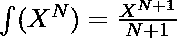

# 给定值在多项式中的积分

> 原文:[https://www . geesforgeks . org/给定值多项式积分/](https://www.geeksforgeeks.org/integration-in-a-polynomial-for-a-given-value/)

给定代表多项式和数字 **N** 的字符串 **str** ，任务是在给定值 **N** 处相对于 **X** 积分该多项式。
**示例:**

> **输入:**str = " 90x<sup>4</sup>+24x<sup>3</sup>+18x<sup>2</sup>+18x "，N = 1。
> **输出:** 39
> **说明:**
> 给定，dy/dx = 90 *(X<sup>4</sup>)+24 *(X<sup>3</sup>)+18 *(X<sup>2</sup>)+18 *(X)。在积分这个方程时，我们得到 18 *(X<sup>5</sup>)+6 *(X<sup>4</sup>)+6 *(X<sup>3</sup>)+9 *(X<sup>2</sup>)，代入数值 X = 1，我们得到:
> 18 + 6 + 6 + 9 = 39。
> **输入:**str = " 4x<sup>3</sup>+2x<sup>2</sup>+3x "，N = 2
> **输出:** 27

**进场:**思路是利用身份的整合。对于某个给定的 N 次方函数 X，这个项的积分由下式给出:



因此，按照以下步骤计算答案:

*   去拿绳子。
*   [拆分字符串](https://www.geeksforgeeks.org/split-string-java-examples/)并根据上述公式进行积分。
*   在得到的表达式中代入 N 的值。
*   将所有单个值相加，得到最终的整数值。

以下是上述方法的实现:

## C++

```
// C++ program to find the integration
// of the given polynomial for the
// value N

#include <bits/stdc++.h>
using namespace std;
typedef long long ll;

// Function to return the integral
// of the given term
double inteTerm(string pTerm, ll val)
{
    // Get the coefficient
    string coeffStr = "";
    int i;

    // Loop to iterate through the string
    // and get the coefficient
    for (i = 0; pTerm[i] != 'x'; i++)
        coeffStr.push_back(pTerm[i]);
    ll coeff = atol(coeffStr.c_str());

    // Get the Power
    string powStr = "";

    // Loop to skip 2 characters for x and ^
    for (i = i + 2; i != pTerm.size(); i++)
        powStr.push_back(pTerm[i]);
    ll power = atol(powStr.c_str());

    // Return the computed integral
    return (coeff * pow(val, power + 1))
           / (power + 1);
}

// Functionto find the integration
// of the given polynomial for the
// value N
double integrationVal(string poly, int val)
{
    ll ans = 0;

    // Using string stream to get the
    // input in tokens
    istringstream is(poly);
    string pTerm;

    while (is >> pTerm) {

        // If the token is equal to '+' then
        // continue with the string
        if (pTerm == "+")
            continue;

        // Otherwise find the integration
        // of that particular term
        else
            ans = (ans + inteTerm(pTerm, val));
    }
    return ans;
}

// Driver code
int main()
{
    string str = "4x^3 + 3x^1 + 2x^2";
    int val = 2;
    cout << integrationVal(str, val);
    return 0;
}
```

## Java 语言(一种计算机语言，尤用于创建网站)

```
// Java program for the above approach
public class GFG
{

  // Function to return the integral
  // of the given term
  static int inteTerm(String pTerm, int val)
  {

    // Get the coefficient
    String coeffStr = "";

    // Loop to iterate through
    // the string and get the
    // coefficient
    int i = 0;
    while (i < pTerm.length() && pTerm.charAt(i) != 'x')
    {
      coeffStr += pTerm.charAt(i);
      i += 1;
    }

    int coeff = Integer.parseInt(coeffStr);

    // Get the Power
    String powStr = "";

    // Loop to skip 2 characters
    // for x and ^
    int j = i + 2;
    while(j< pTerm.length())
    {
      powStr += (pTerm.charAt(j));
      j += 1;
    }
    int power = Integer.parseInt(powStr);

    // Return the computed integral
    return ((coeff * (int)Math.pow(val, power + 1)) / (power + 1));
  }

  // Functionto find the integration
  // of the given polynomial for the
  // value N
  static int integrationVal(String poly, int val)
  {
    int ans = 0;

    // Using string stream to
    // get the input in tokens
    String[] stSplit = poly.split(" \\+ ");

    int i = 0;
    while(i < stSplit.length)
    {
      ans = (ans + inteTerm(stSplit[i], val));
      i += 1;
    }

    return ans;
  }

  // Driver code
  public static void main(String[] args) {
    String st = "4x^3 + 3x^1 + 2x^2";
    int val = 2;
    System.out.println(integrationVal(st, val));
  }
}

// This code is contributed by divyesh072019.
```

## 蟒蛇 3

```
# Python3 program to find
# the integration of the
# given polynomial for the
# value N

# Function to return the integral
# of the given term
def inteTerm(pTerm, val):

    # Get the coefficient
    coeffStr = ""

    # Loop to iterate through
    # the string and get the
    # coefficient
    i = 0
    while (i < len(pTerm) and
           pTerm[i] != 'x'):
        coeffStr += pTerm[i]
        i += 1

    coeff = int(coeffStr)

    # Get the Power
    powStr = ""

    # Loop to skip 2 characters
    # for x and ^
    j = i + 2
    while j< len(pTerm):
        powStr += (pTerm[j])
        j += 1
    power = int(powStr)

    # Return the computed integral
    return ((coeff *
             pow(val,
                 power + 1)) //
            (power + 1))

# Functionto find the integration
# of the given polynomial for the
# value N
def integrationVal(poly, val):

    ans = 0

    # Using string stream to
    # get the input in tokens
    stSplit = poly.split("+")

    i = 0
    while i < len(stSplit):
        ans = (ans +
               inteTerm(stSplit[i],
                        val))
        i += 1

    return ans

# Driver code
if __name__ == "__main__":

    st = "4x^3 + 3x^1 + 2x^2"
    val = 2
    print(integrationVal(st, val))

# This code is contributed by Chitranayal
```

## C#

```
// C# program for the above approach
using System;
using System.Collections.Generic;
class GFG {

  // Function to return the integral
  // of the given term
  static int inteTerm(string pTerm, int val)
  {

    // Get the coefficient
    string coeffStr = "";

    // Loop to iterate through
    // the string and get the
    // coefficient
    int i = 0;
    while (i < pTerm.Length && pTerm[i] != 'x')
    {
      coeffStr += pTerm[i];
      i += 1;
    }

    int coeff = Convert.ToInt32(coeffStr);

    // Get the Power
    string powStr = "";

    // Loop to skip 2 characters
    // for x and ^
    int j = i + 2;
    while(j< pTerm.Length)
    {
      powStr += (pTerm[j]);
      j += 1;
    }
    int power = Convert.ToInt32(powStr);

    // Return the computed integral
    return ((coeff * (int)Math.Pow(val, power + 1)) / (power + 1));
  }

  // Functionto find the integration
  // of the given polynomial for the
  // value N
  static int integrationVal(string poly, int val)
  {
    int ans = 0;

    // Using string stream to
    // get the input in tokens
    string[] stSplit = poly.Split('+');

    int i = 0;
    while(i < stSplit.Length)
    {
      ans = (ans + inteTerm(stSplit[i], val));
      i += 1;
    }

    return ans;
  }

  // Driver code
  static void Main() {
    string st = "4x^3 + 3x^1 + 2x^2";
    int val = 2;
    Console.WriteLine(integrationVal(st, val));
  }
}

// This code is contributed by divyeshrabadiya07.
```

## java 描述语言

```
<script>
// Javascript program for the above approach

// Function to return the integral
  // of the given term
function inteTerm(pTerm,val)
{

    // Get the coefficient
    let coeffStr = "";

    // Loop to iterate through
    // the string and get the
    // coefficient
    let i = 0;
    while (i < pTerm.length && pTerm[i] != 'x')
    {
      coeffStr += pTerm[i];
      i += 1;
    }

    let coeff = parseInt(coeffStr);

    // Get the Power
    let powStr = "";

    // Loop to skip 2 characters
    // for x and ^
    let j = i + 2;
    while(j< pTerm.length)
    {
      powStr += (pTerm[j]);
      j += 1;
    }
    let power = parseInt(powStr);

    // Return the computed integral
    return Math.floor((coeff * Math.floor(Math.pow(val, power + 1))) / (power + 1));
}

// Functionto find the integration
  // of the given polynomial for the
  // value N
function integrationVal(poly,val)
{
    let ans = 0;

    // Using string stream to
    // get the input in tokens
    let stSplit = poly.split(" + ");

    let i = 0;
    while(i < stSplit.length)
    {
      ans = (ans + inteTerm(stSplit[i], val));
      i += 1;
    }

    return ans;
}

// Driver code
let st = "4x^3 + 3x^1 + 2x^2";
let val = 2;
document.write(integrationVal(st, val));

// This code is contributed by avanitrachhadiya2155
</script>
```

**Output:** 

```
27
```