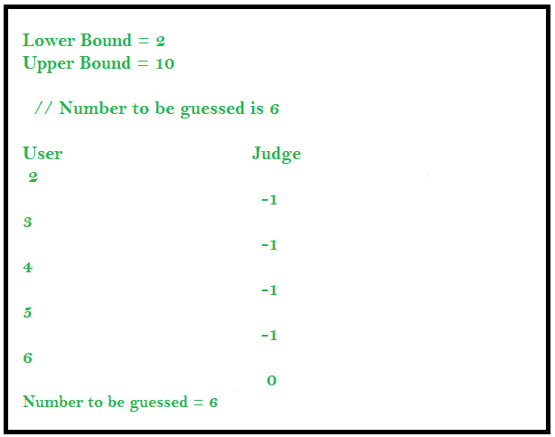

# 竞争性编程中的交互问题

> 原文:[https://www . geesforgeks . org/interactive-in-problems-in-competitive-programming/](https://www.geeksforgeeks.org/interactive-problems-in-competitive-programming/)

交互问题是我们的解决方案或代码与法官实时交互的问题。当我们开发一个交互式问题的解决方案时，给我们的解决方案的输入数据可能不是预先确定的，而是专门为该问题构建的。该解决方案与法官进行了一系列数据交换，在对话结束时，法官会判断我们的解决方案是否正确。

## 猜数字(互动问题)

在这个问题中，用户必须在与法官沟通时猜测号码。向用户提供上限和下限，并且他/她可以询问判断一个数字是否是要猜测的数字。如果数字小于要猜测的数字，法官用-1 回答；如果数字大于要猜测的数字，法官用 1 回答；如果数字等于要猜测的数字，法官用 0 回答。

### 方法 1:线性猜测

用户可以向法官查询下限和上限之间的所有数字，以找到解决方案。



## C++

```
#include <bits/stdc++.h>
using namespace std;

int main()
{
    int lower_bound = 2;
    int upper_bound = 10;

    // Number to be guessed is 6

    // Iterating from lower_bound to upper_bound
    for (int i = lower_bound; i <= upper_bound; i++) {
        cout << i << endl;

        // Input the response from the judge
        int response;
        cin >> response;

        if (response == 0) {
            cout << "Number guessed is :" << i;
            break;
        }
    }

    return 0;
}

// This code is contributed by divyeshrabadiya07
```

## Java 语言(一种计算机语言，尤用于创建网站)

```
import java.util.*;
class GFG {
    public static void main(String[] args)
    {
        Scanner sc1 = new Scanner(System.in);
        int lower_bound = 2;
        int upper_bound = 10;

        // Number to be guessed is 6

        // Iterating from lower_bound to upper_bound
        for (int i = lower_bound; i <= upper_bound; i++) {
            System.out.println(i);

            // Input the response from the judge
            int response = sc1.nextInt();

            if (response == 0) {
                System.out.println("Number guessed is :" + i);
                break;
            }
        }
    }
}
```

## 蟒蛇 3

```
if __name__=='__main__':
    lower_bound = 2;
    upper_bound = 10;

    # Number to be guessed is 6

    # Iterating from lower_bound to upper_bound
    for i in range(lower_bound, upper_bound + 1):
        print(i)

        # Input the response from the judge
        response = int(input())

        if (response == 0):
            print("Number guessed is :", i, end = '')
            break;

            # This code is contributed by rutvik_56
```

## C#

```
using System;
class GFG
{
    public static void Main(string[] args)
    {      
        int lower_bound = 2;
        int upper_bound = 10;

        // Number to be guessed is 6

        // Iterating from lower_bound to upper_bound
        for (int i = lower_bound; i <= upper_bound; i++)
        {
            Console.WriteLine(i);

            // Input the response from the judge
            int response = int.Parse(Console.ReadLine());

            if (response == 0) {
                Console.WriteLine("Number guessed is :" + i);
                break;
            }
        }
    }
}

// This code is contributed by Pratham76
```

**Output**

```
2
Number guessed is :2
```

**时间复杂度:** O(n)

### 方法 2:应用二分搜索法

我们也可以交互式地应用二分搜索法来寻找解决方案。与以前的方法相比，这种解决方案是有效的。


## Java 语言(一种计算机语言，尤用于创建网站)

```
import java.util.*;
class GFG {
    public static void main(String[] args)
    {
        Scanner sc1 = new Scanner(System.in);
        int lower_bound = 2;
        int upper_bound = 10;

        // Number to be guessed is 9

        // Applying Binary Search interactively
        while (lower_bound <= upper_bound) {
            int mid = (lower_bound + upper_bound) / 2;

            // Print the guessed number
            System.out.println(mid);

            // Input the response from the judge
            int response = sc1.nextInt();

            if (response == -1) {
                lower_bound = mid + 1;
            }
            else if (response == 1) {
                upper_bound = mid - 1;
            }
            else if (response == 0) {
                System.out.println("Number guessed is :" + mid);
                break;
            }
        }
    }
}
```

## C#

```
using System;
class GFG {
  static void Main() {
    int lower_bound = 2;
    int upper_bound = 10;

    // Number to be guessed is 9

    // Applying Binary Search interactively
    while (lower_bound <= upper_bound) {
        int mid = (lower_bound + upper_bound) / 2;

        // Print the guessed number
        Console.WriteLine(mid);

        // Input the response from the judge
        int response = Convert.ToInt32(Console.ReadLine());

        if (response == -1) {
            lower_bound = mid + 1;
        }
        else if (response == 1) {
            upper_bound = mid - 1;
        }
        else if (response == 0) {
            Console.WriteLine("Number guessed is :" + mid);
            break;
        }
    }
  }
}

// This code is contributed by divyesh072019
```

## 蟒蛇 3

```
lower_bound = 2
upper_bound = 10

# Number to be guessed is 9

# Applying Binary Search interactively
while (lower_bound <= upper_bound) :
    mid = (lower_bound + upper_bound) // 2

    # Prthe guessed number
    print(mid)

    # Input the response from the judge
    response = int(input())

    if (response == -1) :
        lower_bound = mid + 1

    elif (response == 1) :
        upper_bound = mid - 1

    elif (response == 0) :
        print("Number guessed is :", mid)
        break
```

**Output**

```
6
Number guessed is :6

```

**时间复杂度:**O(logn)
T3】算法范式:分而治之