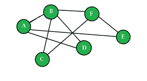

# 日常生活中算法的有趣例子

> 原文:[https://www . geeksforgeeks . org/有趣-日常生活中的算法示例/](https://www.geeksforgeeks.org/interesting-examples-of-algorithms-in-everyday-life/)

在谷歌地图上找到过从 A 地到 B 地的最短路径吗？有没有在网络游戏中只需点击一下就掷骰子的经历？在网站中使用过搜索功能吗？所有这些场景共有的一点是，一个或另一个算法正在运行，结果正在交付。

简单地说，算法是一组基于给定输入得出结果的指令。以当前的世界场景为例，加密几乎已经成为任何应用程序的最低要求。例如，一种流行的加密技术是 MD5 加密算法。

MD5 的例子:

```
Input : HelloWorld
MD5 Hash : 68e109f0f40ca72a15e05cc22786f8e6

Input : GeeksForGeeks
MD5 Hash : f1e069787ece74531d112559945c6871

```

谷歌在显示搜索结果时使用页面排名技术。脸书在显示新闻提要时使用了类似的排名算法，使其与您更相关。所有这些都使用了数据挖掘中一个有趣的分支[链接分析](https://en.wikipedia.org/wiki/Link_analysis)的修改。
我们来考虑一个小例子。



边缘表示友谊的网络图示例。

上图显示了一个示例网络图，其中每个节点表示不同的配置文件，一条边表示友谊。考虑到这种情况，脸书算法可能会确定 A 和 F 之间的共同好友数量为 2，并可能会更新您的订阅源和好友建议。

所以，每当你按键盘上的一个键，打一个电话，做一个计算，启动一个应用程序或者按一个远程按钮，总是会触发一个算法。所以，在我们的日常生活中，有无数个让我们的生活变得更轻松的算法的例子。