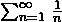

# 一个有趣的时间复杂度问题

> 原文:[https://www . geesforgeks . org/有趣-时间-复杂性-问题/](https://www.geeksforgeeks.org/interesting-time-complexity-question/)

跟随 fun()函数的时间复杂度是多少？

```
int fun(int n)
{    
    for (int i = 1; i <= n; i++)
    {
        for (int j = 1; j < n; j += i)
        {
            // Some O(1) task
        }
    }    
}
```

对于 i = 1，内部循环执行 n 次。
对于 i = 2，内部循环执行大约 n/2 次。
对于 i = 3，内部循环大约执行 n/3 次。
对于 i = 4，内部循环大约执行 n/4 次。
……………………………………。
………………………………。
对于 i = n，内部循环执行大约 n/n 次。

所以上述算法的总时间复杂度为(n + n/2 + n/3 + … + n/n)

其变成 n * (1/1 + 1/2 + 1/3 + … + 1/n)

级数(1/1+1/2+1/3+……+1/n)重要的是，它等于θ(Logn)(参考见[本](http://staff.ustc.edu.cn/~csli/graduate/algorithms/book6/chap03.htm))。所以上面代码的时间复杂度是θ(nLogn)。

作为旁注，无穷[调和级数](http://en.wikipedia.org/wiki/Harmonic_series_%28mathematics%29)的和是违反直觉的，因为级数发散。 [](https://media.geeksforgeeks.org/wp-content/cdn-uploads/timecomplex.png) 的价值是∨。这与几何级数不同，因为比率小于 1 的几何级数收敛。

**参考:**
[http://en . Wikipedia . org/wiki/Harmonic _ series _ % 28 mathematics % 29 # Rate _ of _ diversion](http://en.wikipedia.org/wiki/Harmonic_series_%28mathematics%29#Rate_of_divergence)
[http://staff . ustc . edu . cn/~ csli/graduate/algorithms/book 6/chap 03 . htm](http://staff.ustc.edu.cn/~csli/graduate/algorithms/book6/chap03.htm)

本文由**拉胡尔**供稿。如果您发现任何不正确的地方，或者您想分享更多关于上面讨论的主题的信息，请写评论