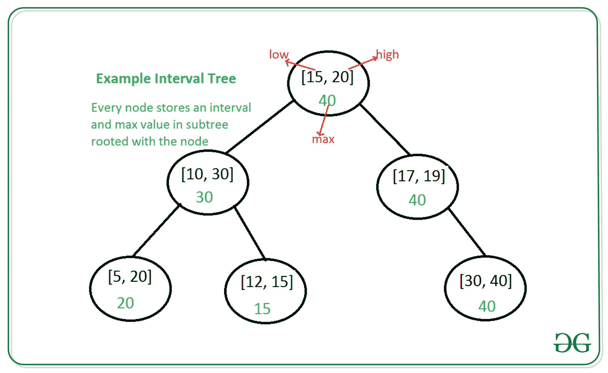

# 使用基于 GNU 树的容器的区间树

> 原文:[https://www . geesforgeks . org/interval-tree-use-GNU-tree-based-container/](https://www.geeksforgeeks.org/interval-tree-using-gnu-tree-based-container/)

考虑这样一种情况:我们有一组时间间隔，我们需要有效地执行以下操作:

1.  添加间隔
2.  删除间隔
3.  给定一个间隔 x，找出 x 是否与任何现有的间隔重叠。

一个**区间树**可以被实现为一个扩充的二进制搜索树(最好是自平衡的)，从而使我们能够以 O(logN)的时间复杂度执行所需的操作。

树的每个节点将存储以下信息:

1.  一个区间 **i** :表示为一对*【低，高】。*
2.  元数据**右端点最大值**:以该节点为根的子树中存储的所有区间的右端点最大值。存储这些元数据就是我们如何*扩充*树。

[区间树|集合 1](https://www.geeksforgeeks.org/interval-tree/) 中使用的区间树示例:



在[区间树|集合 1](https://www.geeksforgeeks.org/interval-tree/) 中，我们看到了如何使用简单的 [BST](https://www.geeksforgeeks.org/binary-search-tree-set-1-search-and-insertion/) 实现区间树(不是自平衡)。在本文中，我们将使用内置的**基于 GNU 树的容器**来实现一个区间树。这样做的好处是:

*   我们不必编写自己的树形数据结构。
*   我们得到默认操作，如**插入**和**删除**开箱即用。
*   我们可以使用内置的**红黑树**实现，这意味着我们的树将是**自平衡**。

我们将使用 [**基于 GNU 策略的**实现树形数据结构](https://gcc.gnu.org/onlinedocs/libstdc++/ext/pb_ds/tree_based_containers.html)。

文章[g++](https://www.geeksforgeeks.org/policy-based-data-structures-g/)中基于策略的数据结构介绍了 GNU 基于策略的数据结构以及所需的头文件。

我们将定义我们自己的 **Node_update** 策略，这样我们就可以将子树中间隔的**最大值保持为我们树的节点中的元数据。**

定义自定义节点策略的语法是:

## C++

```
template <
    typename Const_Node_Iterator,
    typename Node_Iterator,
    typename Cmp_Fn_,
    typename Allocator_>
;
struct custom_node_update_policy {
    typedef type_of_our_metadata
        metadata_type;

    void operator()(
        node_iterator it,
        const_node_iterator end_it)
    {
        // ...
    }

    // ...other methods that we need
}
```

*   **type _ of _ our _ metadata:***int*在我们的例子中，因为我们想要存储元数据“子树中区间右端点的最大值”。
*   **void 运算符()(node_iterator it，const_node_iterator end_it):** 内部调用的方法，用于在不变性失效后恢复**节点不变性**，即维护正确的元数据。
*   **它:** node_iterator 到我们需要恢复其不变性的节点。
*   **end _ it**:const _ node _ iterator 到后叶节点。

详见 [GNU 基于树的容器](https://gcc.gnu.org/onlinedocs/libstdc++/ext/pb_ds/tree_based_containers.html)。

我们还将定义一个方法**重叠搜索**，它搜索树中与给定间隔 **i** 重叠的任何间隔。

```
// pseudocode for overlapSearch

Interval overlapSearch(Interval i) {
    // start from root
    it = root_node

    while (it not null) {
        if (doOVerlap(i, it->interval)) {
              // overlap found
               return it->interval
        }

        if (left_child exists
                     AND
             left_child->max_right_endpoint
                   >= it->left_endpoint) {
            // go to left child
            it = it->left_child
        }

        else {
            // go to right child
            it = it->right_child
        }
    }

    // no overlapping interval found
    return NO_INTERVAL_FOUND
}
```

下面是间隔树的实现:

## C++

```
// CPP program for above approach
#include <bits/stdc++.h>
#include <ext/pb_ds/assoc_container.hpp>

using namespace std;
using namespace __gnu_pbds;

typedef pair<int, int> Interval;

// An invalid interval, used as
// return value to denote that no
// matching interval was found
const Interval NO_INTERVAL_FOUND = { 1, 0 };

// interval update policy struct
template <class Node_CItr,
          class Node_Itr,
          class Cmp_Fn, class _Alloc>
struct interval_node_update_policy {

    // Our metadata is maximum of
    // right-endpoints of intervals in the
    // sub-tree, which is of type int
    typedef int metadata_type;

    // An utility function to check
    // if given two intervals overlap
    bool doOverlap(Interval i1,
                   Node_CItr i2)
    {
        return (i1.first <= (*i2)->second
                && (*i2)->first <= i1.second);
    }

    // Search for any interval that
    // overlaps with Interval i
    Interval overlapSearch(Interval i)
    {
        for (Node_CItr it = node_begin();
             it != node_end();) {
            if (doOverlap(i, it)) {
                return { (*it)->first,
                         (*it)->second };
            }

            if (it.get_l_child() != node_end()
                && it.get_l_child()
                           .get_metadata()
                       >= i.first) {
                it = it.get_l_child();
            }
            else {
                it = it.get_r_child();
            }
        }
        return NO_INTERVAL_FOUND;
    }

    // To restore the node-invariance
    // of the node pointed to by
    // (it). We need to derive the
    // metadata for node (it) from
    // its left-child and right-child.
    void operator()(Node_Itr it,
                    Node_CItr end_it)
    {
        int max_high = (*it)->second;

        if (it.get_l_child() != end_it) {
            max_high = max(
                max_high,
                it.get_l_child()
                    .get_metadata());
        }

        if (it.get_r_child() != end_it) {
            max_high = max(
                max_high,
                it.get_r_child()
                    .get_metadata());
        }

        // The max of right-endpoint
        // of this node and the max
        // right-endpoints of children.
        const_cast<int&>(
            it.get_metadata())
            = max_high;
    }

    virtual Node_CItr node_begin() const = 0;
    virtual Node_CItr node_end() const = 0;
    virtual ~interval_node_update_policy() {}
};

// IntervalTree data structure
// rb_tree_tag: uses red-black search tree
// interval_node_update_policy:
// our custom Node_update policy
typedef tree<Interval,
             null_type,
             less<Interval>,
             rb_tree_tag,
             interval_node_update_policy>
    IntervalTree;

// Driver Code
int main()
{
    IntervalTree IT;
    Interval intvs[] = { { 15, 20 },
                         { 10, 30 },
                         { 17, 19 },
                         { 5, 20 },
                         { 12, 15 },
                         { 30, 40 } };

    for (Interval intv : intvs) {
        IT.insert(intv);
    }

    Interval toSearch = { 25, 29 };
    cout << "\nSearching for interval ["
         << toSearch.first << ", "
         << toSearch.second << "]";
    Interval res = IT.overlapSearch(toSearch);
    if (res == NO_INTERVAL_FOUND)
        cout << "\nNo Overlapping Interval\n";
    else
        cout << "\nOverlaps with ["
             << res.first << ", "
             << res.second << "]\n";

    Interval toErase = { 10, 30 };
    IT.erase(toErase);
    cout << "\nDeleting interval ["
         << toErase.first << ", "
         << toErase.second
         << "]\n";

    cout << "\nSearching for interval ["
         << toSearch.first << ", "
         << toSearch.second << "]";
    res = IT.overlapSearch(toSearch);
    if (res == NO_INTERVAL_FOUND)
        cout << "\nNo Overlapping Interval\n";
    else
        cout << "\nOverlaps with ["
             << res.first << ", "
             << res.second << "]\n";
    return 0;
}
```

**Output:** 

```
Searching for interval [25, 29]
Overlaps with [10, 30]

Deleting interval [10, 30]

Searching for interval [25, 29]
No Overlapping Interval
```

**时间复杂度**

所有操作的大小都是对数的，即 **O(logN)** ，其中 N 是存储在树中的区间数。

我们能够实现对数最坏情况的复杂性，因为内部使用了一个[红黑树](https://www.geeksforgeeks.org/red-black-tree-set-1-introduction-2/)，这是自平衡的。