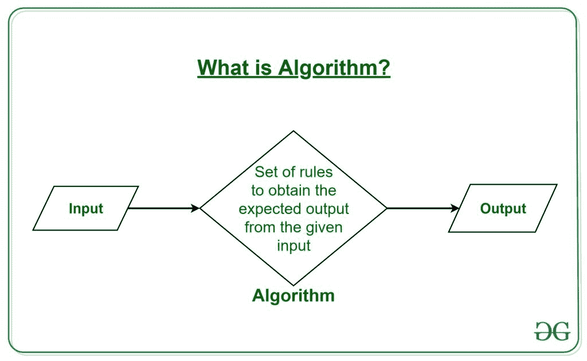
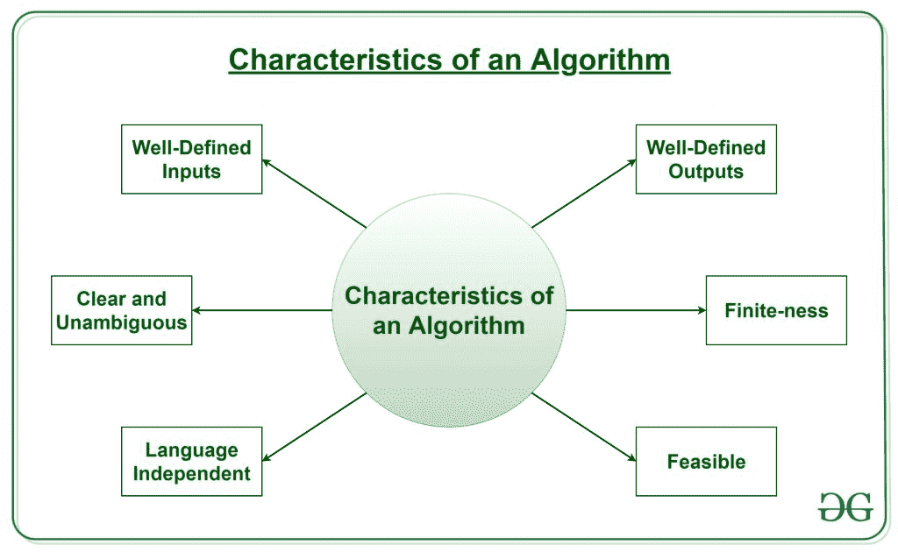

# 算法介绍

> 原文:[https://www.geeksforgeeks.org/introduction-to-algorithms/](https://www.geeksforgeeks.org/introduction-to-algorithms/)

### 什么是算法？算法基础

[**算法**](https://www.geeksforgeeks.org/fundamentals-of-algorithms/) 这个词的意思是“在计算或其他解决问题的操作中要遵循的一个过程或一组规则”。因此，算法指的是一组规则/指令，这些规则/指令一步一步地定义如何执行工作，以获得预期的结果。



举一个烹饪新食谱的例子就可以理解。要烹饪一个新的食谱，你需要阅读说明和步骤，并按照给定的顺序一个接一个地执行它们。这样得到的结果是这道新菜做得很完美。同样，算法有助于在编程中完成一项任务，以获得预期的输出。
设计的算法是独立于语言的，也就是说，它们只是简单的指令，可以用任何语言实现，但输出会和预期的一样。

### 算法有什么特点？



因为人们不会遵循任何书面指示来烹饪食谱，而只会遵循标准的。同样，并不是所有用于编程的书面指令都是算法。为了使某些指令成为算法，它必须具有以下特征:

*   **清晰明确**:算法要清晰明确。它的每一个步骤在所有方面都应该是清楚的，并且必须只导致一个意思。
*   **定义明确的输入**:如果一个算法说取输入，那应该是定义明确的输入。
*   **明确定义的输出:**算法必须明确定义将产生什么输出，并且也应该明确定义。
*   **有限性:**算法必须是有限的，即它不应该以无限循环或类似的方式结束。
*   **可行:**该算法必须简单、通用和实用，以便能够根据可用资源来执行。它不能包含未来的技术或任何东西。
*   **语言无关:**设计的算法必须是语言无关的，也就是说，它必须只是可以用任何语言实现的普通指令，但输出将与预期的一样。

### 算法的优势:

*   这很容易理解。
*   算法是给定问题的解决方案的分步表示。
*   在算法中，问题被分解成更小的部分或步骤，因此，程序员更容易将其转换成实际的程序。

### 算法的缺点:

*   写一个算法需要很长时间，所以很耗时。
*   分支和循环语句很难在算法中显示。

### 如何设计算法？

为了编写一个算法，需要以下东西作为先决条件:

1.  这个算法要解决的**问题**。
2.  解决问题时必须考虑的问题的**约束**。
3.  **输入要采取的解决问题的**。
4.  问题解决时期望的**输出**。
5.  这个问题的**解**，在给定的约束条件下。

然后借助上述参数编写算法，从而解决了这个问题。
**示例:**考虑将三个数字相加并打印总和的示例。

*   **步骤 1:满足先决条件**
    如上所述，为了编写算法，必须满足其先决条件。
    1.  **该算法要解决的问题**:将 3 个数字相加并打印其和。
    2.  **解题时必须考虑的问题的约束条件**:数字必须只包含数字，不包含其他字符。
    3.  **解决问题要采取的输入:**要相加的三个数字。
    4.  **问题解决时期望的输出:**作为输入的三个数之和。
    5.  **这个问题的解，在给定的约束条件下:**这个解由 3 个数相加组成。这可以通过‘+’操作符、位方式或任何其他方法来完成。
*   **第二步:设计算法**
    现在我们来设计算法，借助上面的前提:
    **算法将 3 个数字相加并打印其和:**
    1.  开始
    2.  声明 3 个整数变量 num1、num2 和 num3。
    3.  将三个要相加的数字分别作为变量 num1、num2 和 num3 的输入。
    4.  声明一个整数变量和来存储 3 个数字的和。
    5.  将 3 个数字相加，并将结果存储在变量 sum 中。
    6.  打印变量总和的值
    7.  结束
*   **第三步:通过实现测试算法。**
    为了测试算法，我们用 C 语言来实现。

**程序:**

## C++

```
// C++ program to add three numbers
// with the help of above designed
// algorithm
#include <bits/stdc++.h>
using namespace std;

int main()
{

    // Variables to take the input of
    // the 3 numbers
    int num1, num2, num3;

    // Variable to store the resultant sum
    int sum;

    // Take the 3 numbers as input
    cout << "Enter the 1st number: ";
    cin >> num1;
    cout << " " << num1 << endl;

    cout << "Enter the 2nd number: ";
    cin >> num2;
    cout << " " << num2 << endl;

    cout << "Enter the 3rd number: ";
    cin >> num3;
    cout << " " << num3;

    // Calculate the sum using + operator
    // and store it in variable sum
    sum = num1 + num2 + num3;

    // Print the sum
    cout << "\nSum of the 3 numbers is: "
         << sum;

    return 0;
}

// This code is contributed by shivanisinghss2110
```

## C

```
// C program to add three numbers
// with the help of above designed algorithm

#include <stdio.h>

int main()
{

    // Variables to take the input of the 3 numbers
    int num1, num2, num3;

    // Variable to store the resultant sum
    int sum;

    // Take the 3 numbers as input
    printf("Enter the 1st number: ");
    scanf("%d", &num1);
    printf("%d\n", num1);

    printf("Enter the 2nd number: ");
    scanf("%d", &num2);
    printf("%d\n", num2);

    printf("Enter the 3rd number: ");
    scanf("%d", &num3);
    printf("%d\n", num3);

    // Calculate the sum using + operator
    // and store it in variable sum
    sum = num1 + num2 + num3;

    // Print the sum
    printf("\nSum of the 3 numbers is: %d", sum);

    return 0;
}
```

## 蟒蛇 3

```
# Python3 program to add three numbers
# with the help of above designed
# algorithm

if __name__ == "__main__":

    # Variables to take the input of
    # the 3 numbers
    num1 = num2 = num3 = 0

    # Variable to store the resultant sum
    sum = 0

    # Take the 3 numbers as input
    num1 = int(input("Enter the 1st number: "))

    num2 = int(input("Enter the 2nd number: "))

    num3 = int(input("Enter the 3rd number: "))

    # Calculate the sum using + operator
    # and store it in variable sum
    sum = num1 + num2 + num3

    # Print the sum
    print("\nSum of the 3 numbers is:", sum)
```

**Output**

```
Enter the 1st number: 0
Enter the 2nd number: 0
Enter the 3rd number: -1577141152

Sum of the 3 numbers is: -1577141152
```

*   +运算符
*   逐位运算符
*   。。等等

1.  **先验分析:**“先验”指“之前”。因此，先验分析意味着在算法实现之前对其进行检查。在这种情况下，当算法以理论步骤的形式编写时，会对其进行检查。算法的这种效率是通过假设所有其他因素(例如处理器速度)都是恒定的并且对实现没有影响来衡量的。这通常由算法设计者来完成。正是在这种方法中，确定了算法复杂度。
2.  **后验分析:**“后验”表示“后”。因此，后验分析意味着在算法实现后检查算法。在这种情况下，通过用任何编程语言实现算法并执行它来检查算法。该分析有助于获得关于正确性、所需空间、消耗时间等的实际和真实的分析报告。

*   **时间因素**:通过统计排序算法中比较等关键操作的次数来衡量时间。
*   **空间因子**:通过计算算法所需的最大内存空间来度量空间。

1.  **空间复杂度:**一个算法的空间复杂度是指这个算法执行并得到结果所需要的内存量。这可以用于输入、临时操作或输出。
    **如何计算空间复杂度？**
    算法的空间复杂度通过确定以下 2 个分量来计算:
    *   **固定部分:**这是指算法明确需要的空间。例如，输入变量、输出变量、程序大小等。
    *   **变量部分:**这是指基于算法的实现可以不同的空间。例如，临时变量、动态内存分配、递归堆栈空间等。
2.  **时间复杂度:**一个算法的时间复杂度是指这个算法执行并得到结果所需要的时间量。这可以用于正常操作、条件 if-else 语句、循环语句等。
    **如何计算时间复杂度？**
    算法的时间复杂度也是通过确定以下 2 个分量来计算的:
    *   **恒定时间部分:**任何只执行一次的指令都会进入这个部分。例如，输入、输出、if-else、开关等。
    *   **可变时间部分:**任何被执行一次以上的指令，比如说 n 次，都在这个部分。例如，循环、递归等。