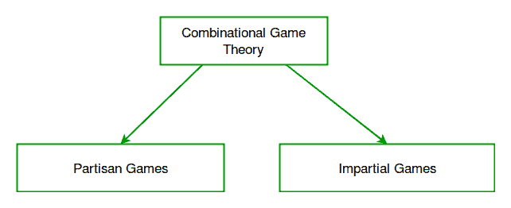

# 组合博弈论|第一集(简介)

> 原文:[https://www . geesforgeks . org/组合博弈论导论/](https://www.geeksforgeeks.org/introduction-to-combinatorial-game-theory/)

组合游戏是有[完美信息](https://en.wikipedia.org/wiki/Perfect_information)的两人游戏，没有机会移动(不涉及像掷硬币这样的随机化可以影响游戏)。这些游戏有一个输赢或平局的结果，由一组位置决定，包括初始位置和轮到谁移动的玩家。玩家从一个位置移动到另一个位置，玩家通常交替移动，直到到达终端位置。终端位置是指不能移动的位置。然后其中一个玩家被宣布为赢家，另一个为输家。或者有一个平局(根据组合游戏的规则，游戏可能以平局告终。关于组合游戏，唯一可以说明的是，游戏应该在某个点结束，不应该陷入循环。为了防止在像国际象棋这样的游戏中出现这种循环情况(考虑两个玩家只是将他们的皇后从一个地方来回移动到另一个地方的情况)，实际上有一个“50 步规则”，根据该规则，如果每个玩家的最后 50 步都已经完成，没有任何棋子移动，也没有任何捕获，则认为游戏已经结束。来源: [Stackexchange](https://chess.stackexchange.com/questions/8331/is-the-number-of-possible-chess-games-infinite/8334#8334)

另一方面，博弈论一般包括机会游戏、不完全知识游戏和玩家可以同时移动的游戏。

组合博弈论(CGT)的特点是编码部分相对非常小且容易。博弈论问题的关键是隐藏的观察，这有时很难找到。

国际象棋、尼姆游戏、井字游戏都属于组合博弈论的范畴。

我们可以将这些游戏分为如下所示的两类:

两者的区别在于在**公正游戏**中，任何位置的所有可能移动对玩家来说都是**相同的**，而在**党派游戏**中，所有玩家的移动都是**不同的**。

考虑下面这样一个游戏:
给定一定数量的堆，其中每个堆包含一定数量的石头/硬币。在每个回合中，玩家选择一堆石头，并从该堆中移除任意数量的石头(至少一个)。不能移动的玩家被认为输掉了比赛。，拿最后一块石头的人就是赢家)。
从上面的游戏规则可以清楚的看到，两个玩家的招式都是一样的。一个球员对另一个球员没有限制。这样的游戏被认为是公正的。
上面提到的游戏以名字闻名- [尼姆游戏](https://en.wikipedia.org/wiki/Nim)将在下一节讨论。

对比上面的游戏，我们来举一个**棋**的例子。在这个游戏中，一个玩家只能移动黑色的棋子，另一个只能移动白色的棋子。因此，对双方球员都有限制。他们的一套动作是不同的，因此这样的游戏被归入**党派游戏**的范畴。

党派游戏比公正游戏更难分析，因为在这样的游戏中[斯普拉格-格伦迪定理](https://en.wikipedia.org/wiki/Sprague%E2%80%93Grundy_theorem)失败了。

在接下来的部分中，我们将主要看到关于公平游戏的内容，比如尼姆游戏及其变体，斯普拉格-格伦迪定理等等。

**练习:**
读者可以尝试解决下面简单的组合博弈论问题。
[自行车赛](https://practice.geeksforgeeks.org/problems/cycle-race3338/1)
[巧克力游戏](https://practice.geeksforgeeks.org/problems/game-of-chocolates3554/1)

**来源:**
[http://www . cs . CMU . edu/AFS/cs/academic/class/15859-f01/www/notes/comb . pdf](http://www.cs.cmu.edu/afs/cs/academic/class/15859-f01/www/notes/comb.pdf)
[https://en.wikipedia.org/wiki/Combinatorial_game_theory](https://en.wikipedia.org/wiki/Combinatorial_game_theory)
[https://en.wikipedia.org/wiki/Impartial_game](https://en.wikipedia.org/wiki/Impartial_game)
T12】https://en.wikipedia.org/wiki/Partisan_game

本文由**拉希特·贝尔瓦亚尔**供稿。如果你喜欢极客博客并想投稿，你也可以写一篇文章并把你的文章邮寄到 review-team@geeksforgeeks.org。看到你的文章出现在极客博客主页上，帮助其他极客。

如果您发现任何不正确的地方，或者您想分享关于上面讨论的主题的更多信息，请写评论