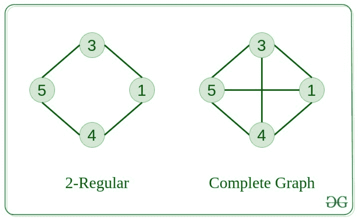
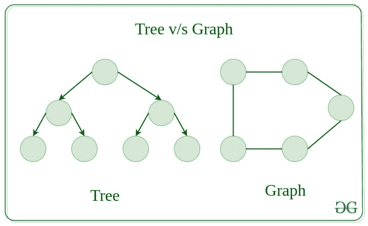
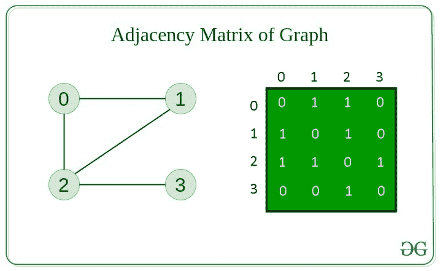
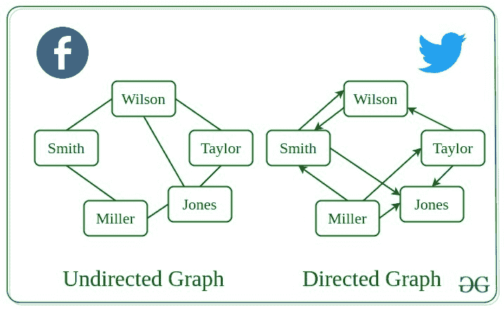

# 图表介绍

> 原文:[https://www.geeksforgeeks.org/introduction-to-graphs/](https://www.geeksforgeeks.org/introduction-to-graphs/)

[图形](https://www.geeksforgeeks.org/graph-data-structure-and-algorithms/)由一组顶点(表示为 **V** )和一组边(表示为 **E** )组成。

> 这个图用 G(E，V)表示。

## 图的组成部分

1.  **顶点:**顶点是图的基本单位。有时，顶点也被称为顶点或节点。每个节点/顶点都可以标记或不标记。
2.  **边:**边是用来连接图的两个节点的边。它可以是有向图中有序的节点对。边可以以任何可能的方式连接任意两个节点。没有规则。有时，边也被称为弧。每条边都可以贴标签/不贴标签。

## [图形类型](https://www.geeksforgeeks.org/graph-types-and-applications/)

1.  #### 零图

    如果图中没有边，则该图称为空图。

    

2.  #### 平凡图

    只有一个顶点的图，它是最小的图。

3.  #### 无向图

    边没有任何方向的图。也就是说，在每条边的定义中，节点都是无序对。

    

4.  #### 有向图

    边有方向的图。也就是说，在每条边的定义中，节点是有序的对。

5.  #### 连通图

    我们可以从一个节点访问图中任何其他节点的图称为连通图。

    

6.  #### 不连通图

    其中至少有一个节点不能从一个节点到达的图称为断开图。

7.  #### 正则图

    每个顶点的度数等于图中其他顶点的度数的图。
    假设每个顶点的度数为 **K** ，则该图称为**K-正则**。

    

8.  #### 完全图

    从每个节点到另一个节点都有一条边的图。

9.  #### 循环图

    图本身是循环的图，每个顶点的度数是 2。

    

10.  #### 循环图

    包含至少一个循环的图称为循环图。

11.  #### 有向无环图

    不包含任何循环的有向图。

    

12.  #### [二分图](https://www.geeksforgeeks.org/bipartite-graph/)

    一种图，其中顶点可以分成两个集合，这样每个集合中的顶点之间不包含任何边。

## 树 v/s 图

树是图的限制类型，只是有更多的规则。每棵树总是一个图，但不是所有的图都是树。
[链表](https://www.geeksforgeeks.org/data-structures/linked-list/)[树](https://www.geeksforgeeks.org/binary-tree-data-structure/)[堆](https://www.geeksforgeeks.org/heap-data-structure/)都是图的特例。

## 图的表示

有两种方法可以存储图表:

*   邻接矩阵
*   邻接表

#### 邻接矩阵

在这种方法中，图形以 2D 矩阵的形式存储，其中行和列表示顶点。
矩阵中的每个条目代表这些顶点之间的边的权重。

#### 邻接表

该图表示为链表的集合。
有一个指针数组，指向与该顶点相连的边。

#### 他们之间的比较

当图形包含大量边时，最好将其存储为矩阵，因为矩阵中只有一些条目是空的。
使用诸如 [Prim 的](https://www.geeksforgeeks.org/prims-minimum-spanning-tree-mst-greedy-algo-5/)和 [Dijkstra](https://www.geeksforgeeks.org/dijkstras-shortest-path-algorithm-greedy-algo-7/) 邻接矩阵这样的算法来降低复杂度。

| 行动 | 邻接矩阵 | 邻接表 |
| --- | --- | --- |
| 添加边 | O(1) | O(1) |
| 移除和边缘 | O(1) | O(N) |
| 正在初始化 | O(N*N) | O(N) |

## 解决问题的步骤

*   将一个[问题](https://practice.geeksforgeeks.org/explore/?category%5B%5D=Graph&page=1)识别为图形问题。
*   找到解决问题的[算法](https://www.geeksforgeeks.org/graph-data-structure-and-algorithms/)
*   设计[数据结构和算法](https://www.geeksforgeeks.org/data-structures/)实现图形求解。
*   [编码](https://ide.geeksforgeeks.org/)！

## 图的基本运算

以下是图表上的基本操作:

*   在图形中插入节点/边–在图形中插入节点。
*   删除图中的节点/边–从图中删除节点。
*   在图形上搜索–在图形中搜索实体。
*   图的遍历–遍历图中的所有节点。

## 图形的使用

*   地图可以用图形表示，然后计算机可以用它来提供各种服务，比如两个城市之间的最短路径。
*   当各种任务相互依赖时，这种情况可以用一个有向无环图来表示，我们可以用拓扑排序来找到执行任务的顺序。
*   状态转移图代表当前状态的合法移动。游戏中的井字游戏可以使用这个。
*   杀戮[采访](https://www.geeksforgeeks.org/category/interview-experiences/)！

## 图的现实应用

**更多图表资源:**

*   [图表上的近期文章](https://www.geeksforgeeks.org/graph-data-structure-and-algorithms/)
*   [练习图上的问题](https://practice.geeksforgeeks.org/explore/?category%5B%5D=Graph&page=1)
*   [图形上的算法](https://www.geeksforgeeks.org/graph-data-structure-and-algorithms/)