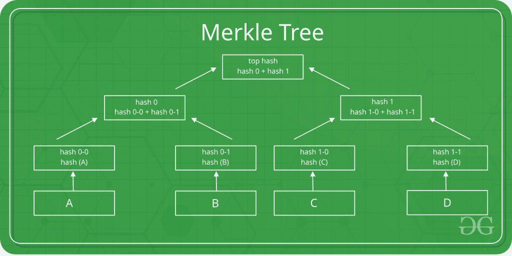

# Merkle 树介绍

> 原文:[https://www.geeksforgeeks.org/introduction-to-merkle-tree/](https://www.geeksforgeeks.org/introduction-to-merkle-tree/)

Merkle 树也称为哈希树，是一种用于数据验证和同步的数据结构。
它是一种树形数据结构，其中每个非叶节点都是其子节点的散列。所有的叶节点都在相同的深度，并且尽可能地靠左。
它维护数据完整性，并为此使用哈希函数。
**哈希函数:**
所以在了解 Merkle 树如何工作之前，我们需要先了解哈希函数是如何工作的。
哈希函数将输入映射到固定输出，该输出称为哈希。
输出对于每个输入都是唯一的，这使得能够对数据进行指纹识别。
因此，通过它们的散列可以很容易地识别大量数据。



这是一棵**二进制默克尔树**，最上面的哈希是整棵树的哈希。

*   这种树的结构允许对大量数据进行有效的映射，并且对数据所做的微小更改可以很容易地识别出来。
*   如果我们想知道数据在哪里发生了变化，那么我们可以检查数据是否与根散列一致，并且我们不必遍历整个结构，而只需遍历结构的一小部分。
*   根散列用作整个数据的指纹。

**对于二元默克尔树**

<figure class="table">

| 操作 | 复杂性 |
| 空间 | O(n) |
| 搜索 | O(logn) |
| 横越 | O(n) |
| 插入 | O(logn) |
| 删除 | O(logn) |
| 同步 | O(logn) |

</figure>

**应用:**

*   Merkle 树在分布式系统中很有用，在分布式系统中，相同的数据应该存在于多个地方。
*   Merkle 树可用于检查不一致性。
*   Apache Cassandra 使用 Merkle 树来检测整个数据库副本之间的不一致。
*   它被用于比特币和区块链。

本代码由 [Amit Das](https://auth.geeksforgeeks.org/user/amit_das/) 贡献。

## C++

```
// CPP code for the above data structure
#include<bits/stdc++.h>
using namespace std;

/* determines the maximimum capacity of
   Hash Tree */
int maxim = 10;        

/* determines the number of elements
   present in Hash Tree */
int size = 0;         

/* node for storing an item in a Binary Tree */
struct node
{
  int key;
  int value;
  struct node *left;
  struct node *right;
};

/* for storing a Binary Tree at each index
   of Hash Tree */
struct bst
{

  /* head pointing to the root of Binary Tree */
  struct node *head;
};

struct bst *arr;

void insert_element(struct node *tree,
                          struct node *item);

struct node* find(struct node *tree, int key);

struct node* remove_element(struct node *tree,
                                     int key);

void display_tree(struct node *tree);

/* this function creates an index corresponding
   to the every given key */
int hashcode(int key)
{
  return (key % maxim);
}

void add(int key, int value)
{
  int index = hashcode(key);

  /* extracting Binary Tree at the given index */
  struct node *tree = (struct node*) arr[index].head;

  /* creating an item to insert in the hashTree */
  struct node *new_item = (struct node*)
                         malloc(sizeof(struct node));

  new_item->key = key;
  new_item->value = value;
  new_item->left = NULL;
  new_item->right = NULL;

  if (tree == NULL)
  {

    /* absence of Binary Tree at a given
       index of Hash Tree */
    cout << "Inserting " << key << " and " <<
                                 value << endl;
    arr[index].head = new_item;
    size++;
  }

  else
  {

    /* a Binary Tree is present at given index
       of Hash Tree */
    struct node *temp = find(tree, key);

    if (temp == NULL)
    {

      /*
       * Key not found in existing Binary Tree
       * Adding the key in existing Binary Tree
       */

      cout << "Inserting " << key << "and" <<
                                value << endl;

      insert_element(tree, new_item);
      size++;
    }

    else
    {

      /*
        * Key already present in existing Binary Tree
        * Updating the value of already existing key
       */

      temp->value = value;
    }
  }
}

/*
 * this function finds the given key in the Binary Tree
 * returns the node containing the key
 * returns NULL in case key is not present
 */
struct node* find(struct node *tree, int key)
{
  if (tree == NULL)
  {
    return NULL;
  }
  if (tree->key == key)
  {
    return tree;
  }
  else if (key < tree->key)
  {
    return find(tree->left, key);
  }
  else
  {
    return find(tree->right, key);
  }
}

/* this function inserts the newly created node
   in the existing Binary Tree */
void insert_element(struct node *tree,
                              struct node *item)
{

  if (item->key < tree->key)
  {
    if (tree->left == NULL)
    {
      tree->left = item;
      return;
    }
    else
    {
      insert_element(tree->left, item);
      return;
    }
  }

  else if (item->key > tree->key)
  {
    if (tree->right == NULL)
    {
      tree->right = item;
      return;
    }
    else
    {
      insert_element(tree->right, item);
      return;
    }
  }
}

/* displays the content of hash Tree */
void display()
{
  int i = 0;
  for(i = 0; i < maxim; i++)
  {
    struct node *tree = arr[i].head;
    if (tree == NULL)
    {
      cout << "arr[" << i << "] has no
                             elements" << endl;
    }
    else
    {
      cout << "arr[" << i << "] has
                             elements" << endl;
      display_tree(tree);
    }
  }
}

/* displays content of binary tree of
particular index */
void display_tree(struct node *tree)
{

  if (tree == NULL)
  {
    return;
  }

  cout << tree->key << " and " <<
                          tree->value << "   ";

  if (tree->left != NULL)
  {
    display_tree(tree->left);
  }

  if (tree->right != NULL)
  {
    display_tree(tree->right);
  }
}

/* for initializing the hash Tree */
void init()
{
  int i = 0;
  for(i = 0; i < maxim; i++)
  {
    arr[i].head = NULL;
  }
}

/* returns the size of hash Tree */
int size_of_hashTree()
{
  return size;
}

/* to del a key from hash Tree */
void del(int key)
{
  int index = hashcode(key);
  struct node *tree = (struct node*)arr[index].head;
  if (tree == NULL)
  {
    cout << key << " Key not present" << endl;
  }

  else
  {
    struct node *temp = find(tree, key);
    if (temp == NULL)
    {
      cout << key << " is not present";
    }
    else
    {
      tree = remove_element(tree, key);
      cout << key << " has been removed
                      form the hash tree" << endl;
    }
  }
}

struct node* remove_element(struct node *tree,
                                      int key)
{

  if (tree == NULL)
  {
    return NULL;
  }

  if (key < tree->key)
  {
    tree->left = remove_element(tree->left, key);
    return tree;
  }

  else if (key > tree->key)
  {
    tree->right = remove_element(tree->right, key);
    return tree;
  }

  else
  {

    /* reached the node */
    if (tree->left == NULL  &&  tree->right == NULL)
    {
      size--;
      return tree->left;
    }

    else if (tree->left != NULL  &&  tree->right == NULL)
    {
      size--;
      return tree->left;
    }

    else if (tree->left == NULL  &&  tree->right != NULL)
    {
      size--;
      return tree->right;
    }

    else
    {
      struct node *left_one = tree->left;
      while (left_one->right != NULL)
      {
        left_one = left_one->right;
      }

      tree->key = left_one->key;
      tree->value = left_one->value;
      tree->left = remove_element(tree->left,
                                     tree->key);
      return tree;
    }
  }
}

// Driver Code
int main()
{
  int choice, key, value, n, c;
  arr = (struct bst*)malloc(maxim *
                             sizeof(struct bst*));
  init();
  do
  {
    cout << "Implementation of Hash Tree" << endl;
    cout << "MENU-: \n1.Insert an item in the Hash Tree"
      "\n2.Remove an item from the Hash Tree"
      "\n3.Check the size of Hash Tree"
      "\n4.Display Hash Tree"
      "\n\n Please enter your choice-:";

    cin >> choice;
    switch(choice)
    {

      case 1:
        cout << "Inserting element in
                           Hash Tree" << endl;
        cout << "Enter key and value-:    ";
        cin >> key >> value;
        add(key, value);
        break;

      case 2:
        cout << "Deleting item from Hash Tree
                   \n Enter the key to delete-:";
        cin >> key;
        del(key);
        break;

      case 3:
        n = size_of_hashTree();
        cout << "Size of Hash Tree is-:" << n << endl;
        break;

      case 4:
        display();
        break;

      default:
        cout << "Wrong Input" << endl;
    }
    cout << "\n Do you want to continue-:
                             (press 1 for yes)     ";
    cin >> c;

  }while(c == 1);
  return 0;
}

//This code is contributed by Amit Das(amit_das)
```