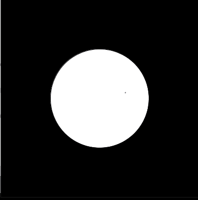

# 加工入门| Java

> 原文:[https://www . geesforgeks . org/introduction-to-processing-Java/](https://www.geeksforgeeks.org/introduction-to-processing-java/)

[Processing](https://processing.org/) 是一个[开源的](https://www.geeksforgeeks.org/open-source-freeware-and-shareware-softwares/)低级动画和 [GUI](https://www.geeksforgeeks.org/what-is-the-difference-between-gui-and-cui/) 库，建立在 Java 之上，带有额外的简化，比如额外的类、别名数学函数和运算。它还提供了一个图形用户界面，用于简单编译处理中编写的程序。

**加工特点:**加工特点如下:

*   它包括一个草图簿，这是 T2 IDE 的一个极简替代物。这个 sketchbook 可以作为一个普通的 IDE 来组织项目。
*   加工中绘制的每个草图都是 [Java 类](https://www.geeksforgeeks.org/classes-objects-java/) (PApplet)的子类。这个类实现了几乎所有的处理功能。
*   由于 processing 继承了类的属性，所以当代码在编译前被转换为纯 java 代码时，草图中定义的所有附加类都将被视为[内部类](https://www.geeksforgeeks.org/inner-class-java/)。因此，加工中严禁使用[静态变量](https://www.geeksforgeeks.org/static-keyword-java/)和方法。
*   处理语言还为用户提供了在 PApplet 草图中创建自己的类的选项。因此，这给了用户一个机会来使用除了 java 中的基本[数据类型之外的更复杂的数据结构。](https://www.geeksforgeeks.org/data-types-in-java/)

**安装加工:**为了用加工语言编码，用户可以从[官网](https://processing.org/)下载加工画册。除此之外，用户还可以下载代码 [jar 文件](https://www.geeksforgeeks.org/jar-files-java/)，并在任何一个 IDE 中设置使用处理。

**示例:**下面是一个了解如何在处理中编码的示例。让我们看看如何在加工中画一个圆。为了做到这一点，我们需要了解处理从其库中调用的主要功能。这意味着，我们只需要定义这个函数，而不需要调用它。

下面是绘制圆的示例处理代码:

```
// This function is called whenever we
// start the app.
void setup()
{
    // This function is a built in function
    // in processing which takes two
    // arguments: width and height
    // 400, 400 means a window of
    // length 400 pixels and width
    // 400 pixels
    size(400, 400);
}

// This function is called once per
// frame. That is, if the frame rate
// is 60, then this will be called
// 60 times in one second
void draw()
{

    // This is also an inbuilt function
    // which can take 4, 3 or 1 argument
    // where each argument represents the
    // intensity of each colour like:
    // 4 = (red, green, blue alpha)
    // 3 = (red, green, blue)
    // 1 = (gray_scale_value)
    background(0);

    // This command draws the circle
    // on our canvas at x=width/2,
    // y=height/2, diameter=200
    circle(width / 2, height / 2, 200);
}
```

**输出:**上述程序的输出为:

[](https://media.geeksforgeeks.org/wp-content/uploads/20200430034836/circle14.png)