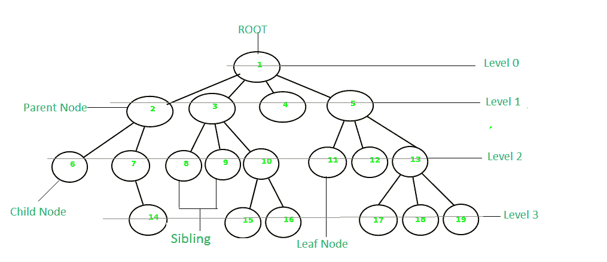
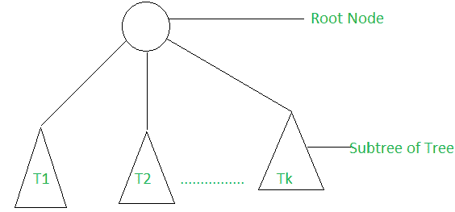
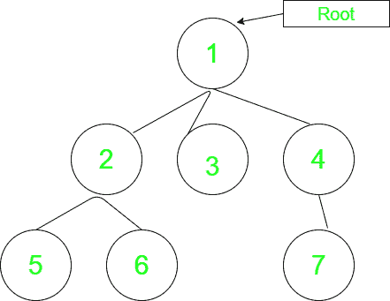

# 树形数据结构介绍

> 原文:[https://www . geesforgeks . org/introduction-to-tree-data-structure/](https://www.geeksforgeeks.org/introduction-to-tree-data-structure/)

树是非线性的，并且是由节点集合组成的分层数据结构，这样树的每个节点都存储一个值，一个节点引用列表(“子节点”)。

[](https://media.geeksforgeeks.org/wp-content/cdn-uploads/20201129105858/Tree-Basic-Terminology.png)

**递归定义:**:一棵树由一个根和零个或多个子树 T <sub>1</sub> 、T <sub>2</sub> 、…、T <sub>k</sub> 组成，这样从树根到每个子树的根都有一条边。

[](https://media.geeksforgeeks.org/wp-content/cdn-uploads/20201129092959/Recursive-Tree1.png)

**树形数据结构中的基本术语:**

*   **父节点:**节点的前身节点称为该节点的父节点。{ **2}** 是{ **6，7}** 的父节点。
*   **子节点:**节点的直接后继节点称为该节点的子节点。例如:{ **6，7}** 是{ **2}** 的子节点。
*   **根节点:**树的最顶端节点或没有任何父节点的节点称为根节点。{ **1}** 是树的根节点。非空树必须包含一个根节点，以及从根到树的所有其他节点的一条路径。
*   **节点的度:**附着在该节点上的子树总数称为该节点的度。叶节点的度数必须是 **0** 。树的度数就是它的根的度数。节点{ **3}** 的度数为 **3** 。
*   **叶节点或外部节点:**没有任何子节点的节点称为叶节点。{ **6、14、8、9、15、16、4、11、12、17、18、19}** 是树的叶节点。
*   **节点的祖先:**根到该节点的路径上的任何前身节点都称为该节点的祖先。{ **1，2}** 是节点{ **7}** 的父节点
*   **后代:**从叶节点到该节点的路径上的任何后继节点。{ **7、14}** 是节点的后代。{ **2}** 。
*   **兄弟节点:**同一父节点的子节点称为兄弟节点。{ **8、9、10}** 叫姐弟。
*   **节点深度:**从根到节点的边数。节点深度{ **14}** 为 **3** 。
*   **节点高度**:从该节点到叶子的最长路径上的边数。节点{ **3}** 高度为 **2** 。
*   **树的高度:**树的高度是根节点的高度，即从根到最深节点的边数。上面树的高度是 **3** 。
*   **节点的级别:**从根节点到该节点的路径上的边数。根节点具有等级 **0** 。
*   **内部节点:**至少有一个子节点的节点称为内部节点。
*   **节点的邻居:**该节点的父节点或子节点称为该节点的邻居。
*   **子树**:树的任意节点及其后代

**树数据结构的几个例子:**下面描述了演示上述几个术语的代码:



## C++

```
// C++ program to demonstrate some of the above
// terminologies
#include <bits/stdc++.h>
using namespace std;
// Function to add an edge between vertices x and y
void addEdge(int x, int y, vector<vector<int> >& adj)
{
    adj[x].push_back(y);
    adj[y].push_back(x);
}
// Function to print the parent of each node
void printParents(int node, vector<vector<int> >& adj,
                  int parent)
{
    // current node is Root, thus, has no parent
    if (parent == 0)
        cout << node << "->Root" << endl;
    else
        cout << node << "->" << parent << endl;
    // Using DFS
    for (auto cur : adj[node])
        if (cur != parent)
            printParents(cur, adj, node);
}
// Function to print the children of each node
void printChildren(int Root, vector<vector<int> >& adj)
{
    // Queue for the BFS
    queue<int> q;
    // pushing the root
    q.push(Root);
    // visit array to keep track of nodes that have been
    // visited
    int vis[adj.size()] = { 0 };
    // BFS
    while (!q.empty()) {
        int node = q.front();
        q.pop();
        vis[node] = 1;
        cout << node << "-> ";
        for (auto cur : adj[node])
            if (vis[cur] == 0) {
                cout << cur << " ";
                q.push(cur);
            }
        cout << endl;
    }
}
// Function to print the leaf nodes
void printLeafNodes(int Root, vector<vector<int> >& adj)
{
    // Leaf nodes have only one edge and are not the root
    for (int i = 1; i < adj.size(); i++)
        if (adj[i].size() == 1 && i != Root)
            cout << i << " ";
    cout << endl;
}
// Function to print the degrees of each node
void printDegrees(int Root, vector<vector<int> >& adj)
{
    for (int i = 1; i < adj.size(); i++) {
        cout << i << ": ";
        // Root has noo parent, thus, its degree is equal to
        // the edges it is connected to
        if (i == Root)
            cout << adj[i].size() << endl;
        else
            cout << adj[i].size() - 1 << endl;
    }
}
// Driver code
int main()
{
    // Number of nodes
    int N = 7, Root = 1;
    // Adjacency list to store the tree
    vector<vector<int> > adj(N + 1, vector<int>());
    // Creating the tree
    addEdge(1, 2, adj);
    addEdge(1, 3, adj);
    addEdge(1, 4, adj);
    addEdge(2, 5, adj);
    addEdge(2, 6, adj);
    addEdge(4, 7, adj);
    // Printing the parents of each node
    cout << "The parents of each node are:" << endl;
    printParents(Root, adj, 0);

    // Printing the children of each node
    cout << "The children of each node are:" << endl;
    printChildren(Root, adj);

    // Printing the leaf nodes in the tree
    cout << "The leaf nodes of the tree are:" << endl;
    printLeafNodes(Root, adj);

    // Printing the degrees of each node
    cout << "The degrees of each node are:" << endl;
    printDegrees(Root, adj);

    return 0;
}
```

**Output**

```
The parents of each node are:
1->Root
2->1
5->2
6->2
3->1
4->1
7->4
The children of each node are:
1-> 2 3 4 
2-> 5 6 
3-> 
4-> 7 
5-> 
6-> 
7-> 
The leaf nodes of the tree are:
3 5 6 7 
The degrees of each node are:
1: 3
2: 2
3: 0
4: 1
5: 0
6: 0
7: 0
```