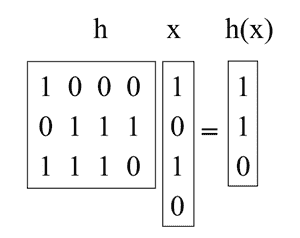

# 数据结构中的通用哈希介绍

> 原文:[https://www . geeksforgeeks . org/数据结构中通用哈希的介绍/](https://www.geeksforgeeks.org/introduction-to-universal-hashing-in-data-structure/)

[哈希](https://www.geeksforgeeks.org/hashing-data-structure/)是一个很棒的实用工具，也有一个有趣而微妙的理论。除了用作字典数据结构，哈希还出现在许多不同的领域，包括[密码学](https://www.geeksforgeeks.org/cryptography-and-its-types/)和[复杂性理论](https://www.geeksforgeeks.org/introduction-to-computation-complex-theory/)。

本文讨论一个重要的概念:**通用哈希** *(也称为通用哈希函数族*)。

**通用哈希**是指从具有一定数学性质的哈希函数族中随机选择一个[哈希函数](https://www.geeksforgeeks.org/what-are-hash-functions-and-how-to-choose-a-good-hash-function/)。这确保了最小数量的冲突。

> 用于构造散列函数的随机化算法**H****H:U →{ 1，…，M}** 是**通用的**如果对于 **U** 中的所有 **(x，y)** 使得 **x ≠ y** ，**PrH∈H【H(x)= H(y)】≤1/M**(即【的概率

散列函数的集合 **H** 称为**通用散列函数族**如果程序*“**随机选择****H∈H**“*是通用的。(这里的关键是识别在**集合上具有均匀分布的函数集合。)**

**定理:**如果 **H** 是通用散列函数族的集合，那么对于任何大小为 **N** 的集合 **S ⊆ U** ，使得 **x ∈ U** 和 **y ∈ S** ，x 和y 之间的预期碰撞次数最多为 **N/M** 。

**证明:**每个 **y ∈ S (y ≠ x)** 最多有一个 **1/M** 的几率与 **x** 碰撞，按照“通用”的定义。所以，

*   如果 **x** 和 **y** 碰撞，则让 **C xy = 1** 否则让 **0** 碰撞。
*   让**CxT3】表示 **x** 的碰撞总数。所以， **C x = ∑ y∈S，x≠y C xy** 。**
*   我们知道**E【Cxy= Pr【x 和 y 碰撞】≤ 1/M** 。
*   所以，通过[线性期望](https://www.geeksforgeeks.org/linearity-of-expectation/)，**E【Cx=∑yE【Cxy<N/M**。

**推论:**如果 H 是通用散列函数族的集合，那么对于系统中任何时间最多有 **M** 个元素的 **L** 插入、查找或删除操作的任何序列，随机 **h ∈ H** 的 **L** 操作的预期总成本仅为 **O(L)** (将计算 **h** 的时间视为常数)。

对于序列中的任何给定操作，根据上述定理，其期望成本是恒定的。因此， **L** 作业的预计总成本为 **O(L)** 乘以[期望线性度](https://www.geeksforgeeks.org/linearity-of-expectation/)。

**使用矩阵方法构建通用散列族:**

假设键是 ***u 位*** 长，表尺寸 ***M*** 是 **2** 的幂，那么一个索引就是 ***b 位*** 长加上***M = 2b***。

我们要做的是选择 ***h*** 作为随机的 *b-by-u 二进制*矩阵，定义 ***h(x) = hx*** ，其中***hx*** 通过将*h**h***的某些列相加来计算 **1** 位(如下例中增加了 **h** 的 1 st 和 3 rd 列)。这些矩阵又短又胖。例如:

现在，拿一对任意的键 **(** ***x，y)*** 这样 ***x ≠ y*** 。他们一定在某个地方有所不同，让我们假设他们在***I***坐标上有所不同，具体来说就是说***xI= 0***和***yI= 1***。试想我们首先选择的全是 ***h*** 却把*****I*****T41】th**列上。结束剩下选择的***I*****th**列，***h(x)*****是固定的。然而，每一个 ***2 b*** 不同设置的***I*****th**列给出了不同值的 ***h(y)*** (特别是，每次我们翻转该列中的一个位，我们就翻转*中的相应位所以正好有一个***1/2*****b**的几率 ***h(x) = h(y)** 。******