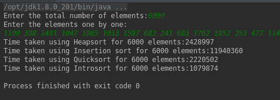

# 内省排序或内省排序

> 原文:[https://www . geesforgeks . org/intro sort-or-intro-sort/](https://www.geeksforgeeks.org/introsort-or-introspective-sort/)

**内省排序(Intravel sort)**是一种基于比较的排序，由三个排序阶段组成。它们是快速排序、堆排序和插入排序。Introsort 和 C++代码的基本概念是[在这里](https://www.geeksforgeeks.org/know-your-sorting-algorithm-set-2-introsort-cs-sorting-weapon/)
**以下部分在回顾了各自算法的优缺点后，展示了 Introsort 算法是如何制定的。**

1.  [**快速排序**](https://www.geeksforgeeks.org/quick-sort/)
    快速排序是一种高效的排序算法，但与 O(N)辅助空间相比，具有 O(N ^ 2)的最坏情况性能。这种最坏情况的复杂性取决于快速排序算法的两个阶段。
    1。选择枢轴元件
    2。算法过程中的递归深度
2.  [**heap sort**](https://www.geeksforgeeks.org/heap-sort/)
    heap sort 具有 O(N log N)最坏情况时间复杂度，比 Quicksort 最坏情况要好得多。那么，很明显 Heapsort 是最好的吗？不，快速排序的秘密在于它不会交换已经按顺序排列的元素，这是不必要的，而对于 Heapsort，即使所有的数据都已经排序，算法也会交换所有的元素来对数组进行排序。此外，通过选择最佳枢轴，可以在快速排序中避免 O(N ^ 2)的最坏情况。但是，在 Heapsort 的情况下，交换将花费更多的时间，这是不可避免的。因此，快速排序优于堆排序。【Heapsort 最好的一点是，如果递归深度变得太大，比如(log N)，最坏的情况复杂度仍然是 O(N log N)。
3.  [**【合并排序】**](http://www.geeksforgeeks.org/merge-sort/)
    合并排序的最坏情况复杂度只有 0(N log N)。Mergesort 可以很好地处理任何类型的数据集，无论其大小如何，而 Quicksort 不能很好地处理大型数据集。但是，合并排序没有到位，而快速排序到位，这在这里起着至关重要的作用。Mergesort 适用于链表，而 Quicksort 适用于数组。快速排序的引用位置更好，而合并排序的引用位置不好。因此，出于常规目的，考虑到内存限制，快速排序优于合并排序。
4.  [**插入排序**](http://www.geeksforgeeks.org/insertion-sort/)
    插入排序的主要优势在于其简单性。在处理小列表时，它也表现出良好的性能。插入排序是一种就地排序算法，因此空间需求最小。插入排序的缺点是，当数据变大时，它的性能不如其他排序算法。

**以下是 Introsort 的公式:**
选择正确的排序算法取决于使用排序算法的场合。手头已经有很多排序算法，它们各有利弊。因此，为了获得更好的排序算法，解决方案是调整现有的算法，并产生一个新的更好的排序算法。有许多混合算法，其性能优于一般的排序算法。其中之一就是 Introsort。快速排序的最佳版本在绝大多数输入上与堆排序和合并排序都有竞争力。快速排序很少出现 O(N ^ 2)运行时间和 O(N)堆栈使用的最坏情况。Heapsort 和 Mergesort 都有 O(N log N)的最坏情况运行时间，Heapsort 和 Mergesort 的堆栈使用量分别为 O(1)和 O(log N)。此外，如果数据集较小，插入排序的性能优于上述任何算法。
综合排序算法的所有优点，Introsort 基于数据集运行。

1.  如果输入中的元素数量变少，则 Introsort 会对输入执行插入排序。
2.  考虑到最少的比较次数(快速排序)，为了通过找到透视元素来拆分数组，使用了快速排序。前面引用的快速排序的最坏情况是基于两个阶段，下面是我们如何修复它们。
    1.  选择枢纽元素:我们可以使用 3 的中间值概念或随机枢纽概念或中间值作为寻找枢纽元素的枢纽概念
    2.  算法过程中的递归深度:当递归深度变高时，Introsort 使用 Heapsort，因为它有 O(N log N)的确定上限。

**深度限制是如何工作的？**
**深度限制**代表递归的最大深度。它通常被选择为输入数组长度的对数(请参考下面的实现)。其思想是确保最坏情况下的时间复杂度保持为 0(N log N)。请注意，HeapSort 的最坏情况时间复杂度是 O(N log N)。

**为什么没有使用 Mergesort？**
由于数组是用快速排序优于合并排序的就地概念处理的，所以我们没有使用合并排序。

【Introsort 能无处不在吗？

1.  如果数据不适合数组，则不能使用 Introsort。
2.  此外，像快速排序和堆排序一样，内含排序也不稳定。当需要稳定的排序时，不能应用 Introsort。

**intro sort 是唯一的混合排序算法吗？**
没有，还有其他的混合排序算法，比如混合归并排序、Tim 排序、insert-Merge 混合。
排序 6000 个元素时比较 Heapsort、Insertion sort、Quicksort、Introsort(以毫秒为单位)。



**伪代码:**

```
sort(A : array):
    depthLimit = 2xfloor(log(length(A)))
    introsort(A, depthLimit)

introsort(A, depthLimit):
    n = length(A)
    if n<=16:
        insertionSort(A)
    if depthLimit == 0:
        heapsort(A)
    else:

        // using quick sort, the
        // partition point is found 
        p = partition(A)  
        introsort(A[0:p-1], depthLimit - 1)
        introsort(A[p+1:n], depthLimit - 1)
```

**时间复杂度:**
最坏情况性能:O(nlogn)(优于快速排序)
平均情况性能:O(nlogn)
在快速排序阶段，可以使用 3 的中值概念或数组的最后一个元素来选择轴心。对于包含大量元素的数据，中位数为 3 的概念会减慢快速排序的运行时间。
在下面描述的示例中，快速排序算法基于中位数为 3 的概念计算枢轴元素。

**示例:**

## C++

```
// C++ implementation of Introsort algorithm

#include <bits/stdc++.h>
using namespace std;

// A utility function to swap the values pointed by
// the two pointers
void swapValue(int* a, int* b)
{
    int* temp = a;
    a = b;
    b = temp;
    return;
}

/* Function to sort an array using insertion sort*/
void InsertionSort(int arr[], int* begin, int* end)
{
    // Get the left and the right index of the subarray
    // to be sorted
    int left = begin - arr;
    int right = end - arr;

    for (int i = left + 1; i <= right; i++) {
        int key = arr[i];
        int j = i - 1;

        /* Move elements of arr[0..i-1], that are
                greater than key, to one position ahead
                of their current position */
        while (j >= left && arr[j] > key) {
            arr[j + 1] = arr[j];
            j = j - 1;
        }
        arr[j + 1] = key;
    }

    return;
}

// A function to partition the array and return
// the partition point
int* Partition(int arr[], int low, int high)
{
    int pivot = arr[high]; // pivot
    int i = (low - 1); // Index of smaller element

    for (int j = low; j <= high - 1; j++) {
        // If current element is smaller than or
        // equal to pivot
        if (arr[j] <= pivot) {
            // increment index of smaller element
            i++;

            swap(arr[i], arr[j]);
        }
    }
    swap(arr[i + 1], arr[high]);
    return (arr + i + 1);
}

// A function that find the middle of the
// values pointed by the pointers a, b, c
// and return that pointer
int* MedianOfThree(int* a, int* b, int* c)
{
    if (*a < *b && *b < *c)
        return (b);

    if (*a < *c && *c <= *b)
        return (c);

    if (*b <= *a && *a < *c)
        return (a);

    if (*b < *c && *c <= *a)
        return (c);

    if (*c <= *a && *a < *b)
        return (a);

    if (*c <= *b && *b <= *a)
        return (b);
}

// A Utility function to perform intro sort
void IntrosortUtil(int arr[], int* begin, int* end,
                   int depthLimit)
{
    // Count the number of elements
    int size = end - begin;

    // If partition size is low then do insertion sort
    if (size < 16) {
        InsertionSort(arr, begin, end);
        return;
    }

    // If the depth is zero use heapsort
    if (depthLimit == 0) {
        make_heap(begin, end + 1);
        sort_heap(begin, end + 1);
        return;
    }

    // Else use a median-of-three concept to
    // find a good pivot
    int* pivot
        = MedianOfThree(begin, begin + size / 2, end);

    // Swap the values pointed by the two pointers
    swapValue(pivot, end);

    // Perform Quick Sort
    int* partitionPoint
        = Partition(arr, begin - arr, end - arr);
    IntrosortUtil(arr, begin, partitionPoint - 1,
                  depthLimit - 1);
    IntrosortUtil(arr, partitionPoint + 1, end,
                  depthLimit - 1);

    return;
}

/* Implementation of introsort*/
void Introsort(int arr[], int* begin, int* end)
{
    int depthLimit = 2 * log(end - begin);

    // Perform a recursive Introsort
    IntrosortUtil(arr, begin, end, depthLimit);

    return;
}

// A utility function ot print an array of size n
void printArray(int arr[], int n)
{
    for (int i = 0; i < n; i++)
        cout << arr[i] << " \n"[i + 1 == n];
}

// Driver program to test Introsort
int main()
{
    int arr[] = { 2,  10, 24, 2,  10, 11, 27, 4,  2,  4,
                  28, 16, 9,  8,  28, 10, 13, 24, 22, 28,
                  0,  13, 27, 13, 3,  23, 18, 22, 8,  8 };
    int n = sizeof(arr) / sizeof(arr[0]);

    // Pass the array, the pointer to the first element and
    // the pointer to the last element
    Introsort(arr, arr, arr + n - 1);
    printArray(arr, n);

    return (0);
}
```

## Java 语言(一种计算机语言，尤用于创建网站)

```
// Java implementation of Introsort algorithm

import java.io.IOException;

public class Introsort {

    // the actual data that has to be sorted
    private int a[];

    // the number of elements in the data
    private int n;

    // Constructor to initialize the size
    // of the data
    Introsort(int n)
    {
        a = new int[n];
        this.n = 0;
    }

    // The utility function to insert the data
    private void dataAppend(int temp)
    {
        a[n] = temp;
        n++;
    }

    // The utility function to swap two elements
    private void swap(int i, int j)
    {
        int temp = a[i];
        a[i] = a[j];
        a[j] = temp;
    }

    // To maxHeap a subtree rooted with node i which is
    // an index in a[]. heapN is size of heap
    private void maxHeap(int i, int heapN, int begin)
    {
        int temp = a[begin + i - 1];
        int child;

        while (i <= heapN / 2) {
            child = 2 * i;

            if (child < heapN
                && a[begin + child - 1] < a[begin + child])
                child++;

            if (temp >= a[begin + child - 1])
                break;

            a[begin + i - 1] = a[begin + child - 1];
            i = child;
        }
        a[begin + i - 1] = temp;
    }

    // Function to build the heap (rearranging the array)
    private void heapify(int begin, int end, int heapN)
    {
        for (int i = (heapN) / 2; i >= 1; i--)
            maxHeap(i, heapN, begin);
    }

    // main function to do heapsort
    private void heapSort(int begin, int end)
    {
        int heapN = end - begin;

        // Build heap (rearrange array)
        this.heapify(begin, end, heapN);

        // One by one extract an element from heap
        for (int i = heapN; i >= 1; i--) {

            // Move current root to end
            swap(begin, begin + i);

            // call maxHeap() on the reduced heap
            maxHeap(1, i, begin);
        }
    }

    // function that implements insertion sort
    private void insertionSort(int left, int right)
    {

        for (int i = left; i <= right; i++) {
            int key = a[i];
            int j = i;

            // Move elements of arr[0..i-1], that are
            // greater than the key, to one position ahead
            // of their current position
            while (j > left && a[j - 1] > key) {
                a[j] = a[j - 1];
                j--;
            }
            a[j] = key;
        }
    }

    // Function for finding the median of the three elements
    private int findPivot(int a1, int b1, int c1)
    {
        int max = Math.max(Math.max(a[a1], a[b1]), a[c1]);
        int min = Math.min(Math.min(a[a1], a[b1]), a[c1]);
        int median = max ^ min ^ a[a1] ^ a[b1] ^ a[c1];
        if (median == a[a1])
            return a1;
        if (median == a[b1])
            return b1;
        return c1;
    }

    // This function takes the last element as pivot, places
    // the pivot element at its correct position in sorted
    // array, and places all smaller (smaller than pivot)
    // to the left of the pivot
    // and greater elements to the right of the pivot
    private int partition(int low, int high)
    {

        // pivot
        int pivot = a[high];

        // Index of smaller element
        int i = (low - 1);
        for (int j = low; j <= high - 1; j++) {

            // If the current element is smaller
            // than or equal to the pivot
            if (a[j] <= pivot) {

                // increment index of smaller element
                i++;
                swap(i, j);
            }
        }
        swap(i + 1, high);
        return (i + 1);
    }

    // The main function that implements Introsort
    // low  --> Starting index,
    // high  --> Ending index,
    // depthLimit  --> recursion level
    private void sortDataUtil(int begin, int end, int depthLimit)
    {
        if (end - begin > 16) {
            if (depthLimit == 0) {

                // if the recursion limit is
                // occurred call heap sort
                this.heapSort(begin, end);
                return;
            }

            depthLimit = depthLimit - 1;
            int pivot = findPivot(begin,
                begin + ((end - begin) / 2) + 1,
                                           end);
            swap(pivot, end);

            // p is partitioning index,
            // arr[p] is now at right place
            int p = partition(begin, end);

            // Separately sort elements before
            // partition and after partition
            sortDataUtil(begin, p - 1, depthLimit);
            sortDataUtil(p + 1, end, depthLimit);
        }

        else {
            // if the data set is small,
            // call insertion sort
            insertionSort(begin, end);
        }
    }

    // A utility function to begin the
    // Introsort module
    private void sortData()
    {

        // Initialise the depthLimit
        // as 2*log(length(data))
        int depthLimit
            = (int)(2 * Math.floor(Math.log(n) /
                                  Math.log(2)));

        this.sortDataUtil(0, n - 1, depthLimit);
    }

    // A utility function to print the array data
    private void printData()
    {
        for (int i = 0; i < n; i++)
            System.out.print(a[i] + " ");
    }

    // Driver code
    public static void main(String args[]) throws IOException
    {
        int[] inp = { 2, 10, 24, 2, 10, 11, 27,
                      4, 2, 4, 28, 16, 9, 8,
                      28, 10, 13, 24, 22, 28,
                      0, 13, 27, 13, 3, 23,
                      18, 22, 8, 8 };

        int n = inp.length;
        Introsort introsort = new Introsort(n);

        for (int i = 0; i < n; i++) {
            introsort.dataAppend(inp[i]);
        }

        introsort.sortData();
        introsort.printData();
    }
}
```

## 蟒蛇 3

```
# Python implementation of Introsort algorithm

import math
import sys
from heapq import heappush, heappop

arr = []

# The main function to sort
# an array of the given size
# using heapsort algorithm

def heapsort():
    global arr
    h = []

    # building the heap

    for value in arr:
        heappush(h, value)
    arr = []

    # extracting the sorted elements one by one

    arr = arr + [heappop(h) for i in range(len(h))]

# The main function to sort the data using
# insertion sort algorithm

def InsertionSort(begin, end):
    left = begin
    right = end

    # Traverse through 1 to len(arr)

    for i in range(left + 1, right + 1):
        key = arr[i]

        # Move elements of arr[0..i-1], that are
        # greater than key, to one position ahead
        # of their current position

        j = i - 1
        while j >= left and arr[j] > key:
            arr[j + 1] = arr[j]
            j = j - 1
        arr[j + 1] = key

# This function takes last element as pivot, places
# the pivot element at its correct position in sorted
# array, and places all smaller (smaller than pivot)
# to left of pivot and all greater elements to right
# of pivot

def Partition(low, high):
    global arr

  # pivot

    pivot = arr[high]

  # index of smaller element

    i = low - 1

    for j in range(low, high):

        # If the current element is smaller than or
        # equal to the pivot

        if arr[j] <= pivot:

            # increment index of smaller element

            i = i + 1
            (arr[i], arr[j]) = (arr[j], arr[i])
    (arr[i + 1], arr[high]) = (arr[high], arr[i + 1])
    return i + 1

# The function to find the median
# of the three elements in
# in the index a, b, d

def MedianOfThree(a, b, d):
    global arr
    A = arr[a]
    B = arr[b]
    C = arr[d]

    if A <= B and B <= C:
        return b
    if C <= B and B <= A:
        return b
    if B <= A and A <= C:
        return a
    if C <= A and A <= B:
        return a
    if B <= C and C <= A:
        return d
    if A <= C and C <= B:
        return d

# The main function that implements Introsort
# low  --> Starting index,
# high  --> Ending index
# depthLimit --> recursion level

def IntrosortUtil(begin, end, depthLimit):
    global arr
    size = end - begin
    if size < 16:

        # if the data set is small, call insertion sort

        InsertionSort(begin, end)
        return

    if depthLimit == 0:

        # if the recursion limit is occurred call heap sort

        heapsort()
        return

    pivot = MedianOfThree(begin, begin + size // 2, end)
    (arr[pivot], arr[end]) = (arr[end], arr[pivot])

    # partitionPoint is partitioning index,
    # arr[partitionPoint] is now at right place

    partitionPoint = Partition(begin, end)

    # Separately sort elements before partition and after partition

    IntrosortUtil(begin, partitionPoint - 1, depthLimit - 1)
    IntrosortUtil(partitionPoint + 1, end, depthLimit - 1)

# A utility function to begin the Introsort module

def Introsort(begin, end):

    # initialise the depthLimit as 2 * log(length(data))

    depthLimit = 2 * math.floor(math.log2(end - begin))
    IntrosortUtil(begin, end, depthLimit)

# A utility function to print the array data

def printArr():
    print ('Arr: ', arr)

def main():
    global arr
    arr = arr + [
        2, 10, 24, 2, 10, 11, 27,
        4, 2, 4, 28, 16, 9, 8,
        28, 10, 13, 24, 22, 28,
        0, 13, 27, 13, 3, 23,
        18, 22, 8, 8 ]

    n = len(arr)

    Introsort(0, n - 1)
    printArr()

if __name__ == '__main__':
    main()
```

## C#

```
// C# implementation of
// Introsort algorithm
using System;
class Introsort{

// the actual data that
// has to be sorted
public int []a;

// the number of elements
// in the data
public int n;

// Constructor to initialize
// the size of the data
Introsort(int n)
{
  a = new int[n];
  this.n = 0;
}

// The utility function to
// insert the data
private void dataAppend(int temp)
{
  a[n] = temp;
  n++;
}

// The utility function to
// swap two elements
private void swap(int i,
                  int j)
{
  int temp = a[i];
  a[i] = a[j];
  a[j] = temp;
}

// To maxHeap a subtree rooted
// with node i which is an index
// in []a. heapN is size of heap
private void maxHeap(int i,
                     int heapN,
                     int begin)
{
  int temp = a[begin + i - 1];
  int child;

  while (i <= heapN / 2)
  {
    child = 2 * i;

    if (child < heapN &&
        a[begin + child - 1] <
        a[begin + child])
      child++;

    if (temp >=
        a[begin + child - 1])
      break;

    a[begin + i - 1] = a[begin + child - 1];
    i = child;
  }
  a[begin + i - 1] = temp;
}

// Function to build the
// heap (rearranging the array)
private void heapify(int begin,
                     int end,
                     int heapN)
{
  for (int i = (heapN) / 2;
           i >= 1; i--)
    maxHeap(i, heapN, begin);
}

// main function to do heapsort
private void heapSort(int begin,
                      int end)
{
  int heapN = end - begin;

  // Build heap (rearrange array)
  this.heapify(begin, end, heapN);

  // One by one extract an element
  // from heap
  for (int i = heapN; i >= 1; i--)
  {
    // Move current root to end
    swap(begin, begin + i);

    // call maxHeap() on the
    // reduced heap
    maxHeap(1, i, begin);
  }
}

// function that implements
// insertion sort
private void insertionSort(int left,
                           int right)
{
  for (int i = left; i <= right; i++)
  {
    int key = a[i];
    int j = i;

    // Move elements of arr[0..i-1],
    // that are greater than the key,
    // to one position ahead
    // of their current position
    while (j > left && a[j - 1] > key)
    {
      a[j] = a[j - 1];
      j--;
    }
    a[j] = key;
  }
}

// Function for finding the median
// of the three elements
private int findPivot(int a1,
                      int b1, int c1)
{
  int max = Math.Max(
            Math.Max(a[a1],
                     a[b1]), a[c1]);
  int min = Math.Min(
            Math.Min(a[a1],
                     a[b1]), a[c1]);
  int median = max ^ min ^
               a[a1] ^ a[b1] ^ a[c1];
  if (median == a[a1])
    return a1;
  if (median == a[b1])
    return b1;
  return c1;
}

// This function takes the last element
// as pivot, places the pivot element at
// its correct position in sorted
// array, and places all smaller
// (smaller than pivot) to the left of
// the pivot and greater elements to
// the right of the pivot
private int partition(int low,
                      int high)
{
  // pivot
  int pivot = a[high];

  // Index of smaller element
  int i = (low - 1);

  for (int j = low;
           j <= high - 1; j++)
  {
    // If the current element
    // is smaller than or equal
    // to the pivot
    if (a[j] <= pivot)
    {
      // increment index of
      // smaller element
      i++;
      swap(i, j);
    }
  }
  swap(i + 1, high);
  return (i + 1);
}

// The main function that implements
// Introsort low  --> Starting index,
// high  --> Ending index, depthLimit
// --> recursion level
private void sortDataUtil(int begin,
                          int end,
                          int depthLimit)
{
  if (end - begin > 16)
  {
    if (depthLimit == 0)
    {
      // if the recursion limit is
      // occurred call heap sort
      this.heapSort(begin, end);
      return;
    }

    depthLimit = depthLimit - 1;
    int pivot = findPivot(begin, begin +
                         ((end - begin) /
                           2) + 1, end);
    swap(pivot, end);

    // p is partitioning index,
    // arr[p] is now at right place
    int p = partition(begin, end);

    // Separately sort elements
    // before partition and after
    // partition
    sortDataUtil(begin, p - 1,
                 depthLimit);
    sortDataUtil(p + 1, end,
                 depthLimit);
  }

  else
  {
    // if the data set is small,
    // call insertion sort
    insertionSort(begin, end);
  }
}

// A utility function to begin
// the Introsort module
private void sortData()
{
  // Initialise the depthLimit
  // as 2*log(length(data))
  int depthLimit = (int)(2 * Math.Floor(
                             Math.Log(n) /
                             Math.Log(2)));

  this.sortDataUtil(0, n - 1, depthLimit);
}

// A utility function to print
// the array data
private void printData()
{
  for (int i = 0; i < n; i++)
    Console.Write(a[i] + " ");
}

// Driver code
public static void Main(String []args)
{
  int[] inp = {2, 10, 24, 2, 10, 11, 27,
               4, 2, 4, 28, 16, 9, 8,
               28, 10, 13, 24, 22, 28,
               0, 13, 27, 13, 3, 23,
               18, 22, 8, 8};

  int n = inp.Length;
  Introsort introsort = new Introsort(n);

  for (int i = 0; i < n; i++)
  {
    introsort.dataAppend(inp[i]);
  }

  introsort.sortData();
  introsort.printData();
}
}

// This code is contributed by Rajput-Ji
```

**Output**

```
0 2 2 2 3 4 4 8 8 8 9 10 10 10 11 13 13 13 16 18 22 22 23 24 24 27 27 28 28 28 
```