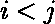
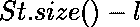
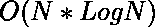

# 使用基于策略的数据结构的反转计数

> 原文:[https://www . geesforgeks . org/inversion-count-use-policy-based-data-structure/](https://www.geeksforgeeks.org/inversion-count-using-policy-based-data-structure/)

**先决条件:[基于策略的数据结构](https://www.geeksforgeeks.org/policy-based-data-structures-g/)**

给定一个数组 **arr[]** ，任务是找到数组中每个元素的逆序数。

> **反转计数:**表示数组距离排序有多远(或多近)。如果数组已经排序，则反转计数为 0。如果数组按相反的顺序排序，那么反转计数就是最大值。
> 
> 形式上，指数和的数量为![arr[i] > arr[j]](img/4899dc04bc4d41a9e5cb31c68025d17e.png "Rendered by QuickLaTeX.com")和。

**示例:**

> **输入:** {5，2，3，2，3，8，1}
> **输出:** {0，1，1，2，1，0，6}
> **解释:**
> 每个元素的反转计数–
> 索引 0 处的元素:不存在索引小于 0 的元素，该元素大于 arr[0]。
> 索引 1 处的元素:有一个元素的索引小于 1，大于 2。那是 5。
> 索引 2 处的元素:有一个元素的索引小于 2，大于 3。那是 5。
> 索引 3 处的元素:有两个元素的索引小于 3，大于 2。那是 5，3。
> 索引 4 处的元素:有一个元素的索引小于 4，大于 3。那是 5。
> 索引 5 处的元素:不存在索引小于 5，大于 8 的元素。
> 指数 6 的元素:指数小于 6 的元素有 6 个，大于 1。那是 5，2，3，2，3
> 
> **输入:** arr[] = {3，2，1}
> **输出:** {0，1，2}

**进场:**

*   创建类型对的基于[策略的数据结构](https://www.geeksforgeeks.org/policy-based-data-structures-g/)。
*   迭代给定的数组并执行以下步骤–
    *   对每个元素 X 应用 order_of_key({X，N+1})，其中 N 是数组的大小。
        **注:** order_of_key 无非是下界。此外，我们使用了 N+1，因为它大于数组中的所有索引。
    *   让 order_of_key 出来是 l，那么当前元素的反转计数将等于，它最终是数组中小于 X 且在 X 之前的元素的计数。
    *   在基于策略的数据结构 St 中插入当前元素 X 及其索引。索引与每个元素一起插入，以获得其在集合中的唯一标识，并处理重复项。

下面是上述方法的实现:

## C++

```
// C++ implementation to find the
// Inversion Count using Policy
// Based Data Structure

#include <bits/stdc++.h>

// Header files for policy based
// data structure which are
// to be included
#include <ext/pb_ds/assoc_container.hpp>
#include <ext/pb_ds/tree_policy.hpp>

using namespace __gnu_pbds;
using namespace std;

typedef tree<pair<int, int>, null_type,
             less<pair<int, int> >, rb_tree_tag,
             tree_order_statistics_node_update>
    new_data_set;

// Function to find the inversion count
// of the elements of the array
void inversionCount(int arr[], int n)
{
    int ans[n];

    // Making a new policy based data
    // structure which will
    // store pair<int, int>
    new_data_set St;

    // Loop to iterate over the elements
    // of the array
    for (int i = 0; i < n; i++) {

        // Now to find lower_bound of
        // the element X, we will use pair
        // as {x, n+1} to cover all the
        // elements and even the duplicates
        int cur = St.order_of_key({ arr[i],
                                    n + 1 });

        ans[i] = St.size() - cur;

        // Store element along with index
        St.insert({ arr[i], i });
    }

    for (int i = 0; i < n; i++) {
        cout << ans[i] << " ";
    }
    cout << "\n";
}

// Driver Code
int main()
{
    int arr[] = { 5, 2, 3, 2, 3, 8, 1 };
    int n = sizeof(arr) / sizeof(int);

    // Function Call
    inversionCount(arr, n);

    return 0;
}
```

**Output:**

```
0 1 1 2 1 0 6

```

**时间复杂度:** 