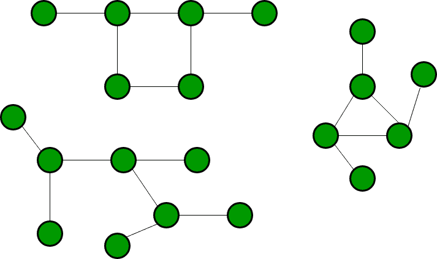

# 使用 BFS 的图形中的孤岛

> 原文： [https://www.geeksforgeeks.org/islands-in-a-graph-using-bfs/](https://www.geeksforgeeks.org/islands-in-a-graph-using-bfs/)

给定布尔 2D 矩阵，找到孤岛的数量。 一组相连的 1 组成一个岛。 例如，下面的矩阵包含 5 个岛

**示例**：

```
Input : mat[][] = {{1, 1, 0, 0, 0},
                   {0, 1, 0, 0, 1},
                   {1, 0, 0, 1, 1},
                   {0, 0, 0, 0, 0},
                   {1, 0, 1, 0, 1} 
Output : 5

```

**什么是岛屿？**

一组相连的 1s 形成一个岛。 例如，下面的矩阵包含 5 个岛

```
                        {1,  1, 0, 0, 0},
                        {0, 1, 0, 0, 1},
                        {1, 0, 0, 1, 1},
                        {0, 0, 0, 0, 0},
                        {1, 0, 1, 0, 1}

```

这是标准问题的一种变体：[已连通组件](https://www.geeksforgeeks.org/connected-components-in-an-undirected-graph/)。 无向图的连接部分是一个子图，其中每两个顶点通过一条路径相互连接，并且不与子图外部的其他顶点连接。

例如，下面的图形具有三个连通组件。



所有顶点相互连接的图具有一个完整的连通组件，该组件由整个图组成。 这种仅具有一个连通组件的图称为“强连接图”。

我们已经讨论了用于岛的 [DFS 解决方案。 通过在每个组件上应用 BFS（）也可以解决此问题。 在每个 BFS（）调用中，都会访问组件或子图。 我们将在下一个未访问的组件上调用 BFS。 BFS（）的调用次数给出了已连通组件的数量。 也可以使用 BFS。](https://www.geeksforgeeks.org/find-number-of-islands/)

2D 矩阵中的一个单元可以连接到 8 个邻居。 因此，与我们处理所有相邻顶点的标准 BFS（）不同，我们仅处理 8 个邻居。 我们会跟踪已访问的 1，以便不再对其进行访问。

## CPP

```

// A BFS based solution to count number of 
// islands in a graph. 
#include <bits/stdc++.h> 
using namespace std; 

// R x C matrix 
#define R 5 
#define C 5 

// A function to check if a given cell 
// (u, v) can be included in DFS 
bool isSafe(int mat[R][C], int i, int j, 
            bool vis[R][C]) 
{ 
    return (i >= 0) && (i < R) &&  
           (j >= 0) && (j < C) &&  
           (mat[i][j] && !vis[i][j]); 
} 

void BFS(int mat[R][C], bool vis[R][C], 
         int si, int sj) 
{ 

    // These arrays are used to get row and 
    // column numbers of 8 neighbours of 
    // a given cell 
    int row[] = { -1, -1, -1, 0, 0, 1, 1, 1 }; 
    int col[] = { -1, 0, 1, -1, 1, -1, 0, 1 }; 

    // Simple BFS first step, we enqueue 
    // source and mark it as visited 
    queue<pair<int, int> > q; 
    q.push(make_pair(si, sj)); 
    vis[si][sj] = true; 

    // Next step of BFS. We take out 
    // items one by one from queue and 
    // enqueue their univisited adjacent 
    while (!q.empty()) { 

        int i = q.front().first; 
        int j = q.front().second; 
        q.pop(); 

        // Go through all 8 adjacent 
        for (int k = 0; k < 8; k++) { 
            if (isSafe(mat, i + row[k], 
                       j + col[k], vis)) { 
             vis[i + row[k]][j + col[k]] = true; 
             q.push(make_pair(i + row[k], j + col[k])); 
            } 
        } 
    } 
} 

// This function returns number islands (connected 
// components) in a graph. It simply works as  
// BFS for disconnected graph and returns count 
// of BFS calls. 
int countIslands(int mat[R][C]) 
{ 
    // Mark all cells as not visited 
    bool vis[R][C]; 
    memset(vis, 0, sizeof(vis)); 

    // Call BFS for every unvisited vertex 
    // Whenever we see an univisted vertex, 
    // we increment res (number of islands) 
    // also. 
    int res = 0; 
    for (int i = 0; i < R; i++) { 
        for (int j = 0; j < C; j++) { 
            if (mat[i][j] && !vis[i][j]) { 
                BFS(mat, vis, i, j); 
                res++; 
            } 
        } 
    } 

    return res; 
} 

// main function 
int main() 
{ 
    int mat[][C] = { { 1, 1, 0, 0, 0 }, 
                     { 0, 1, 0, 0, 1 }, 
                     { 1, 0, 0, 1, 1 }, 
                     { 0, 0, 0, 0, 0 }, 
                     { 1, 0, 1, 0, 1 } }; 

    cout << countIslands(mat); 

    return 0; 
} 

```

## Java

```java

// A BFS based solution to count number of  
// islands in a graph.  
import java.util.*; 

class GFG 
{  

// R x C matrix  
static final int R = 5;  
static final int C = 5 ; 
static class pair 
{  
    int first, second;  
    public pair(int first, int second)  
    {  
        this.first = first;  
        this.second = second;  
    }  
} 

// A function to check if a given cell  
// (u, v) can be included in DFS  
static boolean isSafe(int mat[][], int i, int j,  
                       boolean vis[][])  
{  
    return (i >= 0) && (i < R) &&  
        (j >= 0) && (j < C) &&  
        (mat[i][j]==1 && !vis[i][j]);  
}  

static void BFS(int mat[][], boolean vis[][],  
                int si, int sj)  
{  

    // These arrays are used to get row and  
    // column numbers of 8 neighbours of  
    // a given cell  
    int row[] = { -1, -1, -1, 0, 0, 1, 1, 1 };  
    int col[] = { -1, 0, 1, -1, 1, -1, 0, 1 };  

    // Simple BFS first step, we enqueue  
    // source and mark it as visited  
    Queue<pair> q = new LinkedList<pair>();  
    q.add(new pair(si, sj));  
    vis[si][sj] = true;  

    // Next step of BFS. We take out  
    // items one by one from queue and  
    // enqueue their univisited adjacent  
    while (!q.isEmpty())  
    {  

        int i = q.peek().first;  
        int j = q.peek().second;  
        q.remove();  

        // Go through all 8 adjacent  
        for (int k = 0; k < 8; k++)  
        {  
            if (isSafe(mat, i + row[k],  
                    j + col[k], vis))  
            {  
                vis[i + row[k]][j + col[k]] = true;  
                q.add(new pair(i + row[k], j + col[k]));  
            }  
        }  
    }  
}  

// This function returns number islands (connected  
// components) in a graph. It simply works as  
// BFS for disconnected graph and returns count  
// of BFS calls.  
static int countIslands(int mat[][])  
{  
    // Mark all cells as not visited  
    boolean [][]vis = new boolean[R][C];  

    // Call BFS for every unvisited vertex  
    // Whenever we see an univisted vertex,  
    // we increment res (number of islands)  
    // also.  
    int res = 0;  
    for (int i = 0; i < R; i++)  
    {  
        for (int j = 0; j < C; j++)  
        {  
            if (mat[i][j]==1 && !vis[i][j]) 
            {  
                BFS(mat, vis, i, j);  
                res++;  
            }  
        }  
    }  
    return res;  
}  

// Driver code  
public static void main(String[] args)  
{  
    int mat[][] = { { 1, 1, 0, 0, 0 },  
                    { 0, 1, 0, 0, 1 },  
                    { 1, 0, 0, 1, 1 },  
                    { 0, 0, 0, 0, 0 },  
                    { 1, 0, 1, 0, 1 } };  

    System.out.print(countIslands(mat));  
} 
}  

// This code is contributed by PrinciRaj1992 

```

## C#

```cs

// A BFS based solution to count number of  
// islands in a graph.  
using System; 
using System.Collections.Generic; 

class GFG 
{  

// R x C matrix  
static readonly int R = 5;  
static readonly int C = 5 ; 
class pair 
{  
    public int first, second;  
    public pair(int first, int second)  
    {  
        this.first = first;  
        this.second = second;  
    }  
} 

// A function to check if a given cell  
// (u, v) can be included in DFS  
static bool isSafe(int [,]mat, int i, int j,  
                    bool [,]vis)  
{  
    return (i >= 0) && (i < R) &&  
        (j >= 0) && (j < C) &&  
        (mat[i, j]==1 && !vis[i, j]);  
}  

static void BFS(int [,]mat, bool [,]vis,  
                int si, int sj)  
{  

    // These arrays are used to get row and  
    // column numbers of 8 neighbours of  
    // a given cell  
    int []row = { -1, -1, -1, 0, 0, 1, 1, 1 };  
    int []col = { -1, 0, 1, -1, 1, -1, 0, 1 };  

    // Simple BFS first step, we enqueue  
    // source and mark it as visited  
    List<pair> q = new List<pair>();  
    q.Add(new pair(si, sj));  
    vis[si, sj] = true;  

    // Next step of BFS. We take out  
    // items one by one from queue and  
    // enqueue their univisited adjacent  
    while (q.Count != 0)  
    {  
        int i = q[0].first;  
        int j = q[0].second;  
        q.RemoveAt(0);  

        // Go through all 8 adjacent  
        for (int k = 0; k < 8; k++)  
        {  
            if (isSafe(mat, i + row[k],  
                    j + col[k], vis))  
            {  
                vis[i + row[k], j + col[k]] = true;  
                q.Add(new pair(i + row[k], j + col[k]));  
            }  
        }  
    }  
}  

// This function returns number islands (connected  
// components) in a graph. It simply works as  
// BFS for disconnected graph and returns count  
// of BFS calls.  
static int countIslands(int [,]mat)  
{  
    // Mark all cells as not visited  
    bool [,]vis = new bool[R, C];  

    // Call BFS for every unvisited vertex  
    // Whenever we see an univisted vertex,  
    // we increment res (number of islands)  
    // also.  
    int res = 0;  
    for (int i = 0; i < R; i++)  
    {  
        for (int j = 0; j < C; j++)  
        {  
            if (mat[i, j]==1 && !vis[i, j]) 
            {  
                BFS(mat, vis, i, j);  
                res++;  
            }  
        }  
    }  
    return res;  
}  

// Driver code  
public static void Main(String[] args)  
{  
    int [,]mat = { { 1, 1, 0, 0, 0 },  
                    { 0, 1, 0, 0, 1 },  
                    { 1, 0, 0, 1, 1 },  
                    { 0, 0, 0, 0, 0 },  
                    { 1, 0, 1, 0, 1 } };  

    Console.Write(countIslands(mat));  
} 
} 

// This code is contributed by 29AjayKumar 

```

**Output:**

```
5

```

时间复杂度：`O(V + E)`，其中 V 是顶点数，E 是边数。 请注意，给定的解决方案仅用作断开连接图的 BFS。


* * *

* * *

如果您喜欢 GeeksforGeeks 并希望做出贡献，则还可以使用 [tribution.geeksforgeeks.org](https://contribute.geeksforgeeks.org/) 撰写文章，或将您的文章邮寄至 tribution@geeksforgeeks.org。 查看您的文章出现在 GeeksforGeeks 主页上，并帮助其他 Geeks。

如果您发现任何不正确的地方，请单击下面的“改进文章”按钮，以改进本文。