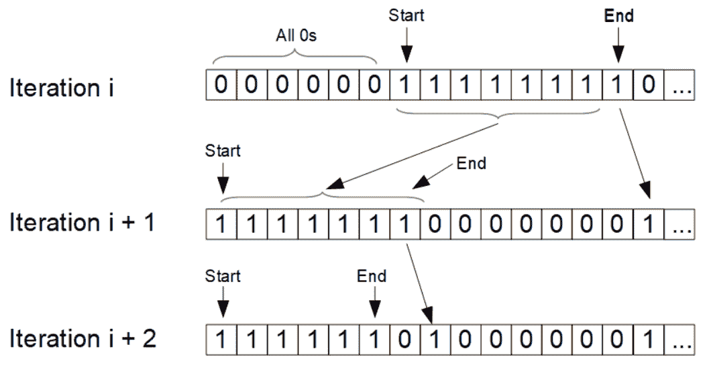

# 打印数组所有组合的迭代方法

> 原文:[https://www . geeksforgeeks . org/迭代方法打印阵列的所有组合/](https://www.geeksforgeeks.org/iterative-approach-to-print-all-combinations-of-an-array/)

给定一个大小为 **N** 的数组 **arr[]** ，任务是生成并打印数组中 **R** 元素的所有可能组合。

**示例:**

> **输入:** arr[] = {0，1，2，3}，R = 3
> **输出:**
> 0 1 2
> 0 1 3
> 0 2 3
> 1 2 3
> 
> **输入:** arr[] = {1，3，4，5，6，7}，R = 5
> **输出:**
> 1 3 4 5 6
> 1 3 4 5 7
> 1 3 4 6 7
> 1 3 5 6 7
> 1 4 5 6 7
> 3 4 5 6 7

**方法:**递归方法在这里[讨论](https://www.geeksforgeeks.org/print-all-possible-combinations-of-r-elements-in-a-given-array-of-size-n/)。在这篇文章中，将讨论一种迭代方法来输出给定数组的所有组合。
迭代方法充当状态机。当机器被调用时，它输出一个组合并移动到下一个。
对于大小为 **n** 的数组中的 **r** 元素的组合，给定的元素可以包含在组合中，也可以不包含在组合中。
让我们有一个大小为 **n** 的布尔数组来标记数据数组中对应的元素是否包含在内。如果包含数据数组中的第 **i** 元素，则布尔数组中的第 **i** 元素为真或假。
然后，布尔数组中的 **r** 布尔将被标记为真。我们可以初始化布尔数组，使 **r** 从索引 **0** 修正为索引**r–1**。在迭代过程中，我们从左到右扫描布尔数组，找到第一个为真且其 ***前一个*** 为假的元素，以及第一个为真且其 ***后一个*** 为假的元素。
然后，我们有了布尔数组中第一个连续的 trues。假设本道有 **m** 个真实，从索引**开始**到索引**结束**。下一次迭代将是

1.  将布尔数组的索引 **End + 1** 设置为真。
2.  将布尔数组的索引**开始**到索引**结束–1**设置为假。
3.  将指数 **0** 设置为指数**k–2**为真。

**例如**、
如果当前的布尔数组是 **{0，0，1，1，1，1，0，0，0，1，0，0}** ，那么 **k = 4** 、 **Start = 2** 、 **End = 5** 。下一个布尔数组将是 **{1，1，1，0，0，0，1，0，0，1，0，0，0}** 。如果 **Start == End** 在声道中只有一个 true，我们只需将索引 **End** 设置为 false，将索引 **End + 1** 设置为 true。
我们还需要在每次迭代中记录当前**开始**和**结束**以及更新**开始**和**结束**。当最后一个 **r** 布尔设置为真时，我们不能移动到下一个组合，我们停止。

下图说明了布尔数组如何从一个迭代变为另一个迭代。



要输出组合，我们只需扫描布尔数组。如果其第 **i** 索引为真，我们打印出数据数组的第 **i** 元素。

下面是上述方法的实现:

## C++

```
// C++ implementation of the approach
#include <iostream>
using namespace std;

class Combination {
private:
    // Data array for combination
    int* Indices;

    // Length of the data array
    int N;

    // Number of elements in the combination
    int R;

    // The boolean array
    bool* Flags;

    // Starting index of the 1st tract of trues
    int Start;

    // Ending index of the 1st tract of trues
    int End;

public:
    // Constructor
    Combination(int* arr, int n, int r)
    {
        this->Indices = arr;
        this->N = n;
        this->R = r;
        this->Flags = nullptr;
    }
    ~Combination()
    {
        if (this->Flags != nullptr) {
            delete[] this->Flags;
        }
    }

    // Set the 1st r Booleans to true,
    // initialize Start and End
    void GetFirst()
    {
        this->Flags = new bool[N];

        // Generate the very first combination
        for (int i = 0; i < this->N; ++i) {
            if (i < this->R) {
                Flags[i] = true;
            }
            else {
                Flags[i] = false;
            }
        }

        // Update the starting ending indices
        // of trues in the boolean array
        this->Start = 0;
        this->End = this->R - 1;
        this->Output();
    }

    // Function that returns true if another
    // combination can still be generated
    bool HasNext()
    {
        return End < (this->N - 1);
    }

    // Function to generate the next combination
    void Next()
    {

        // Only one true in the tract
        if (this->Start == this->End) {
            this->Flags[this->End] = false;
            this->Flags[this->End + 1] = true;
            this->Start += 1;
            this->End += 1;
            while (this->End + 1 < this->N
                   && this->Flags[this->End + 1]) {
                ++this->End;
            }
        }
        else {

            // Move the End and reset the End
            if (this->Start == 0) {
                Flags[this->End] = false;
                Flags[this->End + 1] = true;
                this->End -= 1;
            }
            else {
                Flags[this->End + 1] = true;

                // Set all the values to false starting from
                // index Start and ending at index End
                // in the boolean array
                for (int i = this->Start; i <= this->End; ++i) {
                    Flags[i] = false;
                }

                // Set the beginning elements to true
                for (int i = 0; i < this->End - this->Start; ++i) {
                    Flags[i] = true;
                }

                // Reset the End
                this->End = this->End - this->Start - 1;
                this->Start = 0;
            }
        }
        this->Output();
    }

private:
    // Function to print the combination generated previouslt
    void Output()
    {
        for (int i = 0, count = 0; i < this->N
                                   && count < this->R;
             ++i) {

            // If current index is set to true in the boolean array
            // then element at current index in the original array
            // is part of the combination generated previously
            if (Flags[i]) {
                cout << Indices[i] << " ";
                ++count;
            }
        }
        cout << endl;
    }
};

// Driver code
int main()
{
    int arr[] = { 0, 1, 2, 3 };
    int n = sizeof(arr) / sizeof(int);
    int r = 3;
    Combination com(arr, n, r);
    com.GetFirst();
    while (com.HasNext()) {
        com.Next();
    }
    return 0;
}
```

## Java 语言(一种计算机语言，尤用于创建网站)

```
// Java implementation of the approach
class Combination 
{

    // Data array for combination
    private int[] Indices;

    // Number of elements in the combination
    private int R;

    // The boolean array
    private boolean[] Flags;

    // Starting index of the 1st tract of trues
    private int Start;

    // Ending index of the 1st tract of trues
    private int End;

    // Constructor
    public Combination(int[] arr, int r)
    {
        this.Indices = arr;
        this.R = r;
    }

    // Set the 1st r Booleans to true,
    // initialize Start and End
    public void GetFirst()
    {
        Flags = new boolean[this.Indices.length];

        // Generate the very first combination
        for (int i = 0; i < this.R; ++i) 
        {
            Flags[i] = true;
        }

        // Update the starting ending indices
        // of trues in the boolean array
        this.Start = 0;
        this.End = this.R - 1;
        this.Output();
    }

    // Function that returns true if another
    // combination can still be generated
    public boolean HasNext()
    {
        return End < (this.Indices.length - 1);
    }

    // Function to generate the next combination
    public void Next()
    {

        // Only one true in the tract
        if (this.Start == this.End)
        {
            this.Flags[this.End] = false;
            this.Flags[this.End + 1] = true;
            this.Start += 1;
            this.End += 1;
            while (this.End + 1 < this.Indices.length
                && this.Flags[this.End + 1]) 
            {
                ++this.End;
            }
        }
        else 
        {

            // Move the End and reset the End
            if (this.Start == 0)
            {
                Flags[this.End] = false;
                Flags[this.End + 1] = true;
                this.End -= 1;
            }
            else 
            {
                Flags[this.End + 1] = true;

                // Set all the values to false starting from
                // index Start and ending at index End
                // in the boolean array
                for (int i = this.Start; i <= this.End; ++i)
                {
                    Flags[i] = false;
                }

                // Set the beginning elements to true
                for (int i = 0; i < this.End - this.Start; ++i) 
                {
                    Flags[i] = true;
                }

                // Reset the End
                this.End = this.End - this.Start - 1;
                this.Start = 0;
            }
        }
        this.Output();
    }

    // Function to print the combination generated previouslt
    private void Output()
    {
        for (int i = 0, count = 0; i < Indices.length
                                && count < this.R; ++i)
        {

            // If current index is set to true in the boolean array
            // then element at current index in the original array
            // is part of the combination generated previously
            if (Flags[i]) 
            {
                System.out.print(Indices[i]);
                System.out.print(" ");
                ++count;
            }
        }
        System.out.println();
    }
}

// Driver code
class GFG 
{
    public static void main(String[] args)
    {
        int[] arr = { 0, 1, 2, 3 };
        int r = 3;
        Combination com = new Combination(arr, r);
        com.GetFirst();
        while (com.HasNext())
        {
            com.Next();
        }
    }
}

// This code is contributed by Rajput-Ji
```

## C#

```
// C# implementation of the approach
using System;
namespace IterativeCombination {
class Combination {

    // Data array for combination
    private int[] Indices;

    // Number of elements in the combination
    private int R;

    // The boolean array
    private bool[] Flags;

    // Starting index of the 1st tract of trues
    private int Start;

    // Ending index of the 1st tract of trues
    private int End;

    // Constructor
    public Combination(int[] arr, int r)
    {
        this.Indices = arr;
        this.R = r;
    }

    // Set the 1st r Booleans to true,
    // initialize Start and End
    public void GetFirst()
    {
        Flags = new bool[this.Indices.Length];

        // Generate the very first combination
        for (int i = 0; i < this.R; ++i) {
            Flags[i] = true;
        }

        // Update the starting ending indices
        // of trues in the boolean array
        this.Start = 0;
        this.End = this.R - 1;
        this.Output();
    }

    // Function that returns true if another
    // combination can still be generated
    public bool HasNext()
    {
        return End < (this.Indices.Length - 1);
    }

    // Function to generate the next combination
    public void Next()
    {

        // Only one true in the tract
        if (this.Start == this.End) {
            this.Flags[this.End] = false;
            this.Flags[this.End + 1] = true;
            this.Start += 1;
            this.End += 1;
            while (this.End + 1 < this.Indices.Length
                   && this.Flags[this.End + 1]) {
                ++this.End;
            }
        }
        else {

            // Move the End and reset the End
            if (this.Start == 0) {
                Flags[this.End] = false;
                Flags[this.End + 1] = true;
                this.End -= 1;
            }
            else {
                Flags[this.End + 1] = true;

                // Set all the values to false starting from
                // index Start and ending at index End
                // in the boolean array
                for (int i = this.Start; i <= this.End; ++i) {
                    Flags[i] = false;
                }

                // Set the beginning elements to true
                for (int i = 0; i < this.End - this.Start; ++i) {
                    Flags[i] = true;
                }

                // Reset the End
                this.End = this.End - this.Start - 1;
                this.Start = 0;
            }
        }
        this.Output();
    }

    // Function to print the combination generated previouslt
    private void Output()
    {
        for (int i = 0, count = 0; i < Indices.Length
                                   && count < this.R;
             ++i) {

            // If current index is set to true in the boolean array
            // then element at current index in the original array
            // is part of the combination generated previously
            if (Flags[i]) {
                Console.Write(Indices[i]);
                Console.Write(" ");
                ++count;
            }
        }
        Console.WriteLine();
    }
}

// Driver code
class AppDriver {
    static void Main()
    {
        int[] arr = { 0, 1, 2, 3 };
        int r = 3;
        Combination com = new Combination(arr, r);
        com.GetFirst();
        while (com.HasNext()) {
            com.Next();
        }
    }
}
}
```

**Output:**

```
0 1 2 
0 1 3 
0 2 3 
1 2 3

```