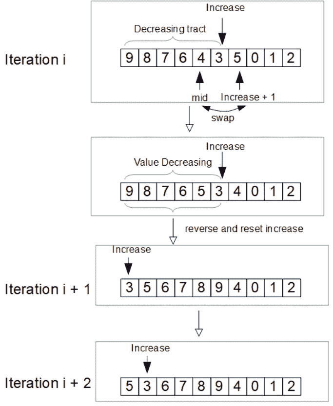

# 打印数组所有排列的迭代方法

> 原文:[https://www . geeksforgeeks . org/迭代方法打印阵列的所有排列/](https://www.geeksforgeeks.org/iterative-approach-to-print-all-permutations-of-an-array/)

给定一个大小为 **N** 的数组 **arr[]** ，任务是生成并打印给定数组的所有排列。

**示例:**

> **输入:** arr[] = {1，2}
> **输出:**
> 1 2
> 2 1
> 
> **输入:** {0，1，2}
> **输出:**
> 0 1 2
> 1 0 2
> 0 2 1
> 2 0 1
> 1 2 0
> 2 1 0

**方法:**这里[这里](https://www.geeksforgeeks.org/heaps-algorithm-for-generating-permutations/)和[这里](https://www.geeksforgeeks.org/write-a-c-program-to-print-all-permutations-of-a-given-string/)讨论了解决上述问题的递归方法。在这篇文章中，将讨论一种迭代方法来输出给定数组的所有置换。
迭代方法充当状态机。当机器被调用时，它输出一个排列并移动到下一个。

首先，我们需要一个整数数组 **Indexes** 来存储输入数组的所有索引，数组 **Indexes** 中的值被初始化为 **0** 到**n–1**。我们需要做的是置换**索引**数组。

在迭代过程中，我们在**索引**数组中找到最小的索引**增加**，使得**索引【增加】<索引【增加+1】**，这是第一个“值增加”。然后，我们有**指标【0】>指标【1】>指标【2】>……>指标【增加】**，这是从**指标【0】**开始的一段递减值。接下来的步骤是:

1.  找到指数**中间**使得**指数【中间】**最大，约束条件为 **0 ≤中间≤增加****指数【中间】<指数【增加+1】**；由于数组**索引**是从 **0** 反向排序到**增加**，这一步可以使用二分搜索法。
2.  互换**指数【增加+1】**和**指数【中】**。
3.  将**指数【0】**反转为**指数【增加】**。

当**索引**中的值变为**n–1**到 **0** 时，没有“值增加”，算法终止。

为了输出组合，我们遍历索引数组，整数数组的值就是输入数组的索引。

下图说明了算法中的迭代。



下面是上述方法的实现:

## C++

```
// C++ implementation of the approach
#include <iostream>
using namespace std;

template <typename T>
class AllPermutation {
private:
    // The input array for permutation
    const T* Arr;

    // Length of the input array
    const int Length;

    // Index array to store indexes of input array
    int* Indexes;

    // The index of the first "increase"
    // in the Index array which is the smallest
    // i such that Indexes[i] < Indexes[i + 1]
    int Increase;

public:
    // Constructor
    AllPermutation(T* arr, int length)
        : Arr(arr), Length(length)
    {
        this->Indexes = nullptr;
        this->Increase = -1;
    }

    // Destructor
    ~AllPermutation()
    {
        if (this->Indexes != nullptr) {
            delete[] this->Indexes;
        }
    }

    // Initialize and output
    // the first permutation
    void GetFirst()
    {

        // Allocate memory for Indexes array
        this->Indexes = new int[this->Length];

        // Initialize the values in Index array
        // from 0 to n - 1
        for (int i = 0; i < this->Length; ++i) {
            this->Indexes[i] = i;
        }

        // Set the Increase to 0
        // since Indexes[0] = 0 < Indexes[1] = 1
        this->Increase = 0;

        // Output the first permutation
        this->Output();
    }

    // Function that returns true if it is
    // possible to generate the next permutation
    bool HasNext()
    {

        // When Increase is in the end of the array,
        // it is not possible to have next one
        return this->Increase != (this->Length - 1);
    }

    // Output the next permutation
    void GetNext()
    {

        // Increase is at the very beginning
        if (this->Increase == 0) {

            // Swap Index[0] and Index[1]
            this->Swap(this->Increase, this->Increase + 1);

            // Update Increase
            this->Increase += 1;
            while (this->Increase < this->Length - 1
                   && this->Indexes[this->Increase]
                          > this->Indexes[this->Increase + 1]) {
                ++this->Increase;
            }
        }
        else {

            // Value at Indexes[Increase + 1] is greater than Indexes[0]
            // no need for binary search,
            // just swap Indexes[Increase + 1] and Indexes[0]
            if (this->Indexes[this->Increase + 1] > this->Indexes[0]) {
                this->Swap(this->Increase + 1, 0);
            }
            else {

                // Binary search to find the greatest value
                // which is less than Indexes[Increase + 1]
                int start = 0;
                int end = this->Increase;
                int mid = (start + end) / 2;
                int tVal = this->Indexes[this->Increase + 1];
                while (!(this->Indexes[mid] < tVal
                         && this->Indexes[mid - 1] > tVal)) {
                    if (this->Indexes[mid] < tVal) {
                        end = mid - 1;
                    }
                    else {
                        start = mid + 1;
                    }
                    mid = (start + end) / 2;
                }

                // Swap
                this->Swap(this->Increase + 1, mid);
            }

            // Invert 0 to Increase
            for (int i = 0; i <= this->Increase / 2; ++i) {
                this->Swap(i, this->Increase - i);
            }

            // Reset Increase
            this->Increase = 0;
        }
        this->Output();
    }

private:
    // Function to output the input array
    void Output()
    {
        for (int i = 0; i < this->Length; ++i) {

            // Indexes of the input array
            // are at the Indexes array
            cout << (this->Arr[this->Indexes[i]]) << " ";
        }
        cout << endl;
    }

    // Swap two values in the Indexes array
    void Swap(int p, int q)
    {
        int tmp = this->Indexes[p];
        this->Indexes[p] = this->Indexes[q];
        this->Indexes[q] = tmp;
    }
};

// Driver code
int main()
{
    int arr[] = { 0, 1, 2 };
    AllPermutation<int> perm(arr, sizeof(arr) / sizeof(int));
    perm.GetFirst();
    while (perm.HasNext()) {
        perm.GetNext();
    }

    return 0;
}
```

## Java 语言(一种计算机语言，尤用于创建网站)

```
// Java implementation of the approach
class AllPermutation 
{

    // The input array for permutation
    private final int Arr[];

    // Index array to store indexes of input array
    private int Indexes[];

    // The index of the first "increase"
    // in the Index array which is the smallest
    // i such that Indexes[i] < Indexes[i + 1]
    private int Increase;

    // Constructor
    public AllPermutation(int arr[])
    {
        this.Arr = arr;
        this.Increase = -1;
        this.Indexes = new int[this.Arr.length];
    }

    // Initialize and output
    // the first permutation
    public void GetFirst()
    {

        // Allocate memory for Indexes array
        this.Indexes = new int[this.Arr.length];

        // Initialize the values in Index array
        // from 0 to n - 1
        for (int i = 0; i < Indexes.length; ++i) 
        {
            this.Indexes[i] = i;
        }

        // Set the Increase to 0
        // since Indexes[0] = 0 < Indexes[1] = 1
        this.Increase = 0;

        // Output the first permutation
        this.Output();
    }

    // Function that returns true if it is
    // possible to generate the next permutation
    public boolean HasNext()
    {

        // When Increase is in the end of the array,
        // it is not possible to have next one
        return this.Increase != (this.Indexes.length - 1);
    }

    // Output the next permutation
    public void GetNext()
    {

        // Increase is at the very beginning
        if (this.Increase == 0) 
        {

            // Swap Index[0] and Index[1]
            this.Swap(this.Increase, this.Increase + 1);

            // Update Increase
            this.Increase += 1;
            while (this.Increase < this.Indexes.length - 1
                && this.Indexes[this.Increase]
                        > this.Indexes[this.Increase + 1]) 
            {
                ++this.Increase;
            }
        }
        else
        {

            // Value at Indexes[Increase + 1] is greater than Indexes[0]
            // no need for binary search,
            // just swap Indexes[Increase + 1] and Indexes[0]
            if (this.Indexes[this.Increase + 1] > this.Indexes[0]) 
            {
                this.Swap(this.Increase + 1, 0);
            }
            else
            {

                // Binary search to find the greatest value
                // which is less than Indexes[Increase + 1]
                int start = 0;
                int end = this.Increase;
                int mid = (start + end) / 2;
                int tVal = this.Indexes[this.Increase + 1];
                while (!(this.Indexes[mid]<tVal&& this.Indexes[mid - 1]> tVal)) 
                {
                    if (this.Indexes[mid] < tVal)
                    {
                        end = mid - 1;
                    }
                    else 
                    {
                        start = mid + 1;
                    }
                    mid = (start + end) / 2;
                }

                // Swap
                this.Swap(this.Increase + 1, mid);
            }

            // Invert 0 to Increase
            for (int i = 0; i <= this.Increase / 2; ++i)
            {
                this.Swap(i, this.Increase - i);
            }

            // Reset Increase
            this.Increase = 0;
        }
        this.Output();
    }

    // Function to output the input array
    private void Output()
    {
        for (int i = 0; i < this.Indexes.length; ++i) 
        {

            // Indexes of the input array
            // are at the Indexes array
            System.out.print(this.Arr[this.Indexes[i]]);
            System.out.print(" ");
        }
        System.out.println();
    }

    // Swap two values in the Indexes array
    private void Swap(int p, int q)
    {
        int tmp = this.Indexes[p];
        this.Indexes[p] = this.Indexes[q];
        this.Indexes[q] = tmp;
    }
}

// Driver code
class AppDriver 
{
    public static void main(String args[])
    {
        int[] arr = { 0, 1, 2 };

        AllPermutation perm = new AllPermutation(arr);
        perm.GetFirst();
        while (perm.HasNext())
        {
            perm.GetNext();
        }
    }
}

// This code is contributed by ghanshyampandey
```

## C#

```
// C# implementation of the approach
using System;
namespace Permutation {

class AllPermutation<T> {

    // The input array for permutation
    private readonly T[] Arr;

    // Index array to store indexes of input array
    private int[] Indexes;

    // The index of the first "increase"
    // in the Index array which is the smallest
    // i such that Indexes[i] < Indexes[i + 1]
    private int Increase;

    // Constructor
    public AllPermutation(T[] arr)
    {
        this.Arr = arr;
        this.Increase = -1;
    }

    // Initialize and output
    // the first permutation
    public void GetFirst()
    {

        // Allocate memory for Indexes array
        this.Indexes = new int[this.Arr.Length];

        // Initialize the values in Index array
        // from 0 to n - 1
        for (int i = 0; i < Indexes.Length; ++i) {
            this.Indexes[i] = i;
        }

        // Set the Increase to 0
        // since Indexes[0] = 0 < Indexes[1] = 1
        this.Increase = 0;

        // Output the first permutation
        this.Output();
    }

    // Function that returns true if it is
    // possible to generate the next permutation
    public bool HasNext()
    {

        // When Increase is in the end of the array,
        // it is not possible to have next one
        return this.Increase != (this.Indexes.Length - 1);
    }

    // Output the next permutation
    public void GetNext()
    {

        // Increase is at the very beginning
        if (this.Increase == 0) {

            // Swap Index[0] and Index[1]
            this.Swap(this.Increase, this.Increase + 1);

            // Update Increase
            this.Increase += 1;
            while (this.Increase < this.Indexes.Length - 1
                   && this.Indexes[this.Increase]
                          > this.Indexes[this.Increase + 1]) {
                ++this.Increase;
            }
        }
        else {

            // Value at Indexes[Increase + 1] is greater than Indexes[0]
            // no need for binary search,
            // just swap Indexes[Increase + 1] and Indexes[0]
            if (this.Indexes[this.Increase + 1] > this.Indexes[0]) {
                this.Swap(this.Increase + 1, 0);
            }
            else {

                // Binary search to find the greatest value
                // which is less than Indexes[Increase + 1]
                int start = 0;
                int end = this.Increase;
                int mid = (start + end) / 2;
                int tVal = this.Indexes[this.Increase + 1];
                while (!(this.Indexes[mid]<tVal&& this.Indexes[mid - 1]> tVal)) {
                    if (this.Indexes[mid] < tVal) {
                        end = mid - 1;
                    }
                    else {
                        start = mid + 1;
                    }
                    mid = (start + end) / 2;
                }

                // Swap
                this.Swap(this.Increase + 1, mid);
            }

            // Invert 0 to Increase
            for (int i = 0; i <= this.Increase / 2; ++i) {
                this.Swap(i, this.Increase - i);
            }

            // Reset Increase
            this.Increase = 0;
        }
        this.Output();
    }

    // Function to output the input array
    private void Output()
    {
        for (int i = 0; i < this.Indexes.Length; ++i) {

            // Indexes of the input array
            // are at the Indexes array
            Console.Write(this.Arr[this.Indexes[i]]);
            Console.Write(" ");
        }
        Console.WriteLine();
    }

    // Swap two values in the Indexes array
    private void Swap(int p, int q)
    {
        int tmp = this.Indexes[p];
        this.Indexes[p] = this.Indexes[q];
        this.Indexes[q] = tmp;
    }
}

// Driver code
class AppDriver {
    static void Main()
    {
        int[] arr = { 0, 1, 2 };
        AllPermutation<int> perm = new AllPermutation<int>(arr);
        perm.GetFirst();
        while (perm.HasNext()) {
            perm.GetNext();
        }
    }
}
}
```

**Output:**

```
0 1 2 
1 0 2 
0 2 1 
2 0 1 
1 2 0 
2 1 0

```