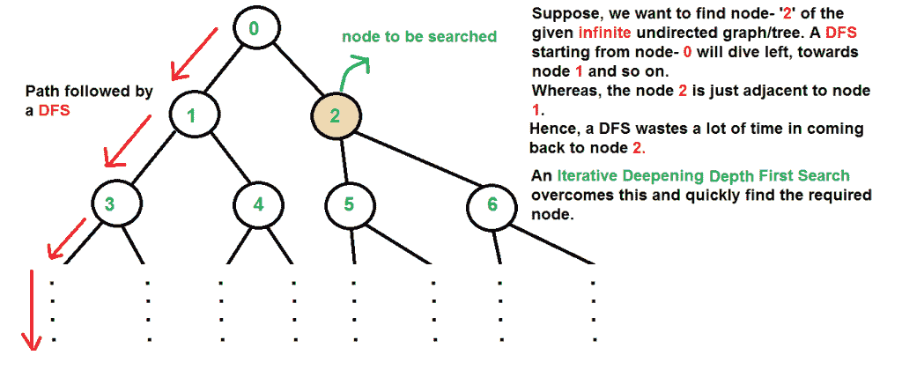
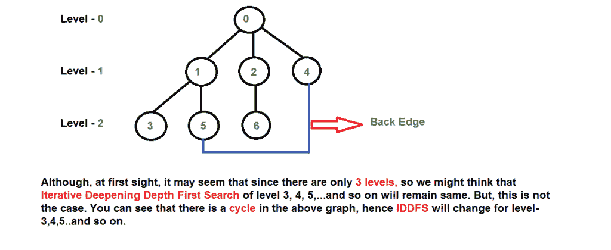
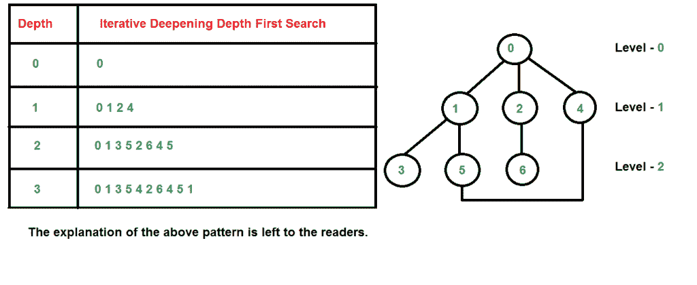
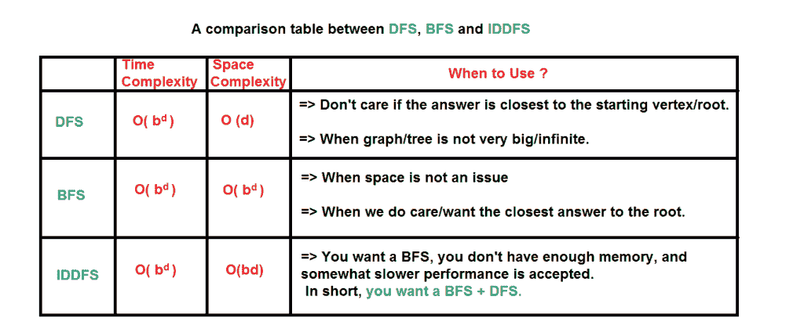

# 迭代深化搜索(IDS)或迭代深化深度优先搜索(IDDFS)

> 原文:[https://www . geesforgeks . org/迭代-深化-searchids-迭代-深化-深度-first-searchiddfs/](https://www.geeksforgeeks.org/iterative-deepening-searchids-iterative-deepening-depth-first-searchiddfs/)

有两种常见的方法来遍历一个图， [BFS](https://www.geeksforgeeks.org/breadth-first-traversal-for-a-graph/) 和 [DFS](https://www.geeksforgeeks.org/depth-first-traversal-for-a-graph/) 。考虑到树(或图形)的巨大高度和宽度，由于以下原因，BFS 和 DFS 都不是非常有效。

1.  **DFS** first traverses nodes going through one adjacent of root, then next adjacent. The problem with this approach is, if there is a node close to root, but not in first few subtrees explored by DFS, then DFS reaches that node very late. Also, DFS may not find shortest path to a node (in terms of number of edges).

    [](https://media.geeksforgeeks.org/wp-content/cdn-uploads/iddfs3.png)

2.  **BFS** 一级一级的走，但是需要更多的空间。DFS 需要的空间是 O(d)，其中 d 是树的深度，但是 BFS 需要的空间是 O(n)，其中 n 是树中的节点数(为什么？请注意，树的最后一级可以有大约 n/2 个节点，第二个最后一级可以有 n/4 个节点，在 BFS，我们需要让每一级都一个接一个地排队)。

**IDDFS** 结合了深度优先搜索的空间效率和广度优先搜索的快速搜索(对于更接近根的节点)。

【IDDFS 是如何工作的？
IDDFS 从初始值开始为不同深度调用 DFS。在每次调用中，DFS 都被限制不能超出给定的深度。所以基本上我们以 BFS 的方式做 DFS。

**算法:**

```
// Returns true if target is reachable from
// src within max_depth
bool IDDFS(src, target, max_depth)
    for limit from 0 to max_depth
       if DLS(src, target, limit) == true
           return true
    return false   

bool DLS(src, target, limit)
    if (src == target)
        return true;

    // If reached the maximum depth, 
    // stop recursing.
    if (limit <= 0) return **false**;   

    **foreach** adjacent i of src
        **if** DLS(i, target, limit?1)             
            **return** **true**

    **return** **false**=>
```

需要注意的一点是，我们会多次访问顶级节点。最后一个(或最大深度)级别被访问一次，第二个最后一个级别被访问两次，依此类推。这看起来很昂贵，但事实证明并不那么昂贵，因为在树中，大多数节点都在底层。所以上层被多次访问也没多大关系。

以下是上述算法
的实现

## C/C++

```
// C++ program to search if a target node is reachable from
// a source with given max depth.
#include<bits/stdc++.h>
using namespace std;

// Graph class represents a directed graph using adjacency
// list representation.
class Graph
{
    int V;    // No. of vertices

    // Pointer to an array containing
    // adjacency lists
    list<int> *adj;

    // A function used by IDDFS
    bool DLS(int v, int target, int limit);

public:
    Graph(int V);   // Constructor
    void addEdge(int v, int w);

    // IDDFS traversal of the vertices reachable from v
    bool IDDFS(int v, int target, int max_depth);
};

Graph::Graph(int V)
{
    this->V = V;
    adj = new list<int>[V];
}

void Graph::addEdge(int v, int w)
{
    adj[v].push_back(w); // Add w to v’s list.
}

// A function to perform a Depth-Limited search
// from given source 'src'
bool Graph::DLS(int src, int target, int limit)
{
    if (src == target)
        return true;

    // If reached the maximum depth, stop recursing.
    if (limit <= 0)
        return false;

    // Recur for all the vertices adjacent to source vertex
    for (auto i = adj[src].begin(); i != adj[src].end(); ++i)
       if (DLS(*i, target, limit-1) == true)
          return true;

     return false;
}

// IDDFS to search if target is reachable from v.
// It uses recursive DFSUtil().
bool Graph::IDDFS(int src, int target, int max_depth)
{
    // Repeatedly depth-limit search till the
    // maximum depth.
    for (int i = 0; i <= max_depth; i++)
       if (DLS(src, target, i) == true)
          return true;

    return false;
}

// Driver code
int main()
{
    // Let us create a Directed graph with 7 nodes
    Graph g(7);
    g.addEdge(0, 1);
    g.addEdge(0, 2);
    g.addEdge(1, 3);
    g.addEdge(1, 4);
    g.addEdge(2, 5);
    g.addEdge(2, 6);

    int target = 6, maxDepth = 3, src = 0;
    if (g.IDDFS(src, target, maxDepth) == true)
        cout << "Target is reachable from source "
                "within max depth";
    else
        cout << "Target is NOT reachable from source "
                "within max depth";
    return 0;
}
```

## 计算机编程语言

```
# Python program to print DFS traversal from a given
# given graph
from collections import defaultdict

# This class represents a directed graph using adjacency
# list representation
class Graph:

    def __init__(self,vertices):

        # No. of vertices
        self.V = vertices

        # default dictionary to store graph
        self.graph = defaultdict(list)

    # function to add an edge to graph
    def addEdge(self,u,v):
        self.graph[u].append(v)

    # A function to perform a Depth-Limited search
    # from given source 'src'
    def DLS(self,src,target,maxDepth):

        if src == target : return True

        # If reached the maximum depth, stop recursing.
        if maxDepth <= 0 : return False

        # Recur for all the vertices adjacent to this vertex
        for i in self.graph[src]:
                if(self.DLS(i,target,maxDepth-1)):
                    return True
        return False

    # IDDFS to search if target is reachable from v.
    # It uses recursive DLS()
    def IDDFS(self,src, target, maxDepth):

        # Repeatedly depth-limit search till the
        # maximum depth
        for i in range(maxDepth):
            if (self.DLS(src, target, i)):
                return True
        return False

# Create a graph given in the above diagram
g = Graph (7);
g.addEdge(0, 1)
g.addEdge(0, 2)
g.addEdge(1, 3)
g.addEdge(1, 4)
g.addEdge(2, 5)
g.addEdge(2, 6)

target = 6; maxDepth = 3; src = 0

if g.IDDFS(src, target, maxDepth) == True:
    print ("Target is reachable from source " +
        "within max depth")
else :
    print ("Target is NOT reachable from source " +
        "within max depth")

# This code is contributed by Neelam Pandey
```

Output :

```
Target is reachable from source within max depth
```

**图解:**
可以有两种情况——
***a)当图形没有循环时:*** 这种情况很简单。我们可以用不同的高度限制进行多次 DFS。

***b)当图形有循环时。*** 这很有意思，因为 IDDFS 中没有访问标志。
[](https://media.geeksforgeeks.org/wp-content/cdn-uploads/iddfs11.png)
[](https://media.geeksforgeeks.org/wp-content/cdn-uploads/iddfs2.png)

**时间复杂度:**假设我们有一棵树，它的分支因子为‘b’(每个节点的子节点数)，深度为‘d’，即有**b<sup>d</sup>T5】个节点。**

在迭代深化搜索中，最底层的节点被扩展一次，次底层的节点被扩展两次，以此类推，直到搜索树的根，搜索树被扩展 d+1 次。所以迭代深化搜索中展开的总数是-

```
 (d)b + (d-1)b2 + .... + 3bd-2 + 2bd-1 + bd

That is,
   Summation[(d + 1 - i) bi], from i = 0 to i = d
Which is same as O(bd)

```

在评估上述表达式之后，我们发现渐近 IDDFS 花费的时间与 DFS 和 BFS 相同，但是它确实比两者都慢，因为它在其时间复杂度表达式中具有更高的常数因子。

IDDFS 最适合完整的无限树

[](https://media.geeksforgeeks.org/wp-content/cdn-uploads/iddfs4.png)

**参考文献:**
[https://en . Wikipedia . org/wiki/Iterative _ degreing _ depth-first _ search](https://en.wikipedia.org/wiki/Iterative_deepening_depth-first_search)

本文由**拉希特·贝尔瓦亚尔**供稿。如果你喜欢极客博客并想投稿，你也可以写一篇文章并把你的文章邮寄到 contribute@geeksforgeeks.org。看到你的文章出现在极客博客主页上，帮助其他极客。

如果您发现任何不正确的地方，或者您想分享关于上面讨论的主题的更多信息，请写评论