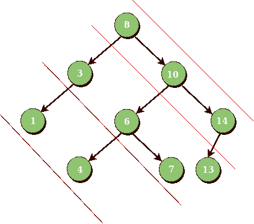

# 二叉树的迭代对角遍历

> 原文:[https://www . geeksforgeeks . org/迭代-对角线-遍历-二叉树/](https://www.geeksforgeeks.org/iterative-diagonal-traversal-binary-tree/)

考虑节点之间的坡度为-1 的线。给定一个二叉树，打印属于同一行的二叉树中的所有对角元素。

```
Input : Root of below tree
```



```
Output : 
Diagonal Traversal of binary tree : 
 8 10 14
 3 6 7 13
 1 4
```

我们已经在下面的帖子中讨论了递归解决方案。
[二叉树的对角遍历](https://www.geeksforgeeks.org/diagonal-traversal-of-binary-tree/)
本文讨论迭代求解。想法是用一个队列只存储**当前**节点的左子节点。打印当前节点的数据后，如果当前节点存在，将当前节点设置为其子节点。
分隔符**空**用于标记下一个对角线的开始。

下面是上述方法的实现。

## C++

```
/* C++ program to construct string from binary tree*/
#include <bits/stdc++.h>
using namespace std;

/* A binary tree node has data, pointer to left
   child and a pointer to right child */
struct Node {
    int data;
    Node *left, *right;
};

/* Helper function that allocates a new node */
Node* newNode(int data)
{
    Node* node = (Node*)malloc(sizeof(Node));
    node->data = data;
    node->left = node->right = NULL;
    return (node);
}

// Iterative function to print diagonal view
void diagonalPrint(Node* root)
{
    // base case
    if (root == NULL)
        return;

    // inbuilt queue of Treenode
    queue<Node*> q;

    // push root
    q.push(root);

    // push delimiter
    q.push(NULL);

    while (!q.empty()) {
        Node* temp = q.front();
        q.pop();

        // if current is delimiter then insert another
        // for next diagonal and cout nextline
        if (temp == NULL) {

            // if queue is empty return
            if (q.empty())
                return;

            // output nextline
            cout << endl;

            // push delimiter again
            q.push(NULL);
        }
        else {
            while (temp) {
                cout << temp->data << " ";

                // if left child is present
                // push into queue
                if (temp->left)
                    q.push(temp->left);

                // current equals to right child
                temp = temp->right;
            }
        }
    }
}

// Driver Code
int main()
{
    Node* root = newNode(8);
    root->left = newNode(3);
    root->right = newNode(10);
    root->left->left = newNode(1);
    root->left->right = newNode(6);
    root->right->right = newNode(14);
    root->right->right->left = newNode(13);
    root->left->right->left = newNode(4);
    root->left->right->right = newNode(7);
    diagonalPrint(root);
}
```

## Java 语言(一种计算机语言，尤用于创建网站)

```
// Java program to con string from binary tree
import java.util.*;
class solution
{

// A binary tree node has data, pointer to left
 //  child and a pointer to right child
static class Node {
    int data;
    Node left, right;
};

// Helper function that allocates a new node
static Node newNode(int data)
{
    Node node = new Node();
    node.data = data;
    node.left = node.right = null;
    return (node);
}

// Iterative function to print diagonal view
static void diagonalPrint(Node root)
{
    // base case
    if (root == null)
        return;

    // inbuilt queue of Treenode
    Queue<Node> q= new LinkedList<Node>();

    // add root
    q.add(root);

    // add delimiter
    q.add(null);

    while (q.size()>0) {
        Node temp = q.peek();
        q.remove();

        // if current is delimiter then insert another
        // for next diagonal and cout nextline
        if (temp == null) {

            // if queue is empty return
            if (q.size()==0)
                return;

            // output nextline
            System.out.println();

            // add delimiter again
            q.add(null);
        }
        else {
            while (temp!=null) {
                System.out.print( temp.data + " ");

                // if left child is present 
                // add into queue
                if (temp.left!=null)
                    q.add(temp.left);

                // current equals to right child
                temp = temp.right;
            }
        }
    }
}

// Driver Code
public static void main(String args[])
{
    Node root = newNode(8);
    root.left = newNode(3);
    root.right = newNode(10);
    root.left.left = newNode(1);
    root.left.right = newNode(6);
    root.right.right = newNode(14);
    root.right.right.left = newNode(13);
    root.left.right.left = newNode(4);
    root.left.right.right = newNode(7);
    diagonalPrint(root);
}
}
//contributed by Arnab Kundu
```

## 蟒蛇 3

```
# Python3 program to construct string from binary tree
class Node:
    def __init__(self,data):
        self.val = data
        self.left = None
        self.right = None

# Function to print diagonal view
def diagonalprint(root):

    # base case
    if root is None:
        return

    # queue of treenode
    q = []

    # Append root
    q.append(root)

    # Append delimiter
    q.append(None)

    while len(q) > 0:
        temp = q.pop(0)

        # If current is delimiter then insert another
        # for next diagonal and cout nextline
        if not temp:

            # If queue is empty then return
            if len(q) == 0:
                return

            # Print output on nextline
            print(' ')

            # append delimiter again
            q.append(None)

        else:
            while temp:
                print(temp.val, end = ' ')

                # If left child is present
                # append into queue
                if temp.left:
                    q.append(temp.left)

                # current equals to right child
                temp = temp.right

# Driver Code
root = Node(8)
root.left = Node(3)
root.right = Node(10)
root.left.left = Node(1)
root.left.right = Node(6)
root.right.right = Node(14)
root.right.right.left = Node(13)
root.left.right.left = Node(4)
root.left.right.right = Node(7)
diagonalprint(root)

# This code is contributed by Praveen kumar
```

## C#

```
// C# program to con string from binary tree
using System;
using System.Collections;

class GFG
{

// A binary tree node has data,
// pointer to left child and
// a pointer to right child
public class Node
{
    public int data;
    public Node left, right;
};

// Helper function that
// allocates a new node
static Node newNode(int data)
{
    Node node = new Node();
    node.data = data;
    node.left = node.right = null;
    return (node);
}

// Iterative function to print diagonal view
static void diagonalPrint(Node root)
{
    // base case
    if (root == null)
        return;

    // inbuilt queue of Treenode
    Queue q = new Queue();

    // Enqueue root
    q.Enqueue(root);

    // Enqueue delimiter
    q.Enqueue(null);

    while (q.Count > 0)
    {
        Node temp = (Node) q.Peek();
        q.Dequeue();

        // if current is delimiter then insert another
        // for next diagonal and cout nextline
        if (temp == null)
        {

            // if queue is empty return
            if (q.Count == 0)
                return;

            // output nextline
            Console.WriteLine();

            // Enqueue delimiter again
            q.Enqueue(null);
        }
        else
        {
            while (temp != null)
            {
                Console.Write( temp.data + " ");

                // if left child is present
                // Enqueue into queue
                if (temp.left != null)
                    q.Enqueue(temp.left);

                // current equals to right child
                temp = temp.right;
            }
        }
    }
}

// Driver Code
public static void Main(String []args)
{
    Node root = newNode(8);
    root.left = newNode(3);
    root.right = newNode(10);
    root.left.left = newNode(1);
    root.left.right = newNode(6);
    root.right.right = newNode(14);
    root.right.right.left = newNode(13);
    root.left.right.left = newNode(4);
    root.left.right.right = newNode(7);
    diagonalPrint(root);
}
}

// This code is contributed by Arnab Kundu
```

## java 描述语言

```
<script>

    // JavaScript program to con string from binary tree

    class Node
    {
        constructor(data) {
           this.left = null;
           this.right = null;
           this.data = data;
        }
    }

    // Helper function that allocates a new node
    function newNode(data)
    {
        let node = new Node(data);
        return (node);
    }

    // Iterative function to print diagonal view
    function diagonalPrint(root)
    {
        // base case
        if (root == null)
            return;

        // inbuilt queue of Treenode
        let q= [];

        // add root
        q.push(root);

        // add delimiter
        q.push(null);

        while (q.length>0) {
            let temp = q[0];
            q.shift();

            // if current is delimiter then insert another
            // for next diagonal and cout nextline
            if (temp == null) {

                // if queue is empty return
                if (q.length==0)
                    return;

                // output nextline
                document.write("</br>");

                // add delimiter again
                q.push(null);
            }
            else {
                while (temp!=null) {
                    document.write( temp.data + " ");

                    // if left child is present
                    // add into queue
                    if (temp.left!=null)
                        q.push(temp.left);

                    // current equals to right child
                    temp = temp.right;
                }
            }
        }
    }

    let root = newNode(8);
    root.left = newNode(3);
    root.right = newNode(10);
    root.left.left = newNode(1);
    root.left.right = newNode(6);
    root.right.right = newNode(14);
    root.right.right.left = newNode(13);
    root.left.right.left = newNode(4);
    root.left.right.right = newNode(7);
    diagonalPrint(root);

</script>
```

**输出:**

```
8 10 14 
3 6 7 13 
1 4
```

**<u>方法:</u>** 不使用分隔符

就像级别顺序遍历一样，使用队列。几乎没有要做的修改。

```
if(curr.left != null) -> add it to the queue
and move curr pointer to right of curr.

if curr = null, then remove a node from queue.
```

**实施:**

## Java 语言(一种计算机语言，尤用于创建网站)

```
import java.util.Queue;
import java.util.LinkedList;

//Node
class Node{
    int data;
    Node left;
    Node right;

    //Constructor for initializing the value of the node along with
    //left and right pointers
    Node(int data){
        this.data = data;
        left = right = null;
    }
}

public class DiagonalTraversal {
    //root node
    Node root = null;

    //function to print in diagonal order
    void traverse() {
        //if the tree is empty, do not have to print
        //anything
        if(root == null)
            return;

        //if root is not empty, point curr node to the
        //root node
        Node curr = root;

        //Maintain a queue to store left child
        Queue<Node> q = new LinkedList<>();

        //continue till the queue is empty and curr is null
        while(!q.isEmpty()  ||  curr!=null) {
            //if curr is null
            //1\. print the data of the curr node
            //2\. if left child is present, add it to the queue
            //3\. Move curr pointer to the right
            if(curr != null) {
                System.out.print(curr.data+" ");

                if(curr.left != null)
                    q.add(curr.left);
                curr = curr.right;
            }
            //if curr is null, remove a node from the queue
            //and point it to curr node
            else {
                curr = q.remove();
            }
        }
    }

    //Driver function
    public static void main(String args[]) {
        DiagonalTraversal tree = new DiagonalTraversal();
/*                 8
               /  \
              3    10
             / \    \
            1   6     14
               / \    /
              4   7  13            */

        //construction of the tree
        tree.root = new Node(8);
        tree.root.left = new Node(3);
        tree.root.right = new Node(10);
        tree.root.left.left = new Node(1);
        tree.root.left.right = new Node(6);
        tree.root.right.right = new Node(14);
        tree.root.right.right.left = new Node(13);
        tree.root.left.right.left = new Node(4);
        tree.root.left.right.right = new Node(7);

        //function call
        tree.traverse();
    }
}

//This method is contributed by Likhita AVL
```

## C#

```
using System;
using System.Collections.Generic;

// Node
public class Node
{
    public int data;
    public Node left;
    public Node right;

    // Constructor for initializing the value
    // of the node along with left and right pointers
    public Node(int data)
    {
        this.data = data;
        left = right = null;
    }
}

public class DiagonalTraversal{

// Root node
Node root = null;

// Function to print in diagonal order
void traverse()
{

    // If the tree is empty, do not have to print
    // anything
    if (root == null)
        return;

    // If root is not empty, point curr node to the
    // root node
    Node curr = root;

    // Maintain a queue to store left child
    Queue<Node> q = new Queue<Node>();

    // Continue till the queue is empty
    // and curr is null
    while (q.Count != 0 || curr != null)
    {

        // If curr is null
        // 1\. print the data of the curr node
        // 2\. if left child is present, add it to the queue
        // 3\. Move curr pointer to the right
        if (curr != null)
        {
            Console.Write(curr.data + " ");

            if (curr.left != null)
                q.Enqueue(curr.left);

            curr = curr.right;
        }

        // If curr is null, remove a node from
        // the queue and point it to curr node
        else
        {
            curr = q.Dequeue();
        }
    }
}

// Driver code
static public void Main()
{

    DiagonalTraversal tree = new DiagonalTraversal();
    /*       8
           /  \
          3    10
         / \    \
        1   6     14
           / \    /
          4   7  13            */

    // Construction of the tree
    tree.root = new Node(8);
    tree.root.left = new Node(3);
    tree.root.right = new Node(10);
    tree.root.left.left = new Node(1);
    tree.root.left.right = new Node(6);
    tree.root.right.right = new Node(14);
    tree.root.right.right.left = new Node(13);
    tree.root.left.right.left = new Node(4);
    tree.root.left.right.right = new Node(7);

    // Function call
    tree.traverse();
}
}

// This code is contributed by rag2127
```

## java 描述语言

```
<script>

//Node
class Node
{
    // Constructor for initializing the value of the node along with
    // left and right pointers
    constructor(data)
    {
        this.data = data;
        this.left = this.right = null;
    }
}

// root node
let root = null;

// function to print in diagonal order
function traverse()
{
    // if the tree is empty, do not have to print
        // anything
        if(root == null)
            return;

        // if root is not empty, point curr node to the
        // root node
        let curr = root;

        // Maintain a queue to store left child
        let q = [];

        // continue till the queue is empty and curr is null
        while(q.length!=0  ||  curr!=null) {
            // if curr is null
            // 1\. print the data of the curr node
            // 2\. if left child is present, add it to the queue
            // 3\. Move curr pointer to the right
            if(curr != null) {
                document.write(curr.data+" ");

                if(curr.left != null)
                    q.push(curr.left);
                curr = curr.right;
            }
            // if curr is null, remove a node from the queue
            // and point it to curr node
            else {
                curr = q.shift();
            }
       }
}

// Driver function

/*               8
               /  \
              3    10
             / \    \
            1   6     14
               / \    /
              4   7  13            */

//construction of the tree
root = new Node(8);
root.left = new Node(3);
root.right = new Node(10);
root.left.left = new Node(1);
root.left.right = new Node(6);
root.right.right = new Node(14);
root.right.right.left = new Node(13);
root.left.right.left = new Node(4);
root.left.right.right = new Node(7);

// function call
traverse();

// This code is contributed by avanitrachhadiya2155

</script>
```

**Output**

```
8 10 14 3 6 7 13 1 4 
```

？list = plqm 7 alhxfyshcxd 7r 1j0ky 9 ZG _ gbb 1 dbk〖t0〗]