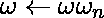
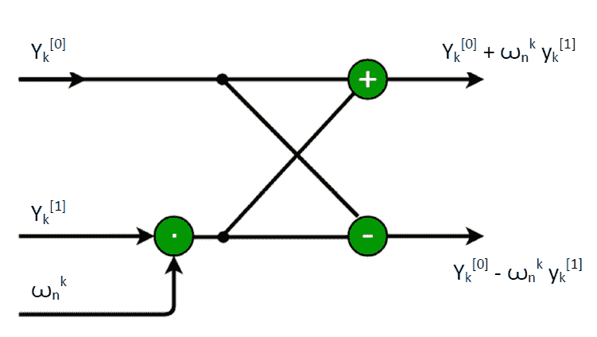
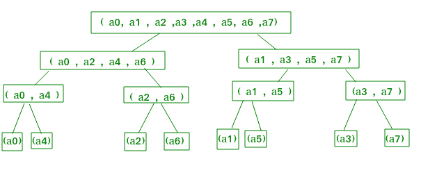
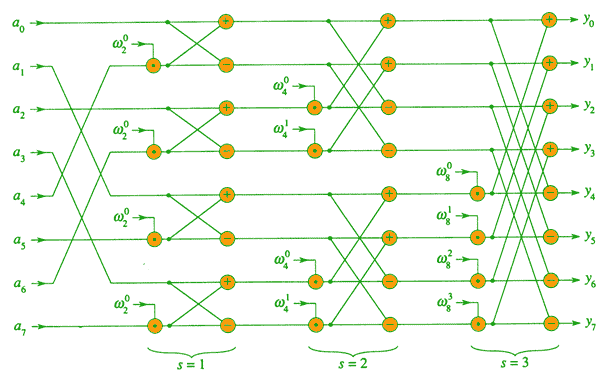
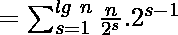

# 多项式乘法的迭代快速傅立叶变换

> 原文:[https://www . geeksforgeeks . org/迭代-快速傅立叶-变换-多项式-乘法/](https://www.geeksforgeeks.org/iterative-fast-fourier-transformation-polynomial-multiplication/)

给定两个多项式 A(x)和 B(x)，求乘积 C(x) = A(x)*B(x)。在[之前的帖子](https://www.geeksforgeeks.org/fast-fourier-transformation-poynomial-multiplication/)中，我们讨论了递归方法来解决这个具有 O(nlogn)复杂度的问题。
示例:

```
Input : 
 A[] = {9, -10, 7, 6}
 B[] = {-5, 4, 0, -2}
Output :
 C(x) = 
```

在信号处理等实际应用中，速度非常重要，本文研究一种高效的快速傅立叶变换实现。本文主要关注迭代版本的快速傅立叶变换算法，该算法在 O(nlogn)时间内运行，但可以比递归版本隐藏更低的常数，而且它节省了递归堆栈空间。
**先决条件**:快速傅立叶变换的递归算法。
回想上一篇文章中的递归-FFT 伪码，在的 for 循环求值中，被计算了两次。我们可以改变循环只计算一次，存储在临时变量 t 中，这样就变成了，
为 k  0 到 n/2–1
做 t![ \leftarrow \omega y^{\left [ 1 \right ]} ](img/96d9c23d897d7b079c607e45e053bb5d.png "Rendered by QuickLaTeX.com")
![y_{k}\leftarrow \omega y_{k}^{\left [ 0 \right ]} + t ](img/89e50b99a095090ce7f03acd78220c58.png "Rendered by QuickLaTeX.com")
![y_{k + \left ( n/2 \right )}\leftarrow _{k}^{\left [ 0 \right ]} - t ](img/af6692a5b4b0492b65d38bc4a929998e.png "Rendered by QuickLaTeX.com")

这个循环中的运算，将旋转因子 w = 乘以![y_k^[^1^] ](img/22851c0b845dc86799d3fd0433cd49e2.png "Rendered by QuickLaTeX.com")，将乘积存储为 t，再从![y_k^[^0^] ](img/3ec2e19d9b8071d95de2b142fc850ddb.png "Rendered by QuickLaTeX.com")中加减 t，称为蝶式运算。
图片上，这就是蝴蝶行动的样子:



让我们假设 n=8，然后继续形成迭代 fft 算法。查看上面的递归树，我们发现如果我们将初始系数向量 a 的元素按照它们在叶子中出现的顺序排列，我们可以跟踪递归-快速傅立叶变换过程的执行，但是是自下而上而不是自上而下。首先，我们成对地获取元素，使用一个蝶形运算计算每对元素的离散傅立叶变换，并用其离散傅立叶变换替换该对元素。该向量然后保存 n/2 个 2 元素 DFt。接下来，我们成对地获取这 n/2 个离散傅立叶变换，并通过执行两个 butterfy 操作来计算它们所来自的四个向量元素的离散傅立叶变换，用一个 4 元素离散傅立叶变换替换两个 2 元素离散傅立叶变换。该向量然后保存 n/4 个 4 元素 DFt。我们以这种方式继续，直到向量包含两个(n/2)元素 DFT，我们使用 n/2 蝶形运算将它们组合成最终的 n 元素 DFt。



为了将这种自下而上的方法转化为代码，我们使用一个数组 A[0…n]，该数组最初按照输入向量 A 在树叶中出现的顺序保存输入向量 A 的元素。因为我们必须组合 DFT，所以在树的每一层，我们引入了可用的 s 来计算层次，范围从 1(在底部，当我们组合成对以形成 2 元素 DFT 时)到 lgn(在顶部，当我们组合两个 n/2 元素 DFT 以产生最终结果时)。因此，算法为:

```
1\. for s=1 to lgn
2\.     do for k=0 to n-1 by 

3\.           do combine the two  -element DFTs in

                A[k...k+-1] and A[k+...k+-1]

                into one 2s-element DFT in A[k...k+-1]
```

现在为了生成代码，我们按照叶子的顺序排列系数向量元素。示例-离开 0、4、2、6、1、5、3、7 的顺序是索引的位反转。从 000，001，010，011，100，101，110，111 开始，反转每个二进制数的位，得到 000，100，010，110，001，101，011，111。迭代 FFT 伪码:

```
BIT-REVERSE-COPY(a, A)
n = length [a]
for k = 0 to n-1
        do A[rev(k)] = a[k]

ITERATIVE-FFT
BIT-REVERSE-COPY(a, A)
n = length(a)
for s = 1 to log n
        do m= 

       =   

           for j = 0 to m/2-1

               do for k = j to n-1 by m

                      do t = A[k+m/2]

                         u = A[k]

                         A[k] = u+t

                         A[k+m/2] = u-t 

return A
```

从下面的并行 FFT 电路将会更加清楚:



## 卡片打印处理机（Card Print Processor 的缩写）

```
// CPP program to implement iterative
// fast Fourier transform.
#include <bits/stdc++.h>
using namespace std;

typedef complex<double> cd;
const double PI = 3.1415926536;

// Utility function for reversing the bits
// of given index x
unsigned int bitReverse(unsigned int x, int log2n)
{
    int n = 0;
    for (int i = 0; i < log2n; i++)
    {
        n <<= 1;
        n |= (x & 1);
        x >>= 1;
    }
    return n;
}

// Iterative FFT function to compute the DFT
// of given coefficient vector
void fft(vector<cd>& a, vector<cd>& A, int log2n)
{
    int n = 4;

    // bit reversal of the given array
    for (unsigned int i = 0; i < n; ++i) {
        int rev = bitReverse(i, log2n);
        A[i] = a[rev];
    }

    // j is iota
    const complex<double> J(0, 1);
    for (int s = 1; s <= log2n; ++s) {
        int m = 1 << s; // 2 power s
        int m2 = m >> 1; // m2 = m/2 -1
        cd w(1, 0);

        // principle root of nth complex
        // root of unity.
        cd wm = exp(J * (PI / m2));
        for (int j = 0; j < m2; ++j) {
            for (int k = j; k < n; k += m) {

                // t = twiddle factor
                cd t = w * A[k + m2];
                cd u = A[k];

                // similar calculating y[k]
                A[k] = u + t;

                // similar calculating y[k+n/2]
                A[k + m2] = u - t;
            }
            w *= wm;
        }
    }
}

int main()
{
    vector<cd> a{ 1, 2, 3, 4 };
    vector<cd> A(4);
    fft(a, A, 2);
    for (int i = 0; i < 4; ++i)
        cout << A[i] << "\n";
}
```

```
Input:  1 2 3 4
Output:
(10, 0)
(-2, -2)
(-2, 0)
(-2, 2)
```

时间复杂度分析:
复杂度为 O(nlgn)。为了展示这一点，我们将 O(nlgn)时间中最里面的循环运行显示为:



