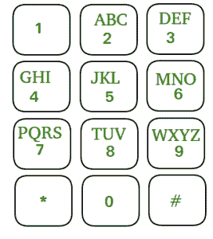

# 电话号码的重复字母组合

> 原文:[https://www . geeksforgeeks . org/电话号码的迭代字母组合/](https://www.geeksforgeeks.org/iterative-letter-combinations-of-a-phone-number/)

给定一个包含来自**【0，9】**的数字的整数数组，任务是打印这些数字可能代表的所有可能的字母组合。

数字到字母的映射(就像电话按钮一样)正在进行。**注意****0**和 **1** 没有映射到任何字母。所有映射如下图所示:



**示例:**

> **输入:**arr[]=【2，3】
> 输出: ad ae af bd be bf cd ce cf
> 
> **输入:**arr[]= { 9 }
> T3】输出: w x y z

**方法:**现在让我们想一想，如果不以迭代的方式处理这个问题，我们将如何处理它。递归解决方案既直观又常见。我们不断递归添加每个可能的字母，这将生成所有可能的字符串。
让我们考虑如何使用递归方法构建迭代解决方案。通过使用堆栈，递归是可能的。所以如果我们用堆栈代替递归函数，那会是迭代解吗？从技术上讲，我们可以这么说，但从逻辑上讲，我们并没有做什么不同。

栈是后进先出直接序列。我们可以使用另一种数据结构吗？如果我们使用先进先出，会有什么不同？比如排队。既然 BFS 是按队列完成的，而 DFS 是按栈完成的，这两者有什么区别吗？
DFS 和 BFS 的区别和这个问题类似。在 DFS 中，我们将在树中逐个找到每条可能的路径。它将首先为一条路径执行所有步骤，而 BFS 将一步一步地一起构建所有路径。
所以，对于这个问题来说，队列是完美的。使用队列和堆栈的两种算法之间的唯一区别是它们的形成方式。堆栈将一个接一个地形成所有字符串，而队列将一起形成所有字符串，即经过 x 次传递后，所有字符串的长度都为 x。

**例如:**

```
If the given number is "23", 
then using queue, the letter combinations 
obtained will be:
["ad", "ae", "af", "bd", "be", "bf", "cd", "ce", "cf"] 
and using stack, the letter combinations obtained will 
be:
["cf","ce","cd","bf","be","bd","af","ae","ad"].
```

下面是上述方法的实现:

## C++

```
// C++ implementation of the approach
#include <bits/stdc++.h>
using namespace std;

// Function to return a vector that contains
// all the generated letter combinations
vector<string> letterCombinationsUtil(const int number[],
                                      int n,
                                      const string table[])
{
    // To store the generated letter combinations
    vector<string> list;

    queue<string> q;
    q.push("");

    while (!q.empty()) {
        string s = q.front();
        q.pop();

        // If complete word is generated
        // push it in the list
        if (s.length() == n)
            list.push_back(s);
        else

            // Try all possible letters for current digit
            // in number[]
            for (auto letter : table[number[s.length()]])
                q.push(s + letter);
    }

    // Return the generated list
    return list;
}

// Function that creates the mapping and
// calls letterCombinationsUtil
void letterCombinations(const int number[], int n)
{

    // table[i] stores all characters that
    // corresponds to ith digit in phone
    string table[10]
        = { "0",   "1",   "abc",  "def", "ghi",
            "jkl", "mno", "pqrs", "tuv", "wxyz" };

    vector<string> list
        = letterCombinationsUtil(number, n, table);

    // Print the contents of the vector
    for (auto word : list)
        cout << word << " ";

    return;
}

// Driver code
int main()
{
    int number[] = { 2, 3 };
    int n = sizeof(number) / sizeof(number[0]);

    // Function call
    letterCombinations(number, n);

    return 0;
}
```

## Java 语言(一种计算机语言，尤用于创建网站)

```
// Java implementation of the approach
import java.io.*;
import java.util.*;

class GFG {
    // Function to return a vector that contains
    // all the generated letter combinations
    static ArrayList<String>
    letterCombinationsUtil(int[] number, int n,
                           String[] table)
    {
        // To store the generated letter combinations
        ArrayList<String> list = new ArrayList<>();

        Queue<String> q = new LinkedList<>();
        q.add("");

        while (!q.isEmpty()) {
            String s = q.remove();

            // If complete word is generated
            // push it in the list
            if (s.length() == n)
                list.add(s);
            else {
                String val = table[number[s.length()]];
                for (int i = 0; i < val.length(); i++)
                {
                    q.add(s + val.charAt(i));
                }
            }
        }
        return list;
    }

    // Function that creates the mapping and
    // calls letterCombinationsUtil
    static void letterCombinations(int[] number, int n)
    {
        // table[i] stores all characters that
        // corresponds to ith digit in phone
        String[] table
            = { "0",   "1",   "abc",  "def", "ghi",
                "jkl", "mno", "pqrs", "tuv", "wxyz" };

        ArrayList<String> list
            = letterCombinationsUtil(number, n, table);

        // Print the contents of the list
        for (int i = 0; i < list.size(); i++) {
            System.out.print(list.get(i) + " ");
        }
    }

    // Driver code
    public static void main(String args[])
    {
        int[] number = { 2, 3 };
        int n = number.length;

        // Function call
        letterCombinations(number, n);
    }
}

// This code is contributed by rachana soma
```

## 蟒蛇 3

```
# Python3 implementation of the approach
from collections import deque

# Function to return a list that contains
# all the generated letter combinations

def letterCombinationsUtil(number, n, table):

    list = []
    q = deque()
    q.append("")

    while len(q) != 0:
        s = q.pop()

        # If complete word is generated
        # push it in the list
        if len(s) == n:
            list.append(s)
        else:

            # Try all possible letters for current digit
            # in number[]
            for letter in table[number[len(s)]]:
                q.append(s + letter)

    # Return the generated list
    return list

# Function that creates the mapping and
# calls letterCombinationsUtil
def letterCombinations(number, n):

    # table[i] stores all characters that
    # corresponds to ith digit in phone
    table = ["0", "1", "abc", "def", "ghi", "jkl",
             "mno", "pqrs", "tuv", "wxyz"]

    list = letterCombinationsUtil(number, n, table)

    s = ""
    for word in list:
        s += word + " "

    print(s)
    return

# Driver code
number = [2, 3]
n = len(number)

# Function call
letterCombinations(number, n)
```

## C#

```
// C# implementation of the approach
using System;
using System.Collections.Generic;

class GFG {
    // Function to return a vector that contains
    // all the generated letter combinations
    static List<String>
    letterCombinationsUtil(int[] number, int n,
                           String[] table)
    {
        // To store the generated letter combinations
        List<String> list = new List<String>();

        Queue<String> q = new Queue<String>();
        q.Enqueue("");

        while (q.Count != 0) {
            String s = q.Dequeue();

            // If complete word is generated
            // push it in the list
            if (s.Length == n)
                list.Add(s);
            else {
                String val = table[number[s.Length]];
                for (int i = 0; i < val.Length; i++) {
                    q.Enqueue(s + val[i]);
                }
            }
        }
        return list;
    }

    // Function that creates the mapping and
    // calls letterCombinationsUtil
    static void letterCombinations(int[] number, int n)
    {
        // table[i] stores all characters that
        // corresponds to ith digit in phone
        String[] table
            = { "0",   "1",   "abc",  "def", "ghi",
                "jkl", "mno", "pqrs", "tuv", "wxyz" };

        List<String> list
            = letterCombinationsUtil(number, n, table);

        // Print the contents of the list
        for (int i = 0; i < list.Count; i++) {
            Console.Write(list[i] + " ");
        }
    }

    // Driver code
    public static void Main(String[] args)
    {
        int[] number = { 2, 3 };
        int n = number.Length;

        // Function call
        letterCombinations(number, n);
    }
}

// This code is contributed by Princi Singh
```

**Output**

```
ad ae af bd be bf cd ce cf 
```

**时间复杂度:** O(4^n)因为我们得到长度为 n 的所有可能数字的集合。在最坏的情况下，对于每个数字可以有 4 种可能性。
**辅助空间:** O(4^n)