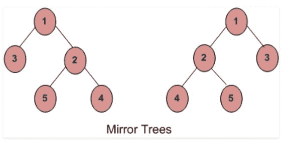

# 检查两棵树是否相互镜像的迭代方法

> 原文:[https://www . geesforgeks . org/iterative-method-check-two-trees-mirror/](https://www.geeksforgeeks.org/iterative-method-check-two-trees-mirror/)

给定两个二叉树。问题是检查这两个二叉树是否是彼此的镜像。
**一个二叉树的镜像:**一个二叉树 T 的镜像是另一个二叉树 M(T)，所有非叶节点的左右子节点互换。



上图中的树是彼此的镜子。

我们已经讨论了一个[递归解决方案来检查两个树是否是镜像](https://www.geeksforgeeks.org/check-if-two-trees-are-mirror/)。本文讨论了后迭代解法。
**先决条件:** [使用堆栈进行迭代有序树遍历](https://www.geeksforgeeks.org/inorder-tree-traversal-without-recursion/)

**进场:**以下步骤为:

1.  并行执行一棵树的迭代有序遍历和另一棵树的迭代反向有序遍历。
2.  在这两次迭代过程中，检查相应的节点是否具有相同的值。如果不相同，那么它们就不是彼此的镜像。
3.  如果值相同，则检查在迭代有序遍历的任何一点，根中的一个是否为空，另一个是否为空。如果发生这种情况，那么它们就不是彼此的镜像。该检查确保它们是否具有相应的镜像结构。
4.  否则，这两棵树就是彼此的镜子。

**反向有序遍历**与有序遍历相反。在这种情况下，首先遍历右子树，然后遍历根，然后遍历左子树。

## C++

```
// C++ implementation to check whether the two
// binary trees are mirrors of each other or not
#include <bits/stdc++.h>
using namespace std;

// structure of a node in binary tree
struct Node
{
    int data;
    struct Node *left, *right;
};

// Utility function to create and return
// a new node for a binary tree
struct Node* newNode(int data)
{
    struct Node *temp = new Node();
    temp->data = data;
    temp->left = temp->right = NULL;
    return temp;
}

// function to check whether the two binary trees
// are mirrors of each other or not
string areMirrors(Node *root1, Node *root2)
{
    stack<Node*> st1, st2;
    while (1)
    {
        // iterative inorder traversal of 1st tree and
        // reverse inorder traversal of 2nd tree
        while (root1 && root2)
        {
            // if the corresponding nodes in the two traversal
            // have different data values, then they are not
            // mirrors of each other.
            if (root1->data != root2->data)
                return "No";

            st1.push(root1);
            st2.push(root2);
            root1 = root1->left;
            root2 = root2->right;   
        }

        // if at any point one root becomes null and
        // the other root is not null, then they are
        // not mirrors. This condition verifies that
        // structures of tree are mirrors of each other.
        if (!(root1 == NULL && root2 == NULL))
            return "No";

        if (!st1.empty() && !st2.empty())
        {
            root1 = st1.top();
            root2 = st2.top();
            st1.pop();
            st2.pop();

            /* we have visited the node and its left subtree.
               Now, it's right subtree's turn */
            root1 = root1->right;

            /* we have visited the node and its right subtree.
               Now, it's left subtree's turn */
            root2 = root2->left;
        }   

        // both the trees have been completely traversed
        else
            break;
    }

    // trees are mirrors of each other
    return "Yes";
}

// Driver program to test above
int main()
{
    // 1st binary tree formation
    Node *root1 = newNode(1);            /*         1          */                     
    root1->left = newNode(3);            /*       /   \        */
    root1->right = newNode(2);           /*      3     2       */
    root1->right->left = newNode(5);     /*          /   \     */ 
    root1->right->right = newNode(4);    /*         5     4    */

    // 2nd binary tree formation   
    Node *root2 = newNode(1);            /*         1          */                     
    root2->left = newNode(2);            /*       /   \        */
    root2->right = newNode(3);           /*      2     3       */
    root2->left->left = newNode(4);      /*    /   \           */
    root2->left->right = newNode(5);     /*   4    5           */

    cout << areMirrors(root1, root2);
    return 0;
}
```

## Java 语言(一种计算机语言，尤用于创建网站)

```
// Java implementation to check whether the two
// binary trees are mirrors of each other or not
import java.util.*;
class GfG {

// structure of a node in binary tree
static class Node
{
    int data;
    Node left, right;
}

// Utility function to create and return
// a new node for a binary tree
static Node newNode(int data)
{
    Node temp = new Node();
    temp.data = data;
    temp.left = null;
    temp.right = null;
    return temp;
}

// function to check whether the two binary trees
// are mirrors of each other or not
static String areMirrors(Node root1, Node root2)
{
    Stack<Node> st1 = new Stack<Node> ();
    Stack<Node> st2  = new Stack<Node> ();
    while (true)
    {
        // iterative inorder traversal of 1st tree and
        // reverse inorder traversal of 2nd tree
        while (root1 != null && root2 != null)
        {
            // if the corresponding nodes in the two traversal
            // have different data values, then they are not
            // mirrors of each other.
            if (root1.data != root2.data)
                return "No";

            st1.push(root1);
            st2.push(root2);
            root1 = root1.left;
            root2 = root2.right;    
        }

        // if at any point one root becomes null and
        // the other root is not null, then they are
        // not mirrors. This condition verifies that
        // structures of tree are mirrors of each other.
        if (!(root1 == null && root2 == null))
            return "No";

        if (!st1.isEmpty() && !st2.isEmpty())
        {
            root1 = st1.peek();
            root2 = st2.peek();
            st1.pop();
            st2.pop();

            /* we have visited the node and its left subtree.
            Now, it's right subtree's turn */
            root1 = root1.right;

            /* we have visited the node and its right subtree.
            Now, it's left subtree's turn */
            root2 = root2.left;
        }    

        // both the trees have been completely traversed
        else
            break;
    }

    // trees are mirrors of each other
    return "Yes";
}

// Driver program to test above
public static void main(String[] args)
{
    // 1st binary tree formation
    Node root1 = newNode(1);         /*         1         */                   
    root1.left = newNode(3);         /*     / \     */
    root1.right = newNode(2);         /*     3     2     */
    root1.right.left = newNode(5);     /*         / \     */
    root1.right.right = newNode(4); /*         5     4 */

    // 2nd binary tree formation    
    Node root2 = newNode(1);         /*         1         */                   
    root2.left = newNode(2);         /*     / \     */
    root2.right = newNode(3);         /*     2     3     */
    root2.left.left = newNode(4);     /* / \         */
    root2.left.right = newNode(5);     /* 4 5         */

    System.out.println(areMirrors(root1, root2));
}
}
```

## 蟒蛇 3

```
# Python3 implementation to check whether
# the two binary trees are mirrors of each
# other or not

# Utility function to create and return
# a new node for a binary tree
class newNode:
    def __init__(self, data):
        self.data = data
        self.left = self.right = None

# function to check whether the two binary
# trees are mirrors of each other or not
def areMirrors(root1, root2):
    st1 = []
    st2 = []
    while (1):

        # iterative inorder traversal of 1st tree
        # and reverse inorder traversal of 2nd tree
        while (root1 and root2):

            # if the corresponding nodes in the
            # two traversal have different data
            # values, then they are not mirrors
            # of each other.
            if (root1.data != root2.data):
                return "No"

            st1.append(root1)
            st2.append(root2)
            root1 = root1.left
            root2 = root2.right

        # if at any point one root becomes None and
        # the other root is not None, then they are
        # not mirrors. This condition verifies that
        # structures of tree are mirrors of each other.
        if (not (root1 == None and root2 == None)):
            return "No"

        if (not len(st1) == 0 and not len(st2) == 0):
            root1 = st1[-1]
            root2 = st2[-1]
            st1.pop(-1)
            st2.pop(-1)

            # we have visited the node and its left
            # subtree. Now, it's right subtree's turn
            root1 = root1.right

            # we have visited the node and its right
            # subtree. Now, it's left subtree's turn
            root2 = root2.left

        # both the trees have been
        # completely traversed
        else:
            break

    # trees are mirrors of each other
    return "Yes"

# Driver Code
if __name__ == '__main__':

    # 1st binary tree formation
    root1 = newNode(1)         #          1                            
    root1.left = newNode(3)         #     / \    
    root1.right = newNode(2)  #        3    2    
    root1.right.left = newNode(5)#       / \    
    root1.right.right = newNode(4) #  5      4

    # 2nd binary tree formation    
    root2 = newNode(1)        #          1                            
    root2.left = newNode(2)         #     / \    
    root2.right = newNode(3) #        2     3    
    root2.left.left = newNode(4)#  / \        
    root2.left.right = newNode(5)# 4  5        

    print(areMirrors(root1, root2))

# This code is contributed by pranchalK
```

## C#

```
// C# implementation to check whether the two
// binary trees are mirrors of each other or not
using System;
using System.Collections.Generic;

class GfG
{

    // structure of a node in binary tree
    public class Node
    {
        public int data;
        public Node left, right;
    }

    // Utility function to create and return
    // a new node for a binary tree
    static Node newNode(int data)
    {
        Node temp = new Node();
        temp.data = data;
        temp.left = null;
        temp.right = null;
        return temp;
    }

    // function to check whether the two binary trees
    // are mirrors of each other or not
    static String areMirrors(Node root1, Node root2)
    {
        Stack<Node> st1 = new Stack<Node> ();
        Stack<Node> st2 = new Stack<Node> ();
        while (true)
        {
            // iterative inorder traversal of 1st tree and
            // reverse inorder traversal of 2nd tree
            while (root1 != null && root2 != null)
            {
                // if the corresponding nodes in the two traversal
                // have different data values, then they are not
                // mirrors of each other.
                if (root1.data != root2.data)
                    return "No";

                st1.Push(root1);
                st2.Push(root2);
                root1 = root1.left;
                root2 = root2.right;    
            }

            // if at any point one root becomes null and
            // the other root is not null, then they are
            // not mirrors. This condition verifies that
            // structures of tree are mirrors of each other.
            if (!(root1 == null && root2 == null))
                return "No";

            if (st1.Count != 0 && st2.Count != 0)
            {
                root1 = st1.Peek();
                root2 = st2.Peek();
                st1.Pop();
                st2.Pop();

                /* we have visited the node and its left subtree.
                Now, it's right subtree's turn */
                root1 = root1.right;

                /* we have visited the node and its right subtree.
                Now, it's left subtree's turn */
                root2 = root2.left;
            }    

            // both the trees have been completely traversed
            else
                break;
        }

        // trees are mirrors of each other
        return "Yes";
    }

    // Driver program to test above
    public static void Main(String[] args)
    {
        // 1st binary tree formation
        Node root1 = newNode(1);         /*         1         */               
        root1.left = newNode(3);         /*     / \     */
        root1.right = newNode(2);         /*     3     2     */
        root1.right.left = newNode(5);     /*         / \     */
        root1.right.right = newNode(4); /*         5     4 */

        // 2nd binary tree formation    
        Node root2 = newNode(1);         /*         1         */               
        root2.left = newNode(2);         /*     / \     */
        root2.right = newNode(3);         /*     2     3     */
        root2.left.left = newNode(4);     /* / \         */
        root2.left.right = newNode(5);     /* 4 5         */

        Console.WriteLine(areMirrors(root1, root2));
    }
}

// This code has been contributed by 29AjayKumar
```

## java 描述语言

```
<script>

// Javascript implementation to check whether
// the two binary trees are mirrors of each
// other or not structure of a node in binary tree
class Node
{
    constructor()
    {
        this.data = 0;
        this.left = null;
        this.right = null;
    }
}

// Utility function to create and return
// a new node for a binary tree
function newNode(data)
{
    var temp = new Node();
    temp.data = data;
    temp.left = null;
    temp.right = null;
    return temp;
}

// Function to check whether the two binary trees
// are mirrors of each other or not
function areMirrors(root1, root2)
{
    var st1 = [];
    var st2 = [];

    while (true)
    {

        // Iterative inorder traversal of 1st tree and
        // reverse inorder traversal of 2nd tree
        while (root1 != null && root2 != null)
        {
            // if the corresponding nodes in the
            // two traversal have different data
            // values, then they are not mirrors
            // of each other.
            if (root1.data != root2.data)
                return "No";

            st1.push(root1);
            st2.push(root2);
            root1 = root1.left;
            root2 = root2.right;    
        }

        // If at any point one root becomes null and
        // the other root is not null, then they are
        // not mirrors. This condition verifies that
        // structures of tree are mirrors of each other.
        if (!(root1 == null && root2 == null))
            return "No";

        if (st1.length != 0 && st2.length != 0)
        {
            root1 = st1[st1.length - 1];
            root2 = st2[st2.length - 1];
            st1.pop();
            st2.pop();

            /* We have visited the node and
            its left subtree. Now, it's right
            subtree's turn */
            root1 = root1.right;

            /* We have visited the node and
            its right subtree. Now, it's left
            subtree's turn */
            root2 = root2.left;
        }    

        // Both the trees have been
        // completely traversed
        else
            break;
    }

    // Trees are mirrors of each other
    return "Yes";
}

// Driver code
// 1st binary tree formation
var root1 = newNode(1);         /*       1         */               
root1.left = newNode(3);         /*     / \     */
root1.right = newNode(2);         /*   3   2     */
root1.right.left = newNode(5);     /*      / \     */
root1.right.right = newNode(4); /*        5   4 */

// 2nd binary tree formation    
var root2 = newNode(1);         /*       1         */               
root2.left = newNode(2);         /*     / \     */
root2.right = newNode(3);         /*   2   3     */
root2.left.left = newNode(4);     /*  / \         */
root2.left.right = newNode(5);     /* 4  5         */

document.write(areMirrors(root1, root2));

// This code is contributed by noob2000

</script>
```

**输出:**

```
Yes
```

**时间复杂度:** O(n)

https://www.youtube.com/watch?v=v70YxIpP

-是

本文由**阿育什·乔哈里**供稿。如果你喜欢 GeeksforGeeks 并想投稿，你也可以使用[write.geeksforgeeks.org](https://write.geeksforgeeks.org)写一篇文章或者把你的文章邮寄到 review-team@geeksforgeeks.org。看到你的文章出现在极客博客主页上，帮助其他极客。
如果你发现任何不正确的地方，或者你想分享更多关于上面讨论的话题的信息，请写评论。