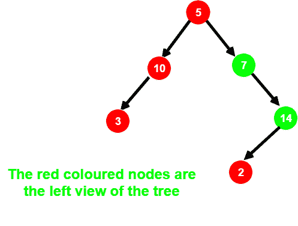

# 打印二叉树左视图的迭代方法

> 原文:[https://www . geeksforgeeks . org/迭代方法打印-二叉树左视图/](https://www.geeksforgeeks.org/iterative-method-to-print-left-view-of-a-binary-tree/)

给定一个二叉树，打印它的左视图。二叉树的左视图是从左侧看树时可见的一组节点。



**例:**

```
Input :        1
             /   \
            2     3
           / \   / \
          4   5 6   7
Output : 1 2 4

Input :         1
              /   \
             2     3
              \   /
               4 5
                  \
                   6
                  / \
                 7   8
Output : 1 2 4 6 7
```

我们已经使用[递归方法](https://www.geeksforgeeks.org/print-left-view-binary-tree/)讨论了这个问题，这里使用迭代方法来解决上述问题。
想法是使用一个队列对树进行级别顺序遍历，并在每个级别打印第一个节点。
在进行层级顺序遍历时，遍历完每一层级的所有节点后，推送一个空分隔符来标记当前层级的结束。所以，进行树的层次顺序遍历。打印树中每一级的第一个节点，并推送队列中每一级的所有节点的子节点，直到遇到空分隔符。
以下是上述方法的实施:

## C++

```
// C++ program to print the
// left view of Binary Tree

#include <bits/stdc++.h>

using namespace std;

// A Binary Tree Node
struct node {
    int data;
    struct node *left, *right;
};

// A utility function to create a new
// Binary Tree node
struct node* newNode(int item)
{
    struct node* temp = new node;
    temp->data = item;
    temp->left = NULL;
    temp->right = NULL;
    return temp;
}

// Utility function to print the left view of
// the binary tree
void leftViewUtil(struct node* root, queue<node*>& q)
{
    if (root == NULL)
        return;

    // Push root
    q.push(root);

    // Delimiter
    q.push(NULL);

    while (!q.empty()) {
        node* temp = q.front();

        if (temp) {

            // Prints first node
            // of each level
            cout << temp->data << " ";

            // Push children of all nodes at
            // current level
            while (q.front() != NULL) {

                // If left child is present
                // push into queue
                if (temp->left)
                    q.push(temp->left);

                // If right child is present
                // push into queue
                if (temp->right)
                    q.push(temp->right);

                // Pop the current node
                q.pop();

                temp = q.front();
            }

            // Push delimiter
            // for the next level
            q.push(NULL);
        }

        // Pop the delimiter of
        // the previous level
        q.pop();
    }
}

// Function to print the leftView
// of Binary Tree
void leftView(struct node* root)
{
    // Queue to store all
    // the nodes of the tree
    queue<node*> q;

    leftViewUtil(root, q);
}

// Driver Code
int main()
{
    struct node* root = newNode(10);
    root->left = newNode(12);
    root->right = newNode(3);
    root->left->right = newNode(4);
    root->right->left = newNode(5);
    root->right->left->right = newNode(6);
    root->right->left->right->left = newNode(18);
    root->right->left->right->right = newNode(7);

    leftView(root);

    return 0;
}
```

## Java 语言(一种计算机语言，尤用于创建网站)

```
// Java program to print the
// left view of Binary Tree
import java.util.*;

class GFG
{

// A Binary Tree Node
static class node
{
    int data;
    node left, right;
};

// A utility function to create a new
// Binary Tree node
static node newNode(int item)
{
    node temp = new node();
    temp.data = item;
    temp.left = null;
    temp.right = null;
    return temp;
}
static Queue<node> q;

// Utility function to print the left view of
// the binary tree
static void leftViewUtil( node root )
{
    if (root == null)
        return;

    // add root
    q.add(root);

    // Delimiter
    q.add(null);

    while (q.size() > 0)
    {
        node temp = q.peek();

        if (temp != null)
        {

            // Prints first node
            // of each level
            System.out.print(temp.data + " ");

            // add children of all nodes at
            // current level
            while (q.peek() != null)
            {

                // If left child is present
                // add into queue
                if (temp.left != null)
                    q.add(temp.left);

                // If right child is present
                // add into queue
                if (temp.right != null)
                    q.add(temp.right);

                // remove the current node
                q.remove();

                temp = q.peek();
            }

            // add delimiter
            // for the next level
            q.add(null);
        }

        // remove the delimiter of
        // the previous level
        q.remove();
    }
}

// Function to print the leftView
// of Binary Tree
static void leftView( node root)
{
    // Queue to store all
    // the nodes of the tree
    q = new LinkedList<node>();

    leftViewUtil(root);
}

// Driver Code
public static void main(String args[])
{
    node root = newNode(10);
    root.left = newNode(12);
    root.right = newNode(3);
    root.left.right = newNode(4);
    root.right.left = newNode(5);
    root.right.left.right = newNode(6);
    root.right.left.right.left = newNode(18);
    root.right.left.right.right = newNode(7);

    leftView(root);
}
}

// This code is contributed by Arnab Kundu
```

## 蟒蛇 3

```
# Python3 program to print the
# left view of Binary Tree

# Binary Tree Node
""" utility that allocates a newNode
with the given key """
class newNode:

    # Construct to create a newNode
    def __init__(self, key):
        self.data = key
        self.left = None
        self.right = None
        self.hd=0

# Utility function to print the left
# view of the binary tree
def leftViewUtil(root, q) :

    if (root == None) :
        return

    # append root
    q.append(root)

    # Delimiter
    q.append(None)

    while (len(q)):
        temp = q[0]

        if (temp):

            # Prints first node of each level
            print(temp.data, end = " ")

            # append children of all nodes
            # at current level
            while (q[0] != None) :
                temp = q[0]

                # If left child is present
                # append into queue
                if (temp.left) :
                    q.append(temp.left)

                # If right child is present
                # append into queue
                if (temp.right) :
                    q.append(temp.right)

                # Pop the current node
                q.pop(0)

            # append delimiter
            # for the next level
            q.append(None)

        # Pop the delimiter of
        # the previous level
        q.pop(0)

# Function to print the leftView
# of Binary Tree
def leftView(root):

    # Queue to store all
    # the nodes of the tree
    q = []

    leftViewUtil(root, q)

# Driver Code
if __name__ == '__main__':

    root = newNode(10)
    root.left = newNode(12)
    root.right = newNode(3)
    root.left.right = newNode(4)
    root.right.left = newNode(5)
    root.right.left.right = newNode(6)
    root.right.left.right.left = newNode(18)
    root.right.left.right.right = newNode(7)
    leftView(root)

# This code is contributed by
# Shubham Singh(SHUBHAMSINGH10)
```

## C#

```
// C# program to print the
// left view of Binary Tree
using System;
using System.Collections.Generic;

class GFG
{

// A Binary Tree Node
public class node
{
    public int data;
    public node left, right;
};

// A utility function to create a new
// Binary Tree node
static node newNode(int item)
{
    node temp = new node();
    temp.data = item;
    temp.left = null;
    temp.right = null;
    return temp;
}
static Queue<node> q = new Queue<node>();

// Utility function to print the left view of
// the binary tree
static void leftViewUtil( node root )
{
    if (root == null)
        return;

    // add root
    q.Enqueue(root);

    // Delimiter
    q.Enqueue(null);

    while (q.Count > 0)
    {
        node temp = q.Peek();

        if (temp != null)
        {

            // Prints first node
            // of each level
            Console.Write(temp.data + " ");

            // add children of all nodes at
            // current level
            while (q.Peek() != null)
            {

                // If left child is present
                // add into queue
                if (temp.left != null)
                    q.Enqueue(temp.left);

                // If right child is present
                // add into queue
                if (temp.right != null)
                    q.Enqueue(temp.right);

                // remove the current node
                q.Dequeue();

                temp = q.Peek();
            }

            // add delimiter
            // for the next level
            q.Enqueue(null);
        }

        // remove the delimiter of
        // the previous level
        q.Dequeue();
    }
}

// Function to print the leftView
// of Binary Tree
static void leftView( node root)
{
    // Queue to store all
    // the nodes of the tree
    q = new Queue<node>();

    leftViewUtil(root);
}

// Driver Code
public static void Main(String []args)
{
    node root = newNode(10);
    root.left = newNode(12);
    root.right = newNode(3);
    root.left.right = newNode(4);
    root.right.left = newNode(5);
    root.right.left.right = newNode(6);
    root.right.left.right.left = newNode(18);
    root.right.left.right.right = newNode(7);

    leftView(root);
}
}

// This code is contributed by 29AjayKumar
```

## java 描述语言

```
<script>

    // JavaScript program to print the left view of Binary Tree

    // Binary Tree Node
    class node
    {
        constructor(item) {
           this.left = null;
           this.right = null;
           this.data = item;
        }
    }

    // A utility function to create a new
    // Binary Tree node
    function newNode(item)
    {
        let temp = new node(item);
        return temp;
    }
    let q = [];

    // Utility function to print the left view of
    // the binary tree
    function leftViewUtil(root)
    {
        if (root == null)
            return;

        // add root
        q.push(root);

        // Delimiter
        q.push(null);

        while (q.length > 0)
        {
            let temp = q[0];

            if (temp != null)
            {

                // Prints first node
                // of each level
                document.write(temp.data + " ");

                // add children of all nodes at
                // current level
                while (q[0] != null)
                {

                    // If left child is present
                    // add into queue
                    if (temp.left != null)
                        q.push(temp.left);

                    // If right child is present
                    // add into queue
                    if (temp.right != null)
                        q.push(temp.right);

                    // remove the current node
                    q.shift();

                    temp = q[0];
                }

                // add delimiter
                // for the next level
                q.push(null);
            }

            // remove the delimiter of
            // the previous level
            q.shift();
        }
    }

    // Function to print the leftView
    // of Binary Tree
    function leftView(root)
    {
        // Queue to store all
        // the nodes of the tree
        q = [];

        leftViewUtil(root);
    }

    let root = newNode(10);
    root.left = newNode(12);
    root.right = newNode(3);
    root.left.right = newNode(4);
    root.right.left = newNode(5);
    root.right.left.right = newNode(6);
    root.right.left.right.left = newNode(18);
    root.right.left.right.right = newNode(7);

    leftView(root);

</script>
```

**输出**:

```
10 12 4 6 18
```

**时间复杂度** : O(N)，其中 N 为二叉树中的顶点数。
**辅助空间** : O(N)。