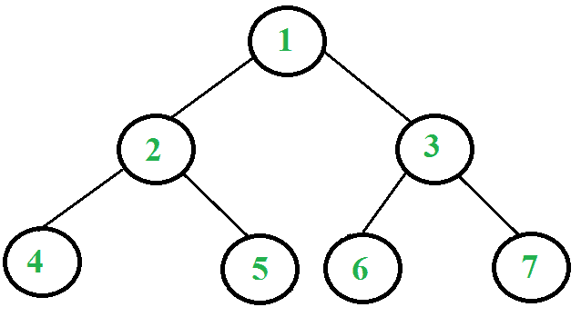

# 迭代后序遍历|集合 1(使用两个栈)

> 原文:[https://www . geesforgeks . org/iterative-post-order-traversation/](https://www.geeksforgeeks.org/iterative-postorder-traversal/)

我们已经讨论了[迭代顺序](https://www.geeksforgeeks.org/inorder-tree-traversal-without-recursion/)和[迭代预顺序](https://www.geeksforgeeks.org/iterative-preorder-traversal/)遍历。在这篇文章中，讨论了迭代的后序遍历，它比其他两个遍历更复杂(由于其非[尾递归](http://en.wikipedia.org/wiki/Tail_call)的性质，在对自身的最终递归调用之后有一个额外的语句)。不过，使用两个堆栈可以轻松完成后置遍历。其思想是将反向后置遍历推送到堆栈。一旦我们在堆栈中有了反向的后序遍历，我们就可以从堆栈中一个接一个地弹出所有项目并打印它们；由于堆栈的后进先出属性，这种打印顺序将处于后序。现在的问题是，如何在堆栈中获得逆序的后置元素——第二个堆栈就是用于这个目的的。例如，在下面的树中，我们需要在堆栈中获得 1、3、7、6、2、5、4。如果仔细观察这个序列，我们可以观察到这个序列非常类似于前序遍历。唯一不同的是，右子在左子之前被访问，因此顺序是“根右左”而不是“根左右”。因此，我们可以做一些类似[的迭代前序遍历](https://www.geeksforgeeks.org/iterative-preorder-traversal/)的事情，区别如下:
a)我们不是打印一个项目，而是将其推送到堆栈中。
b)我们把左子树推到右子树之前。
以下是完整的算法。在步骤 2 之后，我们在第二个堆栈中得到一个后置遍历的反向。我们使用第一个堆栈来获得正确的顺序。

```
1\. Push root to first stack.
2\. Loop while first stack is not empty
   2.1 Pop a node from first stack and push it to second stack
   2.2 Push left and right children of the popped node to first stack
3\. Print contents of second stack
```

让我们考虑下面的树



下面是使用两个堆栈打印上述树的后置遍历的步骤。

```
1\. Push 1 to first stack.
      First stack: 1
      Second stack: Empty

2\. Pop 1 from first stack and push it to second stack. 
   Push left and right children of 1 to first stack
      First stack: 2, 3
      Second stack: 1

3\. Pop 3 from first stack and push it to second stack. 
   Push left and right children of 3 to first stack
      First stack: 2, 6, 7
      Second stack: 1, 3

4\. Pop 7 from first stack and push it to second stack.
      First stack: 2, 6
      Second stack: 1, 3, 7

5\. Pop 6 from first stack and push it to second stack.
      First stack: 2
      Second stack: 1, 3, 7, 6

6\. Pop 2 from first stack and push it to second stack. 
   Push left and right children of 2 to first stack
      First stack: 4, 5
      Second stack: 1, 3, 7, 6, 2

7\. Pop 5 from first stack and push it to second stack.
      First stack: 4
      Second stack: 1, 3, 7, 6, 2, 5

8\. Pop 4 from first stack and push it to second stack.
      First stack: Empty
      Second stack: 1, 3, 7, 6, 2, 5, 4

The algorithm stops here since there are no more items in the first stack. 
Observe that the contents of second stack are in postorder fashion. Print them. 
```

下面是使用两个堆栈实现迭代后序遍历。

## C++

```
#include <bits/stdc++.h>
using namespace std;

// A tree node
struct Node {

    int data;
    Node *left, *right;
};

// Function to create a new node with the given data
Node* newNode(int data)
{
    Node* node = new Node;
    node->data = data;
    node->left = node->right = NULL;
    return node;
}
// An iterative function to do post order
// traversal of a given binary tree
void postOrderIterative(Node* root)
{
    if (root == NULL)
        return;

    // Create two stacks
    stack<Node *> s1, s2;

    // push root to first stack
    s1.push(root);
    Node* node;

    // Run while first stack is not empty
    while (!s1.empty()) {
        // Pop an item from s1 and push it to s2
        node = s1.top();
        s1.pop();
        s2.push(node);

        // Push left and right children
        // of removed item to s1
        if (node->left)
            s1.push(node->left);
        if (node->right)
            s1.push(node->right);
    }

    // Print all elements of second stack
    while (!s2.empty()) {
        node = s2.top();
        s2.pop();
        cout << node->data << " ";
    }
}

// Driver code
int main()
{
    // Let us construct the tree
    // shown in above figure
    Node* root = NULL;
    root = newNode(1);
    root->left = newNode(2);
    root->right = newNode(3);
    root->left->left = newNode(4);
    root->left->right = newNode(5);
    root->right->left = newNode(6);
    root->right->right = newNode(7);

    postOrderIterative(root);

    return 0;
}
```

## C

```
#include <stdio.h>
#include <stdlib.h>

// Maximum stack size
#define MAX_SIZE 100

// A tree node
struct Node {
    int data;
    struct Node *left, *right;
};

// Stack type
struct Stack {
    int size;
    int top;
    struct Node** array;
};

// A utility function to create a new tree node
struct Node* newNode(int data)
{
    struct Node* node = (struct Node*)malloc(sizeof(struct Node));
    node->data = data;
    node->left = node->right = NULL;
    return node;
}

// A utility function to create a stack of given size
struct Stack* createStack(int size)
{
    struct Stack* stack = (struct Stack*)malloc(sizeof(struct Stack));
    stack->size = size;
    stack->top = -1;
    stack->array = (struct Node**)malloc(stack->size * sizeof(struct Node*));
    return stack;
}

// BASIC OPERATIONS OF STACK
int isFull(struct Stack* stack)
{
    return stack->top - 1 == stack->size;
}

int isEmpty(struct Stack* stack)
{
    return stack->top == -1;
}

void push(struct Stack* stack, struct Node* node)
{
    if (isFull(stack))
        return;
    stack->array[++stack->top] = node;
}

struct Node* pop(struct Stack* stack)
{
    if (isEmpty(stack))
        return NULL;
    return stack->array[stack->top--];
}

// An iterative function to do post order traversal of a given binary tree
void postOrderIterative(struct Node* root)
{
    if (root == NULL)
        return;

    // Create two stacks
    struct Stack* s1 = createStack(MAX_SIZE);
    struct Stack* s2 = createStack(MAX_SIZE);

    // push root to first stack
    push(s1, root);
    struct Node* node;

    // Run while first stack is not empty
    while (!isEmpty(s1)) {
        // Pop an item from s1 and push it to s2
        node = pop(s1);
        push(s2, node);

        // Push left and right children of removed item to s1
        if (node->left)
            push(s1, node->left);
        if (node->right)
            push(s1, node->right);
    }

    // Print all elements of second stack
    while (!isEmpty(s2)) {
        node = pop(s2);
        printf("%d ", node->data);
    }
}

// Driver program to test above functions
int main()
{
    // Let us construct the tree shown in above figure
    struct Node* root = NULL;
    root = newNode(1);
    root->left = newNode(2);
    root->right = newNode(3);
    root->left->left = newNode(4);
    root->left->right = newNode(5);
    root->right->left = newNode(6);
    root->right->right = newNode(7);

    postOrderIterative(root);

    return 0;
}
```

## Java 语言(一种计算机语言，尤用于创建网站)

```
// Java program for iterative post
// order using two stacks

import java.util.*;
public class IterativePostorder {

    static class node {
        int data;
        node left, right;

        public node(int data)
        {
            this.data = data;
        }
    }

    // Two stacks as used in explanation
    static Stack<node> s1, s2;

    static void postOrderIterative(node root)
    {
        // Create two stacks
        s1 = new Stack<>();
        s2 = new Stack<>();

        if (root == null)
            return;

        // push root to first stack
        s1.push(root);

        // Run while first stack is not empty
        while (!s1.isEmpty()) {
            // Pop an item from s1 and push it to s2
            node temp = s1.pop();
            s2.push(temp);

            // Push left and right children of
            // removed item to s1
            if (temp.left != null)
                s1.push(temp.left);
            if (temp.right != null)
                s1.push(temp.right);
        }

        // Print all elements of second stack
        while (!s2.isEmpty()) {
            node temp = s2.pop();
            System.out.print(temp.data + " ");
        }
    }

    public static void main(String[] args)
    {
        // Let us construct the tree
        // shown in above figure

        node root = null;
        root = new node(1);
        root.left = new node(2);
        root.right = new node(3);
        root.left.left = new node(4);
        root.left.right = new node(5);
        root.right.left = new node(6);
        root.right.right = new node(7);

        postOrderIterative(root);
    }
}

// This code is contributed by Rishabh Mahrsee
```

## 计算机编程语言

```
# Python program for iterative postorder
# traversal using two stacks

# A binary tree node
class Node:

    # Constructor to create a new node
    def __init__(self, data):
        self.data = data
        self.left = None
        self.right = None

# An iterative function to do postorder
# traversal of a given binary tree
def postOrderIterative(root):

    if root is None:
        return       

    # Create two stacks
    s1 = []
    s2 = []

    # Push root to first stack
    s1.append(root)

    # Run while first stack is not empty
    while s1:

        # Pop an item from s1 and
        # append it to s2
        node = s1.pop()
        s2.append(node)

        # Push left and right children of
        # removed item to s1
        if node.left:
            s1.append(node.left)
        if node.right:
            s1.append(node.right)

        # Print all elements of second stack
    while s2:
        node = s2.pop()
        print node.data,

# Driver program to test above function
root = Node(1)
root.left = Node(2)
root.right = Node(3)
root.left.left = Node(4)
root.left.right = Node(5)
root.right.left = Node(6)
root.right.right = Node(7)
postOrderIterative(root)
```

## C#

```
// C# program for iterative post
// order using two stacks
using System;
using System.Collections;
public class IterativePostorder {

    public class node {
        public int data;
        public node left, right;

        public node(int data)
        {
            this.data = data;
        }
    }

    // Two stacks as used in explanation
    static public Stack s1, s2;

    static void postOrderIterative(node root)
    {
        // Create two stacks
        s1 = new Stack();
        s2 = new Stack();

        if (root == null)
            return;

        // Push root to first stack
        s1.Push(root);

        // Run while first stack is not empty
        while (s1.Count > 0) {
            // Pop an item from s1 and Push it to s2
            node temp = (node)s1.Pop();
            s2.Push(temp);

            // Push left and right children of
            // removed item to s1
            if (temp.left != null)
                s1.Push(temp.left);
            if (temp.right != null)
                s1.Push(temp.right);
        }

        // Print all elements of second stack
        while (s2.Count > 0) {
            node temp = (node)s2.Pop();
            Console.Write(temp.data + " ");
        }
    }

    public static void Main(String[] args)
    {
        // Let us construct the tree
        // shown in above figure

        node root = null;
        root = new node(1);
        root.left = new node(2);
        root.right = new node(3);
        root.left.left = new node(4);
        root.left.right = new node(5);
        root.right.left = new node(6);
        root.right.right = new node(7);

        postOrderIterative(root);
    }
}

// This code is contributed by Arnab Kundu
```

## java 描述语言

```
<script>

      // JavaScript program for iterative post
      // order using two stacks
      class node {
        constructor(data) {
          this.data = data;
          this.left = null;
          this.right = null;
        }
      }

      function postOrderIterative(root) {
        // Two stacks as used in explanation
        // Create two stacks
        var s1 = [];
        var s2 = [];

        if (root == null) return;

        // Push root to first stack
        s1.push(root);

        // Run while first stack is not empty
        while (s1.length > 0) {
          // Pop an item from s1 and Push it to s2
          var temp = s1.pop();
          s2.push(temp);

          // Push left and right children of
          // removed item to s1
          if (temp.left != null) s1.push(temp.left);
          if (temp.right != null) s1.push(temp.right);
        }

        // Print all elements of second stack
        while (s2.length > 0) {
          var temp = s2.pop();
          document.write(temp.data + " ");
        }
      }

      // Let us construct the tree
      // shown in above figure

      var root = null;
      root = new node(1);
      root.left = new node(2);
      root.right = new node(3);
      root.left.left = new node(4);
      root.left.right = new node(5);
      root.right.left = new node(6);
      root.right.right = new node(7);

      postOrderIterative(root);

</script>
```

**输出:**

```
4 5 2 6 7 3 1
```

以下是上述帖子的概述。
使用两个栈可以很容易地实现迭代的前序遍历。第一个堆栈用于获得反向的后置遍历。获得反向后序的步骤类似于[迭代前序](https://www.geeksforgeeks.org/iterative-preorder-traversal/)。
你可能也想看看[一个只用一叠](https://www.geeksforgeeks.org/iterative-postorder-traversal-using-stack/)的方法。
本文由[阿诗·巴纳瓦尔](https://www.facebook.com/barnwal.aashish?fref=ts)整理。如果您发现任何不正确的地方，请写评论，或者您想分享更多关于上面讨论的主题的信息