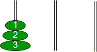
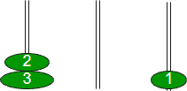
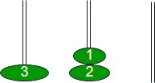
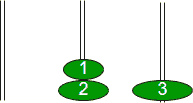
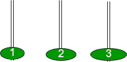
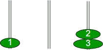
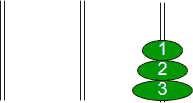

# 河内迭代塔

> 原文:[https://www.geeksforgeeks.org/iterative-tower-of-hanoi/](https://www.geeksforgeeks.org/iterative-tower-of-hanoi/)

河内塔是一个数学难题。它由三个磁极和许多不同大小的圆盘组成，这些圆盘可以滑动到任何磁极上。这个谜题从圆盘开始，在一个磁极中按照大小的升序排列，最小的在顶部，从而形成一个圆锥形。这个谜题的目的是在第三个极点(比如辅助极点)的帮助下，把所有的圆盘从一个极点(比如说“源极点”)移动到另一个极点(比如说“目的极点”)。

拼图有以下两个规则:
1。您不能将较大的磁盘放在较小的磁盘上
2。一次只能移动一个磁盘

我们已经讨论了河内塔的递归解决方案。我们还看到，对于 n 个磁盘，总共需要 2 次 <sup>n 次</sup>–1 次移动。

**迭代算法:**

```
1\. Calculate the total number of moves required i.e. "pow(2, n)
   - 1" here n is number of disks.
2\. If number of disks (i.e. n) is even then interchange destination 
   pole and auxiliary pole.
3\. for i = 1 to total number of moves:
     if i%3 == 1:
    legal movement of top disk between source pole and 
        destination pole
     if i%3 == 2:
    legal movement top disk between source pole and 
        auxiliary pole    
     if i%3 == 0:
        legal movement top disk between auxiliary pole 
        and destination pole 
```

**示例:**

```
Let us understand with a simple example with 3 disks:
So, total number of moves required = 7
```



```
 S                      A                   D

When i= 1, (i % 3 == 1) legal movement between‘S’ and ‘D’ 
```



```
When i = 2,  (i % 3 == 2) legal movement between ‘S’ and ‘A’ 
```


```
When i = 3, (i % 3 == 0) legal movement between ‘A’ and ‘D’ ’
```



```
When i = 4, (i % 3 == 1) legal movement between ‘S’ and ‘D’ 
```



```
When i = 5, (i % 3 == 2) legal movement between ‘S’ and ‘A’
```



```
When i = 6, (i % 3 == 0) legal movement between ‘A’ and ‘D’ 
```



```
When i = 7, (i % 3 == 1) legal movement between ‘S’ and ‘D’ 
```



所以，毕竟这些目的地极点包含了所有的大小顺序。
观察上述迭代后，我们可以认为，移动除最小盘以外的一个盘后，下一个要移动的盘一定是最小的盘，因为它是顶在备用极上的顶盘，没有其他选择来移动一个盘。

## C++

```
// C++ Program for Iterative Tower of Hanoi
#include <iostream>
#include <bits/stdc++.h>
using namespace std;

// A structure to represent a stack
struct Stack
{
unsigned capacity;
int top;
int *array;
};

// function to create a stack of given capacity.
struct Stack* createStack(unsigned capacity)
{
    struct Stack* stack =
        (struct Stack*) malloc(sizeof(struct Stack));
    stack -> capacity = capacity;
    stack -> top = -1;
    stack -> array =
        (int*) malloc(stack -> capacity * sizeof(int));
    return stack;
}

// Stack is full when top is equal to the last index
int isFull(struct Stack* stack)
{
return (stack->top == stack->capacity - 1);
}

// Stack is empty when top is equal to -1
int isEmpty(struct Stack* stack)
{
return (stack->top == -1);
}

// Function to add an item to stack. It increases
// top by 1
void push(struct Stack *stack, int item)
{
    if (isFull(stack))
        return;
    stack -> array[++stack -> top] = item;
}

// Function to remove an item from stack. It
// decreases top by 1
int pop(struct Stack* stack)
{
    if (isEmpty(stack))
        return INT_MIN;
    return stack -> array[stack -> top--];
}

//Function to show the movement of disks
void moveDisk(char fromPeg, char toPeg, int disk)
{
    cout <<"Move the disk " << disk <<" from " << fromPeg << " to "<< toPeg << endl;
}

// Function to implement legal movement between
// two poles
void moveDisksBetweenTwoPoles(struct Stack *src,
            struct Stack *dest, char s, char d)
{
    int pole1TopDisk = pop(src);
    int pole2TopDisk = pop(dest);

    // When pole 1 is empty
    if (pole1TopDisk == INT_MIN)
    {
        push(src, pole2TopDisk);
        moveDisk(d, s, pole2TopDisk);
    }

    // When pole2 pole is empty
    else if (pole2TopDisk == INT_MIN)
    {
        push(dest, pole1TopDisk);
        moveDisk(s, d, pole1TopDisk);
    }

    // When top disk of pole1 > top disk of pole2
    else if (pole1TopDisk > pole2TopDisk)
    {
        push(src, pole1TopDisk);
        push(src, pole2TopDisk);
        moveDisk(d, s, pole2TopDisk);
    }

    // When top disk of pole1 < top disk of pole2
    else
    {
        push(dest, pole2TopDisk);
        push(dest, pole1TopDisk);
        moveDisk(s, d, pole1TopDisk);
    }
}

//Function to implement TOH puzzle
void tohIterative(int num_of_disks, struct Stack
            *src, struct Stack *aux,
            struct Stack *dest)
{
    int i, total_num_of_moves;
    char s = 'S', d = 'D', a = 'A';

    //If number of disks is even, then interchange
    //destination pole and auxiliary pole
    if (num_of_disks % 2 == 0)
    {
        char temp = d;
        d = a;
        a = temp;
    }
    total_num_of_moves = pow(2, num_of_disks) - 1;

    //Larger disks will be pushed first
    for (i = num_of_disks; i >= 1; i--)
        push(src, i);

    for (i = 1; i <= total_num_of_moves; i++)
    {
        if (i % 3 == 1)
        moveDisksBetweenTwoPoles(src, dest, s, d);

        else if (i % 3 == 2)
        moveDisksBetweenTwoPoles(src, aux, s, a);

        else if (i % 3 == 0)
        moveDisksBetweenTwoPoles(aux, dest, a, d);
    }
}

// Driver Program
int main()
{

    // Input: number of disks
    unsigned num_of_disks = 3;

    struct Stack *src, *dest, *aux;

    // Create three stacks of size 'num_of_disks'
    // to hold the disks
    src = createStack(num_of_disks);
    aux = createStack(num_of_disks);
    dest = createStack(num_of_disks);

    tohIterative(num_of_disks, src, aux, dest);
    return 0;
}

// This code is contributed by shivanisinghss2110
```

## C

```
// C Program for Iterative Tower of Hanoi
#include <stdio.h>
#include <math.h>
#include <stdlib.h>
#include <limits.h>

// A structure to represent a stack
struct Stack
{
unsigned capacity;
int top;
int *array;
};

// function to create a stack of given capacity.
struct Stack* createStack(unsigned capacity)
{
    struct Stack* stack =
        (struct Stack*) malloc(sizeof(struct Stack));
    stack -> capacity = capacity;
    stack -> top = -1;
    stack -> array =
        (int*) malloc(stack -> capacity * sizeof(int));
    return stack;
}

// Stack is full when top is equal to the last index
int isFull(struct Stack* stack)
{
return (stack->top == stack->capacity - 1);
}

// Stack is empty when top is equal to -1
int isEmpty(struct Stack* stack)
{
return (stack->top == -1);
}

// Function to add an item to stack. It increases
// top by 1
void push(struct Stack *stack, int item)
{
    if (isFull(stack))
        return;
    stack -> array[++stack -> top] = item;
}

// Function to remove an item from stack. It
// decreases top by 1
int pop(struct Stack* stack)
{
    if (isEmpty(stack))
        return INT_MIN;
    return stack -> array[stack -> top--];
}

//Function to show the movement of disks
void moveDisk(char fromPeg, char toPeg, int disk)
{
    printf("Move the disk %d from \'%c\' to \'%c\'\n",
        disk, fromPeg, toPeg);
}

// Function to implement legal movement between
// two poles
void moveDisksBetweenTwoPoles(struct Stack *src,
            struct Stack *dest, char s, char d)
{
    int pole1TopDisk = pop(src);
    int pole2TopDisk = pop(dest);

    // When pole 1 is empty
    if (pole1TopDisk == INT_MIN)
    {
        push(src, pole2TopDisk);
        moveDisk(d, s, pole2TopDisk);
    }

    // When pole2 pole is empty
    else if (pole2TopDisk == INT_MIN)
    {
        push(dest, pole1TopDisk);
        moveDisk(s, d, pole1TopDisk);
    }

    // When top disk of pole1 > top disk of pole2
    else if (pole1TopDisk > pole2TopDisk)
    {
        push(src, pole1TopDisk);
        push(src, pole2TopDisk);
        moveDisk(d, s, pole2TopDisk);
    }

    // When top disk of pole1 < top disk of pole2
    else
    {
        push(dest, pole2TopDisk);
        push(dest, pole1TopDisk);
        moveDisk(s, d, pole1TopDisk);
    }
}

//Function to implement TOH puzzle
void tohIterative(int num_of_disks, struct Stack
            *src, struct Stack *aux,
            struct Stack *dest)
{
    int i, total_num_of_moves;
    char s = 'S', d = 'D', a = 'A';

    //If number of disks is even, then interchange
    //destination pole and auxiliary pole
    if (num_of_disks % 2 == 0)
    {
        char temp = d;
        d = a;
        a = temp;
    }
    total_num_of_moves = pow(2, num_of_disks) - 1;

    //Larger disks will be pushed first
    for (i = num_of_disks; i >= 1; i--)
        push(src, i);

    for (i = 1; i <= total_num_of_moves; i++)
    {
        if (i % 3 == 1)
        moveDisksBetweenTwoPoles(src, dest, s, d);

        else if (i % 3 == 2)
        moveDisksBetweenTwoPoles(src, aux, s, a);

        else if (i % 3 == 0)
        moveDisksBetweenTwoPoles(aux, dest, a, d);
    }
}

// Driver Program
int main()
{
    // Input: number of disks
    unsigned num_of_disks = 3;

    struct Stack *src, *dest, *aux;

    // Create three stacks of size 'num_of_disks'
    // to hold the disks
    src = createStack(num_of_disks);
    aux = createStack(num_of_disks);
    dest = createStack(num_of_disks);

    tohIterative(num_of_disks, src, aux, dest);
    return 0;
}
```

## Java 语言(一种计算机语言，尤用于创建网站)

```
// Java program for iterative
// Tower of Hanoi
class TOH{

// A structure to represent a stack
class Stack
{
    int capacity;
    int top;
    int array[];
}

// Function to create a stack of given capacity.
Stack createStack(int capacity)
{
    Stack stack = new Stack();
    stack.capacity = capacity;
    stack.top = -1;
    stack.array = new int[capacity];
    return stack;
}

// Stack is full when the top is equal
// to the last index
boolean isFull(Stack stack)
{
    return (stack.top == stack.capacity - 1);
}

// Stack is empty when top is equal to -1
boolean isEmpty(Stack stack)
{
    return (stack.top == -1);
}

// Function to add an item to stack.It
// increases top by 1
void push(Stack stack, int item)
{
    if (isFull(stack))
        return;

    stack.array[++stack.top] = item;
}

// Function to remove an item from stack.It
// decreases top by 1
int pop(Stack stack)
{
    if (isEmpty(stack))
        return Integer.MIN_VALUE;

    return stack.array[stack.top--];
}

// Function to implement legal movement between
// two poles
void moveDisksBetweenTwoPoles(Stack src, Stack dest,
                              char s, char d)
{
    int pole1TopDisk = pop(src);
    int pole2TopDisk = pop(dest);

    // When pole 1 is empty
    if (pole1TopDisk == Integer.MIN_VALUE)
    {
        push(src, pole2TopDisk);
        moveDisk(d, s, pole2TopDisk);
    }

    // When pole2 pole is empty
    else if (pole2TopDisk == Integer.MIN_VALUE)
    {
        push(dest, pole1TopDisk);
        moveDisk(s, d, pole1TopDisk);
    }

    // When top disk of pole1 > top disk of pole2
    else if (pole1TopDisk > pole2TopDisk)
    {
        push(src, pole1TopDisk);
        push(src, pole2TopDisk);
        moveDisk(d, s, pole2TopDisk);
    }
    // When top disk of pole1 < top disk of pole2
    else
    {
        push(dest, pole2TopDisk);
        push(dest, pole1TopDisk);
        moveDisk(s, d, pole1TopDisk);
    }
}

// Function to show the movement of disks
void moveDisk(char fromPeg, char toPeg, int disk)
{
    System.out.println("Move the disk " + disk +
                            " from " + fromPeg +
                              " to " + toPeg);
}

// Function to implement TOH puzzle
void tohIterative(int num_of_disks, Stack
                  src, Stack aux, Stack dest)
{
    int i, total_num_of_moves;
    char s = 'S', d = 'D', a = 'A';

    // If number of disks is even, then
    // interchange destination pole and
    // auxiliary pole
    if (num_of_disks % 2 == 0)
    {
        char temp = d;
        d = a;
        a  = temp;
    }
    total_num_of_moves = (int)(Math.pow(
                         2, num_of_disks) - 1);

    // Larger disks will be pushed first
    for(i = num_of_disks; i >= 1; i--)
        push(src, i);

    for(i = 1; i <= total_num_of_moves; i++)
    {
        if (i % 3 == 1)
          moveDisksBetweenTwoPoles(src, dest, s, d);

        else if (i % 3 == 2)
          moveDisksBetweenTwoPoles(src, aux, s, a);

        else if (i % 3 == 0)
          moveDisksBetweenTwoPoles(aux, dest, a, d);
    }
}

// Driver code
public static void main(String[] args)
{

    // Input: number of disks
    int num_of_disks = 3;

    TOH ob = new TOH();
    Stack src, dest, aux;

    // Create three stacks of size 'num_of_disks'
    // to hold the disks
    src = ob.createStack(num_of_disks);
    dest = ob.createStack(num_of_disks);
    aux = ob.createStack(num_of_disks);

    ob.tohIterative(num_of_disks, src, aux, dest);
}
}

// This code is contributed by Sumit Ghosh
```

## 蟒蛇 3

```
# Python3 program for iterative Tower of Hanoi
import sys

# A structure to represent a stack
class Stack:
    # Constructor to set the data of
    # the newly created tree node
    def __init__(self, capacity):
        self.capacity = capacity
        self.top = -1
        self.array = [0]*capacity

# function to create a stack of given capacity.
def createStack(capacity):
    stack = Stack(capacity)
    return stack

# Stack is full when top is equal to the last index
def isFull(stack):
    return (stack.top == (stack.capacity - 1))

# Stack is empty when top is equal to -1
def isEmpty(stack):
    return (stack.top == -1)

# Function to add an item to stack.
# It increases top by 1
def push(stack, item):
    if(isFull(stack)):
        return
    stack.top+=1
    stack.array[stack.top] = item

# Function to remove an item from stack.
# It decreases top by 1
def Pop(stack):
    if(isEmpty(stack)):
        return -sys.maxsize
    Top = stack.top
    stack.top-=1
    return stack.array[Top]

# Function to implement legal
# movement between two poles
def moveDisksBetweenTwoPoles(src, dest, s, d):
    pole1TopDisk = Pop(src)
    pole2TopDisk = Pop(dest)

    # When pole 1 is empty
    if (pole1TopDisk == -sys.maxsize):
        push(src, pole2TopDisk)
        moveDisk(d, s, pole2TopDisk)

    # When pole2 pole is empty
    elif (pole2TopDisk == -sys.maxsize):
        push(dest, pole1TopDisk)
        moveDisk(s, d, pole1TopDisk)

    # When top disk of pole1 > top disk of pole2
    elif (pole1TopDisk > pole2TopDisk):
        push(src, pole1TopDisk)
        push(src, pole2TopDisk)
        moveDisk(d, s, pole2TopDisk)

    # When top disk of pole1 < top disk of pole2
    else:
        push(dest, pole2TopDisk)
        push(dest, pole1TopDisk)
        moveDisk(s, d, pole1TopDisk)

# Function to show the movement of disks
def moveDisk(fromPeg, toPeg, disk):
    print("Move the disk", disk, "from '", fromPeg, "' to '", toPeg, "'")

# Function to implement TOH puzzle
def tohIterative(num_of_disks, src, aux, dest):
    s, d, a = 'S', 'D', 'A'

    # If number of disks is even, then interchange
    # destination pole and auxiliary pole
    if (num_of_disks % 2 == 0):
        temp = d
        d = a
        a = temp
    total_num_of_moves = int(pow(2, num_of_disks) - 1)

    # Larger disks will be pushed first
    for i in range(num_of_disks, 0, -1):
        push(src, i)

    for i in range(1, total_num_of_moves + 1):
        if (i % 3 == 1):
            moveDisksBetweenTwoPoles(src, dest, s, d)

        elif (i % 3 == 2):
            moveDisksBetweenTwoPoles(src, aux, s, a)

        elif (i % 3 == 0):
            moveDisksBetweenTwoPoles(aux, dest, a, d)

# Input: number of disks
num_of_disks = 3

# Create three stacks of size 'num_of_disks'
# to hold the disks
src = createStack(num_of_disks)
dest = createStack(num_of_disks)
aux = createStack(num_of_disks)

tohIterative(num_of_disks, src, aux, dest)

# This code is contributed by divyeshrabadiya07.
```

## C#

```
// C# program for iterative
// Tower of Hanoi
using System;

class GFG
{
    // A structure to represent a stack
    public class Stack
    {
        public int capacity;
        public int top;
        public int []array;
    }

    // function to create a stack of given capacity.
    Stack createStack(int capacity)
    {
        Stack stack = new Stack();
        stack.capacity = capacity;
        stack.top = -1;
        stack.array = new int[capacity];
        return stack;
    }

    // Stack is full when top is equal to the last index
    Boolean isFull(Stack stack)
    {
        return (stack.top == stack.capacity - 1);
    }

    // Stack is empty when top is equal to -1
    Boolean isEmpty(Stack stack)
    {
        return (stack.top == -1);
    }

    // Function to add an item to stack.
    // It increases top by 1
    void push(Stack stack,int item)
    {
        if(isFull(stack))
            return;
        stack.array[++stack.top] = item;
    }

    // Function to remove an item from stack. 
    // It decreases top by 1
    int pop(Stack stack)
    {
        if(isEmpty(stack))
            return int.MinValue;
        return stack.array[stack.top--];
    }

    // Function to implement legal 
    // movement between two poles
    void moveDisksBetweenTwoPoles(Stack src, Stack dest,
                                            char s, char d)
    {
        int pole1TopDisk = pop(src);
        int pole2TopDisk = pop(dest);

        // When pole 1 is empty
        if (pole1TopDisk == int.MinValue)
        {
            push(src, pole2TopDisk);
            moveDisk(d, s, pole2TopDisk);
        }

        // When pole2 pole is empty
        else if (pole2TopDisk == int.MinValue)
        {
            push(dest, pole1TopDisk);
            moveDisk(s, d, pole1TopDisk);
        }

        // When top disk of pole1 > top disk of pole2
        else if (pole1TopDisk > pole2TopDisk)
        {
            push(src, pole1TopDisk);
            push(src, pole2TopDisk);
            moveDisk(d, s, pole2TopDisk);
        }

        // When top disk of pole1 < top disk of pole2
        else
        {
            push(dest, pole2TopDisk);
            push(dest, pole1TopDisk);
            moveDisk(s, d, pole1TopDisk);
        }
    }

    // Function to show the movement of disks
    void moveDisk(char fromPeg, char toPeg, int disk)
    {
        Console.WriteLine("Move the disk "+disk +
                        " from "+fromPeg+" to "+toPeg);
    }

    // Function to implement TOH puzzle
    void tohIterative(int num_of_disks, Stack
                src, Stack aux, Stack dest)
    {
        int i, total_num_of_moves;
        char s = 'S', d = 'D', a = 'A';

        // If number of disks is even, then interchange
        // destination pole and auxiliary pole
        if (num_of_disks % 2 == 0)
        {
            char temp = d;
            d = a;
            a = temp;
        }
        total_num_of_moves = (int) (Math.Pow(2, num_of_disks) - 1);

        // Larger disks will be pushed first
        for (i = num_of_disks; i >= 1; i--)
            push(src, i);

        for (i = 1; i <= total_num_of_moves; i++)
        {
            if (i % 3 == 1)
            moveDisksBetweenTwoPoles(src, dest, s, d);

            else if (i % 3 == 2)
            moveDisksBetweenTwoPoles(src, aux, s, a);

            else if (i % 3 == 0)
            moveDisksBetweenTwoPoles(aux, dest, a, d);
        }
    }

    // Driver code
    public static void Main(String []args)
    {

        // Input: number of disks
        int num_of_disks = 3;

        GFG ob = new GFG();
        Stack src, dest, aux;

        // Create three stacks of size 'num_of_disks'
        // to hold the disks
        src = ob.createStack(num_of_disks);
        dest = ob.createStack(num_of_disks);
        aux = ob.createStack(num_of_disks);

        ob.tohIterative(num_of_disks, src, aux, dest);
    }
}

// This code is Contributed by Arnab Kundu
```

## java 描述语言

```
<script>
    // Javascript program for iterative Tower of Hanoi

    // A structure to represent a stack
    class Stack
    {
        constructor(capacity) {
            this.capacity = capacity;
            this.top = -1;
            this.array = new Array(capacity);
        }
    }

    // function to create a stack of given capacity.
    function createStack(capacity)
    {
        let stack = new Stack(capacity);
        return stack;
    }

    // Stack is full when top is equal to the last index
    function isFull(stack)
    {
        return (stack.top == (stack.capacity - 1));
    }

    // Stack is empty when top is equal to -1
    function isEmpty(stack)
    {
        return (stack.top == -1);
    }

    // Function to add an item to stack.
    // It increases top by 1
    function push(stack, item)
    {
        if(isFull(stack))
            return;
        stack.array[++stack.top] = item;
    }

    // Function to remove an item from stack.
    // It decreases top by 1
    function pop(stack)
    {
        if(isEmpty(stack))
            return Number.MIN_VALUE;
        return stack.array[stack.top--];
    }

    // Function to implement legal
    // movement between two poles
    function moveDisksBetweenTwoPoles(src, dest, s, d)
    {
        let pole1TopDisk = pop(src);
        let pole2TopDisk = pop(dest);

        // When pole 1 is empty
        if (pole1TopDisk == Number.MIN_VALUE)
        {
            push(src, pole2TopDisk);
            moveDisk(d, s, pole2TopDisk);
        }

        // When pole2 pole is empty
        else if (pole2TopDisk == Number.MIN_VALUE)
        {
            push(dest, pole1TopDisk);
            moveDisk(s, d, pole1TopDisk);
        }

        // When top disk of pole1 > top disk of pole2
        else if (pole1TopDisk > pole2TopDisk)
        {
            push(src, pole1TopDisk);
            push(src, pole2TopDisk);
            moveDisk(d, s, pole2TopDisk);
        }

        // When top disk of pole1 < top disk of pole2
        else
        {
            push(dest, pole2TopDisk);
            push(dest, pole1TopDisk);
            moveDisk(s, d, pole1TopDisk);
        }
    }

    // Function to show the movement of disks
    function moveDisk(fromPeg, toPeg, disk)
    {
        document.write("Move the disk "+disk +
                        " from '"+fromPeg+"' to '"+toPeg + "'</br>");
    }

    // Function to implement TOH puzzle
    function tohIterative(num_of_disks, src, aux, dest)
    {
        let i, total_num_of_moves;
        let s = 'S', d = 'D', a = 'A';

        // If number of disks is even, then interchange
        // destination pole and auxiliary pole
        if (num_of_disks % 2 == 0)
        {
            let temp = d;
            d = a;
            a = temp;
        }
        total_num_of_moves = parseInt(Math.pow(2, num_of_disks) - 1, 10);

        // Larger disks will be pushed first
        for (i = num_of_disks; i >= 1; i--)
            push(src, i);

        for (i = 1; i <= total_num_of_moves; i++)
        {
            if (i % 3 == 1)
                moveDisksBetweenTwoPoles(src, dest, s, d);

            else if (i % 3 == 2)
                moveDisksBetweenTwoPoles(src, aux, s, a);

            else if (i % 3 == 0)
                moveDisksBetweenTwoPoles(aux, dest, a, d);
        }
    }

    // Input: number of disks
    let num_of_disks = 3;

    let src, dest, aux;

    // Create three stacks of size 'num_of_disks'
    // to hold the disks
    src = createStack(num_of_disks);
    dest = createStack(num_of_disks);
    aux = createStack(num_of_disks);

    tohIterative(num_of_disks, src, aux, dest);

    // This code is contributed by decode2207
</script>
```

**输出:**

```
Move the disk 1 from 'S' to 'D'
Move the disk 2 from 'S' to 'A'
Move the disk 1 from 'D' to 'A'
Move the disk 3 from 'S' to 'D'
Move the disk 1 from 'A' to 'S'
Move the disk 2 from 'A' to 'D'
Move the disk 1 from 'S' to 'D'
```

**相关文章**

*   [递归函数](https://www.geeksforgeeks.org/recursive-functions/)
*   [尾部递归](https://www.geeksforgeeks.org/tail-recursion/)
*   [递归测验](https://www.geeksforgeeks.org/algorithms-gq/recursion-gq/)

**参考文献:**
[http://en . Wikipedia . org/wiki/Tower _ of _ Hanoi # Iterative _ solution](http://en.wikipedia.org/wiki/Tower_of_Hanoi#Iterative_solution)

本文由 **Anand Barnwal** 供稿。如果你发现任何不正确的地方，请写评论，或者你想分享更多关于上面讨论的话题的信息