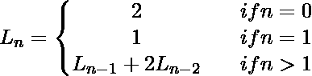

# 雅各布斯塔尔和雅各布斯塔尔-卢卡斯数

> 原文:[https://www . geesforgeks . org/Jacobs thal-and-Jacobs thal-Lucas-numbers/](https://www.geeksforgeeks.org/jacobsthal-and-jacobsthal-lucas-numbers/)

雅可比序列是一个类似于斐波那契序列的加法序列，由递推关系 J<sub>n</sub>= J<sub>n-1</sub>+2J<sub>n-2</sub>定义，初始项 J <sub>0</sub> = 0，J <sub>1</sub> = 1。序列中的一个数叫做 [**雅可比数**](https://en.wikipedia.org/wiki/Jacobsthal_number) 。它们是特定类型的[卢卡斯序列](https://en.wikipedia.org/wiki/Lucas_sequence) U <sub>n</sub> (P，Q)，其中 P = 1，Q = -2。

第一个雅可比数是:
0、1、1、3、5、11、21、43、85、171、341、683、1365、2731、5461、10923、21845、43691、……
雅可比数由递推关系定义:


**雅各布斯塔尔-卢卡斯数**
雅各布斯塔尔-卢卡斯数表示互补的卢卡斯序列 V <sub>n</sub> (1，-2)。它们满足与雅可比数相同的递推关系，但具有不同的初始值:
给定正整数 **n** 。任务是找到第 n 个雅各布斯塔尔和雅各布斯塔尔-卢卡斯数。

**示例:**

```
Input : n = 5
Output :
Jacobsthal number: 11
Jacobsthal-Lucas number: 31

Input : n = 4
Output :
Jacobsthal number: 5
Jacobsthal-Lucas number: 17
```

下面是使用递归寻找第 n 个雅各布斯塔尔和雅各布斯塔尔-卢卡斯数的实现。

## C++

```
// A simple C++ recursive solution to find
// Jacobsthal and Jacobsthal-Lucas numbers
#include <bits/stdc++.h>
using namespace std;

// Return nth Jacobsthal number.
int Jacobsthal(int n)
{
    // base case
    if (n == 0)
        return 0;

    // base case
    if (n == 1)
        return 1;

    // recursive step.
    return Jacobsthal(n - 1) + 2 * Jacobsthal(n - 2);
}

// Return nth Jacobsthal-Lucas number.
int Jacobsthal_Lucas(int n)
{
    // base case
    if (n == 0)
        return 2;

    // base case
    if (n == 1)
        return 1;

    // recursive step.
    return Jacobsthal_Lucas(n - 1) +
           2 * Jacobsthal_Lucas(n - 2);
}

// Driven Program
int main()
{
    int n = 5;
    cout << "Jacobsthal number: " << Jacobsthal(n) << endl;
    cout << "Jacobsthal-Lucas number: " << Jacobsthal_Lucas(n) << endl;
    return 0;
}
```

## Java 语言(一种计算机语言，尤用于创建网站)

```
// A simple recursive solution
// to find Jacobsthal and
// Jacobsthal-Lucas numbers
import java.util.*;
import java.lang.*;

public class GfG{

    // Return nth Jacobsthal number.
    public static int Jacobsthal(int n)
    {
        // base case
        if (n == 0)
            return 0;

        // base case
        if (n == 1)
            return 1;

        // recursive step.
        return Jacobsthal(n - 1) + 2 * Jacobsthal(n - 2);
    }

    // Return nth Jacobsthal-Lucas number.
    public static int Jacobsthal_Lucas(int n)
    {
        // base case
        if (n == 0)
            return 2;

        // base case
        if (n == 1)
            return 1;

        // recursive step.
        return Jacobsthal_Lucas(n - 1) +
               2 * Jacobsthal_Lucas(n - 2);
    }

    // Driver function
    public static void main(String argc[]){
        int n = 5;
        System.out.println("Jacobsthal number: "
                            + Jacobsthal(n));
        System.out.println("Jacobsthal-Lucas number: "
                            + Jacobsthal_Lucas(n));
    }
}

/* This code is contributed Sagar Shukla */
```

## 蟒蛇 3

```
# A simple Python3 recursive solution to 
# find Jacobsthal and Jacobsthal-Lucas
# numbers

# Return nth Jacobsthal number.
def Jacobsthal(n):
    # base case
    if (n == 0):
        return 0

    # base case
    if (n == 1):
        return 1

    # recursive step.
    return Jacobsthal(n - 1) + 2 * Jacobsthal(n - 2)

# Return nth Jacobsthal-Lucas number.
def Jacobsthal_Lucas(n):
    # base case
    if (n == 0):
        return 2

    # base case
    if (n == 1):
        return 1

    # recursive step.
    return Jacobsthal_Lucas(n - 1) + 2 * Jacobsthal_Lucas(n - 2)

# Driven Program
n = 5
print("Jacobsthal number:", Jacobsthal(n))
print("Jacobsthal-Lucas number:", Jacobsthal_Lucas(n))

# This code is contributed by Smitha Dinesh Semwal
```

## C#

```
// A simple recursive solution
// to find Jacobsthal and
// Jacobsthal-Lucas numbers
using System;

public class GfG {

    // Return nth Jacobsthal number.
    public static int Jacobsthal(int n)
    {
        // base case
        if (n == 0) return 0;

        // base case
        if (n == 1) return 1;

        // recursive step.
        return Jacobsthal(n - 1) +
               2 * Jacobsthal(n - 2);
    }

    // Return nth Jacobsthal-Lucas number.
    public static int Jacobsthal_Lucas(int n)
    {
        // base case
        if (n == 0) return 2;

        // base case
        if (n == 1) return 1;

        // recursive step
        return Jacobsthal_Lucas(n - 1) +
                2 * Jacobsthal_Lucas(n - 2);
    }

    // Driver function
    public static void Main() {
        int n = 5;
        Console.WriteLine("Jacobsthal number: "
                                + Jacobsthal(n));
        Console.WriteLine("Jacobsthal-Lucas number: "
                                + Jacobsthal_Lucas(n));
    }
}

// This code is contributed vt_m
```

## 服务器端编程语言（Professional Hypertext Preprocessor 的缩写）

```
<?php
// A simple PHP recursive solution
// to find Jacobsthal and
// Jacobsthal-Lucas numbers

// Return nth Jacobsthal number.
function Jacobsthal($n)
{
    // base case
    if ($n == 0)
        return 0;

    // base case
    if ($n == 1)
        return 1;

    // recursive step.
    return Jacobsthal($n - 1) +
        2 * Jacobsthal($n - 2);
}

// Return nth Jacobsthal-
// Lucas number.
function Jacobsthal_Lucas($n)
{
    // base case
    if ($n == 0)
        return 2;

    // base case
    if ($n == 1)
        return 1;

    // recursive step.
    return Jacobsthal_Lucas($n - 1) +
        2 * Jacobsthal_Lucas($n - 2);
}

// Driven Code
$n = 5;
echo "Jacobsthal number: " ,
      Jacobsthal($n) , "\n";
echo "Jacobsthal-Lucas number: ",
      Jacobsthal_Lucas($n), "\n";

// This code is contributed by aj_36
?>
```

## java 描述语言

```
<script>

// JavaScript program to find max xor sum
// of 1 to n using atmost k numbers

    // Return nth Jacobsthal number.
    function Jacobsthal(n)
    {
        let dp = [];

        // base case
        dp[0] = 0;
        dp[1] = 1;

        for (let i = 2; i <= n; i++)
            dp[i] = dp[i - 1] + 2 * dp[i - 2];

        return dp[n];
    }

    // Return nth Jacobsthal-Lucas number.
    function Jacobsthal_Lucas(n)
    {
        let dp = [];

        // base case
        dp[0] = 2;
        dp[1] = 1;

        for (let i = 2; i <= n; i++)
            dp[i] = dp[i - 1] + 2 * dp[i - 2];

        return dp[n];
    }

// Driver code

        let n = 5;
        document.write("Jacobsthal number: "
                            + Jacobsthal(n) + "<br/>");
        document.write("Jacobsthal-Lucas number: "
                            + Jacobsthal_Lucas(n));

</script>
```

**输出:**

```
Jacobsthal number: 11
Jacobsthal-Lucas number: 31
```

下面是使用动态规划寻找第 n 个雅各布斯塔尔和雅各布斯塔尔-卢卡斯数的实现。

## C++

```
// A DP based solution to find Jacobsthal
// and Jacobsthal-Lucas numbers
#include <bits/stdc++.h>
using namespace std;

// Return nth Jacobsthal number.
int Jacobsthal(int n)
{
    int dp[n + 1];

    // base case
    dp[0] = 0;
    dp[1] = 1;

    for (int i = 2; i <= n; i++)
        dp[i] = dp[i - 1] + 2 * dp[i - 2];

    return dp[n];
}

// Return nth Jacobsthal-Lucas number.
int Jacobsthal_Lucas(int n)
{
    int dp[n + 1];

    // base case
    dp[0] = 2;
    dp[1] = 1;

    for (int i = 2; i <= n; i++)
        dp[i] = dp[i - 1] + 2 * dp[i - 2];

    return dp[n];
}
// Driven Program
int main()
{
    int n = 5;
    cout << "Jacobsthal number: " << Jacobsthal(n) << endl;
    cout << "Jacobsthal-Lucas number: " << Jacobsthal_Lucas(n) << endl;
    return 0;
}
```

## Java 语言(一种计算机语言，尤用于创建网站)

```
// A DP based solution
// to find Jacobsthal and
// Jacobsthal-Lucas numbers
import java.util.*;
import java.lang.*;

public class GfG{

    // Return nth Jacobsthal number.
    public static int Jacobsthal(int n)
    {
        int[] dp = new int[n + 1];

        // base case
        dp[0] = 0;
        dp[1] = 1;

        for (int i = 2; i <= n; i++)
            dp[i] = dp[i - 1] + 2 * dp[i - 2];

        return dp[n];
    }

    // Return nth Jacobsthal-Lucas number.
    public static int Jacobsthal_Lucas(int n)
    {
        int[] dp = new int[n + 1];

        // base case
        dp[0] = 2;
        dp[1] = 1;

        for (int i = 2; i <= n; i++)
            dp[i] = dp[i - 1] + 2 * dp[i - 2];

        return dp[n];
    }

    // Driver function
    public static void main(String argc[]){
        int n = 5;
        System.out.println("Jacobsthal number: "
                            + Jacobsthal(n));
        System.out.println("Jacobsthal-Lucas number: "
                            + Jacobsthal_Lucas(n));
    }

}

/* This code is contributed Sagar Shukla */
```

## 蟒蛇 3

```
# A DP based solution to find
# Jacobsthal and Jacobsthal-
# Lucas numbers

# Return nth Jacobsthal number.
def Jacobsthal(n):
    dp = [0] * (n + 1)

    # base case
    dp[0] = 0
    dp[1] = 1

    for i in range(2, n+1):
        dp[i] = dp[i - 1] + 2 * dp[i - 2]

    return dp[n]

# Return nth Jacobsthal-
# Lucas number.
def Jacobsthal_Lucas(n):

    dp=[0] * (n + 1)

    # base case
    dp[0] = 2
    dp[1] = 1

    for i in range(2, n+1):
        dp[i] = dp[i - 1] + 2 * dp[i - 2];

    return dp[n]

# Driven Program
n = 5

print("Jacobsthal number:",Jacobsthal(n))
print("Jacobsthal-Lucas number:",Jacobsthal_Lucas(n))

# This code is contributed by Smitha Dinesh Semwal
```

## C#

```
// A DP based solution
// to find Jacobsthal and
// Jacobsthal-Lucas numbers
using System;

public class GfG {

    // Return nth Jacobsthal number.
    public static int Jacobsthal(int n)
    {
        int[] dp = new int[n + 1];

        // base case
        dp[0] = 0;
        dp[1] = 1;

        for (int i = 2; i <= n; i++)
            dp[i] = dp[i - 1] + 2 * dp[i - 2];

        return dp[n];
    }

    // Return nth Jacobsthal-Lucas number.
    public static int Jacobsthal_Lucas(int n)
    {
        int[] dp = new int[n + 1];

        // base case
        dp[0] = 2;
        dp[1] = 1;

        for (int i = 2; i <= n; i++)
            dp[i] = dp[i - 1] + 2 * dp[i - 2];

        return dp[n];
    }

    // Driver Code
    public static void Main() {
        int n = 5;
        Console.WriteLine("Jacobsthal number: "
                                + Jacobsthal(n));
        Console.WriteLine("Jacobsthal-Lucas number: "
                                + Jacobsthal_Lucas(n));
    }

}

// This code is contributed vt_m
```

## 服务器端编程语言（Professional Hypertext Preprocessor 的缩写）

```
<?php
// A DP based solution to
// find Jacobsthal and
// Jacobsthal-Lucas numbers

// Return nth Jacobsthal number.
function Jacobsthal($n)
{
    //$dp[$n + 1];

    // base case
    $dp[0] = 0;
    $dp[1] = 1;

    for ($i = 2; $i <= $n; $i++)
        $dp[$i] = $dp[$i - 1] + 2 *
                  $dp[$i - 2];

    return $dp[$n];
}

// Return nth Jacobsthal-
// Lucas number.
function Jacobsthal_Lucas($n)
{
    // $dp[$n + 1];

    // base case
    $dp[0] = 2;
    $dp[1] = 1;

    for ($i = 2; $i <= $n; $i++)
        $dp[$i] = $dp[$i - 1] + 2 *
                  $dp[$i - 2];

    return $dp[$n];
}

// Driver Code
$n = 5;
echo "Jacobsthal number: " ,
       Jacobsthal($n), "\n";
echo "Jacobsthal-Lucas number: " ,
       Jacobsthal_Lucas($n), "\n";

// This code is contributed by ajit
?>
```

## java 描述语言

```
<script>

// A DP based solution
// to find Jacobsthal and
// Jacobsthal-Lucas numbers

// Return nth Jacobsthal number.
function Jacobsthal(n)
{
    let dp = new Array(n + 1);

    // Base case
    dp[0] = 0;
    dp[1] = 1;

    for(let i = 2; i <= n; i++)
        dp[i] = dp[i - 1] + 2 * dp[i - 2];

    return dp[n];
}

// Return nth Jacobsthal-Lucas number.
function Jacobsthal_Lucas(n)
{
    let dp = new Array(n + 1);

    // Base case
    dp[0] = 2;
    dp[1] = 1;

    for(let i = 2; i <= n; i++)
        dp[i] = dp[i - 1] + 2 * dp[i - 2];

    return dp[n];
}

// Driver code
let n = 5;
document.write("Jacobsthal number: " +
               Jacobsthal(n) + "<br>");
document.write("Jacobsthal-Lucas number: " +
               Jacobsthal_Lucas(n));

// This code is contributed by rameshtravel07

</script>
```

**输出:**

```
Jacobsthal number: 11
Jacobsthal-Lucas number: 31
```