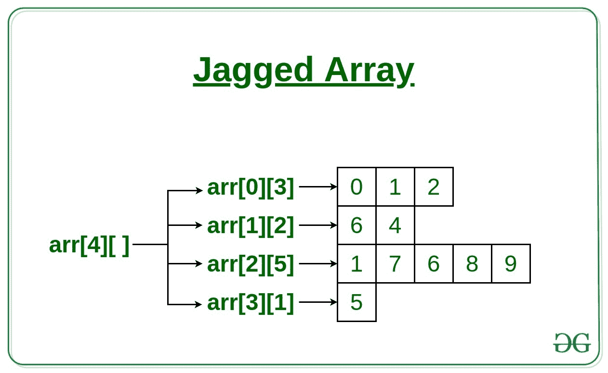

# 交错数组或 C 中数组的数组示例

> 原文:[https://www . geeksforgeeks . org/jagged-array-or-array-of-in-c-array-with-examples/](https://www.geeksforgeeks.org/jagged-array-or-array-of-arrays-in-c-with-examples/)

**先决条件:**[C 中的数组](https://www.geeksforgeeks.org/arrays-in-c-cpp/)

**交错数组**是[数组](https://www.geeksforgeeks.org/arrays-in-c-cpp/) 的 **[数组](https://www.geeksforgeeks.org/arrays-in-c-cpp/)，这样成员数组可以有不同的大小，也就是说，我们可以创建一个二维数组，但是每行的列数是可变的。这些类型的数组也称为交错数组。**

**示例:**

```
arr[][] = { {0, 1, 2},
            {6, 4},
            {1, 7, 6, 8, 9},
            {5} 
          };

```

[](https://media.geeksforgeeks.org/wp-content/uploads/20200131134104/Jagged-Array.jpg)

下面是在 C 语言中实现交错数组的方法:

1.  **Using [array](https://www.geeksforgeeks.org/arrays-in-c-cpp/) and a [pointer](https://www.geeksforgeeks.org/pointers-in-c-and-c-set-1-introduction-arithmetic-and-array/) ([Static](https://www.geeksforgeeks.org/static-variables-in-c/) Jagged Array)**
    *   首先用需要的行数声明一维数组，
    *   每个数组(行中元素的数组)的大小将是行中列(或元素)的数量，
    *   然后声明一个一维指针数组来保存行的地址，
    *   一维数组的大小是您想要在交错数组中的行数。

    以下是上述方法的实现:
    **示例:**

    ```
    // C program to show the
    // implementation of Jagged Arrays

    #include <stdio.h>
    #include <stdlib.h>

    int main()
    {

        int row0[4] = { 1, 2, 3, 4 };
        int row1[2] = { 5, 6 };

        int* jagged[2] = { row0, row1 };

        // Array to hold the size of each row
        int Size[2] = { 4, 2 }, k = 0;

        // To display elements of Jagged array
        for (int i = 0; i < 2; i++) {

            // pointer to hold the address of the row
            int* ptr = jagged[i];

            for (int j = 0; j < Size[k]; j++) {
                printf("%d ", *ptr);

                // move the pointer to the
                // next element in the row
                ptr++;
            }

            printf("\n");
            k++;

            // move the pointer to the next row
            jagged[i]++;
        }

        return 0;
    }
    ```

    **Output:**

    ```
    1 2 3 4 
    5 6

    ```

2.  **Using an [array of pointer](https://www.geeksforgeeks.org/difference-between-pointer-to-an-array-and-array-of-pointers/) (Dynamic Jagged Array)**
    *   声明指针数组(交错数组)，
    *   这个数组的大小将是 Jagged 数组中所需的行数
    *   然后，为数组中的每个指针分配内存，以容纳该行中所需的元素数量。

    以下是上述方法的实现:
    **示例:**

    ```
    // C program to show the
    // implementation of Jagged Arrays

    #include <stdio.h>
    #include <stdlib.h>

    int main()
    {
        // 2 Rows
        int* jagged[2];

        // Allocate memory for elements in row 0
        jagged[0] = malloc(sizeof(int) * 1);

        // Allocate memory for elements in row 1
        jagged[1] = malloc(sizeof(int) * 3);

        // Array to hold the size of each row
        int Size[2] = { 1, 3 }, k = 0, number = 100;

        // User enters the numbers
        for (int i = 0; i < 2; i++) {

            int* p = jagged[i];

            for (int j = 0; j < Size[k]; j++) {
                *p = number++;

                // move the pointer
                p++;
            }
            k++;
        }

        k = 0;

        // Display elements in Jagged array
        for (int i = 0; i < 2; i++) {

            int* p = jagged[i];
            for (int j = 0; j < Size[k]; j++) {

                printf("%d ", *p);
                // move the pointer to the next element
                p++;
            }
            printf("\n");
            k++;
            // move the pointer to the next row
            jagged[i]++;
        }

        return 0;
    }
    ```

    **Output:**

    ```
    100 
    101 102 103

    ```