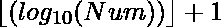

# 詹姆斯·乔伊斯的《尤利西斯》序列

> 原文:[https://www . geesforgeks . org/James-joyces-尤利西斯-sequence/](https://www.geeksforgeeks.org/james-joyces-ulysses-sequence/)

**詹姆斯·乔伊斯的《尤利西斯》序列**代表 N <sup>NN</sup> 中的位数。
詹姆斯·乔伊斯《尤利西斯》系列的前几个术语是

> 1, 2, 13, 155, 2185, 36306…… ..

给定一个整数 **N** ，任务是打印詹姆斯·乔伊斯的《尤利西斯》序列的第 N 项。
**例:**

> **输入:** 2
> **输出:** 2
> **说明:**
> 2<sup>22</sup>的位数为 2 自 2 <sup>22</sup> = 16
> **输入:** 3
> **输出:** 13

**进场:****Num**的位数由给出。因此 N <sup>NN</sup> 中的位数由
给出

要想看到乔伊斯的号码光彩照人，我们需要打印大约 3.7 亿个数字。假设每行 100 个数字，每页 100 行，这意味着大约需要 37 卷，每 1000 页，明确写下。乔伊斯在《尤利西斯》中的估计是 33 卷；考虑到他在数学方面的糟糕表现，还不错。
以下是上述方法的实施:

## C++

```
// C++ implementation of
// the above approach

#include <bits/stdc++.h>
using namespace std;

// Function to return N-th term
// of James Joyce's "Ulysses" sequence.
int nthTerm(int n)
{
    return floor(pow(n, n) * log10(n)) + 1;
}

// Driver Code
int main()
{
    int n = 3;
    cout << nthTerm(n);

    return 0;
}
```

## Java 语言(一种计算机语言，尤用于创建网站)

```
// Java implementation of
// the above approach
class GFG{

// Function to return N-th term
// of James Joyce's "Ulysses" sequence.
static int nthTerm(int n)
{
    return (int)(Math.floor(Math.pow(n, n) *
                            Math.log10(n)) + 1);
}

// Driver Code
public static void main(String[] args)
{
    int n = 3;
    System.out.print(nthTerm(n));
}
}

// This code is contributed by 29AjayKumar
```

## 蟒蛇 3

```
# Python3 implementation of the
# above approach
import math

# Function to return N-th term
# of James Joyce's "Ulysses" sequence.
def nthTerm(n):

    return (math.floor(math.pow(n, n) *
                       math.log10(n)) + 1);

# Driver Code
if __name__ == "__main__" :

    # Given number
    n = 3;

    # Function call
    print(nthTerm(n));

# This code is contributed by rock_cool
```

## C#

```
// C# implementation of
// the above approach
using System;
class GFG{

// Function to return N-th term
// of James Joyce's "Ulysses" sequence.
static int nthTerm(int n)
{
    return (int)(Math.Floor(Math.Pow(n, n) *
                            Math.Log10(n)) + 1);
}

// Driver Code
public static void Main()
{
    int n = 3;
    Console.Write(nthTerm(n));
}
}

// This code is contributed by Nidhi_biet
```

## java 描述语言

```
<script>
// Javascript implementation of
// the above approach

    // Function to return N-th term
    // of James Joyce's "Ulysses" sequence.
    function nthTerm( n)
    {
        return parseInt( (Math.floor(Math.pow(n, n) * Math.log10(n)) + 1));
    }

    // Driver Code
    let n = 3;
    document.write(nthTerm(n));

// This code is contributed by todaysgaurav
</script>
```

**Output:** 

```
13
```

**参考文献:**T2https://oeis.org/A054382