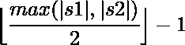

# Jaro 和 Jaro-Winkler 相似性

> 原文:[https://www . geeksforgeeks . org/jaro-and-jaro-Winkler-相似性/](https://www.geeksforgeeks.org/jaro-and-jaro-winkler-similarity/)

### **<u>雅罗相似度</u>**

**Jaro 相似度**是两个字符串之间相似度的度量。Jaro 距离的值范围从 0 到 1。其中 1 表示字符串相等，0 表示两个字符串之间没有相似性。

**示例:**

> **输入:**S1 =“CRATE”，S2 =“TRACE”；
> T3】输出: Jaro 相似度= 0.733333
> 
> **输入:**S1 =“DwAyNE”，S2 =“DuANE”；
> T3】输出: Jaro 相似度= 0.822222

**算法:**
雅罗相似度使用以下公式计算

![\[ Jaro\hspace{1mm}similarity\hspace{1mm}= \left \{ \begin{tabular}{cc} 0, if m=0\\ \[\cfrac{1}{3}\]\Big(\[\cfrac{m}{\big| s1 \big|}\] + \[\cfrac{m}{\big| s2 \big|}\]+\[\cfrac{m-t}{m}\]\Big), for m!=0 \end{tabular} } \]            ](img/15b085a65a3d0943b0a793e54c3eae5b.png "Rendered by QuickLaTeX.com")

其中:

*   **m** 为匹配字符数
*   **t** 是换位次数的一半
*   其中 **|s1|** 和 **|s2|** 分别为弦 s1 和 s2 的长度。

如果字符相同，并且字符不超过
位置是两个字符串中匹配字符数量的一半，但顺序不同，则称字符匹配。
T3】计算:

*   让 S1 =“arnab”，S2 =“raan b”，这样每个字符匹配的最大距离就是 1。
*   很明显，这两个字符串都有 5 个匹配的字符，但是顺序不一样，所以不按顺序的字符数是 4，所以换位数是 2。
*   因此，Jaro 相似度可以计算如下:
    T1】Jaro 相似度=(1/3)* {(5/5)+(5/5)+(5-2)/5 } =**0.86667**

下面是上述方法的实现。

## C++

```
// C++ implementation of above approach
#include <bits/stdc++.h>
using namespace std;

// Function to calculate the
// Jaro Similarity of two strings
double jaro_distance(string s1, string s2)
{
    // If the strings are equal
    if (s1 == s2)
        return 1.0;

    // Length of two strings
    int len1 = s1.length(),
        len2 = s2.length();

    // Maximum distance upto which matching
    // is allowed
    int max_dist = floor(max(len1, len2) / 2) - 1;

    // Count of matches
    int match = 0;

    // Hash for matches
    int hash_s1[s1.length()] = { 0 },
        hash_s2[s2.length()] = { 0 };

    // Traverse through the first string
    for (int i = 0; i < len1; i++) {

        // Check if there is any matches
        for (int j = max(0, i - max_dist);
             j < min(len2, i + max_dist + 1); j++)

            // If there is a match
            if (s1[i] == s2[j] && hash_s2[j] == 0) {
                hash_s1[i] = 1;
                hash_s2[j] = 1;
                match++;
                break;
            }
    }

    // If there is no match
    if (match == 0)
        return 0.0;

    // Number of transpositions
    double t = 0;

    int point = 0;

    // Count number of occurrences
    // where two characters match but
    // there is a third matched character
    // in between the indices
    for (int i = 0; i < len1; i++)
        if (hash_s1[i]) {

            // Find the next matched character
            // in second string
            while (hash_s2[point] == 0)
                point++;

            if (s1[i] != s2[point++])
                t++;
        }

    t /= 2;

    // Return the Jaro Similarity
    return (((double)match) / ((double)len1)
            + ((double)match) / ((double)len2)
            + ((double)match - t) / ((double)match))
           / 3.0;
}

// Driver code
int main()
{
    string s1 = "CRATE", s2 = "TRACE";

    // Print jaro Similarity of two strings
    cout << jaro_distance(s1, s2) << endl;

    return 0;
}
```

## Java 语言(一种计算机语言，尤用于创建网站)

```
// Java implementation of above approach
class GFG
{

// Function to calculate the
// Jaro Similarity of two Strings
static double jaro_distance(String s1, String s2)
{
    // If the Strings are equal
    if (s1 == s2)
        return 1.0;

    // Length of two Strings
    int len1 = s1.length(),
        len2 = s2.length();

    // Maximum distance upto which matching
    // is allowed
    int max_dist = (int) (Math.floor(Math.max(len1, len2) / 2) - 1);

    // Count of matches
    int match = 0;

    // Hash for matches
    int hash_s1[] = new int[s1.length()];
    int hash_s2[] = new int[s2.length()];

    // Traverse through the first String
    for (int i = 0; i < len1; i++)
    {

        // Check if there is any matches
        for (int j = Math.max(0, i - max_dist);
            j < Math.min(len2, i + max_dist + 1); j++)

            // If there is a match
            if (s1.charAt(i) == s2.charAt(j) && hash_s2[j] == 0)
            {
                hash_s1[i] = 1;
                hash_s2[j] = 1;
                match++;
                break;
            }
    }

    // If there is no match
    if (match == 0)
        return 0.0;

    // Number of transpositions
    double t = 0;

    int point = 0;

    // Count number of occurrences
    // where two characters match but
    // there is a third matched character
    // in between the indices
    for (int i = 0; i < len1; i++)
        if (hash_s1[i] == 1)
        {

            // Find the next matched character
            // in second String
            while (hash_s2[point] == 0)
                point++;

            if (s1.charAt(i) != s2.charAt(point++) )
                t++;
        }

    t /= 2;

    // Return the Jaro Similarity
    return (((double)match) / ((double)len1)
            + ((double)match) / ((double)len2)
            + ((double)match - t) / ((double)match))
        / 3.0;
}

// Driver code
public static void main(String[] args)
{
    String s1 = "CRATE", s2 = "TRACE";

    // Print jaro Similarity of two Strings
    System.out.print(jaro_distance(s1, s2) +"\n");
}
}

// This code is contributed by PrinciRaj1992
```

## 蟒蛇 3

```
# Python3 implementation of above approach
from math import floor, ceil

# Function to calculate the
# Jaro Similarity of two s
def jaro_distance(s1, s2):

    # If the s are equal
    if (s1 == s2):
        return 1.0

    # Length of two s
    len1 = len(s1)
    len2 = len(s2)

    # Maximum distance upto which matching
    # is allowed
    max_dist = floor(max(len1, len2) / 2) - 1

    # Count of matches
    match = 0

    # Hash for matches
    hash_s1 = [0] * len(s1)
    hash_s2 = [0] * len(s2)

    # Traverse through the first
    for i in range(len1):

        # Check if there is any matches
        for j in range(max(0, i - max_dist),
                       min(len2, i + max_dist + 1)):

            # If there is a match
            if (s1[i] == s2[j] and hash_s2[j] == 0):
                hash_s1[i] = 1
                hash_s2[j] = 1
                match += 1
                break

    # If there is no match
    if (match == 0):
        return 0.0

    # Number of transpositions
    t = 0
    point = 0

    # Count number of occurrences
    # where two characters match but
    # there is a third matched character
    # in between the indices
    for i in range(len1):
        if (hash_s1[i]):

            # Find the next matched character
            # in second
            while (hash_s2[point] == 0):
                point += 1

            if (s1[i] != s2[point]):
                t += 1
            point += 1
    t = t//2

    # Return the Jaro Similarity
    return (match/ len1 + match / len2 +
            (match - t) / match)/ 3.0

# Driver code
s1 = "CRATE"
s2 = "TRACE"

# Prjaro Similarity of two s
print(round(jaro_distance(s1, s2),6))

# This code is contributed by mohit kumar 29
```

## C#

```
// C# implementation of above approach
using System;

class GFG
{

    // Function to calculate the
    // Jaro Similarity of two Strings
    static double jaro_distance(string s1, string s2)
    {
        // If the Strings are equal
        if (s1 == s2)
            return 1.0;

        // Length of two Strings
        int len1 = s1.Length ;
        int len2 = s2.Length;

        // Maximum distance upto which matching
        // is allowed
        int max_dist = (int)(Math.Floor((double)(
                        (Math.Max(len1, len2) / 2) - 1)));

        // Count of matches
        int match = 0;

        // Hash for matches
        int []hash_s1 = new int[s1.Length];
        int []hash_s2 = new int[s2.Length];

        // Traverse through the first String
        for (int i = 0; i < len1; i++)
        {

            // Check if there is any matches
            for (int j = Math.Max(0, i - max_dist);
                j < Math.Min(len2, i + max_dist + 1); j++)

                // If there is a match
                if (s1[i] == s2[j] && hash_s2[j] == 0)
                {
                    hash_s1[i] = 1;
                    hash_s2[j] = 1;
                    match++;
                    break;
                }
        }

        // If there is no match
        if (match == 0)
            return 0.0;

        // Number of transpositions
        double t = 0;

        int point = 0;

        // Count number of occurrences
        // where two characters match but
        // there is a third matched character
        // in between the indices
        for (int i = 0; i < len1; i++)
            if (hash_s1[i] == 1)
            {

                // Find the next matched character
                // in second String
                while (hash_s2[point] == 0)
                    point++;

                if (s1[i] != s2[point++] )
                    t++;
            }

        t /= 2;

        // Return the Jaro Similarity
        return (((double)match) / ((double)len1)
                + ((double)match) / ((double)len2)
                + ((double)match - t) / ((double)match))
            / 3.0;
    }

    // Driver code
    public static void Main()
    {
        string s1 = "CRATE", s2 = "TRACE";

        // Print jaro Similarity of two Strings
        Console.WriteLine(jaro_distance(s1, s2));
    }
}

// This code is contributed by AnkitRai01
```

## java 描述语言

```
<script>

// Javascript implementation of above approach

// Function to calculate the
// Jaro Similarity of two strings
function jaro_distance(s1, s2)
{
    // If the strings are equal
    if (s1 == s2)
        return 1.0;

    // Length of two strings
    var len1 = s1.length,
        len2 = s2.length;

    // Maximum distance upto which matching
    // is allowed
    var max_dist = Math.floor(Math.max(len1, len2) / 2) - 1;

    // Count of matches
    var match = 0;

    // Hash for matches
    var hash_s1 = Array(s1.length).fill(0);
    var hash_s2 = Array(s1.length).fill(0);

    // Traverse through the first string
    for (var i = 0; i < len1; i++) {

        // Check if there is any matches
        for (var j = Math.max(0, i - max_dist);
             j < Math.min(len2, i + max_dist + 1); j++)

            // If there is a match
            if (s1[i] == s2[j] && hash_s2[j] == 0) {
                hash_s1[i] = 1;
                hash_s2[j] = 1;
                match++;
                break;
            }
    }

    // If there is no match
    if (match == 0)
        return 0.0;

    // Number of transpositions
    var t = 0;

    var point = 0;

    // Count number of occurrences
    // where two characters match but
    // there is a third matched character
    // in between the indices
    for (var i = 0; i < len1; i++)
        if (hash_s1[i]) {

            // Find the next matched character
            // in second string
            while (hash_s2[point] == 0)
                point++;

            if (s1[i] != s2[point++])
                t++;
        }

    t /= 2;

    // Return the Jaro Similarity
    return ((match) / (len1)
            + (match) / (len2)
            + (match - t) / (match))
           / 3.0;
}

// Driver code
var s1 = "CRATE", s2 = "TRACE";
// Print jaro Similarity of two strings
document.write( jaro_distance(s1, s2).toFixed(5));

</script>
```

**Output:** 

```
0.733333
```

### **<u>贾罗-温克勒相似性</u>**

**Jaro-Winkler 相似性**是一种测量两个字符串之间编辑距离的字符串度量。雅罗-温克勒相似性与雅罗相似性非常相似。当两个字符串的前缀匹配时，它们会有所不同。jaro–Winkler 相似性使用前缀比例“p ”,当字符串具有定义的最大长度 l 的公共前缀时，它会给出更准确的答案。
**示例:**

> **输入:**S1 =“DwAyNE”，S2 =“DuANE”；
> **输出:**雅罗-温克勒相似度=0.84
> 
> **输入:**S1 =“TRATE”，S2 =“TRACE”；
> **输出:**雅罗-温克勒相似度= 0.906667

**计算:**

*   Jaro Winkler 相似性定义如下
    **Sw = Sj+P * L *(1–Sj)**
    其中，
    *   Sj，是雅罗相似吗
    *   Sw，jaro- winkler 相似吗
    *   p 是比例因子(默认为 0.1)
    *   l 是匹配前缀的长度，最多 4 个字符。
*   让 S1 =“arnab”，S2 =“aranb”。两个字符串的 Jaro 相似度为 0.933333(根据上面的计算。)
*   匹配前缀的长度是 2，我们将比例因子取为 0.1。
*   代入公式；
    **Jaro-Winkler 相似度**= 0.9333333+0.1 * 2 *(1-0.9333333)= 0.946667

下面是上述方法的实现。

## C++

```
// C++ implementation of above approach
#include <bits/stdc++.h>
using namespace std;

// Function to calculate the
// Jaro Similarity of two strings
double jaro_distance(string s1, string s2)
{
    // If the strings are equal
    if (s1 == s2)
        return 1.0;

    // Length of two strings
    int len1 = s1.length(),
        len2 = s2.length();

    if (len1 == 0 || len2 == 0)
        return 0.0;

    // Maximum distance upto which matching
    // is allowed
    int max_dist = floor(max(len1, len2) / 2) - 1;

    // Count of matches
    int match = 0;

    // Hash for matches
    int hash_s1[s1.length()] = { 0 },
        hash_s2[s2.length()] = { 0 };

    // Traverse through the first string
    for (int i = 0; i < len1; i++) {

        // Check if there is any matches
        for (int j = max(0, i - max_dist);
             j < min(len2, i + max_dist + 1); j++)
            // If there is a match
            if (s1[i] == s2[j] && hash_s2[j] == 0) {
                hash_s1[i] = 1;
                hash_s2[j] = 1;
                match++;
                break;
            }
    }

    // If there is no match
    if (match == 0)
        return 0.0;

    // Number of transpositions
    double t = 0;

    int point = 0;

    // Count number of occurrences
    // where two characters match but
    // there is a third matched character
    // in between the indices
    for (int i = 0; i < len1; i++)
        if (hash_s1[i]) {

            // Find the next matched character
            // in second string
            while (hash_s2[point] == 0)
                point++;

            if (s1[i] != s2[point++])
                t++;
        }

    t /= 2;

    // Return the Jaro Similarity
    return (((double)match) / ((double)len1)
            + ((double)match) / ((double)len2)
            + ((double)match - t) / ((double)match))
           / 3.0;
}

// Jaro Winkler Similarity
double jaro_Winkler(string s1, string s2)
{
    double jaro_dist = jaro_distance(s1, s2);

    // If the jaro Similarity is above a threshold
    if (jaro_dist > 0.7) {

        // Find the length of common prefix
        int prefix = 0;

        for (int i = 0;
             i < min(s1.length(), s2.length()); i++) {
            // If the characters match
            if (s1[i] == s2[i])
                prefix++;

            // Else break
            else
                break;
        }

        // Maximum of 4 characters are allowed in prefix
        prefix = min(4, prefix);

        // Calculate jaro winkler Similarity
        jaro_dist += 0.1 * prefix * (1 - jaro_dist);
    }

    return jaro_dist;
}

// Driver code
int main()
{
    string s1 = "TRATE", s2 = "TRACE";

    // Print Jaro-Winkler Similarity of two strings
    cout << "Jaro-Winkler Similarity ="
         << jaro_Winkler(s1, s2) << endl;

    return 0;
}
```

## Java 语言(一种计算机语言，尤用于创建网站)

```
// Java implementation of above approach
class GFG
{

    // Function to calculate the
    // Jaro Similarity of two strings
    static double jaro_distance(String s1, String s2)
    {
        // If the strings are equal
        if (s1 == s2)
            return 1.0;

        // Length of two strings
        int len1 = s1.length(),
            len2 = s2.length();

        if (len1 == 0 || len2 == 0)
            return 0.0;

        // Maximum distance upto which matching
        // is allowed
        int max_dist = (int)Math.floor(Math.max(len1, len2) / 2) - 1;

        // Count of matches
        int match = 0;

        // Hash for matches
        int hash_s1[] = new int [s1.length()];
        int hash_s2[] = new int[s2.length()];

        // Traverse through the first string
        for (int i = 0; i < len1; i++)
        {

            // Check if there is any matches
            for (int j = Math.max(0, i - max_dist);
                j < Math.min(len2, i + max_dist + 1); j++)

                // If there is a match
                if (s1.charAt(i) == s2.charAt(j) &&
                                hash_s2[j] == 0)
                {
                    hash_s1[i] = 1;
                    hash_s2[j] = 1;
                    match++;
                    break;
                }
        }

        // If there is no match
        if (match == 0)
            return 0.0;

        // Number of transpositions
        double t = 0;

        int point = 0;

        // Count number of occurrences
        // where two characters match but
        // there is a third matched character
        // in between the indices
        for (int i = 0; i < len1; i++)
            if (hash_s1[i] == 1)
            {

                // Find the next matched character
                // in second string
                while (hash_s2[point] == 0)
                    point++;

                if (s1.charAt(i) != s2.charAt(point++))
                    t++;
            }

        t /= 2;

        // Return the Jaro Similarity
        return (((double)match) / ((double)len1)
                + ((double)match) / ((double)len2)
                + ((double)match - t) / ((double)match))
            / 3.0;
    }

    // Jaro Winkler Similarity
    static double jaro_Winkler(String s1, String s2)
    {
        double jaro_dist = jaro_distance(s1, s2);

        // If the jaro Similarity is above a threshold
        if (jaro_dist > 0.7)
        {

            // Find the length of common prefix
            int prefix = 0;

            for (int i = 0;
                i < Math.min(s1.length(), s2.length()); i++)
            {

                // If the characters match
                if (s1.charAt(i) == s2.charAt(i))
                    prefix++;

                // Else break
                else
                    break;
            }

            // Maximum of 4 characters are allowed in prefix
            prefix = Math.min(4, prefix);

            // Calculate jaro winkler Similarity
            jaro_dist += 0.1 * prefix * (1 - jaro_dist);
        }
        return jaro_dist;
    }

    // Driver code
    public static void main (String[] args)
    {
        String s1 = "TRATE", s2 = "TRACE";

        // Print Jaro-Winkler Similarity of two strings
        System.out.println("Jaro-Winkler Similarity =" +
                            jaro_Winkler(s1, s2));
    }
}

// This code is contributed by AnkitRai01
```

## 蟒蛇 3

```
# Python3 implementation of above approach
from math import floor

# Function to calculate the
# Jaro Similarity of two strings
def jaro_distance(s1, s2) :

    # If the strings are equal
    if (s1 == s2) :
        return 1.0;

    # Length of two strings
    len1 = len(s1);
    len2 = len(s2);

    if (len1 == 0 or len2 == 0) :
        return 0.0;

    # Maximum distance upto which matching
    # is allowed
    max_dist = (max(len(s1), len(s2)) // 2 ) - 1;

    # Count of matches
    match = 0;

    # Hash for matches
    hash_s1 = [0] * len(s1) ;
    hash_s2 = [0] * len(s2) ;

    # Traverse through the first string
    for i in range(len1) :

        # Check if there is any matches
        for j in range( max(0, i - max_dist),
                    min(len2, i + max_dist + 1)) :

            # If there is a match
            if (s1[i] == s2[j] and hash_s2[j] == 0) :
                hash_s1[i] = 1;
                hash_s2[j] = 1;
                match += 1;
                break;

    # If there is no match
    if (match == 0) :
        return 0.0;

    # Number of transpositions
    t = 0;

    point = 0;

    # Count number of occurrences
    # where two characters match but
    # there is a third matched character
    # in between the indices
    for i in range(len1) :
        if (hash_s1[i]) :

            # Find the next matched character
            # in second string
            while (hash_s2[point] == 0) :
                point += 1;

            if (s1[i] != s2[point]) :
                point += 1;
                t += 1;
            else :
                point += 1;

        t /= 2;

    # Return the Jaro Similarity
    return ((match / len1 + match / len2 +
            (match - t) / match ) / 3.0);

# Jaro Winkler Similarity
def jaro_Winkler(s1, s2) :

    jaro_dist = jaro_distance(s1, s2);

    # If the jaro Similarity is above a threshold
    if (jaro_dist > 0.7) :

        # Find the length of common prefix
        prefix = 0;

        for i in range(min(len(s1), len(s2))) :

            # If the characters match
            if (s1[i] == s2[i]) :
                prefix += 1;

            # Else break
            else :
                break;

        # Maximum of 4 characters are allowed in prefix
        prefix = min(4, prefix);

        # Calculate jaro winkler Similarity
        jaro_dist += 0.1 * prefix * (1 - jaro_dist);

    return jaro_dist;

# Driver code
if __name__ == "__main__" :

    s1 = "TRATE"; s2 = "TRACE";

    # Print Jaro-Winkler Similarity of two strings
    print("Jaro-Winkler Similarity =", jaro_Winkler(s1, s2)) ;

# This code is contributed by AnkitRai01
```

## C#

```
// C# implementation of above approach
using System;

class GFG
{

    // Function to calculate the
    // Jaro Similarity of two strings
    static double jaro_distance(string s1, string s2)
    {
        // If the strings are equal
        if (s1 == s2)
            return 1.0;

        // Length of two strings
        int len1 = s1.Length,
            len2 = s2.Length;

        if (len1 == 0 || len2 == 0)
            return 0.0;

        // Maximum distance upto which matching
        // is allowed
        int max_dist = (int)Math.Floor((double)
                        Math.Max(len1, len2) / 2) - 1;

        // Count of matches
        int match = 0;

        // Hash for matches
        int []hash_s1 = new int [s1.Length];
        int []hash_s2 = new int[s2.Length];

        // Traverse through the first string
        for (int i = 0; i < len1; i++)
        {

            // Check if there is any matches
            for (int j = Math.Max(0, i - max_dist);
                j < Math.Min(len2, i + max_dist + 1); j++)

                // If there is a match
                if (s1[i] == s2[j] &&
                    hash_s2[j] == 0)
                {
                    hash_s1[i] = 1;
                    hash_s2[j] = 1;
                    match++;
                    break;
                }
        }

        // If there is no match
        if (match == 0)
            return 0.0;

        // Number of transpositions
        double t = 0;

        int point = 0;

        // Count number of occurrences
        // where two characters match but
        // there is a third matched character
        // in between the indices
        for (int i = 0; i < len1; i++)
            if (hash_s1[i] == 1)
            {

                // Find the next matched character
                // in second string
                while (hash_s2[point] == 0)
                    point++;

                if (s1[i] != s2[point++])
                    t++;
            }
        t /= 2;

        // Return the Jaro Similarity
        return (((double)match) / ((double)len1)
                + ((double)match) / ((double)len2)
                + ((double)match - t) / ((double)match))
            / 3.0;
    }

    // Jaro Winkler Similarity
    static double jaro_Winkler(string s1, string s2)
    {
        double jaro_dist = jaro_distance(s1, s2);

        // If the jaro Similarity is above a threshold
        if (jaro_dist > 0.7)
        {

            // Find the length of common prefix
            int prefix = 0;

            for (int i = 0; i < Math.Min(s1.Length,
                                        s2.Length); i++)
            {

                // If the characters match
                if (s1[i] == s2[i])
                    prefix++;

                // Else break
                else
                    break;
            }

            // Maximum of 4 characters are allowed in prefix
            prefix = Math.Min(4, prefix);

            // Calculate jaro winkler Similarity
            jaro_dist += 0.1 * prefix * (1 - jaro_dist);
        }
        return jaro_dist;
    }

    // Driver code
    public static void Main ()
    {
        string s1 = "TRATE", s2 = "TRACE";

        // Print Jaro-Winkler Similarity of two strings
        Console.WriteLine("Jaro-Winkler Similarity =" +
                            jaro_Winkler(s1, s2));
    }
}

// This code is contributed by AnkitRai01
```

## java 描述语言

```
<script>
    // Javascript implementation of above approach

    // Function to calculate the
    // Jaro Similarity of two strings
    function jaro_distance(s1, s2)
    {
        // If the strings are equal
        if (s1 == s2)
            return 1.0;

        // Length of two strings
        let len1 = s1.length, len2 = s2.length;

        if (len1 == 0 || len2 == 0)
            return 0.0;

        // Maximum distance upto which matching
        // is allowed
        let max_dist = Math.floor(Math.max(len1, len2) / 2) - 1;

        // Count of matches
        let match = 0;

        // Hash for matches
        let hash_s1 = new Array(s1.length);
        hash_s1.fill(0);
        let hash_s2 = new Array(s2.length);
        hash_s2.fill(0);

        // Traverse through the first string
        for (let i = 0; i < len1; i++)
        {

            // Check if there is any matches
            for (let j = Math.max(0, i - max_dist);
                j < Math.min(len2, i + max_dist + 1); j++)

                // If there is a match
                if (s1[i] == s2[j] &&
                    hash_s2[j] == 0)
                {
                    hash_s1[i] = 1;
                    hash_s2[j] = 1;
                    match++;
                    break;
                }
        }

        // If there is no match
        if (match == 0)
            return 0.0;

        // Number of transpositions
        let t = 0;

        let point = 0;

        // Count number of occurrences
        // where two characters match but
        // there is a third matched character
        // in between the indices
        for (let i = 0; i < len1; i++)
            if (hash_s1[i] == 1)
            {

                // Find the next matched character
                // in second string
                while (hash_s2[point] == 0)
                    point++;

                if (s1[i] != s2[point++])
                    t++;
            }
        t /= 2;

        // Return the Jaro Similarity
        return ((match) / (len1)
                + (match) / (len2)
                + (match - t) / (match))
            / 3.0;
    }

    // Jaro Winkler Similarity
    function jaro_Winkler(s1, s2)
    {
        let jaro_dist = jaro_distance(s1, s2);

        // If the jaro Similarity is above a threshold
        if (jaro_dist > 0.7)
        {

            // Find the length of common prefix
            let prefix = 0;

            for (let i = 0; i < Math.min(s1.length,s2.length); i++)
            {

                // If the characters match
                if (s1[i] == s2[i])
                    prefix++;

                // Else break
                else
                    break;
            }

            // Maximum of 4 characters are allowed in prefix
            prefix = Math.min(4, prefix);

            // Calculate jaro winkler Similarity
            jaro_dist += 0.1 * prefix * (1 - jaro_dist);
        }
        return jaro_dist.toFixed(6);
    }

    let s1 = "TRATE", s2 = "TRACE";

    // Print Jaro-Winkler Similarity of two strings
    document.write("Jaro-Winkler Similarity =" +
                      jaro_Winkler(s1, s2));

</script>
```

**Output:** 

```
Jaro-Winkler Similarity =0.906667
```

**时间复杂度:** O(N * M)，其中 N 为字符串 s1 的长度，M 为字符串 s2 的长度。
**辅助空间:** O(N + M)