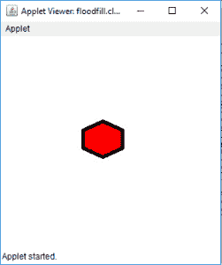
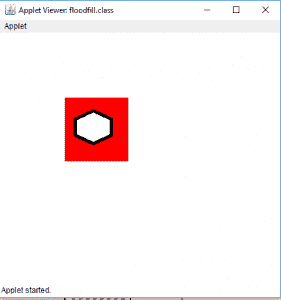
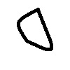
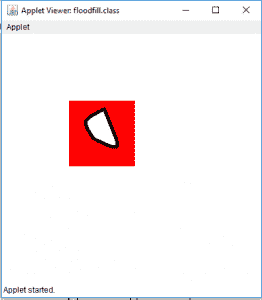
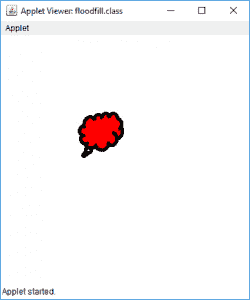
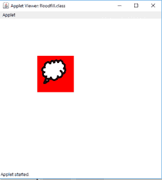
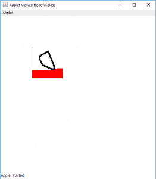

# Java 小程序|实现洪水填充算法

> 原文:[https://www . geesforgeks . org/Java-applet-implementing-flood-fill-algorithm/](https://www.geeksforgeeks.org/java-applet-implementing-flood-fill-algorithm/)

[泛洪填充算法](https://www.geeksforgeeks.org/flood-fill-algorithm-implement-fill-paint/)是用指定的颜色替换某个封闭的或类似颜色的字段。FloodFill 算法的使用可以在油漆和其他游戏中看到，比如扫雷。
在本文中，在 Java Applet 中，通过使用 FloodFill 算法，FloodFill 通过指定的颜色用于连接的区域。
有两种方法可以使用:

1.  递归方法(使用有限，因为它会在更大的区域崩溃)
2.  使用队列(更可靠)

**例:**

1.  对于图像 1:




*   输出(位置 1，1 处充满洪水):



1.  对于图像 2:




*   输出(位置 1，1 处充满洪水):



*   />

1.  对于图像 3:




*   输出(位置 1，1 处充满洪水):



**程序 1:** 要使用递归在 Java Applet 中实现 floodfill 算法:
**注意:**要运行程序，请使用离线 IDE，如 [Netbeans](https://course.ccs.neu.edu/is4300f12/netbeans1.htm) 、Eclipse 等。请下载输入的图片，并与课程文件放在一起。否则，程序可能会产生“无法读取输入文件”的错误。

## Java 语言(一种计算机语言，尤用于创建网站)

```
// Java Program to implement floodfill algorithm
// in Java Applet(using recursion)
import java.awt.*;
import javax.swing.*;
import java.awt.image.*;
import java.io.*;
import javax.imageio.ImageIO;

public class floodfill extends JApplet {

    public void init()
    {
    }

    // paint function
    public void paint(Graphics g)
    {
        BufferedImage i = null;
        try {
            // Input the image to be used for FloodFill
            // The output is shown for 3 images
            // image1, image2 and image2
            i = ImageIO.read(new File("image1.jpg"));

            // floodfill with color red at point 35, 35
            // get color of image at 35, 35
            Color c = new Color(i.getRGB(35, 35));
            flood(i, g, 35, 35, c, Color.red);

            // draw the image after floodfill
            g.drawImage(i, 100, 100, this);
        }
        catch (Exception e) {
            JOptionPane.showMessageDialog(this, e.getMessage());
        }

        // draw the image after floodfill
        g.drawImage(i, 100, 100, this);
    }

    // function to floodfill the image
    public void flood(BufferedImage i,
                      Graphics g,
                      int x,
                      int y,
                      Color c,
                      Color c1)
    {
        if (x >= 1 && y >= 1
            && x < i.getWidth()
            && y < i.getHeight()) {
            // find the color at point x, y
            Color c2 = new Color(i.getRGB(x, y));

            // if there is no boundary (the color is almost
            // same as the color of the point where
            // floodfill is to be applied
            if (Math.abs(c2.getGreen() - c.getGreen()) < 30
                && Math.abs(c2.getRed() - c.getRed()) < 30
                && Math.abs(c2.getBlue() - c.getBlue()) < 30) {
                // change the color of the pixel of image
                i.setRGB(x, y, c1.getRGB());

                g.drawImage(i, 100, 100, this);

                // floodfill in all possible directions
                flood(i, g, x, y + 1, c, c1);
                flood(i, g, x + 1, y, c, c1);
                flood(i, g, x - 1, y, c, c1);
                flood(i, g, x, y - 1, c, c1);
            }
        }
    }
}
```

**输出:**

*   **为图像 1:**
    输入:


*   输出:


*   **为图像 2:**
    输入:


*   输出:


*   **为图像 3:**
    输入:


*   输出:


*   **注意:**如果使用递归方法对更大的区域进行洪水填充(在坐标 1，1 处)，则递归算法可能会导致**崩溃。**
    **例:**

```
floodfill the larger side of image
Input:
```


```
Output:
```



```
*Explanation:*
Since the area to be covered is very large, 
therefore only some part is covered by the algorithm, 
and after that the program gets crashed.
```

*   **程序 2:** 要使用队列在 Java Applet 中实现 floodfill 算法:
    **注意:**要运行程序，请使用 Netbeans、Eclipse 等离线 IDE。请下载输入的图片，并与课程文件放在一起。否则，程序可能会产生“无法读取输入文件”的错误。

## Java 语言(一种计算机语言，尤用于创建网站)

```
// Java Program to implement floodfill algorithm
// in Java Applet(using queue)
import java.awt.*;
import javax.swing.*;
import java.awt.image.*;
import java.io.*;
import javax.imageio.ImageIO;

public class floodfill extends JApplet {

    public void init()
    {
    }

    // paint function
    public void paint(Graphics g)
    {
        BufferedImage i = null;
        try {
            // Input the image to be used for FloodFill
            // The output is shown for 3 images
            // image1, image2 and image2
            i = ImageIO.read(new File("image1.jpg"));

            // floodfill with color red at point 1, 1
            // get color of image at 1, 1
            // if 35, 35 point is floodfilled it will floodfill
            // the smaller area
            Color c = new Color(i.getRGB(1, 1));
            flood(i, g, 1, 1, c, Color.red);

            // draw the image after floodfill
            g.drawImage(i, 100, 100, this);
        }
        catch (Exception e) {
            JOptionPane.showMessageDialog(this, e.getMessage());
        }

        // draw the image after floodfill
        g.drawImage(i, 100, 100, this);
    }

    // function to floodfill the image using queue
    public void flood(BufferedImage i,
                      Graphics g,
                      int x1,
                      int y1,
                      Color c,
                      Color c1)
    {
        // create a stack using array
        int stx[] = new int[100000];
        int sty[] = new int[100000], f, r, x, y;

        // create a front and rear
        f = r = 0;

        // initialize them
        stx[0] = x1;
        sty[0] = y1;

        // while front is greater than rear
        while (f >= r) {
            // pop element out
            x = stx[r];
            y = sty[r++];
            if (x >= 1 && y >= 1
                && x < i.getWidth()
                && y < i.getHeight()) {
                // find the color at point x, y
                Color c2 = new Color(i.getRGB(x, y));

                // if there is no boundary (the color is almost
                // same as the color of the point where
                // floodfill is to be applied

                if (Math.abs(c2.getGreen() - c.getGreen()) < 30
                    && Math.abs(c2.getRed() - c.getRed()) < 30
                    && Math.abs(c2.getBlue() - c.getBlue()) < 30) {

                    // change the color of the pixel of image
                    i.setRGB(x, y, c1.getRGB());

                    g.drawImage(i, 100, 100, this);

                    // floodfill in all possible directions
                    // store them in queue
                    stx[f] = x;
                    sty[f++] = y + 1;
                    stx[f] = x;
                    sty[f++] = y - 1;
                    stx[f] = x + 1;
                    sty[f++] = y;
                    stx[f] = x - 1;
                    sty[f++] = y;
                }
            }
        }
    }
}
```

*   **输出:**
    *   **对于图像 1:**
        输入:


*   输出(位置 35，35 处充满洪水):


*   输出(位置 1，1 处充满洪水):


*   **对于图像 2:**
    输入:


*   输出(位置 35，35 处充满洪水):


*   输出(位置 1，1 处充满洪水):


*   **对于图像 3:**
    输入:


*   输出(位置 35，35 处充满洪水):


*   输出(位置 1，1 处充满洪水):

