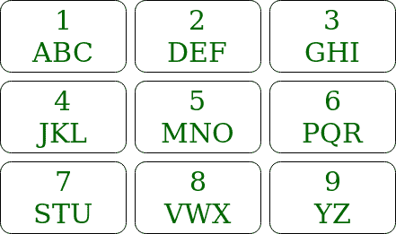

# Java ArrayList 打印电话号码中所有可能的单词

> 原文:[https://www . geesforgeks . org/Java-ArrayList-to-print-所有可能的单词-来自电话-数字/](https://www.geeksforgeeks.org/java-arraylist-to-print-all-possible-words-from-phone-digits/)

给定手机的键盘和需要按下的按键，任务是打印所有可能通过按下这些数字生成的单词。



**例:**

```
Input: str = "12" 
Output: [ad, bd, cd, ae, be, ce, af, bf, cf]
Explanation: The characters that can be formed
by pressing 1 is a, b, c and by pressing 2 characters
d, e, f can be formed.
So all the words will be a combination where first 
character belongs to a, b, c and 2nd character belongs
to d, e, f

Input: str = "4"
Output: [j, k, l]
Explanation: The characters that can be formed
by pressing 4 is j, k, l
```

**<u>方法 1</u> :** 这里讨论另一种方法[从电话号码中打印所有可能的单词](https://www.geeksforgeeks.org/find-possible-words-phone-digits/)
**<u>方法 2</u> :**
**方法:**该方法与另一篇文章中的方法略有不同。假设有 n 个按键被按下(a1 a2 a3..an)。找出所有能用(a2 a3)构成的单词..an)。假设可以通过按 a1 生成 3 个字符，然后对于每个字符，在所有单词之前连接该字符，并将它们插入列表。
**例如:**

> 如果按键是 12
> 按 1 可以形成的字符是 a、b、c，按 2 可以形成字符 d、e、f。
> 所以所有可以用 2 构成的单词都是【d，e，f】
> 所以现在把‘a’和所有返回的单词连接起来，这样列表就是【ad，ae，af】同样连接 b 和 c，这样列表就变成了【ad，ae，af，bd，be，bf，cd，ce，cf】。

**算法:**

1.  编写一个递归函数，接受按键字符串，返回[数组列表](https://www.geeksforgeeks.org/arraylist-in-java/)中可以形成的所有单词。
2.  如果给定字符串的长度为 0，则返回包含空字符串的数组列表。
3.  否则递归调用函数，除了原始字符串的第一个字符，即包含从索引 1 到 n-1 的所有字符的字符串。并存储返回的数组列表，*列表*并创建一个新的数组列表*和*
4.  获取原字符串第一个字符的字符集 *CSet*
5.  对于*列表*的每个单词，在 *Cset* 中运行一个循环，并将*列表*的单词前面的 *Cset* 的字符连接起来，并将其插入到*和*数组列表中。
6.  返回数组列表，*和*。

**执行:**

## Java 语言(一种计算机语言，尤用于创建网站)

```
// Java implementation of the approach
import java.util.ArrayList;

public class GFG {

    // String array to store keypad characters
    static final String codes[]
        = { " ", "abc", "def",
            "ghi", "jkl", "mno",
            "pqr", "stu", "vwx",
            "yz" };

    // Function that returns an Arraylist
    // which contains all the generated words
    public static ArrayList<String> printKeyWords(String str)
    {

        // If str is empty
        if (str.length() == 0) {
            ArrayList<String> baseRes = new ArrayList<>();
            baseRes.add("");

            // Return an Arraylist containing
            // empty string
            return baseRes;
        }

        // First character of str
        char ch = str.charAt(0);

        // Rest of the characters of str
        String restStr = str.substring(1);

        ArrayList<String> prevRes = printKeyWords(restStr);
        ArrayList<String> Res = new ArrayList<>();

        String code = codes[ch - '0'];

        for (String val : prevRes) {

            for (int i = 0; i < code.length(); i++) {
                Res.add(code.charAt(i) + val);
            }
        }
        return Res;
    }

    // Driver code
    public static void main(String[] args)
    {
        String str = "23";

        // Print all the possible words
        System.out.println(printKeyWords(str));
    }
}
```

**Output:** 

```
[dg, eg, fg, dh, eh, fh, di, ei, fi]
```

**复杂度分析:**

*   **时间复杂度:** O(3 <sup>n</sup> )。
    虽然递归函数运行了 n 次。但是数组列表的大小呈指数级增长。所以数组列表中大约有 3 个 <sup>n</sup> 元素。因此，遍历它们需要 3 <sup>n</sup> 个时间。
*   **空间复杂度:** O(3 <sup>n</sup> )。
    存储所有单词所需的空间为 0(3<sup>n</sup>)。因为输出中会有大约 3 个 <sup>n</sup> 字。