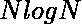

# Java |使用数组时处理 TLE While()函数

> 原文:[https://www . geesforgeks . org/Java-handling-tle-while-use-arrays-sort-function/](https://www.geeksforgeeks.org/java-handling-tle-while-using-arrays-sort-function/)

在编程中，如果不小心使用 [Arrays.sort()](https://www.geeksforgeeks.org/arrays-sort-in-java-with-examples/) 函数，Java 程序员通常会面临超过[时间限制或 TLE](https://www.geeksforgeeks.org/how-to-get-rid-of-java-tle-problem/) 的情况。

下面的 java 代码显示了普通的 Arrays.sort()函数的运行时间。

```
// Java program to show
// time taken by trivial Arrays.sort function

import java.util.Arrays;
import java.util.Calendar;

public class ArraySort {

    // function to fill array with values
    void fill(int a[], int n)
    {
        for (int i = 0; i < n; i++)
            a[i] = i + 1;
    }

    // function to check the performance
    // of trivial Arrays.sort() function
    void performanceCheckOfSorting()
    {
        // creating a class object
        ArraySort obj = new ArraySort();

        // variables to store start
        // and end of operation
        long startTime = 0l;
        long endTime = 0l;
        int array1[] = new int[100000];
        int n = array1.length;

        // calling function to fill array with
        // values
        obj.fill(array1, n);

        startTime = Calendar.getInstance()
                        .getTimeInMillis();
        // sorting the obtained array
        Arrays.sort(array1);
        endTime = Calendar.getInstance()
                      .getTimeInMillis();

        // printing the total time taken
        // by Arrays.sort in worst case
        System.out.println("Time Taken By The"
                           + " Use of Trivial "
                           + "Arrays.sort() function : "
                           + (endTime - startTime)
                           + "ms");
    }

    // Driver function
    public static void main(String args[])
    {
        // creating object of class
        ArraySort obj = new ArraySort();

        // calling function to compare performance
        obj.performanceCheckOfSorting();
    }
}
```

**Output:**

```
Time Taken By The Use of Trivial Arrays.sort() function : 31ms

```

正如我们所看到的，对 100 万个数字进行排序所花费的时间非常长，乍一看，这似乎没有那么长，但是在编程竞赛期间，每一毫秒都会带来不同。

**TLE 的原因:**
Arrays.sort()函数在实现中使用了快速排序。快速排序的最坏情况是 O( )，其中 N 是数组的大小。最坏的情况是输入数组已经排序，大多数时候问题设置者喜欢做这样的测试用例。

### 如何处理最坏的情况:

1.  **Using an Array Of Objects (Wrapper Classes of Primitives) Instead of Values:**
    Instead of using an array of values, sorting of object array takes lesser time. It is because Arrays.sort() function uses Merge Sort for sorting object array, which has a worst-case complexity of O() in comparison to quick sort’s O().

    下面的 java 代码显示了在值数组上使用 Arrays.sort()函数与在对象数组上使用 Arrays.sort()函数之间的运行时比较。

    ```
    // Java program to handle worst case
    // of Arrays.sort method

    import java.util.Arrays;
    import java.util.Calendar;

    public class ArraySort {

        // function to fill array with values
        void fill(int a[], int n)
        {
            for (int i = 0; i < n; i++)
                a[i] = i + 1;
        }

        // function to fill array with
        // objects
        void fill2(Integer a[], int n)
        {
            for (int i = 0; i < n; i++)
                a[i] = new Integer(i + 1);
        }

        // function to compare performance
        // of original and optimized method 1
        void performanceCheckOfSorting()
        {
            // creating a class object
            ArraySort obj = new ArraySort();

            // variables to store start
            // and end of operation
            long startTime = 0l;
            long endTime = 0l;

            // Method 1
            // Using Arrays.sort()
            int array1[] = new int[100000];
            int n = array1.length;

            // calling function to fill array with
            // values
            obj.fill(array1, n);

            startTime = Calendar.getInstance()
                            .getTimeInMillis();
            // sorting the obtained array
            Arrays.sort(array1);
            endTime = Calendar.getInstance()
                          .getTimeInMillis();

            // printing the total time taken
            // by Arrays.sort in worst case
            System.out.println("Time Taken By Arrays.sort"
                               + " Method On Values : "
                               + (endTime - startTime)
                               + "ms");

            // Method 2
            // Taking Array Of Type Object
            Integer array2[] = new Integer[n];

            // calling function to fill array with
            // objects of class Integer
            obj.fill2(array2, n);

            startTime = Calendar.getInstance()
                            .getTimeInMillis();
            Arrays.sort(array2);
            endTime = Calendar.getInstance()
                          .getTimeInMillis();

            // printing the total time taken
            // by Arrays.sort in case of object array
            System.out.println("Time Taken By Arrays.sort"
                               + " Method On Objects: "
                               + (endTime - startTime)
                               + "ms");
        }

        // Driver function
        public static void main(String args[])
        {
            // creating object of class
            ArraySort obj = new ArraySort();

            // calling function to compare performance
            obj.performanceCheckOfSorting();
        }
    }
    ```

    **Output:**

    ```
    Time Taken By Arrays.sort Method On Values : 31ms
    Time Taken By Arrays.sort Method On Objects : 19ms

    ```

    这里我们可以看到 Arrays.sort()函数对对象的数组进行排序所花费的时间少于数组的值。

2.  **Shuffling Before Sorting:**
    This method is most frequently used by competitive java programmers. The idea is to shuffle the whole input array
    before sorting, in this way the worst case of quicksort which arises in the case of the already sorted array is handled.
    Another benefit of this method is, it maintains the primitive nature of the array.

    在下面的 Java 程序中，我展示了 Arrays.sort()函数的简单使用和对整个数组进行洗牌后的比较。我还提供了用户定义的洗牌方法的实现，具有洗牌的复杂度 O( )，其中 N 是数组的大小。

    ```
    // Java program to handle worst-case
    // of Arrays.sort method

    import java.util.Arrays;
    import java.util.Calendar;

    public class ArraySort {

        // function to fill array with values
        void fill(int a[], int n)
        {
            for (int i = 0; i < n; i++)
                a[i] = i + 1;
        }

        // Java implementation of shuffle
        // function
        void shuffle(int a[], int n)
        {
            for (int i = 0; i < n; i++) {

                // getting the random index
                int t = (int)Math.random() * a.length;

                // and swapping values a random index
                // with the current index
                int x = a[t];
                a[t] = a[i];
                a[i] = x;
            }
        }

        // function to compare performance
        // of original and optimized method 2
        void performanceCheckOfSorting()
        {
            // creating a class object
            ArraySort obj = new ArraySort();

            // variables to store start
            // and end of operation
            long startTime = 0l;
            long endTime = 0l;

            // Using Arrays.sort()
            // without shuffling before sorting
            int array1[] = new int[100000];
            int n = array1.length;

            // calling function to fill array with
            // values
            obj.fill(array1, n);

            startTime = Calendar.getInstance()
                            .getTimeInMillis();
            // sorting the obtained array
            Arrays.sort(array1);
            endTime = Calendar.getInstance()
                          .getTimeInMillis();

            // printing the total time taken
            // by Arrays.sort in worst case
            System.out.println("Time Taken By Arrays.sort"
                               + " Method On Trivial Use: "
                               + (endTime - startTime)
                               + "ms");

            // Shuffling before Sorting
            // calling function to fill array with
            // values
            obj.fill(array1, n);

            // calling function to shuffle
            // obtained array
            obj.shuffle(array1, n);

            startTime = Calendar.getInstance()
                            .getTimeInMillis();
            Arrays.sort(array1);
            endTime = Calendar.getInstance()
                          .getTimeInMillis();

            // printing the total time taken
            // by Arrays.sort() function in case shuffling
            // of shuffling before sorting
            System.out.println("Time Taken By Arrays.sort"
                               + " Method After Shuffling "
                               + "Before Sorting : "
                               + (endTime - startTime)
                               + "ms");
        }

        // Driver function
        public static void main(String args[])
        {
            // creating object of class
            ArraySort obj = new ArraySort();

            // calling function to compare performance
            obj.performanceCheckOfSorting();
        }
    }
    ```

    **Output:**

    ```
    Time Taken By Arrays.sort() Function On Trivial Use : 31ms
    Time Taken By Arrays.sort() Function After Shuffling Before Sorting : 10ms

    ```

    这里，在这种情况下，我们看到在混洗的数组上使用 Arrays.sort()函数比在未混洗的数组上花费更少的时间。此外，对对象数组进行排序所花费的时间要比洗牌后对数组进行排序所花费的时间多。