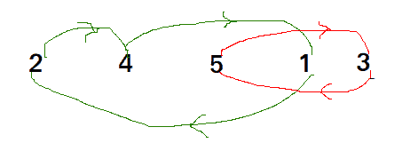
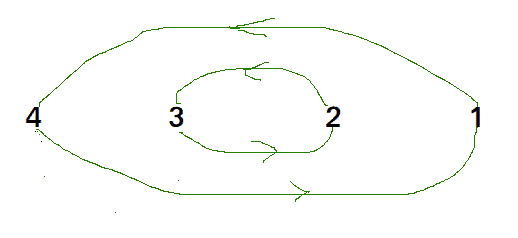

# 循环排序的 Java 程序

> 原文:[https://www.geeksforgeeks.org/java-program-for-cycle-sort/](https://www.geeksforgeeks.org/java-program-for-cycle-sort/)

循环排序是一种就地排序算法，[不稳定排序算法](https://en.wikipedia.org/wiki/Sorting_algorithm#Stability)，这是一种比较排序，就对原始阵列的总写入次数而言，理论上是最佳的。

*   就内存写入次数而言，它是最佳的。它[最小化要排序的内存写入次数](https://www.geeksforgeeks.org/which-sorting-algorithm-makes-minimum-number-of-writes/)(每个值要么被写入零次，如果它已经在它的正确位置，要么被写入一次到它的正确位置。)
*   It is based on the idea that array to be sorted can be divided into cycles. Cycles can be visualized as a graph. We have n nodes and an edge directed from node i to node j if the element at i-th index must be present at j-th index in the sorted array.
    Cycle in arr[] = {4, 5, 2, 1, 5}
    

    在 arr[]中循环= {4，3，2，1}
    

我们一个一个考虑所有的周期。我们首先考虑包含第一个元素的循环。我们找到第一个元素的正确位置，把它放在正确的位置，比如 j。我们考虑 arr[j]的旧值，找到它的正确位置，我们一直这样做，直到当前周期的所有元素都放在正确的位置，也就是说，我们没有回到周期的起点。

## Java 语言(一种计算机语言，尤用于创建网站)

```
// Java program to impleament cycle sort

import java.util.*;
import java.lang.*;

class GFG
{
// Function sort the array using Cycle sort
    public static void cycleSort (int arr[], int n)
    {
        // count number of memory writes
        int writes = 0;

        // traverse array elements and put it to on
        // the right place
        for (int cycle_start=0; cycle_start<=n-2; cycle_start++)
        {
            // initialize item as starting point
            int item = arr[cycle_start];

            // Find position where we put the item. We basically
            // count all smaller elements on right side of item.
            int pos = cycle_start;
            for (int i = cycle_start+1; i<n; i++)
                if (arr[i] < item)
                    pos++;

            // If item is already in correct position
            if (pos == cycle_start)
                continue;

            // ignore all duplicate elements
            while (item == arr[pos])
                pos += 1;

            // put the item to it\'s right position
            if (pos != cycle_start)
            {
                int temp = item;
                item = arr[pos];
                arr[pos] = temp;
                writes++;
            }

            // Rotate rest of the cycle
            while (pos != cycle_start)
            {
                pos = cycle_start;

                // Find position where we put the element
                for (int i = cycle_start+1; i<n; i++)
                    if (arr[i] < item)
                        pos += 1;

                // ignore all duplicate elements
                while (item == arr[pos])
                    pos += 1;

                // put the item to it\'s right position
                if (item != arr[pos])
                {
                    int temp = item;
                    item = arr[pos];
                    arr[pos] = temp;
                    writes++;
                }
            }
        }
    }

// Driver program to test above function
    public static void main(String[] args)
    {
        int arr[] = {1, 8, 3, 9, 10, 10, 2, 4 };
        int n = arr.length;
        cycleSort(arr, n) ;

        System.out.println("After sort : ");
        for (int i =0; i<n; i++)
            System.out.print(arr[i] + " ");
    }
}

// Code Contributed by Mohit Gupta_OMG <(0_o)>
```

**输出:**

```
After sort : 
1 2 3 4 8 9 10 10 

```

详情请参考[循环排序](https://www.geeksforgeeks.org/cycle-sort/)整篇文章！