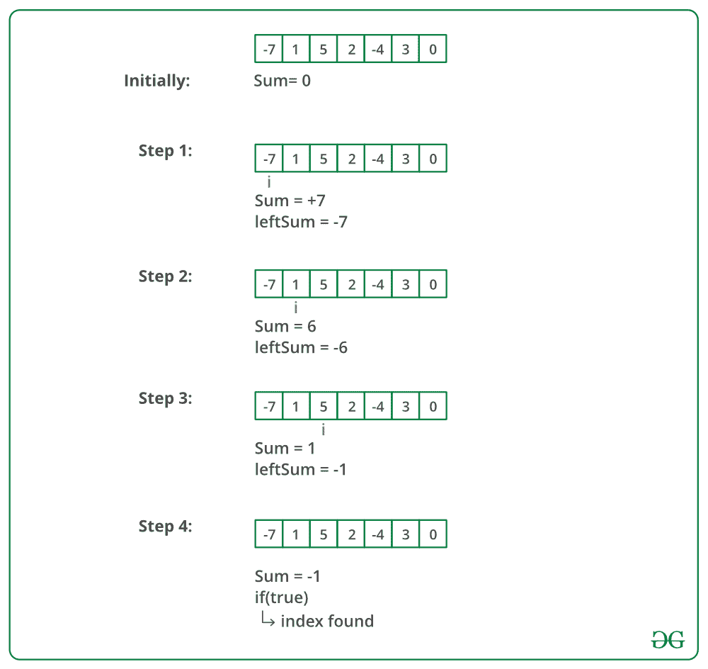

# 数组平衡索引的 Java 程序

> 原文:[https://www . geeksforgeeks . org/Java-平衡程序-数组索引/](https://www.geeksforgeeks.org/java-program-for-equilibrium-index-of-an-array/)

数组的平衡索引是这样一种索引，即较低索引处的元素之和等于较高索引处的元素之和。例如，在数组 A 中:

**示例:**

> **输入** : A[] = {-7，1，5，2，-4，3，0}
> 输出 : 3
> 3 是均衡指标，因为:
> A[0]+A[1]+A[2]= A[4]+A[5]+A[6]
> 
> **输入** : A[] = {1，2，3}
> **输出** : -1

写一个函数*int balance(int[]arr，int n)*；给定大小为 n 的序列 arr[,返回一个平衡指数(如果有的话),如果不存在平衡指数，则返回-1。

**方法 1(简单但低效)**
使用两个循环。外循环遍历所有元素，内循环找出外循环选择的当前索引是否为平衡索引。这个解决方案的时间复杂度是 O(n^2).

## Java 语言(一种计算机语言，尤用于创建网站)

```
// Java program to find equilibrium
// index of an array

class EquilibriumIndex {
    int equilibrium(int arr[], int n)
    {
        int i, j;
        int leftsum, rightsum;

        /* Check for indexes one by one until 
           an equilibrium index is found */
        for (i = 0; i < n; ++i) {

            /* get left sum */
            leftsum = 0;  
            for (j = 0; j < i; j++)
                leftsum += arr[j];

            /* get right sum */
            rightsum = 0;
            for (j = i + 1; j < n; j++)
                rightsum += arr[j];

            /* if leftsum and rightsum are same, 
               then we are done */
            if (leftsum == rightsum)
                return i;
        }

        /* return -1 if no equilibrium index is found */
        return -1;
    }
    // Driver code
    public static void main(String[] args)
    {
        EquilibriumIndex equi = new EquilibriumIndex();
        int arr[] = { -7, 1, 5, 2, -4, 3, 0 };
        int arr_size = arr.length;
        System.out.println(equi.equilibrium(arr, arr_size));
    }
}

// This code has been contributed by Mayank Jaiswal
```

**Output**

```
3
```

**时间复杂度:** O(n^2)

**方法二(刁钻高效)**
思路是先得到阵的总和。然后迭代数组并不断更新初始化为零的左和。在循环中，我们可以通过逐个减去元素得到正确的和。感谢 Sambasiva 提出了这个解决方案，并为此提供了代码。

```
1) Initialize leftsum  as 0
2) Get the total sum of the array as *sum*
3) Iterate through the array and for each index i, do following.
    a)  Update *sum* to get the right sum.  
           *sum* = *sum* - arr[i] 
       // *sum* is now right sum
    b) If leftsum is equal to *sum*, then return current index. 
       // update leftsum for next iteration.
    c) leftsum = leftsum + arr[i]
4) return -1 
// If we come out of loop without returning then
// there is no equilibrium index
```

下图显示了上述方法的试运行:



下面是上述方法的实现:

## Java 语言(一种计算机语言，尤用于创建网站)

```
// Java program to find equilibrium
// index of an array

class EquilibriumIndex {
    int equilibrium(int arr[], int n)
    {
        int sum = 0; // initialize sum of whole array
        int leftsum = 0; // initialize leftsum

        /* Find sum of the whole array */
        for (int i = 0; i < n; ++i)
            sum += arr[i];

        for (int i = 0; i < n; ++i) {
            sum -= arr[i]; // sum is now right sum for index i

            if (leftsum == sum)
                return i;

            leftsum += arr[i];
        }

        /* If no equilibrium index found, then return 0 */
        return -1;
    }

   // Driver code
    public static void main(String[] args)
    {
        EquilibriumIndex equi = new EquilibriumIndex();
        int arr[] = { -7, 1, 5, 2, -4, 3, 0 };
        int arr_size = arr.length;
        System.out.println("First equilibrium index is " + 
                          equi.equilibrium(arr, arr_size));
    }
}

// This code has been contributed by Mayank Jaiswal
```

**Output**

```
First equilibrium index is 3
```

**产量:**
第一均衡指数为 3

**时间复杂度:** O(n)

**方法 3 :**

这是一个非常简单直接的方法。想法是取数组的前缀和两次。一个来自阵列前端，另一个来自阵列后端。

在获取两个前缀和之后，运行一个循环并检查一些 I，如果一个数组的两个前缀和等于第二个数组的前缀和，那么该点可以被认为是平衡点。

## Java 语言(一种计算机语言，尤用于创建网站)

```
// Java program to find equilibrium
// index of an array
class GFG{

static int equilibrium(int a[], int n)
{ 
    if (n == 1)
        return (0);

    int[] front = new int[n];
    int[] back = new int[n];

    // Taking the prefixsum from front end array
    for (int i = 0; i < n; i++)
    {
        if (i != 0)
        {
            front[i] = front[i - 1] + a[i];
        }
        else 
        {
            front[i] = a[i];
        }
    }

    // Taking the prefixsum from back end of array
    for (int i = n - 1; i > 0; i--) 
    {
        if (i <= n - 2) 
        {
            back[i] = back[i + 1] + a[i];
        }
        else 
        {
            back[i] = a[i];
        }
    }

    // Checking for equilibrium index by
    //compairing front and back sums 
    for(int i = 0; i < n; i++) 
    {
        if (front[i] == back[i])
        {
            return i;
        }
    }

    // If no equilibrium index found,then return -1
    return -1;
}

// Driver code
public static void main(String[] args)
{
    int arr[] = { -7, 1, 5, 2, -4, 3, 0 };
    int arr_size = arr.length;

    System.out.println("First Point of equilibrium " +
                       "is at index " + 
                       equilibrium(arr, arr_size));
}
}

// This code is contributed by Lovish Aggarwal
```

**Output**

```
First Point of equilibrium is at index 3
```

**时间复杂度:** O(N)

**空间复杂度:** O(N)

更多详情请参考完整文章[数组平衡指数](https://www.geeksforgeeks.org/equilibrium-index-of-an-array/)！