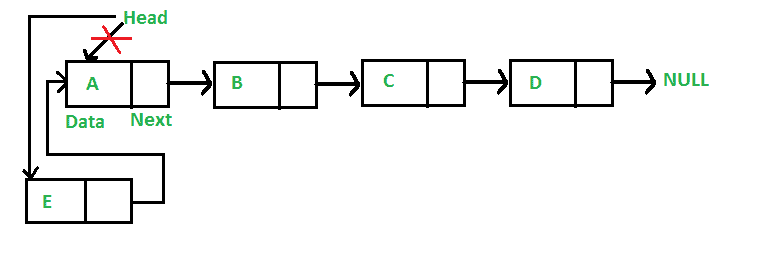
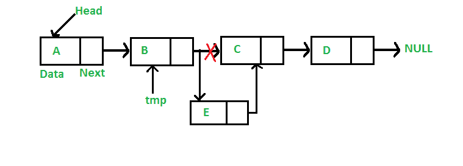

# 用于在链表中插入节点的 Java 程序

> 原文:[https://www . geesforgeks . org/Java-插入链表中节点的程序/](https://www.geeksforgeeks.org/java-program-for-inserting-a-node-in-a-linked-list/)

我们已经在[之前的帖子](https://www.geeksforgeeks.org/linked-list-set-1-introduction/)中引入了链表。我们还创建了一个简单的 3 节点链表，并讨论了链表遍历。
本文讨论的所有程序都考虑了链表的以下表示。

## Java 语言(一种计算机语言，尤用于创建网站)

```
// Linked List Class
class LinkedList
{
    // Head of list
    Node head;  

    // Node Class 
    class Node
    {
        int data;
        Node next;

        // Constructor to create
        // a new node
        Node(int d) 
        {
            data = d; 
            next = null; 
        }
    }
}
```

在这篇文章中，讨论了在链表中插入一个新节点的方法。一个节点可以通过三种方式添加
**1)** 在链表的前面
**2)** 在给定的节点之后。
**3)** 在链表的末尾。

**在前面添加一个节点:(4 步流程)**
新节点总是添加在给定链表的头部之前。新添加的节点成为链表的新头。例如，如果给定的链接列表是 10- > 15- > 20- > 25，并且我们在前面添加了项目 5，则链接列表变成 5->10->15->20->25。让我们调用在列表前面添加的函数是 push()。push()必须接收指向头指针的指针，因为 push 必须更改头指针以指向新节点(参见[本](https://www.geeksforgeeks.org/how-to-write-functions-that-modify-the-head-pointer-of-a-linked-list/)

[](https://media.geeksforgeeks.org/wp-content/cdn-uploads/gq/2013/03/Linkedlist_insert_at_start.png)

以下是在前端添加节点的 4 个步骤。

## Java 语言(一种计算机语言，尤用于创建网站)

```
/* This function is in LinkedList class. Inserts a
   new Node at front of the list. This method is 
   defined inside LinkedList class shown above */
public void push(int new_data)
{
    /* 1 & 2: Allocate the Node &
              Put in the data*/
    Node new_node = new Node(new_data);

    // 3\. Make next of new Node as head 
    new_node.next = head;

    // 4\. Move the head to point to 
    // new Node 
    head = new_node;
}
```

push()的时间复杂度是 O(1)，因为它做的功是恒定的。
**给定节点后添加节点:(5 步流程)**
给我们一个节点的指针，新节点插入给定节点后。

[](https://media.geeksforgeeks.org/wp-content/cdn-uploads/gq/2013/03/Linkedlist_insert_middle.png) 

## Java 语言(一种计算机语言，尤用于创建网站)

```
/* This function is in LinkedList class. 
   Inserts a new node after the given 
   prev_node. This method is defined 
   inside LinkedList class shown above */
public void insertAfter(Node prev_node, 
                        int new_data) 
{ 
    // 1\. Check if the given Node is null 
    if (prev_node == null) 
    { 
        System.out.println(
               "The given previous node cannot be null"); 
        return; 
    } 

    /* 2\. Allocate the Node & 
       3\. Put in the data*/
    Node new_node = new Node(new_data); 

    // 4\. Make next of new Node as next
    // of prev_node 
    new_node.next = prev_node.next; 

    // 5\. make next of prev_node as new_node 
    prev_node.next = new_node; 
}
```

insertAfter()的时间复杂度是 O(1)，因为它做的功是恒定的。

**在末尾添加节点:(6 步流程)**
新节点总是添加在给定链表的最后一个节点之后。例如，如果给定的链接列表是 5- > 10- > 15- > 20- > 25，并且我们在末尾添加了项目 30，则链接列表将变成 5->10->15->20->25->30。
由于链表通常由链表的头来表示，所以我们必须遍历链表直到结束，然后将倒数第二个节点更改为新节点。

[](https://media.geeksforgeeks.org/wp-content/cdn-uploads/gq/2013/03/Linkedlist_insert_last.png)

下面是在末尾添加节点的 6 个步骤。

## Java 语言(一种计算机语言，尤用于创建网站)

```
/* Appends a new node at the end.  This method is 
   defined inside LinkedList class shown above */
public void append(int new_data)
{
    /* 1\. Allocate the Node &
       2\. Put in the data
       3\. Set next as null */
    Node new_node = new Node(new_data);

    /* 4\. If the Linked List is empty, then 
          make the new node as head */
    if (head == null)
    {
        head = new Node(new_data);
        return;
    }

    /* 4\. This new node is going to be the 
          last node, so make next of it 
          as null */
    new_node.next = null;

    // 5\. Else traverse till the last node 
    Node last = head; 
    while (last.next != null)
        last = last.next;

    // 6\. Change the next of last node 
    last.next = new_node;
    return;
}
```

追加的时间复杂度为 O(n)，其中 n 是链表中的节点数。因为从头到尾有一个循环，所以函数做 O(n)工作。
这个方法也可以通过保持一个额外的指针指向链表的尾部/

下面是一个完整的程序，使用上述所有方法来创建一个链表。

## Java 语言(一种计算机语言，尤用于创建网站)

```
// A complete working Java program to 
// demonstrate all insertion methods
// on linked list
class LinkedList
{
    // head of list
    Node head;  

    // Linked list Node
    class Node
    {
        int data;
        Node next;
        Node(int d) 
        {
            data = d; 
            next = null; 
        }
    }

    // Inserts a new Node at front 
    // of the list. 
    public void push(int new_data)
    {
        /* 1 & 2: Allocate the Node &
                  Put in the data*/
        Node new_node = new Node(new_data);

        // 3\. Make next of new Node as head 
        new_node.next = head;

        // 4\. Move the head to point to
        // new Node 
        head = new_node;
    }

    // Inserts a new node after the 
    // given prev_node. 
    public void insertAfter(Node prev_node, 
                            int new_data)
    {
        // 1\. Check if the given Node is null 
        if (prev_node == null)
        {
            System.out.println(
                   "The given previous node cannot be null");
            return;
        }

        /* 2 & 3: Allocate the Node &
                  Put in the data*/
        Node new_node = new Node(new_data);

        // 4\. Make next of new Node as next 
        // of prev_node 
        new_node.next = prev_node.next;

        // 5\. make next of prev_node as 
        // new_node 
        prev_node.next = new_node;
    }

    /* Appends a new node at the end. 
       This method is defined inside 
       LinkedList class shown above */
    public void append(int new_data)
    {
        /* 1\. Allocate the Node &
           2\. Put in the data
           3\. Set next as null */
        Node new_node = new Node(new_data);

        /* 4\. If the Linked List is empty, 
              then make the new node as head */
        if (head == null)
        {
            head = new Node(new_data);
            return;
        }

        /* 4\. This new node is going to be 
              the last node, so make next 
              of it as null */
        new_node.next = null;

        // 5\. Else traverse till the last node 
        Node last = head; 
        while (last.next != null)
            last = last.next;

        // 6\. Change the next of last node 
        last.next = new_node;
        return;
    }

    /* This function prints contents of 
       linked list starting from the 
       given node */
    public void printList()
    {
        Node tnode = head;
        while (tnode != null)
        {
            System.out.print(tnode.data + " ");
            tnode = tnode.next;
        }
    }

    // Driver code
    public static void main(String[] args)
    {
        // Start with the empty list 
        LinkedList llist = new LinkedList();

        // Insert 6\. So linked list 
        // becomes 6->NUllist
        llist.append(6);

        // Insert 7 at the beginning. 
        // So linked list becomes 
        // 7->6->NUllist
        llist.push(7);

        // Insert 1 at the beginning. 
        // So linked list becomes
        // 1->7->6->NUllist
        llist.push(1);

        // Insert 4 at the end. 
        // So linked list becomes
        // 1->7->6->4->NUllist
        llist.append(4);

        // Insert 8, after 7\. So linked 
        // list becomes
        // 1->7->8->6->4->NUllist
        llist.insertAfter(llist.head.next, 8);

        System.out.println(
               "Created Linked list is: ");
        llist.printList();
    }
}
// This code is contributed by Rajat Mishra
```

**输出:**

```
 Created Linked list is:  1  7  8  6  4
```

详情请参考[链表|集合 2(插入节点)](https://www.geeksforgeeks.org/linked-list-set-2-inserting-a-node/)整篇文章！