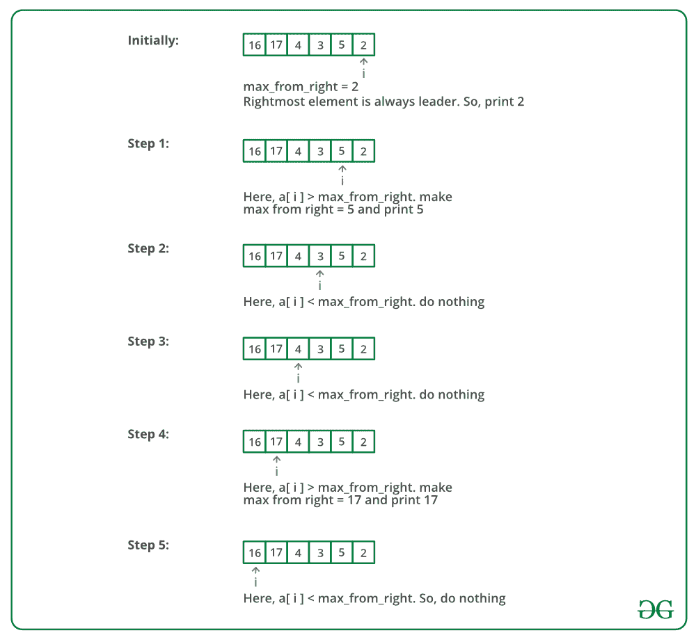

# 面向数组中领导者的 Java 程序

> 原文:[https://www . geesforgeks . org/Java-面向阵列领导者的程序/](https://www.geeksforgeeks.org/java-program-for-leaders-in-an-array/)

编写一个程序来打印数组中的所有 LEADERS。如果某个元素大于其右侧的所有元素，则该元素为引线。最右边的元素总是一个领导者。例如，在数组{16，17，4，3，5，2}中，前导是 17，5 和 2。
让输入数组为 arr[]，数组的大小为*大小*。

**方法 1(简单)**
使用两个循环。外部循环从 0 到 size–1 运行，并从左到右逐一挑选所有元素。内部循环将拾取的元素与其右侧的所有元素进行比较。如果拾取的元素大于其右侧的所有元素，则拾取的元素是引线。

## Java 语言(一种计算机语言，尤用于创建网站)

```
class LeadersInArray 
{
    /*Java Function to print leaders in an array */
    void printLeaders(int arr[], int size) 
    {
        for (int i = 0; i < size; i++) 
        {
            int j;
            for (j = i + 1; j < size; j++) 
            {
                if (arr[i] <=arr[j])
                    break;
            }
            if (j == size) // the loop didn't break
                System.out.print(arr[i] + " ");
        }
    }

    /* Driver program to test above functions */
    public static void main(String[] args) 
    {
        LeadersInArray lead = new LeadersInArray();
        int arr[] = new int[]{16, 17, 4, 3, 5, 2};
        int n = arr.length;
        lead.printLeaders(arr, n);
    }
}
```

**输出:**

```
17 5 2
```

**时间复杂度:** O(n*n)
**方法 2(从右扫描)**
从右到左扫描一个数组中的所有元素，一直跟踪最大值到现在。当最大值改变时，打印它。
下图是上述方法的模拟运行:



以下是上述方法的实现:

## Java 语言(一种计算机语言，尤用于创建网站)

```
class LeadersInArray 
{
    /* Java Function to print leaders in an array */
    void printLeaders(int arr[], int size)
    {
        int max_from_right =  arr[size-1];

        /* Rightmost element is always leader */
        System.out.print(max_from_right + " ");

        for (int i = size-2; i >= 0; i--)
        {
            if (max_from_right < arr[i])
            {           
            max_from_right = arr[i];
            System.out.print(max_from_right + " ");
            }
        }    
    }

    /* Driver program to test above functions */
    public static void main(String[] args) 
    {
        LeadersInArray lead = new LeadersInArray();
        int arr[] = new int[]{16, 17, 4, 3, 5, 2};
        int n = arr.length;
        lead.printLeaders(arr, n);
    }
}
```

**输出:**

```
2 5 17
```

**时间复杂度:** O(n)

更多详情请参考[阵中领袖](https://www.geeksforgeeks.org/leaders-in-an-array/)整篇文章！