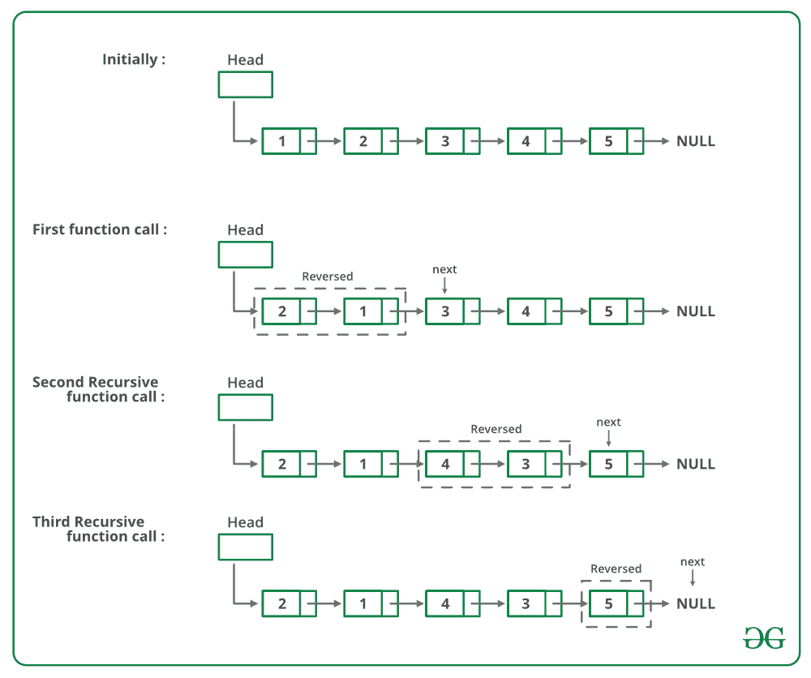

# 给定链表成对交换元素的 Java 程序

> 原文:[https://www . geeksforgeeks . org/Java-程序对成对交换给定链表的元素/](https://www.geeksforgeeks.org/java-program-for-pairwise-swapping-elements-of-a-given-linked-list/)

给定一个单链表，编写一个成对交换元素的函数。

```
Input: 1->2->3->4->5->6->NULL 
Output: 2->1->4->3->6->5->NULL

Input: 1->2->3->4->5->NULL 
Output: 2->1->4->3->5->NULL

Input: 1->NULL 
Output: 1->NULL

```

例如，如果链表是 1->2->3->4->5，那么函数应该将其改为 2->1->4->3->5，如果链表是，那么函数应该将其改为。

**方法 1(迭代):**
从头节点开始遍历列表。同时用下一个节点的数据遍历每个节点的交换数据。
以下是上述方法的实施:

## Java 语言(一种计算机语言，尤用于创建网站)

```
// Java program to pairwise swap 
// elements of a linked list
class LinkedList 
{
    // Head of list
    Node head; 

    // Linked list Node
    class Node 
    {
        int data;
        Node next;
        Node(int d)
        {
            data = d;
            next = null;
        }
    }

    void pairWiseSwap()
    {
        Node temp = head;

        /* Traverse only till there are 
           atleast 2 nodes left */
        while (temp != null && 
               temp.next != null) 
        {
            // Swap the data 
            int k = temp.data;
            temp.data = temp.next.data;
            temp.next.data = k;
            temp = temp.next.next;
        }
    }

    // Utility functions 
    /* Inserts a new Node at front of 
       the list. */
    public void push(int new_data)
    {
        /* 1 & 2: Allocate the Node &
                  Put in the data*/
        Node new_node = new Node(new_data);

        // 3\. Make next of new Node as head 
        new_node.next = head;

        // 4\. Move the head to point to
        // new Node 
        head = new_node;
    }

    // Function to print linked list 
    void printList()
    {
        Node temp = head;
        while (temp != null) 
        {
            System.out.print(temp.data + " ");
            temp = temp.next;
        }
        System.out.println();
    }

    // Driver code
    public static void main(String args[])
    {
        LinkedList llist = new LinkedList();

        /* Created Linked List 
           1->2->3->4->5 */
        llist.push(5);
        llist.push(4);
        llist.push(3);
        llist.push(2);
        llist.push(1);

        System.out.println(
               "Linked List before calling pairWiseSwap() ");
        llist.printList();

        llist.pairWiseSwap();

        System.out.println(
               "Linked List after calling pairWiseSwap() ");
        llist.printList();
    }
}
// This code is contributed by Rajat Mishra 
```

**输出:**

```
Linked list before calling pairWiseSwap()
1 2 3 4 5 
Linked list after calling pairWiseSwap()
2 1 4 3 5 
```

**时间复杂度:** O(n)

**方法 2(递归):**
如果链表中有 2 个或 2 个以上的节点，那么交换前两个节点，递归调用链表的其余部分。
下图是上述方法的试运行:



下面是上述方法的实现:

## Java 语言(一种计算机语言，尤用于创建网站)

```
/* Recursive function to pairwise swap 
   elements of a linked list */
static void pairWiseSwap(node head)
{
    /* There must be at-least two nodes 
       in the list */
    if (head != null && 
        head.next != null) 
    {
        /* Swap the node's data with data 
           of next node */
        swap(head.data, head.next.data);

        /* Call pairWiseSwap() for rest of 
           the list */
        pairWiseSwap(head.next.next);
    }
}
// This code is contributed by aashish1995 
```

**时间复杂度:** O(n)
这里提供的解决方案是交换节点的数据。如果数据包含许多字段，将会有许多交换操作。参见 [**这个**](https://www.geeksforgeeks.org/pairwise-swap-elements-of-a-given-linked-list-by-changing-links/) **了解一个改变链接而不是交换数据的实现。**

**更多详情请参考完整文章[给定链表](https://www.geeksforgeeks.org/pairwise-swap-elements-of-a-given-linked-list/)的成对交换元素！**