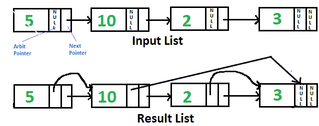

# 用于将仲裁指针指向链表中最大值右侧节点的 Java 程序

> 原文:[https://www . geesforgeks . org/Java-program-for-pointing-arbitr-指向最大值的指针-右侧-链表中的节点/](https://www.geeksforgeeks.org/java-program-for-pointing-arbit-pointer-to-greatest-value-right-side-node-in-a-linked-list/)

给定单链表，每个节点都有一个额外的“任意”指针，该指针当前指向空。我们需要将“任意”指针指向右侧链表中最大值的节点。



一个**简单的解决方案**就是逐个遍历所有节点。对于每个节点，找到右侧值最大的节点，并更改下一个指针。该解决方案的时间复杂度为 0(n<sup>2</sup>)。

一个**高效的解决方案**可以在 O(n)时间内工作。以下是步骤。

1.  反转给定的链表。
2.  开始遍历链表并存储到目前为止遇到的最大值节点。使每个节点的仲裁指向 max。如果到目前为止，当前节点中的数据多于 max 节点，请更新 max。
3.  反向修改链表和返回头。

下面是上述步骤的实现。

## Java 语言(一种计算机语言，尤用于创建网站)

```
// Java program to point arbit pointers 
// to highest value on its right 
class GfG{ 

// Link list node 
static class Node 
{ 
    int data; 
    Node next, arbit; 
}

/* Function to reverse the 
   linked list */
static Node reverse(Node head) 
{ 
    Node prev = null, 
         current = head, next = null; 
    while (current != null) 
    { 
        next = current.next; 
        current.next = prev; 
        prev = current; 
        current = next; 
    } 
    return prev; 
} 

// This function populates arbit pointer 
// in every node to the greatest value 
// to its right. 
static Node populateArbit(Node head) 
{ 
    // Reverse given linked list 
    head = reverse(head); 

    // Initialize pointer to maximum 
    // value node 
    Node max = head; 

    // Traverse the reversed list 
    Node temp = head.next; 
    while (temp != null) 
    { 
        // Connect max through arbit 
        // pointer 
        temp.arbit = max; 

        // Update max if required 
        if (max.data < temp.data) 
            max = temp; 

        // Move ahead in reversed list 
        temp = temp.next; 
    } 

    // Reverse modified linked list 
    // and return head. 
    return reverse(head); 
} 

// Utility function to print result 
// linked list 
static void printNextArbitPointers(Node node) 
{ 
    System.out.println("Node    " +
                       "Next Pointer    " +
                       "Arbit Pointer"); 
    while (node != null) 
    { 
        System.out.print(node.data + 
                         "        "); 

        if (node.next != null) 
            System.out.print(node.next.data + 
                             "        "); 
        else
            System.out.print("NULL" +
                             "        "); 

        if (node.arbit != null) 
            System.out.print(node.arbit.data); 
        else
            System.out.print("NULL"); 

        System.out.println(); 
        node = node.next; 
    } 
} 

/* Function to create a new node 
   with given data */
static Node newNode(int data) 
{ 
    Node new_node = new Node(); 
    new_node.data = data; 
    new_node.next = null; 
    return new_node; 
} 

// Driver code
public static void main(String[] args) 
{ 
    Node head = newNode(5); 
    head.next = newNode(10); 
    head.next.next = newNode(2); 
    head.next.next.next = newNode(3); 

    head = populateArbit(head); 

    System.out.println(
           "Resultant Linked List is: "); 
    printNextArbitPointers(head); 
}
} 
// This code is contributed by Prerna Saini.
```

**输出:**

```
Resultant Linked List is: 
Node    Next Pointer    Arbit Pointer
5               10              10
10              2               3
2               3               3
3               NULL            NULL
```

**递归求解:**
我们可以递归到达最后一个节点，从头到尾遍历链表。递归解决方案不需要反转链表。我们也可以用堆栈代替递归来临时保存节点。感谢 Santosh Kumar Mishra 提供了这个解决方案。

## Java 语言(一种计算机语言，尤用于创建网站)

```
// Java program to point arbit pointers 
// to highest value on its right
class GfG
{
    // Link list node 
    static class Node
    {
        int data;
        Node next, arbit;
    }

    static Node maxNode;

    // This function populates arbit pointer 
    // in every node to the greatest value 
    // to its right.
    static void populateArbit(Node head)
    {
        // if head is null simply return 
        // the list
        if (head == null)
            return;

        /* if head->next is null it means we 
           reached at the last node just update 
           the max and maxNode */
        if (head.next == null)
        {
            maxNode = head;
            return;
        }

        /* Calling the populateArbit to the 
           next node */
        populateArbit(head.next);

        /* updating the arbit node of the current
           node with the maximum value on the 
           right side */
        head.arbit = maxNode;

        /* if current Node value id greater then
           the previous right node then update it */
        if (head.data > maxNode.data)
            maxNode = head;

        return;
    }

    // Utility function to print result 
    // linked list
    static void printNextArbitPointers(Node node)
    {
        System.out.println("Node    " + 
                           "Next Pointer    " + 
                           "Arbit Pointer");
        while (node != null)
        {
            System.out.print(node.data + 
                             "            ");

            if (node.next != null)
                System.out.print(node.next.data + 
                                 "                ");
            else
                System.out.print("NULL" +
                                 "            ");

            if (node.arbit != null)
                System.out.print(node.arbit.data);
            else
                System.out.print("NULL");

            System.out.println();
            node = node.next;
        }
    }

    /* Function to create a new node 
       with given data */
    static Node newNode(int data)
    {
        Node new_node = new Node();
        new_node.data = data;
        new_node.next = null;
        return new_node;
    }

    // Driver code
    public static void main(String[] args)
    {
        Node head = newNode(5);
        head.next = newNode(10);
        head.next.next = newNode(2);
        head.next.next.next = newNode(3);

        populateArbit(head);

        System.out.println(
               "Resultant Linked List is: ");
        printNextArbitPointers(head);
    }
}
// This code is contributed by shubham96301    
```

**输出:**

```
Resultant Linked List is: 
Node    Next Pointer    Arbit Pointer
5               10              10
10              2               3
2               3               3
3               NULL            NULL
```

更多详情请参考完整文章[将仲裁指针指向链表](https://www.geeksforgeeks.org/point-arbit-pointer-greatest-value-right-side-node-linked-list/)右侧最大值节点！