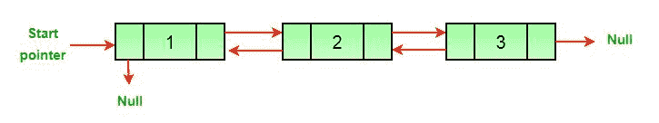
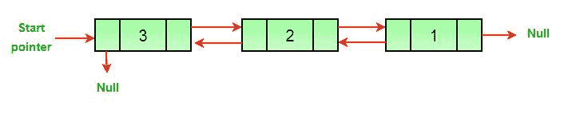

# 用于反转双向链表的 Java 程序

> 原文:[https://www . geesforgeks . org/Java-程序换向-双链表/](https://www.geeksforgeeks.org/java-program-for-reversing-a-doubly-linked-list/)

给定一个[双链表](https://www.geeksforgeeks.org/doubly-linked-list/)，任务是反转给定的双链表。

例如，见下图。

```
(a) Original Doubly Linked List 
```



```
(b) Reversed Doubly Linked List 
```



这里有一个简单的方法来反转双向链表。我们所需要做的就是交换所有节点的上一个和下一个指针，改变头(或开始)的上一个，最后改变头指针。

## Java 语言(一种计算机语言，尤用于创建网站)

```
// Java program to reverse a doubly 
// linked list
class LinkedList 
{
    static Node head;
    static class Node 
    {
        int data;
        Node next, prev;
        Node(int d)
        {
            data = d;
            next = prev = null;
        }
    }

    /* Function to reverse a Doubly 
       Linked List */
    void reverse()
    {
        Node temp = null;
        Node current = head;

        /* Swap next and prev for all nodes 
           of doubly linked list */
        while (current != null) 
        {
            temp = current.prev;
            current.prev = current.next;
            current.next = temp;
            current = current.prev;
        }

        /* Before changing head, check for the 
           cases like empty list and list with 
           only one node */
        if (temp != null) 
        {
            head = temp.prev;
        }
    }

    // UTILITY FUNCTIONS 
    /* Function to insert a node at the 
       beginning of the Doubly Linked List */
    void push(int new_data)
    {
        // Allocate node 
        Node new_node = new Node(new_data);

        /* Since we are adding at the beginning,
           prev is always NULL */
        new_node.prev = null;

        // Link the old list off the new node 
        new_node.next = head;

        /* Change prev of head node to 
           new node */
        if (head != null) {
            head.prev = new_node;
        }

        /* Move the head to point to the 
           new node */
        head = new_node;
    }

    /* Function to print nodes in a given 
       doubly linked list. This function is 
       same as printList() of singly linked
       list */
    void printList(Node node)
    {
        while (node != null) 
        {
            System.out.print(node.data + " ");
            node = node.next;
        }
    }

    public static void main(String[] args)
    {
        LinkedList list = new LinkedList();

        /* Let us create a sorted linked list 
           to test the functions Created linked 
           list will be 10->8->4->2 */
        list.push(2);
        list.push(4);
        list.push(8);
        list.push(10);

        System.out.println(
        "Original linked list ");
        list.printList(head);

        list.reverse();
        System.out.println("");
        System.out.println(
        "The reversed Linked List is ");
        list.printList(head);
    }
}
// This code is contributed by Mayank Jaiswal
```

**输出:**

```
Original linked list 
10 8 4 2 
The reversed Linked List is 
2 4 8 10
```

**时间复杂度:** O(N)，其中 N 表示双向链表中的节点数。
辅助空间:O(1)
我们也可以交换数据而不是指针来反转双链表。[反转数组的方法](https://www.geeksforgeeks.org/write-a-program-to-reverse-an-array-or-string/)可以用来交换数据。与指针相比，如果数据项的大小更大，交换数据的成本会更高。
如发现以上代码/算法有不正确的地方，请写评论，或者找到更好的方法解决同样的问题。

**方法二:**

同样的问题也可以用 Stacks 来做。

步骤:

1.  继续在堆栈中推送节点的数据。-> O(n)
2.  不断弹出元素并更新双向链表

## Java 语言(一种计算机语言，尤用于创建网站)

```
// Java program to reverse a doubly 
// linked list
import java.util.*;
class LinkedList 
{
    static Node head;

    static class Node 
    {
        int data;
        Node next, prev;

        Node(int d)
        {
            data = d;
            next = prev = null;
        }
    }

    /* Function to reverse a Doubly Linked 
       List using Stacks */
    void reverse()
    {
        Stack<Integer> stack = new Stack<>();
        Node temp = head;
        while (temp != null) 
        {
            stack.push(temp.data);
            temp = temp.next;
        }
        // Added all the elements sequence 
        // wise in the stack
        temp = head;
        while (temp != null) 
        {
            temp.data = stack.pop();
            temp = temp.next;
        }

        // Popped all the elements and the 
        // added in the linked list,
        // which are in the reversed order.
    }

    // UTILITY FUNCTIONS 
    /* Function to insert a node at the 
       beginning of the Doubly Linked List */
    void push(int new_data)
    {
        // Allocate node 
        Node new_node = new Node(new_data);

        /* Since we are adding at the beginning,
           prev is always NULL */
        new_node.prev = null;

        /* Link the old list off the new node */
        new_node.next = head;

        /* Change prev of head node to 
           new node */
        if (head != null) 
        {
            head.prev = new_node;
        }

        /* move the head to point to the new node */
        head = new_node;
    }

    /* Function to print nodes in a given doubly linked list
     This function is same as printList() of singly linked
     list */
    void printList(Node node)
    {
        while (node != null) {
            System.out.print(node.data + " ");
            node = node.next;
        }
    }

    // Driver Code
    public static void main(String[] args)
    {
        LinkedList list = new LinkedList();

        /* Let us create a sorted linked list to test the
         functions Created linked list will be 10->8->4->2
       */
        list.push(2);
        list.push(4);
        list.push(8);
        list.push(10);

        System.out.println(
        "Original linked list ");
        list.printList(head);

        list.reverse();
        System.out.println("");
        System.out.println(
        "The reversed Linked List is ");
        list.printList(head);
    }
}
// This code is contributed by Rashita Mehta
```

**输出:**

```
Original linked list 
10 8 4 2 
The reversed Linked List is 
2 4 8 10
```

**时间复杂度:**O(N)
T3】辅助空间: O(N)

在这个方法中，我们遍历链表一次，并将元素添加到堆栈中，然后再次遍历整个链表来更新所有元素。整体耗时 2n，是 O(n)的时间复杂度。

更多详情请参考[反向双链表](https://www.geeksforgeeks.org/reverse-a-doubly-linked-list/)整篇文章！