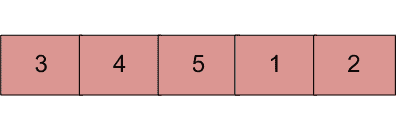

# 在排序和旋转数组中搜索元素的 Java 程序

> 原文:[https://www . geesforgeks . org/Java-program-for-search-a-element-in-a-sorted-and-rotated-array/](https://www.geeksforgeeks.org/java-program-for-search-an-element-in-a-sorted-and-rotated-array/)

排序数组中的元素可以通过[二分搜索法](https://www.geeksforgeeks.org/binary-search/)在 O(log n)时间内找到。但是假设我们在你事先不知道的某个枢轴上旋转一个升序排序的数组。举个例子，1 2 3 4 5 可能变成 3 4 5 1 2。设计一种方法，在 O(log n)时间内找到旋转数组中的元素。



**例:**

```
Input  : arr[] = {5, 6, 7, 8, 9, 10, 1, 2, 3};
         key = 3
Output : Found at index 8

Input  : arr[] = {5, 6, 7, 8, 9, 10, 1, 2, 3};
         key = 30
Output : Not found

Input : arr[] = {30, 40, 50, 10, 20}
        key = 10   
Output : Found at index 3
```

**这里提供的所有解决方案都假设数组中的所有元素都是不同的。**
**<u>基本解:</u>**
**进场:**

1.  其思想是找到枢轴点，将数组分成两个子数组并执行二分搜索法运算。
2.  查找透视的主要思想是–对于排序(按递增顺序)和透视数组，透视元素是其下一个元素小于它的唯一元素。
3.  利用上面的说法和二分搜索法的支点可以找到。
4.  找到轴心后，将数组分成两个子数组。
5.  现在，单独的子数组被排序，因此可以使用二分搜索法搜索元素。

**执行:**

```
Input arr[] = {3, 4, 5, 1, 2}
Element to Search = 1
  1) Find out pivot point and divide the array in two
      sub-arrays. (pivot = 2) /*Index of 5*/
  2) Now call binary search for one of the two sub-arrays.
      (a) If element is greater than 0th element then
             search in left array
      (b) Else Search in right array
          (1 will go in else as 1 < 0th element(3))
  3) If element is found in selected sub-array then return index
     Else return -1.
```

以下是上述方法的实现:

## Java 语言(一种计算机语言，尤用于创建网站)

```
/* Java program to search an element 
   in a sorted and pivoted array*/

class Main {

    /* Searches an element key in a 
       pivoted sorted array arrp[]
       of size n */
    static int pivotedBinarySearch(int arr[], int n, int key)
    {
        int pivot = findPivot(arr, 0, n - 1);

        // If we didn't find a pivot, then
        // array is not rotated at all
        if (pivot == -1)
            return binarySearch(arr, 0, n - 1, key);

        // If we found a pivot, then first
        // compare with pivot and then
        // search in two subarrays around pivot
        if (arr[pivot] == key)
            return pivot;
        if (arr[0] <= key)
            return binarySearch(arr, 0, pivot - 1, key);
        return binarySearch(arr, pivot + 1, n - 1, key);
    }

    /* Function to get pivot. For array 
       3, 4, 5, 6, 1, 2 it returns
       3 (index of 6) */
    static int findPivot(int arr[], int low, int high)
    {
        // base cases
        if (high < low)
            return -1;
        if (high == low)
            return low;

        /* low + (high - low)/2; */
        int mid = (low + high) / 2;
        if (mid < high && arr[mid] > arr[mid + 1])
            return mid;
        if (mid > low && arr[mid] < arr[mid - 1])
            return (mid - 1);
        if (arr[low] >= arr[mid])
            return findPivot(arr, low, mid - 1);
        return findPivot(arr, mid + 1, high);
    }

    /* Standard Binary Search function */
    static int binarySearch(int arr[], int low, int high, int key)
    {
        if (high < low)
            return -1;

        /* low + (high - low)/2; */
        int mid = (low + high) / 2;
        if (key == arr[mid])
            return mid;
        if (key > arr[mid])
            return binarySearch(arr, (mid + 1), high, key);
        return binarySearch(arr, low, (mid - 1), key);
    }

    // main function
    public static void main(String args[])
    {
        // Let us search 3 in below array
        int arr1[] = { 5, 6, 7, 8, 9, 10, 1, 2, 3 };
        int n = arr1.length;
        int key = 3;
        System.out.println("Index of the element is : "
                           + pivotedBinarySearch(arr1, n, key));
    }
}
```

**输出:**

```
Index of the element is : 8
```

**复杂度分析:**

*   **时间复杂度:** O(log n)。
    二分搜索法需要对数 n 比较来找到元素。所以时间复杂度为 O(log n)。
*   **空间复杂度:** O(1)，不需要额外空间。

*感谢 Ajay Mishra 的初步解答。*
**<u>改良方案:</u>**
**进场:**代替二分搜索法的两次或两次以上传球，结果可以在二分搜索法的一次传球中找到。需要修改二分搜索法号来执行搜索。其思想是创建一个递归函数，将 l 和 r 作为输入和键的范围。

```
1) Find middle point mid = (l + h)/2
2) If key is present at middle point, return mid.
3) Else If arr[l..mid] is sorted
    a) If key to be searched lies in range from arr[l]
       to arr[mid], recur for arr[l..mid].
    b) Else recur for arr[mid+1..h]
4) Else (arr[mid+1..h] must be sorted)
    a) If key to be searched lies in range from arr[mid+1]
       to arr[h], recur for arr[mid+1..h].
    b) Else recur for arr[l..mid] 
```

以下是上述思路的实现:

## Java 语言(一种计算机语言，尤用于创建网站)

```
/* Java program to search an element in 
   sorted and rotated array using
   single pass of Binary Search*/

class Main {
    // Returns index of key in arr[l..h]
    // if key is present, otherwise returns -1
    static int search(int arr[], int l, int h, int key)
    {
        if (l > h)
            return -1;

        int mid = (l + h) / 2;
        if (arr[mid] == key)
            return mid;

        /* If arr[l...mid] first subarray is sorted */
        if (arr[l] <= arr[mid]) {
            /* As this subarray is sorted, we 
               can quickly check if key lies in 
               half or other half */
            if (key >= arr[l] && key <= arr[mid])
                return search(arr, l, mid - 1, key);
            /*If key not lies in first half subarray, 
           Divide other half  into two subarrays,
           such that we can quickly check if key lies 
           in other half */
            return search(arr, mid + 1, h, key);
        }

        /* If arr[l..mid] first subarray is not sorted, 
           then arr[mid... h] must be sorted subarry*/
        if (key >= arr[mid] && key <= arr[h])
            return search(arr, mid + 1, h, key);

        return search(arr, l, mid - 1, key);
    }

    // main function
    public static void main(String args[])
    {
        int arr[] = { 4, 5, 6, 7, 8, 9, 1, 2, 3 };
        int n = arr.length;
        int key = 6;
        int i = search(arr, 0, n - 1, key);
        if (i != -1)
            System.out.println("Index: " + i);
        else
            System.out.println("Key not found");
    }
}
```

**输出:**

```
Index: 2
```

**复杂度分析:**

*   **时间复杂度:** O(log n)。
    二分搜索法需要对数 n 比较来找到元素。所以时间复杂度为 O(log n)。
*   **空间复杂度:** O(1)。
    因为不需要额外的空间。

*感谢 Gaurav Ahirwar 提出上述解决方案。*
**如何处理重复？**
在允许重复的所有情况下，似乎都不可能在 O(Logn)时间内进行搜索。例如，考虑在{2，2，2，2，2，2，2，2，0，2}和{2，0，2，2，2，2，2，2，2，2，2，2，2，2，2，2，2，2}中搜索 0。
看起来不可能通过在中间进行恒定次数的比较来决定是在左半部分还是右半部分重现。

**类似文章:**

*   [在排序和旋转的数组中找到最小元素](https://www.geeksforgeeks.org/find-minimum-element-in-a-sorted-and-rotated-array/)
*   [给定一个经过排序和旋转的数组，查找是否有一个给定和的对。](https://www.geeksforgeeks.org/given-a-sorted-and-rotated-array-find-if-there-is-a-pair-with-a-given-sum/)

如果发现以上代码/算法有任何 bug，请写评论，或者找其他方法解决同样的问题。

更多详情请参考[完整文章在排序旋转数组](https://www.geeksforgeeks.org/search-an-element-in-a-sorted-and-pivoted-array/)中搜索元素！