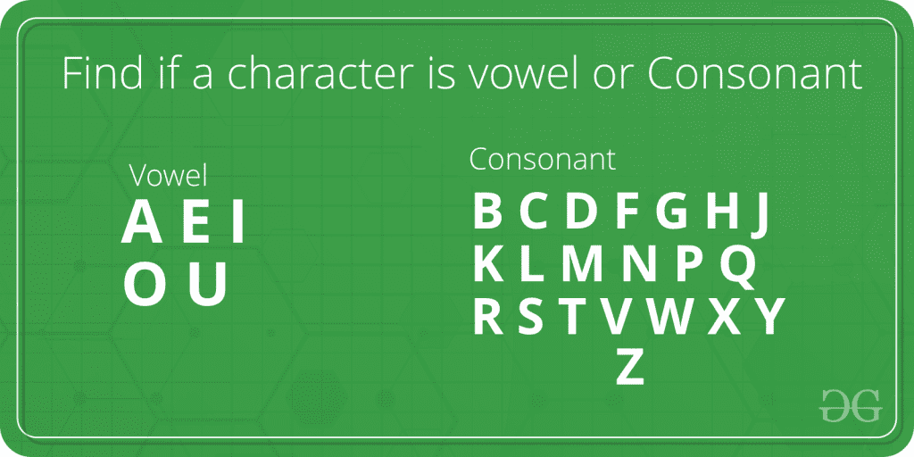

# 检查字符是元音还是辅音的 Java 程序

> 原文:[https://www . geesforgeks . org/Java-program-to-check-字符是元音还是辅音/](https://www.geeksforgeeks.org/java-program-to-check-whether-the-character-is-vowel-or-consonant/)

对于任何给定的字符，我们需要检查它是元音还是辅音。正如我们所知，元音是' a '，' e '，' I '，' o '，' u '和所有其他字符(即' b '，' c '，' d '，' f' …..)是辅音。



**示例:**

```
Input : char = 'r'
Output : Consonant

Input : char = 'e'
Output : Vowel
```

这里，在下面的实现中，我们将检查所述字符是否对应于五个元音中的任何一个。如果匹配，“元音”被打印，否则“辅音”被打印。

**例 1:**

## Java 语言(一种计算机语言，尤用于创建网站)

```
// java program to check whether input
// character is a vowel or consonant

import java.io.*;

public class geek {

    // Function to find whether an input
    // character is vowel or not
    static void Vowel_Or_Consonant(char y)
    {
        if (y == 'a' || y == 'e' || y == 'i' || y == 'o'
            || y == 'u')
            System.out.println("It is a Vowel.");
        else
            System.out.println("It is a Consonant.");
    }

    // The Driver code
    static public void main(String[] args)
    {
        Vowel_Or_Consonant('b');
        Vowel_Or_Consonant('u');
    }
}
```

**Output**

```
It is a Consonant.
It is a Vowel.
```

**例 2:**

*   *大写字母的变更。*

## Java 语言(一种计算机语言，尤用于创建网站)

```
// java program to check whether input
// character is a vowel or consonant

import java.io.*;

public class geek {

    // Function to find whether an input
    // character is vowel or not
    static void Vowel_Or_Consonant(char y)
    {
        if (y == 'a' || y == 'e' || y == 'i' || y == 'o'
            || y == 'u' || y == 'A' || y == 'E' || y == 'I'
            || y == 'O' || y == 'U')
            System.out.println("It is a Vowel.");
        else
            System.out.println("It is a Consonant.");
    }

    // The Driver code
    static public void main(String[] args)
    {
        Vowel_Or_Consonant('W');
        Vowel_Or_Consonant('I');
    }
}
```

**Output**

```
It is a Consonant.
It is a Vowel.
```

**例 3:**

*   [方法指数](https://www.geeksforgeeks.org/java-string-indexof/)

## Java 语言(一种计算机语言，尤用于创建网站)

```
// java program to check whether input
// character is a vowel or consonant

import java.io.*;

class GFG {
    // Function to find whether an input
    // character is vowel or not
    static String isVowel(char ch)
    {
        // Make the list of vowels
        String str = "aeiouAEIOU";
        return (str.indexOf(ch) != -1) ? "Vowel"
                                       : "Consonant";
    }

    // Driver Code
    public static void main(String[] args)
    {
        System.out.println("It is a " + isVowel('a'));
        System.out.println("It is a " + isVowel('x'));
    }
}
```

**Output**

```
It is a Vowel
It is a Consonant

```